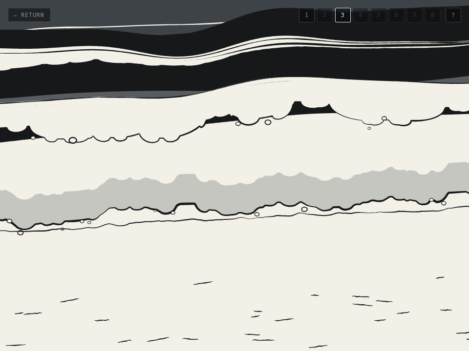
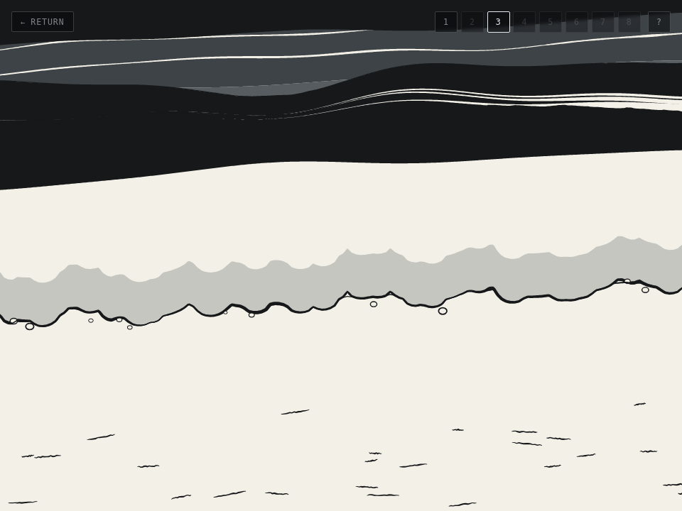
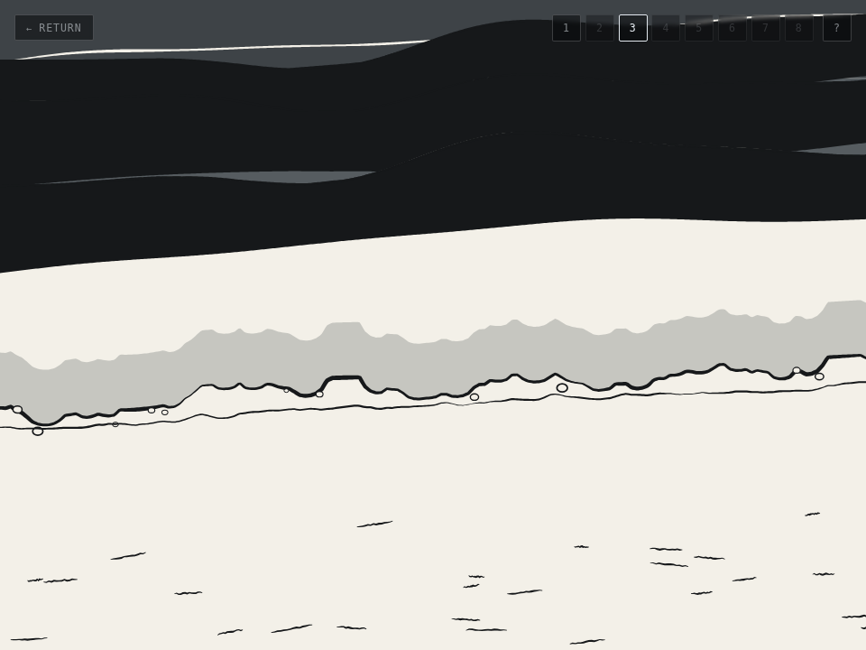
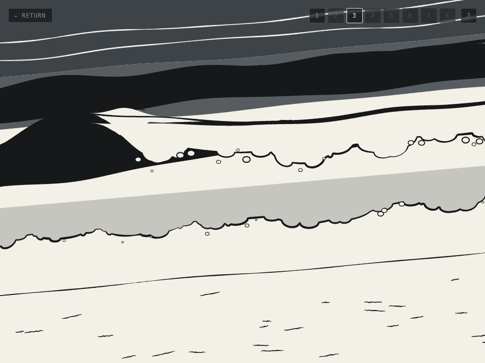
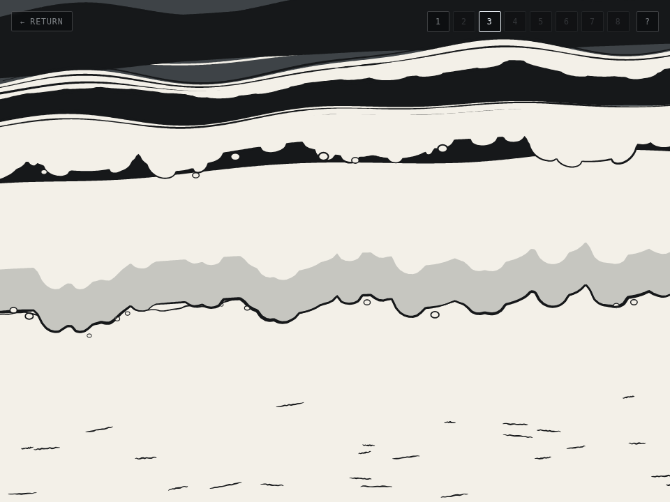

# Scene 3 — the drawing layer replaced

The wave object, its five stages, the reference tooling and the gate work from
#271 stay. What is replaced is the layer that turned all of it into marks.

`scene/beach-draw.js` — a halftone lattice that carried tone as stroke weight
and duty on a constant pitch — is gone. `scene/beach-brush.js` is the drawing
layer: a cartoon on paper, a mid-grey sea, a near-black wave face, scalloped
foam edges, brush strokes with a swelling width. It arrived as a working,
self-contained module verified in headless Chromium at three resolutions. This
session wired it; it did not illustrate anything.

---

## 0. The standalone picture did not move, and that is measured

`beach-brush.js` needed four edits to be wireable at all (below). The control
for every one of them is that the module, called with no wave list and no
published edge, draws exactly what it drew before:

> **0 of 11,289,600 pixels differ** over ten frozen states — a peel sweep from
> −0.30 to 1.70, a phase drift and a second seed — at 960x720, 1920x1080 and
> 2560x1440.

That is an identity rather than a threshold, so it needs no noise floor. It is
available because both sides were produced by the same page session drawing the
same content; the repo's rule about the renderer's determinism *between*
sessions still holds and no pixel delta is quoted anywhere else here.

Getting it took one correction worth keeping. The first cut moved the bubble
loop's random draws into a `bubbleParams()` call at the top of the wave — which
draws all forty-eight values unconditionally, where the loop skips two of every
three on a gated-out bubble. **5% of pixels moved**, on every cell, because
every later draw on the frame's shared stream shifted. The standalone branch
keeps the original loop draw for draw; only the wired branch reads stored
parameters.

### And the WIRED path needed its own, which re-reading the diff found

The section above is about `draw()` called with **no wave list** — the
standalone path. The scratch-pool refactor touched both branches, and they
share almost no code: the wired one reads the caller's per-column crest and
break phase, each wave's lobes and bubbles stored at birth, and the published
front and high-water queries. A control on one of them is a control on half
the change.

Closed the same way, in one page session: both modules loaded, handed the SAME
specs built from real `makeWave` records, `waterlineS` deliberately not passed
so the sheet clamp (a later, intentional change) is inert and only the refactor
is under test. **0 of 58,060,800 pixels** over 27 cells — three resolutions x
three record sets x three drifts, 135 wave draws.

## 1. The four edits to the drawing layer

Each one is a number moving from the module to a caller that owns it. Nothing
below changes a mark.

| what | before | after |
|---|---|---|
| the shear | `SHEAR`, a module constant | `state.shear`, from `beach-shore.js` |
| the swash front | `lobes()` generated here | `state.frontAt(u)`, the published edge |
| the strand line | a fixed `s = 0.755` | `state.wetAt(u)`, the high-water mark |
| the waves | two hardcoded | `state.waves`, one entry per live record |

Plus two mechanical splits that let a wave's foam be drawn once and stored:
`lobeParams()` / `lobesFrom()` (the parameter draw separated from the
evaluation, in fractions of the width so a stored set survives a resize) and
`bubbleParams()`. And one constant surfaced by name, `FOAM_ONSET_B`, read off
`foamw`'s own smoothstep, so the simulation's break clock and the drawing's
break phase have one owner for where foam begins.

`scene/beach-render.js` is new: the adapter, the only file that has read both
sides. It holds no state, no clock and no constant of its own.

## 2. The invariant: one curve

**The drawn foam edge and the published swash edge are the same curve**, because
there is only one curve. The scallops — the union of half-discs every cartoon
foam line has — are generated in `beach-swash.js` from each wave's own seed at
birth, folded into `extentOf`, and reach the drawing through `swash.edgeAtU`.
The renderer generates nothing.

Two halves, and both are checked:

* `draw/the-drawn-foam-edge-is-the-published-swash-edge` reads the front back
  **off the rasterised framebuffer** in twelve columns and compares it with the
  scene's own `swashYAt(x)`. Measured: **12 of 12 columns, worst 0.46 and mean
  0.31 CSS px.** The brief's bar was "within a pixel or two".
* `draw/the-drawing-takes-its-shear-from-the-shore`. `beach-shore.js` declares
  an ANGLE (3.0 degrees) and every published query goes through it;
  `beach-brush.js` declared a fraction of height dropped across the width,
  which is a different quantity and draws **5.0 degrees on a 4:3 frame and 3.76
  on 16:9**. Left alone the two lines would have diverged by seventeen pixels at
  the frame's edges however exactly they agreed about `s`. The shore wins; the
  module's own `SHEAR` stays as the standalone default. **This makes the drawn
  shoreline shallower than the module drew it, and that is a look change** — it
  is the one the invariant costs.

The read-back needed one carve-out, stated rather than hidden: **eleven bubbles
are drawn along the front after it**, each a paper disc with an ink outline, so
where one lands the first ink below the grey band is the bubble's rim and reads
seven pixels off. A column whose ink run is one pixel is not readable. The front
itself is brushed at `3.8 * H / 720` px and is never one pixel, so an edge
generated separately would still be in the subject — it would be a full-width
stroke in the wrong place.

## 3. What moving the scallops into the simulation cost

The front's shape is now the drawing's. Two consequences, both measured over
five seeds and five minutes each:

**(a) `WOB_S` changed value because its job changed.** It was "how deep the
scallops on a front run" at 0.020; the scallops are the drawing's now and it is
only the long wander beneath them. Its value is read off the drawing —
`bumps(..., 0.007 * H, 3, ...)` sums to 0.00947 of a frame height at its peak,
and `wob` is two sines summing to at most 1.5, so **0.00631**. Holding 0.020 and
adding the scallops puts the live front's peak-to-trough at **0.0496 against the
drawing's own 0.0344** — a third deeper than the picture that was verified.

**(b) `OVERRUN_MARGIN_S` was re-derived, 0.12 → 0.150.** This is a MEASURED
separation between two populations and the quantity it separates them by moved.
The same sweep the original used, on the front as it is now:

```
  margin   0.035  0.060  0.090  0.120  0.150  0.180
  quiet    12.32  12.32   7.24   0.36   0.00   0.00   overruns per minute
  w/ sets   8.24   5.60   3.48   3.04   2.80   2.64
```

0.150 reads exactly what 0.120 used to: nothing at all on a quiet beach, and the
set-driven rate down 8%. **The gate caught this rather than a reading of the
code** — `swash/an-overrun-fires-with-the-extent-it-reached` asserts zero
overruns in fifteen quiet minutes and went red at three. Holding 0.120 would have
left the event firing about once every three and a half minutes with no input at
all, which is the no-signal state that constant exists to avoid; the only other
lever was making the drawn scallops shallower than the drawing draws them, which
is tuning a picture to satisfy a simulation constant.

The high-water mark's own headline measurement is untouched: **30.0 px per 3.5 s
on a 900 px frame against 30.2 before.**

## 4. Wiring the wave records

* **A seed per wave**, drawn at birth. Every mark a wave makes comes off it, so
  nothing a wave draws depends on what was drawn before it.
* **Its lobes and bubbles drawn once**, at birth, off that seed, stored on the
  record as `drawA` / `drawB` / `drawBubbles`.
* **`height`**, new, energy-sized at birth. The range's ends are the module's own
  two numbers — `[0.048, 0.082]`, its far wave and its hero — which is the least
  invention available, and the shape is the one every other energy-sized field in
  that file already has. PICKED: nothing in the reference measures a wave's
  height against the size of the set that made it.
* **`peelS` is now energy-sized too**, as the brief asked. The direction (a
  bigger set peels over a longer stretch) is PICKED and stated; the energy shifts
  where in the range the draw lands and a jitter keeps the wave-to-wave variation,
  because a plain `LO + (HI-LO) * e` would make every wave on a quiet beach peel
  for the same 0.8 s.
* **`drawPhaseAt(w, u)`** is the map from this simulation's clock to the
  drawing's one number per column. Both scales are the record's own derived
  lengths — `breakAge` (birth to break) and `preS - breakAge` (break to the
  waterline) — and the anchor is `FOAM_ONSET_B`, imported. So the moment the
  simulation says a column has broken is the moment the drawing first puts foam
  on it.
* **A spent wave is not drawn.** `waveStage` says SWASH once the crest has
  crossed the waterline everywhere, which is where the drawing's phase reaches
  its spent end and where the swash front takes over the same stretch of beach.
  **The drop is not a visible pop, measured**: over 219 frames a drop event
  changes a median of 38,527 pixels against an ordinary step's median of 29,804
  and maximum of 103,591 — inside the ordinary frame-to-frame variation.

### Why `b` spans the whole seaward life

The first cut mapped the drawing's break phase onto `BAND_GROW_S + bandFadeS`
(2.6–3.8 s), which is where the simulation's own foam alpha reaches zero. **The
drawing has no fade**: its foam band grows with `b` and never thins. So a wave
hit `b = 1` about three seconds after breaking and then spent the remaining
**eight seconds** — half a frame of travel — drawing a full white band on its way
to the shore. Rendered, the middle of the frame was a stack of spent bands with
no faces in it. Spanning the whole seaward life puts the spent end exactly at the
hand-over to stage six.

## 5. The retirements, each named

The brief: *"Identify every check and mutant that encodes the photographic
approach, remove them EXPLICITLY, and say in the PR which ones went and why."*

**Five part-one checks** (`beach-tone`), all about `beach-draw.js`'s tone ladder:

| check | why it goes |
|---|---|
| the value ordering is the reference's own | `TONE.deep > shallow > gloss > wet > foam == dry == 0`. **The new drawing breaks this ordering on purpose**: its shallows are bare paper, LIGHTER than the wet-sand grey behind the swash front. There is no tone ladder left to order. |
| the foam band is a plateau of paper, not a ramp to one | about `waterTone`'s band profile. The foam is a paper FILL now; a plateau is what a fill is. |
| the run-up sheet is lighter than deep water | about the ocean gradient being anchored off the moving edge. There is no gradient. |
| the dry sand leaves a register for the marks session | **THE ONE REAL LOSS** — see below. |
| the swell fades out in the deep water | about `swell()`, the lattice's along-shore displacement. |

**Three browser checks**:

| check | why it goes |
|---|---|
| the value ordering holds and the dry sand is toned not blank | **the five-band ink-coverage comparison the brief names.** Band means plus a local-contrast floor on the dry band and a darkest-1% ceiling. The new drawing fails it by design and its sand texture is full-strength ink. |
| the foam band reaches bare paper | the band's longest bare run against the reference's 0.43–3.56% of frame. The foam is a fill; it is bare everywhere inside its own path. |
| the swell has somewhere to go | measured the swell's DELIVERED INK through `beach-draw.js`'s `__flatTone` hook. There is no lattice and no `__flatTone`. |

**Two wave checks**, this PR's own rather than the merged scene's:

| check | why it goes |
|---|---|
| the dark face is darker than the water on both sides of it | measured on the emitted TONE through `waveToneAt`. The finding is not lost — it is what the drawing now DRAWS, as a `PALETTE.ink` fill against a paper lip — but "darker than the water either side" is not a question a flat fill answers. |
| the face is one band across the wave while the foam is not | **it is false of the new drawing on purpose.** `faceBot` is `(0.040 + 0.030 * (1 - b)) * H + 0.22 h`, per column by construction. `beach-wave.js` held one depth because a bilevel row averaged across a varying one read as nothing; a fill has no such problem. Keeping it would have meant tuning the drawing. |

**Eleven mutants**, all on `scene/beach-draw.js` except the first:
`the-face-follows-each-column` (anchored on `faceCentreOf`),
`the-deep-water-keeps-the-old-saturated-tone`, `the-drift-phase-is-not-wrapped`,
`the-renderer-sets-its-own-transform`, `the-water-ramp-follows-the-moving-edge`,
`the-foam-band-is-a-ramp-not-a-plateau`, `the-swell-bands-the-deep-water`,
`the-dry-sand-is-blank-paper`, `the-sand-texture-is-in-the-marks-register`,
`the-register-headroom-is-given-away`, `the-foam-band-is-narrower-than-a-row`.

**Two sheet tools**: `tools/shot-beach-mockup.mjs` (the tone mockup against the
reference contact sheet, merged in #269) and `tools/shot-beach-stages.mjs` (this
PR's six-stage sheet, whose entire measurement half was row means and tone
targets). Replaced by `tools/shot-beach-brush.mjs`.

**And the tone half of `beach-wave.js`** — `waveToneAt`, `waveField`,
`swellDepthAt`, `faceCentreOf`, the constants `FACE_TONE`, `SWELL_TONE`,
`FACE_GAP`, `FACE_W`, `SWELL_W`, `BAND_RAMP_IN/OUT`, and the record's
`faceDepth` / `swellDepth`. The MODEL stays: `brokenAt`, `crestAt`,
`bandWidthAt`, `foamAlphaAt`, `faceAmountOf`, `stageAt`, `waveStage`,
`sortWaves`, `makeWave` and every measured constant. The measurements the tone
targets were set from are in `docs/beach-wave-object.md` and in that file's own
reference block.

### The loss, stated plainly

**The dry sand's marks register is gone and cannot be asserted.** The lattice
drew its sand texture at a declared alpha with 0.30 of headroom under the floor a
later session's drawn marks would start at, so the two could not collide. Every
mark in the new drawing is full-strength ink. **The sand-marking session will
have to separate its register some other way — by density, by shape or by
weight — and this paragraph is the whole of the warning it gets.**

## 6. What replaced them

Seven checks in a new `draw` section, none of which asks what tone anything is.

| check | what it reads |
|---|---|
| the drawn foam edge IS the published swash edge | the framebuffer, against `swashYAt` |
| the drawing takes its shear from the shore | the drawn shear against the shore's own slope |
| every wave is drawn once, with its own record | the renderer's tally against the simulation's list less the arrived waves |
| no wave is drawn once it is spent | both directions — a spent wave is never drawn AND a live one always is |
| the peel is monotone in time and runs across the frame | per wave, tracked over 90 samples |
| a wave's foam holds still between frames | two clauses, and the second is the one that matters |
| the nearer wave is painted last | the op stream, exactly |

Two of them needed a second clause because the first read the RECORD rather than
the artefact — session 41's mirror rule, in the family it keeps happening to:

* **foam holds still.** The record-reading clause asks whether a wave's stored
  lobe parameters moved. A renderer that ignored them and generated its own per
  frame leaves the record untouched and passes it. The second clause is about the
  marks: **a wave's op block must not depend on what was drawn before it** —
  measured, a wave's 5,160-op block is unmoved by the wave in front of it going
  from 4,813 to 6,128 ops. `the-lobes-are-drawn-per-frame` reddens the second
  clause and not the first, which is why the second exists.
* **the nearer wave is painted last.** Every count-and-order clause is satisfied
  by a renderer that draws ONE record twice, so the check also asserts the two
  waves' op blocks DIFFER. `every-wave-draws-the-first-waves-record` is its
  mutant.

The order check's first cut attributed ops to a wave by how near their y was to
that wave's crest, and **a wave's own foam band reaches 0.12 of frame height past
its crest** — so the seaward wave's marks landed inside the shoreward wave's
window and it failed on a clean tree. A wired wave draws nothing off the frame's
shared stream, so its op block is identical whoever it is drawn beside: the claim
is now that the stream for `[back, front]` is the background, then back's block
verbatim, then front's.

**Seven new mutants**: `the-renderer-generates-its-own-foam-edge` (the state the
drawing layer arrived in), `the-drawing-keeps-its-own-shear`,
`a-spent-wave-is-still-drawn`, `every-wave-draws-the-first-waves-record`,
`the-renderer-sorts-behind-the-callers-back`, `the-lobes-are-drawn-per-frame`,
`the-break-phase-runs-backwards`.

**And the anchor pre-check earned its keep**: re-deriving `OVERRUN_MARGIN_S`
disarmed `the-overrun-fires-on-every-wave`, whose `from` was the old literal. The
sweep refused before running a single mutant.

## 7. Performance

Measured on the same box, software GL, headless Chromium, `deviceScaleFactor` 1.

| | median | p95 |
|---|---|---|
| standalone, 960x720 | 3.9 ms | 6.7 |
| standalone, 1920x1080 | 3.6 | 6.8 |
| standalone, 2560x1440 | 2.9 | 7.1 |
| **wired**, 960x720 | **4.0** | **6.2** |
| **wired**, 1920x1080 | **4.0** | **7.0** |
| **wired**, 2560x1440 | **4.7** | **7.2** |

The standalone column reproduces the brief's own pre-wiring figures (~3 ms
median, <12 ms p95), which is what makes the two comparable. **The wired median
is 4.0–4.7 ms, under the ~8 ms the brief names**, with an average of 3.7 waves
alive against the module's fixed two.

**A reproducible ~1.2 s stall exists and it is NOT the wiring's.** Every ~160
frames the live scene spends 1.15–1.24 s on one frame; redrawing the identical
state costs 3–5 ms, so it is not the geometry. **The module standalone does the
same thing** — 3 stalls of ~1.0 s over 700 frames, one every ~217 — and that
measurement still reproduces exactly today (215 / 434 / 649, max 1026 ms, on the
module's own probe run unmodified).

> **THE ATTRIBUTION IN THIS PARAGRAPH WAS WRONG AND IS REFUTED BY MEASUREMENT —
> see section 7b.** It read: *"so it is a property of the drawing's per-frame
> allocation (a fresh set of arrays per wave per frame) … the remedy would be
> reusing buffers, which is a drawing change."* The buffers **were** reused, the
> heap **is** flat, and **the stall did not move by a single draw.** It is not JS
> garbage. The observation above stands; the cause named for it does not.

## 7b. The stall is NOT the allocation, and the allocation pass did not fix it

**Measured on the shipped file, after the pass, at Eva's request.** The
acceptance criterion was ZERO frames over 40 ms in 600 consecutive draws at
1920x1080. **It FAILS.**

| Eva's ask | shipped file |
|---|---|
| 600 draws @ 1920x1080, frames over 40 ms | **2** (5 in 1200) |
| 1x / 2x / 3x draws-per-iteration, first spike | **draw 216 / 216 / 216** |
| standalone median / p95 — 960x720 | 2.10 / 3.30 ms |
| standalone median / p95 — 1920x1080 | 2.10 / 3.20 ms |
| standalone median / p95 — 2560x1440 | 2.10 / 3.60 ms |
| wired median / p95 — 960x720 | 2.90 / 4.70 ms |
| wired median / p95 — 1920x1080 | 2.90 / 4.70 ms |
| wired median / p95 — 2560x1440 | 2.90 / 6.10 ms |

**The first spike is at draw 216 whatever the multiplier**, which is the
signature the brief described — a fixed draw count, independent of iteration
count — still present.

**IT IS NOT JS GARBAGE, and five measurements say so:**

1. **The pre-fix tree is identical.** The same harness against a worktree of
   `34938cb`, before the allocation pass: first spike at draw **216**, max
   ~1000 ms, 2 in 600. The pass moved it by nothing.
2. **The JS heap is flat** — 9.5 MB before and after 600 draws, unchanged.
3. **It is exactly periodic.** With the draw state held CONSTANT the spikes land
   every **229 draws** — gaps of 229, 229, 229, 229 — so it is not a
   configuration the sweep passes through.
4. **The controls are clean.** The same 600-iteration loop with one `fillRect`,
   or with an empty body, produces **no spike at all** (max 0.1 ms). So it is
   the drawing's load, not the page's or the harness's.
5. **Its magnitude scales with canvas area** — 643 / 1020 / 1380 ms at the three
   sizes. GC scales with heap, not with pixels.

**What it is instead is NOT established.** A plain loop of canvas strokes with
none of this module in it also produces 700–850 ms pauses on this box, so the
phenomenon belongs to Chromium's software 2D canvas here rather than to
`beach-brush.js` — but the periodicity does not match (every ~44,000 plain ops
against every ~3.9 million of the module's), so the two are not demonstrably the
same event and no mechanism is claimed. `beach-brush.js` issues **17,602 canvas
calls per draw** at 1920x1080, which is the lever if one is wanted.

**ALL OF THIS IS HEADLESS SOFTWARE GL.** Whether this periodic ~1 s canvas event
is the same thing seen in a real browser is not established; the magnitudes are
close (~1.0 s here against the reported ~1.2 s) and that is all.

**What the pass DID buy, measured the same way:** steady-state cost. Standalone
median **2.6 → 2.1 ms**, wired median **4.2–4.3 → 2.9 ms**, wired p95
**7.3–9.1 → 4.7–6.1 ms**, and a flat heap where there was 36.9 KiB of garbage a
draw. Those gains are real and they are not what the pass was for.

## 8. The five I reported, and what became of them

The brief's four known-imperfect items are Eva's and remain untouched: the hero
wave still reads band-like across the frame, the small artifact at the left edge
early in the peel, the hard parallel edges on the grey sea bands, the brush width
variation.

Five more were reported rather than acted on when the wiring shipped. **Eva ruled
on four of them in the pass after**, and they are recorded here with what the
ruling turned out to cost, because in two cases that was not what the report
predicted.

1. **The composition assumed a hero wave near the shore and the simulation broke
   far out** — `BREAK_S` `[0.115, 0.020]`, the curl peaking at s 0.202 and the
   whole lower wave zone carrying nothing but spent bands. **RULED: the break
   moves shoreside.** It is `[0.300, 0.205]` now, the curl peaks at s 0.331 and
   the foam band reaches 0.386–0.466.

   The report called this "one constant". It is not: `b` is linear in s between
   the break and the waterline, so a wave that breaks nearer the shore has less
   TIME before the hand-over, and its own foam band takes up to
   `BAND_GROW_S + bandFadeS` = 3.8 s to grow and fade. Breaking nearer than
   s 0.305 hands a wave to the swash with its band still growing. That bound is
   what sets the value, and
   `wave/the-break-leaves-a-wave-room-to-show-the-band-it-committed-to` holds it
   from four owners that are not `BREAK_S`.

   **AND IT COSTS THE SEA, WHICH IS A FINDING RATHER THAN A SIDE NOTE.** The
   drawing's foam exists only where `b` is past `FOAM_ONSET_B`, and `b` is
   linear in s between the break and the waterline — so **the foam region IS
   `[breakS, WATERLINE_S]`**. Moving the break shoreside shortens it in exactly
   the same proportion as it lowers the curl: the two are one dial, not two.
   `node tools/shot-beach-break.mjs <dir>` is the instrument and it prints this
   table. **SAMPLING: three seeds x 24 pumped moments each, at 960x720**, of
   the WAVE ZONE (top of frame down to the waterline); the bracket is the
   range across seeds.

   | `BREAK_S` | curl at s | ink % | paper % | broken, of 3.8 drawn |
   |---|---|---|---|---|
   | `[0.115, 0.020]` (as it shipped) | 0.202 | 38.6 [37.5–39.8] | 49.0 [44.8–53.4] | 3.3 |
   | `[0.180, 0.085]` | 0.247 | 49.5 [48.5–50.8] | 38.9 [34.6–42.3] | 2.8 |
   | `[0.230, 0.135]` | 0.297 | 58.3 [56.9–59.4] | 30.2 [26.1–33.1] | 2.4 |
   | **`[0.300, 0.205]` (ships)** | **0.331** | **70.6 [69.5–72.3]** | **17.8 [15.2–19.5]** | **1.8** |

   **THE SPREAD IS WHY IT IS THERE.** A first cut of this table quoted single
   figures — 44.7% ink against 67.8% — from a run with no `?seed=`, and
   `scene.html` seeds from `Date.now()` when it is given none, so every run is
   a different sea and those numbers did not reproduce (the next run read 39.4
   against 72.7). The trend is far outside the spread; the individual figures
   were not reproducible and are corrected here.

   A wave is unbroken for **77% of its seaward life** now, against 35% before —
   13.6 s of approach against 4.0 s of foam, where it was 6.2 s against 11.4 s.
   On screen that is a much blacker sea: the dark face is drawn for every wave
   whether it has broken or not, and the foam band is what used to whiten it.

   **SO THE RULING'S TWO CRITERIA PULL AGAINST EACH OTHER** — "the curl reading
   at size" wants the break shoreside, "the foam having room to run" wants it
   out — and the measurement above is what the choice between them costs. It
   ships at the shoreward end because that is what was ruled, bounded by the
   band's own life; `[0.230, 0.135]` is where both are met (curl 0.297, paper
   30.3%) and is one constant away.

   
   *`[0.115, 0.020]` — the composition Eva objected to. Three separate events
   down the frame, and the curl at s 0.202 is the top one. Seed 7, the first
   of the three the table averages.*

   
   *`[0.230, 0.135]` — the curl mid-frame with open water above it. Not what
   ships; it is here because it is what "both criteria met" looks like.*

   
   *`[0.300, 0.205]`, which ships. The curl is where it was asked for and the
   sea above it is a black mass: 17.8% paper against 49.0%.*

   **WHAT WOULD DECOUPLE THEM** is drawing a wave PAST the waterline so its
   foam runs up the beach — which is the hand-over to the swash, and that is
   settled model this session was told not to touch. Recorded, not attempted.

2. **A wave arriving at the shore was progressively covered by the swash sheet.**
   The report called it "physically right, visually odd". **RULED: a bug**, and
   on measurement it is one. `sheetTop` was `front - 0.085`, a fixed band hung
   off the swash front — so whenever the swash came within that depth of the
   waterline the wet grey was drawn ON THE SEA: **52% of frames over 30 s of
   beach**, by up to the full 0.085 of frame height. A wave was eaten from the
   bottom up while it was still a twelfth of the frame from the shore.

   The sheet's seaward end is the waterline now, which is the same number that
   decides a wave has become the swash — so it cannot cover a wave that is still
   arriving. The depth is unchanged and is a maximum. What it costs is a thinner
   sheet while the swash is drained, which is what drained means: 39% of frames
   have the front within 0.02 of the waterline.

3. **Nothing drew the streak records.** **RULED: deleted.** `beach-water.js` kept
   a field of persistent foam streaks — a sound law, correctly implemented, and
   rendered by nothing once the halftone lattice went. A green check on a feature
   no frame draws is worse than no check, so the records, the check that held
   them and the mutant that exercised them all went together. What is left is the
   `drift`, which is live: it is the drawing's `phase`.

4. **The scallop depth was fixed at one aspect.** **RULED: make it scale**, and
   the reason is that /scene is full-viewport and people have wide monitors. The
   record keeps the shape in WIDTHS (which is what the drawing's lobe radii are),
   the swash is told the aspect by the one thing that owns a canvas, and
   `extentOf` converts at the point of use. The simulation still has no canvas;
   it no longer needs one.

5. **`waveStage` could never report STEEPEN on a peeling wave.** The report
   called this "not a defect". **RULED: remove the stage.** A state nobody can be
   in reads as covered while nothing covers it, and it was in the required list
   of the stage walk, so the model claimed six and exercised five. The model is
   five stages now and SWASH is 5. The LIP did not go with it — `bandWidthAt`,
   `foamAlphaAt` and `faceAmountOf` all still open it over `steepS`; what went is
   the label, and a column in that window reports SWELL, which is what it is.

   Removing it cost one mutant its witness and bought a better one:
   `the-wave-never-leaves-the-swell` used to be caught by STEEPEN becoming
   unreachable, and with SWELL meaning exactly "has not broken" the transition
   now has a TIME, held against the record's own `breakAge`.

### And one thing the ruling pass found that no report had

**`draw/the-drawn-foam-edge-is-the-published-swash-edge` was flaky, and it
shipped that way.** A mutation proved PIXEL-IDENTICAL over 64,512,000 pixels
reddened it on one run of three. Its search accepted a moment on `edgeMax` alone
and then asserted nine of twelve columns were readable — two different questions.
And its reader took the centre of the first ink run below the wet band, which a
bubble drawn ON the front merges with: measured on a failing column, the stroke's
own top sat at y 354.1 where the published edge predicts 354.1, and the run ran
on to y 368. The drawing was right and the reader was wrong.

Both are fixed. The search asks the real question; columns whose ink run exceeds
1.8× the COLUMNS' OWN MEDIAN are dropped (the front is one stroke of one width,
so that median IS the width, measured rather than imported from the thing under
test); and the claim moved onto the median column, with the worst kept as a
looser second bound. A separately generated front moves every column together, so
the median is the sensitive statistic and the worst is the one the drawing's own
marks contaminate.

## 8b. The marks register — a note for the sand-marking session

Not built, and deliberately not. What follows is a decision handed forward so
that session inherits one instead of rediscovering a problem.

**What was lost.** The halftone lattice drew the dry sand's texture at a declared
alpha with 0.30 of headroom under the floor a later session's drawn marks would
start at, and a gate clause held that gap. In this idiom there is no such gap:
every mark in `beach-brush.js` is full-strength `PALETTE.ink` on `PALETTE.paper`,
because that is what a cartoon on paper is. **There is no ink strength left to
spend, so the register cannot be a tonal one and no amount of tuning will make it
one.**

**Where the separation has to come from instead: WEIGHT and LENGTH.** The sand's
own marks are already a family with measurable bounds — thirty strokes, each
`1.9 * H / 720` CSS px wide and `(16 + 34·r) * W / 960` long, laid at ±0.15 rad
of the shear, with `passes: false` and `vary: 0.3`. A user's mark should be
legibly outside that family in BOTH of those, not in one:

* **weight** — at or above roughly twice the sand's, which puts it at or above
  the swash front's own `3.8 * H / 720` and therefore among the picture's
  structural lines rather than its texture;
* **length** — beyond the sand's upper bound, so a mark reads as a gesture
  rather than as another grain of the field it sits on.

**Why both.** Weight alone collides with the strand line and the foam edge, which
are the same weight and are also long; length alone collides with the sand, which
is the same weight. The pair is what is free, and it is free precisely because
the sand field is narrow in both.

**What to assert, and what not to.** The retired clause was a tonal gap and is
not recoverable. Its replacement is a two-dimensional one — the drawn stroke
width and the drawn length of a user mark are each outside the sand family's
measured range — and it wants reading off the EMITTED stroke rather than off the
constants, for the reason the register existed in the first place: a mark that
declares itself heavy and draws thin is exactly the failure. `brush()`'s own
`width` argument is not the drawn width; the profile term `sin(πt)^0.30` and the
three-frequency wobble both move it, so the measurement is of ink, on a canvas.

**One thing NOT to do.** Do not give a user mark its own darker ink. The palette
is five colours and the drawing's whole legibility rests on ink-or-paper; a sixth
value to mean "the user drew this" is the tonal register coming back under
another name, and on a printed-looking page it reads as a smudge rather than as a
mark.

## 9. Gate

`node tools/verify-scene.mjs` — **145/145**, 72 mutants declared. Section 10 is
the WIRING pass's sweep and is kept as the record of that pass; **section 10b is
this pass's**, and it is the current one.
`node tools/shot-beach-brush.mjs <dir>` is the sheet: the module standalone at
five frozen states as the control, then the live scene at each of the five
stages — five, because STEEPEN was removed (section 8).


*`beach-brush.js` drawn on its own at `peel` 0.35: two waves, one of them mid-peel.
This is the picture the drawing layer arrived with, and it is unchanged to the pixel.*


*The same module drawing the simulation's own records: five waves alive at four
different stages, the swash front drawn from the published edge, the strand line
drawn from the high-water mark.*

---

## 10. The mutant sweep — the WIRING pass

The record of the pass that wired the drawing, at 141 checks and 66 mutants.
Superseded as a count by section 10b; every finding below still stands.

**25 mutants run, 25 behave.** The seven new drawing mutants, plus every
pre-existing one over code this session touched (`beach-swash.js`,
`beach-wave.js`, `beach-shore.js`, `beach-water.js`). The other 41 in the file
were not run and are not claimed.

The first pass reported **five BAD**, and they split three ways — which is the
useful part, because only one of them was a defect in a check:

**One real defect, in a check written this session.**
`draw/the-drawing-takes-its-shear-from-the-shore` reported MISSED. The module's
`SHEAR` is a fraction of HEIGHT dropped across the WIDTH, so the screen slope it
draws is `SHEAR * H / W`, and the check had that ratio inverted. It did not move
the fitted value — only the BAR derived from it, and it made the bar four times
too generous: on the 3:2 scratch canvas the mutant draws −0.0778 against the
shore's −0.0524, an error of 0.0254, against an inverted bar of 0.0307. **Missed
by a hair, and nothing but the sweep could have said so.** Corrected the bar is
0.0063 with the clean tree's error at 0.0008 — eight times the headroom. The
degrees quoted throughout this document were computed correctly and stand.

**One claim that was simply wrong.**
`the-waves-composite-shoreward-first` was listed as breaking
`draw/the-nearer-wave-is-painted-last`. It cannot: that check hands the renderer
its two waves in an order it writes down itself, because what it is about is the
renderer HONOURING the order it is given. A reversed sort cannot reach it, and a
renderer that re-sorts has its own mutant. **The claim came off rather than
either check being loosened** — the two are complementary and neither
substitutes for the other.

**Three lists short in the honest direction**, each widening verified rather than
assumed:

* `the-break-goes-white-all-at-once` also reddens the energy check, and that is
  true about it: `peelS` is one of the four quantities the set energy sizes at
  birth, and a peel pinned at 1e-6 is outside its declared range at every energy.
* `a-running-swash-reads-the-set-energy` also reddens the edge invariant —
  because there is no front left to read. It grows the runup by 40% of the energy
  every frame, a geometric series: **measured, the edge reaches s = 3.4e63 inside
  ninety seconds.**
* `the-seaward-life-is-per-wave` reddened the edge invariant too, and **that one
  was the fixture rather than the mutation.** Measured, it leaves the edge's
  range untouched — max s 1.028 on both trees, 2.1% of frames past 0.97 against
  1.9% — and reddened the check purely by moving which moment a fixed pump landed
  on. About 2% of moments have the swash at the bottom of the frame where the
  grey band is squeezed against the sand marks and no column reads. The check
  FINDS a moment with the front on the canvas now, and fails loudly if none does.
  That carve-out does not exclude what the check doubts: a front drawn from a
  separately generated curve still draws a grey band with an ink edge under it,
  in the wrong place rather than absent.

After the corrections: **5 of 5 on the re-run, 25 of 25 overall.**

---

## 10b. The mutant sweep — THIS pass

**14 mutants run over the files this pass changed; 12 behaved and 2 did not, and
both were diagnosed rather than waived.** The other 40 were not run and are not
claimed. The 72-mutant full sweep is *not* what ran — it died on a Chromium
protocol error after one mutant, reported here rather than rounded up to a sweep.

Both BADs landed on the same new clause,
`swash/the-scallops-are-as-deep-in-widths-on-any-shape-of-frame`, for two
different reasons — which is what made them worth measuring instead of widening a
list twice.

**`a-running-swash-reads-the-set-energy` — the clause was right and its message
was not.** The first guess was that the edge goes non-finite and the vacuity guard
fires. Measured, it does not: the edge reaches **4.4e+86 and stays finite**, and
what fails is the *recovery* clause. The real reason is sharper — **the inserted
line never reads `dt`**, so a zero-length advance still multiplies every runup,
and `advance(0, …)` is exactly how the clause refreshes the published edge in
order to read ONE state at three aspects. Each read was a different beach. The
clause asserts that premise first now, by re-reading the FIRST aspect LAST: an
identity, not a bound — **0.000e+0 on this tree, 3.2e+86 mutated**. The mutant
keeps its red; what changed is that the red says what is actually wrong.

**`the-seaward-life-is-per-wave` — three unclaimed reds, and its blast radius grew
because THIS pass moved a constant its replacement reads.** It substitutes
`breakS - speedS * swellLeadS`, and `BREAK_S` went 0.115 → 0.300, so its waves are
born 0.185 of a frame nearer the shore than when the mutant was written.

* **The scallop clause was the FIXTURE.** At its fixed pump the mutated tree has
  **two live waves against this tree's four, and the aspect reaches exactly zero
  of them** — `peak` 0.000e+0, so the clause declined. It searches for a moment
  with a scallop on the water now. **That figure and the try-5 recovery below are
  a STANDALONE PROBE's, running the clause's own arithmetic against that
  mutant's tree — not the gate's, which prints no detail for a mutant that
  passes.** At try 5 the recovery is still exact (7.0e-16); the clause reports
  its own moment on every run, so a clean tree that started having to hunt
  would be visible rather than silent. **The search does not carve out what the clause doubts**:
  a depth baked at one aspect reads zero at EVERY moment, so the search finds none
  and the clause fails loudly — measured on that mutant, which is the one it
  exists for.
* **The two draw checks are POPULATION guards, and that is MEASURED rather than
  read off the source.** The gate collects each failure's message but prints none
  for a mutant, so a probe copy that does was run against this one. It reports
  `every-wave-is-drawn-once` failing on **"at most 2 waves were ever drawn at
  once"** — its guard wants three — and the foam clause on **"only 126
  frame-to-frame comparisons"**, where its guard wants 200. **Neither core claim
  fired**: not the renderer-draws-exactly-the-non-swash-waves equality, not
  `moved === 0`. What fails is the fixture's ability to gather a sample from a
  beach whose arrivals have been scrambled, which is the same statement the mutant
  already makes by claiming `several-waves-are-alive-at-once`. They are listed and
  the checks are not loosened. **Listing them on the reasoning alone was the risk
  worth six minutes to remove:** had a core claim been what fired, the entry would
  have hidden a real defect behind a green run.

**After the fixes: 3 of 3 on the re-run** — both BADs, plus
`the-scallop-depth-is-baked-at-one-aspect`, the mutant the changed clause exists
for, which still reddens it. That last one is what makes the fix a fix rather than
a loosening.

That is the second time this one mutant has exposed a fixture rather than a defect
— section 10 records the first, on the edge invariant — and the pattern is worth
naming: **a check that picks its moment by a fixed pump is quietly asserting
something about the wave schedule it never meant to.**

**And one hazard was recorded rather than built.** `ensureField` *replaces*
`P.runs` where `ensureStroke` *grows* it, and the two pools share that one buffer,
so a larger stroke pool followed by a growing field pool would shrink it under a
live consumer. It is **structurally unreachable** — `ensureField` has exactly one
call site and its argument is `const n = NCOL`, so `FIELD_CAP` is set once and
cannot grow, and nothing outside the module calls the exported `wave` or `brush`.
No branch was added for an impossible case; the condition and its remedy are a
comment beside the function.
