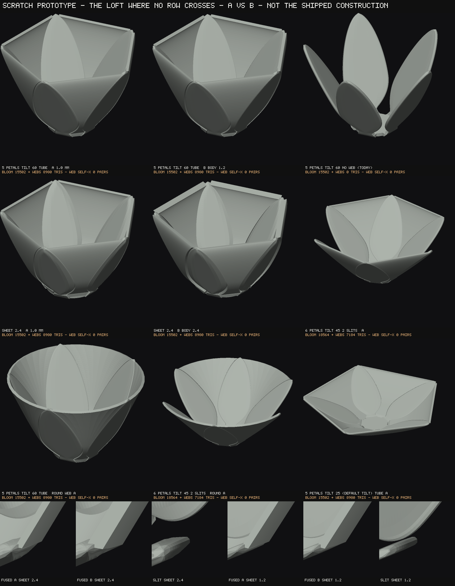
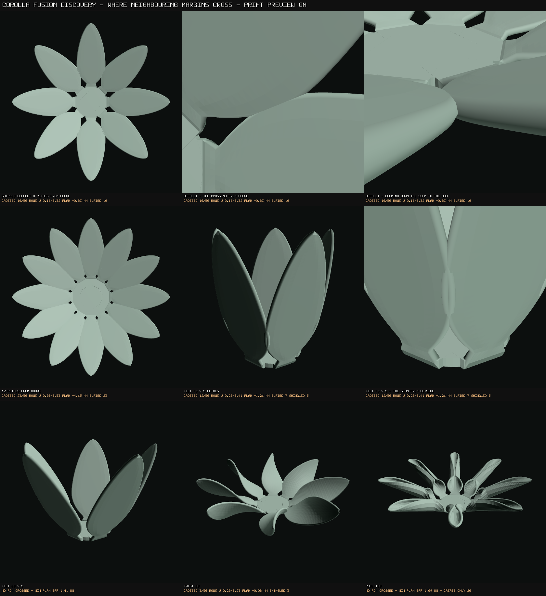
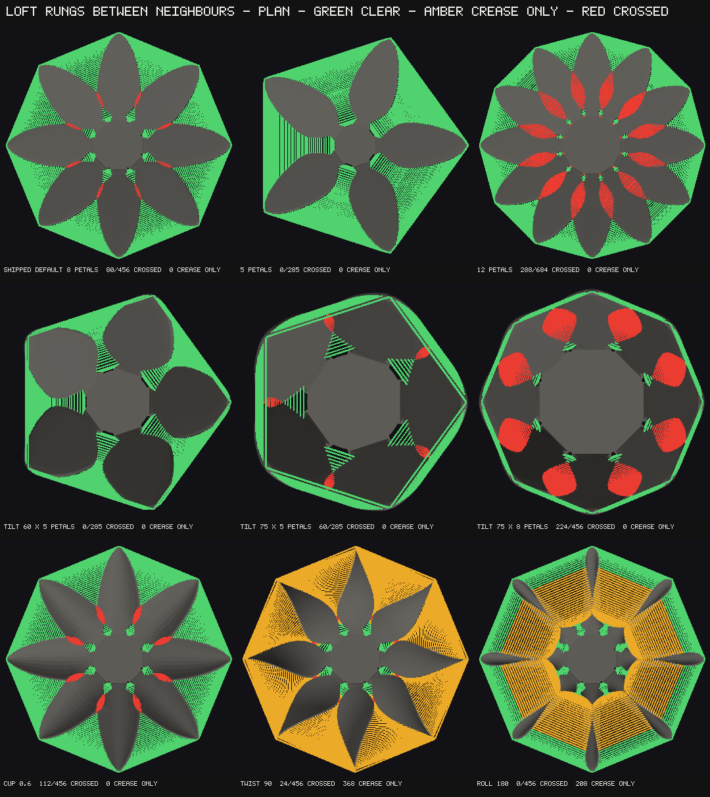

# Parametric Bloom — corolla fusion: discovery, and why the build stopped

*Oct 1, 2026. Base `main` at `798516f`. **Discovery only. The build was not started.** The brief
(fuse adjacent petal sides into a tube with a web, slits evenly dividing the whorl) carried its
own stop condition, and the first measurement met it. Nothing in the generator, the registry, the
app, the harness, any gate or any workflow was touched — predeclared before the first edit and
verified by `git diff --stat origin/main` at close (§10). Every measurement names its MODE and
its SAMPLING (session 32's rule): unless a line says otherwise it is the **EXPORT** build, read on
**every row of the shipped blade ladder** (56 blade rows plus the ring row at `NU` 56), by the
SHIPPED `buildBloomInto` in Node from `bloom-registry.js`'s `DEFAULTS` plus a named set. LIVE was
checked on four states and reads the same to the digit (the ladder is mode-free; only the floors
differ). Every figure in §2 is reproduced by `node tools/bloom-fusion-margins.mjs` in about 30 s
(`--matrix` adds the named states, ~90 s).*

**A CORRECTION MADE BEFORE THIS WAS PUSHED, KEPT VISIBLE ON PURPOSE.** The first version of this
doc and of its instrument called a row "crossed" when the signed bridge span went negative. An
independent audit (§9) showed that criterion reports false crossings on rolled and twisted petals —
a rolled margin leaves a straight rung at an obtuse angle without ever reaching its neighbour.
The criterion is now the PLAN GAP (§2a), every number below was re-measured on it, and the
claims the old criterion produced are withdrawn by name in §9: **twist does not make neighbouring
margins cross on any state measured; roll does only at a few positive settings; `ALL MIN`,
`LAYERS: 3 x ALL FORM MAX` and `INFILL: x ALL FORM MAX` do not cross at all.** The default's
crossing, the count/width/length/tilt/cup tables and the tube-range map were unaffected to the
row.

---

## 0. The answer in one paragraph

**Neighbouring petal margins CROSS on the shipped default, so a web lofted from one margin to the
next has nowhere to be over part of every petal — the brief's STOP clause 1 is met, clause 2 is met
narrowly (through roll, not twist), and the build was not started.** At the defaults (8 petals,
tilt 25, width 16, length 35) petal *i*'s trailing margin and petal *i+1*'s leading margin are
0.86 mm apart in plan at the ring row, then **cross for u 0.161–0.323 (10 of 56 blade rows):
the margin passes up to 0.83 mm past its neighbour's (plan gap −0.83 mm), reaches 0.857 mm inside
the neighbour's outline measured in that petal's own frame, and lies 0.13 mm from its mid-surface
— BURIED inside the neighbour's 1.2 mm sheet** (confirmed against the emitted solid by ray
parity and by a triangle-triangle test, §9) — before opening again to ~29 mm at the tips. A
loft's rungs REVERSE over exactly that band, and as a thickened solid the web's normal flips at
both band edges and its skins intersect there (58, 454 and 548 within-web pairs in or beside the
band, from three independent thick-web constructions, §9). **The default band is a buried overlap the default already
ships** — the builder's own told flag prints it on every build ("SKINS PASS THROUGH EACH OTHER",
−1.19 mm, VS5's pin) — so the seam there is closed by material already; what fails is the
HYPOTHESIS (a web from margin to margin) where people are. The band grows with every lever that
makes a corolla read as a tube: **on a 1,536-state grid of count × tilt × width × length × cup,
only 145 of the 576 tube-range states (tilt 60–90) are clean and 347 have SHINGLED rows** —
margins tucked over or under the neighbour, which a web between them would have to cut through a
sheet to join — and every clean island is ONE slider step from crossing (cup 0.4, curl 45, roll
30). Under twist the margins do NOT cross (the old claim that they did was the instrument's
defect, §9). Where nothing crosses the loft is the hypothesis and needs no workaround — a scratch
prototype was rendered there so the A/B thickness question can be ruled at the same time (§6), and
**it found a second failure of the literal hypothesis: a web run "base to tip" folds through
itself at the apex nib on every state, clean ones included (678 pairs on the prototype's headline
cell), and reads 0 when it ends at the nib entry.** Nothing was invented to get past the crossing;
§7 costs the constructions that could, for a ruling.

---

## 1. Premises in the brief, checked against source or a measurement

| # | The brief said | What is true | Where |
|---|---|---|---|
| 1 | "give numbers on the defaults, **every preset** and ALL MAX" | **The bloom ships no design presets.** `bloom-view-presets.js` is camera chrome (`VIEW_PRESETS`, `bloom.js:17, 2042–2106`); nothing else in `bloom.js` / `bloom-registry.js` names a preset. The closest analogue is the matrix's NAMED states (`IRIS`, `ALL THIN`, `ALL FORM MAX`, `MUM`, `INCURVE`, `EVA_CONFIG`, `ALL MAX`, `ALL MIN`) — measured in §2c. | grep |
| 2 | "Mechanism hypothesis … a web lofted between petal i's trailing margin and petal i+1's leading margin" | Tested; **fails on the shipped default** (§2). And it is a THIRD construction: the only fusion design on record is the bell doc's **closed-ring panel** (`docs/bloom-bell-corolla-discovery.md` Q2/Q3), which derives the fused width from the ring so neighbours cannot cross by construction. That doc's Q1 second half and Q3 are still OPEN (`docs/bloom-state-of-play-oct-2026.md` §7a A1, A2). | §7 |
| 3 | "k = n means every seam is open … default k = n" | Consistent, but `DEFAULTS` is a static table (`bloom-registry.js:3842`), so a default cannot BE `n`. The representation that works is an integer slider whose top (40, `petalCount`'s own maximum) builds FREE at every n, with the geometry mapping the asked value onto the valid set. | §8 Q4 |
| 4 | "k snaps to the nearest valid value when n changes" | **A snap written back into the input breaks the harness's read-back** (`applyConfig` reads every set value back; `fullStateDrift` requires every control to equal DEFAULTS + set — every matrix row that sets `petalCount` would drift), and `stamenSpread`'s ruling is that a stored value is never rewritten (`bloom-registry.js:3240`). The snap can live on the BUILT value (the slider keeps the asked k, the read-out tells the built one). That is a change to the ruling's wording, so it is a question, not a decision. | §8 Q4 |
| 5 | "Control is PER LAYER … each layer … its own divisor set" | **`petalCount` is shared by every layer** (`bloom-registry.js:2747`, "count shared"), so every layer of a RADIAL bloom has the same n and the same divisor set; per layer, only k differs. No per-layer control family exists yet; the closest pattern is the per-petal block (`Array.from({ length: MAX_FAN_GROUPS })`, `bloom-registry.js:3136`), instanced over `MAX_LAYERS` (6). | §8 Q5 |
| 6 | "spiral arrangement … derived away" | Three distinct reasons, all real: **SPIRAL** places a layer's slots at the golden angle (`bloom-geometry.js:3601`), so "adjacent" is not "next in index" and gaps are uneven; **CONTINUOUS** has no whorl at all (one sequence, every slot its own ring); **FAN** is an open arc with a notch, not a closed ring of seams; **SPHERE** is CONTINUOUS-only. | §8 Q6 |
| 7 | "zygomorphic (iris/orchid per-slot) blooms" | There is **no single zygomorphy predicate**. What makes neighbours differ in one whorl: slot roles split (`fr.slotRolesSplit`), per-petal groups (FAN), size variance, form variance, and the buckle (a per-slot phase, `slotIndex * GOLDEN_ANGLE`, so adjacent ruffled margins are out of phase). Each gives neighbours different ladders or different margins; the instrument refuses those rows rather than matching rows by guesswork (S2). | §8 Q6 |
| 8 | the word "seam" | **"Seam" is taken**: 151 uses in the geometry mean the FOOT-TO-BLADE seam (`seamClearanceMm`, `seamStep`, A7). The inter-petal joint wants another word ("slit" / "fused margin" / "fusion"). | §8 Q8 |
| 9 | "Confirm the petal edge profile (#278) is on main" | **On main** (`2464d50`, and S5 `b4088e3` made `emitRimLoop` the one owner of every rim). | git log |
| 10 | "List open PRs; if any touches the rim emitter … do not merge" | Two open: #230 (a no-op deploy-preview snapshot) and #111 (a FLOWER PR). **Neither touches `emitRimLoop` / `emitPanel`.** Moot in any case: nothing here touches the rim. | PR list |

---

## 2. Q1 — how neighbouring margins relate

### 2a. The instrument, and what it reads

`tools/bloom-fusion-margins.mjs`. The margin's owner is `petalSurface().rowAt(u).sect(±1)` (§4);
the instrument reads that owner's OUTPUT as emitted — every petal's captured `lamina`, which
`buildBloomInto` has recorded on every build since organic variance build 1. Column NV−1 is
v = +1, which faces slot i+1 (T = (−sin a, cos a) is counter-clockwise and RADIAL slot i+1 sits at
a + 2π/n). With A on petal i's +v margin and B on petal i+1's −v margin at the SAME row:

    plan = wrap( azimuth(B) − azimuth(A) ) × ( ρ(A) + ρ(B) ) / 2

— the azimuthal gap between the two margins as an arc at their mean plan radius. **Negative: A has
passed B round the axis, the margins have CROSSED, and a straight rung from A to B points the wrong
way round the whorl — the rung reverses, which is what folds a loft.** On a mirror-symmetric whorl
it is exactly "A lies past the bisector plane between the two petals". Where it is negative A is
located against the neighbour's emitted mid-surface: within half a sheet of it the margin is
**BURIED** (the seam is already closed by overlap and the margin invisible); further, the petals
are **SHINGLED** (imbricate — one margin over or under the next) and a rung between them passes
through a sheet (5 of 5 rows at tilt 75 × 5, 23 of 23 at tilt 75 × 8, measured independently).
The classifier's bar is the BODY half-thickness; within `RIM_TAPER_MM` of the margin the emitted
sheet tapers to about ±0.52 mm, so a row within ~0.08 mm of the bar can be misclassified — tilt
75 × 5 reads 7 buried / 5 shingled here and 6 / 6 against the emitted solid. The COUNT of crossed
rows does not depend on the classifier.

**The signed bridge span** — `min((B − A)·dA^, (B − A)·dB^)`, dA / dB the in-surface directions
across each margin — **was the first criterion and is wrong** (§9): it goes negative wherever a rung
leaves a margin at an obtuse angle, which a rolled or twisted margin does with no crossing at all.
It is kept and reported as the **CREASE**: a row whose span is negative while its plan gap is
positive is a web that would fold back over its own petal at the margin — a sharp crease, the
foot-to-blade seam's class of problem — never a crossing.

**Self-checks, each shown able to fire (`--control`, 8 of 8 must-fails fire):** S0 the captured
columns run exactly −1..+1; S1 RADIAL slots sit exactly on their law; S2 neighbours carry the SAME
ladder row for row (`Object.is`), else the layer is refused by name; S3 on a flat hub the ring
row's gap equals the closed form from `footRing()`'s OWN `ring.radius` and `ring.width` — a
different owner from the lamina — to 1e-9; S4 where this tool finds a BURIED crossing above
`ROOT_BLEND_END`, the builder's told flag (`neighbourFlag`, a different session's instrument) must
read a crossing. **S3's subject is the flat ring row and S4 runs in one direction**, which is
exactly why neither could see the span defect — both are said in the tool's header, and S4's
second control leg is the span criterion reverted on a rolled state.

### 2b. The table (EXPORT, every blade row of the shipped ladder)

`ring` is the plan gap at the ring row (u = 0; the in-surface rung there is a little shorter, 0.79
mm at the default); `min plan` the most negative plan gap over the BLADE rows and its u (at 12
petals and up the ring row itself is already crossed — a web rooted at the ring row starts
crossed); `crossed` the blade rows with a negative plan gap, and the band as RUNS (a band with a
hole is printed as two); `crease` the rows that crease without crossing; `told flag` the builder's
`neighbourFlag` skin gap (ALL pairs above `ROOT_BLEND_END` less one sheet — on a layered bloom that
includes whorl-to-whorl pairs, which is why it reads "crossing" where adjacent margins are clear).

| state | n | ring | min plan (u) | crossed | band u | buried / shingled | crease | told flag |
|---|---|---|---|---|---|---|---|---|
| **DEFAULTS (shipped)** | 8 | +0.86 | **−0.83 (0.232)** | **10/56** | **0.161–0.323** | 10 / 0 | — | **−1.19 CROSSING** |
| petalCount 3 | 3 | +6.46 | +7.79 | 0 | — | — | — | +17.10 |
| petalCount 4 | 4 | +4.39 | +5.52 | 0 | — | — | — | +10.23 |
| petalCount 5 | 5 | +3.06 | +4.06 | 0 | — | — | — | +5.69 |
| petalCount 6 | 6 | +2.12 | +2.50 | 0 | — | — | — | +2.53 |
| petalCount 10 | 10 | +0.02 | −3.06 (0.268) | 18 | 0.107–0.433 | 18 / 0 | — | −1.16 CROSSING |
| petalCount 12 | 12 | −0.57 | −4.65 (0.268) | 23 | 0.089–0.533 | 23 / 0 | — | −1.20 CROSSING |
| petalCount 16 | 16 | −1.40 | −6.79 (0.304) | 30 | 0.018–0.036 + 0.071–0.632 | 30 / 0 | — | −1.19 CROSSING |
| petalCount 20 | 20 | −1.95 | −8.16 (0.304) | 35 | 0.018–0.729 | 35 / 0 | — | −1.20 CROSSING |
| petalCount 30 | 30 | −2.79 | −10.13 (0.323) | 39 | 0.018–0.819 | 39 / 0 | — | −1.20 CROSSING |
| petalCount 40 | 40 | −3.28 | −11.19 (0.323) | 42 | 0.018–0.880 | 42 / 0 | — | −1.20 CROSSING |
| petalWidth 8 | 8 | +1.84 | +2.46 | 0 | — | — | — | +3.79 |
| petalWidth 12 | 8 | +1.43 | +1.52 | 0 | — | — | — | +1.19 |
| petalWidth 20 | 8 | +0.18 | −3.44 (0.268) | 17 | 0.125–0.433 | 17 / 0 | — | −1.19 CROSSING |
| petalWidth 30 | 8 | −0.78 | −11.51 (0.286) | 27 | 0.071–0.605 | 5 / 22 | — | −1.17 CROSSING |
| petalLength 20 | 8 | +0.86 | −3.57 (0.286) | 20 | 0.125–0.502 | 20 / 0 | — | −1.20 CROSSING |
| petalLength 60 | 8 | +0.86 | +1.96 | 0 | — | — | — | +3.78 |
| petalTilt 0 | 8 | +0.86 | −0.24 (0.232) | 5 | 0.196–0.268 | 5 / 0 | — | −0.78 CROSSING |
| petalTilt 45 | 8 | +0.86 | −2.17 (0.268) | 15 | 0.143–0.409 | 15 / 0 | — | −1.17 CROSSING |
| petalTilt 60 | 8 | +0.86 | −3.71 (0.286) | 20 | 0.125–0.508 | 5 / 15 | — | −1.16 CROSSING |
| petalTilt 75 | 8 | +0.86 | −5.70 (0.323) | 28 | 0.107–0.681 | 5 / 23 | — | −1.15 CROSSING |
| petalTilt 90 | 8 | +0.86 | −8.17 (0.362) | 38 | 0.089–0.880 | 4 / 34 | — | −1.19 CROSSING |
| petalTilt 105 † | 8 | +0.86 | −11.63 (0.508) | 45 | 0.089–0.983 | 1 / 44 | 7 | −1.20 CROSSING |
| **tilt 60 × 5** | 5 | +3.06 | **+1.41** | **0** | — | — | — | +0.58 |
| tilt 60 × 6 | 6 | +2.12 | −0.79 (0.268) | 9 | 0.196–0.343 | 9 / 0 | — | −1.13 CROSSING |
| tilt 60 × 12 | 12 | −0.57 | −6.86 (0.304) | 30 | 0.018 + 0.089–0.681 | 7 / 23 | — | −1.20 CROSSING |
| **tilt 75 × 5** | 5 | +3.06 | **−1.26 (0.286)** | **12** | 0.196–0.409 | 7 / 5 | — | −1.08 CROSSING |
| tilt 75 × 6 | 6 | +2.12 | −3.20 (0.304) | 20 | 0.143–0.533 | 4 / 16 | — | −1.20 CROSSING |
| tilt 75 × 12 | 12 | −0.57 | −8.32 (0.323) | 36 | 0.018 + 0.071–0.797 | 7 / 29 | — | −1.19 CROSSING |
| tilt 90 × 5 | 5 | +3.06 | −4.76 (0.362) | 31 | 0.143–0.797 | 4 / 27 | — | −1.16 CROSSING |
| tilt 90 × 6 | 6 | +2.12 | −6.28 (0.362) | 34 | 0.125–0.840 | 3 / 31 | — | −1.20 CROSSING |
| tilt 90 × 12 | 12 | −0.57 | −10.08 (0.362) | 42 | 0.018 + 0.071–0.916 | 6 / 36 | — | −1.17 CROSSING |
| petalCup −0.8 | 8 | +0.86 | +0.50 | 0 | — | — | — | +0.49 |
| petalCup −0.4 | 8 | +0.86 | −0.12 (0.214) | 4 | 0.196–0.250 | 4 / 0 | — | −0.53 CROSSING |
| petalCup 0.4 | 8 | +0.86 | −1.61 (0.250) | 13 | 0.143–0.362 | 13 / 0 | — | −1.11 CROSSING |
| petalCup 0.6 | 8 | +0.86 | −2.05 (0.268) | 14 | 0.143–0.385 | 6 / 8 | — | −1.12 CROSSING |
| petalCup 1.2 | 8 | +0.86 | −3.45 (0.286) | 17 | 0.125–0.433 | 3 / 14 | — | −1.00 CROSSING |
| petalRoll 30 | 8 | +0.86 | −0.95 (0.232) | 10 | 0.161–0.323 | 10 / 0 | — | −1.19 CROSSING |
| petalRoll 90 | 8 | +0.86 | −0.11 (0.179) | 2 | 0.179–0.196 | 2 / 0 | — | +1.98 |
| petalRoll 180 | 8 | +0.86 | +1.09 | **0** | — | — | 26 | +7.39 |
| petalRoll 330 | 8 | +0.86 | +1.60 | **0** | — | — | 28 | +9.96 |
| petalTwist 15 | 8 | +0.86 | −0.80 (0.232) | 9 | 0.161–0.304 | 4 / 5 | 1 | −0.06 CROSSING |
| petalTwist 30 | 8 | +0.86 | −0.73 (0.232) | 9 | 0.161–0.304 | 0 / 9 | 3 | +1.10 |
| petalTwist 90 | 8 | +0.86 | −0.08 (0.214) | 3 | 0.196–0.232 | 0 / 3 | 46 | +5.29 |
| petalTwist 180 | 8 | +0.86 | +1.19 | **0** | — | — | 50 | +9.45 |
| layerCount 2 · outer / inner | 8 | +2.97 / +2.14 | +1.28 / +0.41 | 0 / 0 | — | — | — | −0.56 (whorl to whorl) |
| layerCount 3 · L0 / L1 / L2 | 8 | +4.23 / +3.05 / +2.19 | +2.53 / +1.31 / +0.43 | 0 / 0 / 0 | — | — | — | −0.69 (whorl to whorl) |
| layerCount 6 · L0..L3 | 8 | +6.10 .. +2.28 | +4.39 .. +0.52 | 0 each | — | — | — | |
| layerCount 6 · L4 | 8 | +1.64 | −0.05 (0.304) | 5 | 0.268–0.339 | 5 / 0 | — | |
| layerCount 6 · L5 (innermost) | 8 | +0.84 | −0.38 (0.321) | 20 | 0.196–0.535 | 20 / 0 | — | −1.20 (any pair) |
| tilt 75 × cup 0.6 × 5 (the bell doc's bluebell) | 5 | +3.06 | −6.75 (0.304) | 24 | 0.143–0.632 | 22 / 2 | — | −1.18 CROSSING |
| tilt 75 × cup 0.6 × curl −45 (its recurved lip) | 8 | +0.86 | −8.05 (0.304) | 25 | 0.107–0.608 | 7 / 18 | — | −1.09 CROSSING |
| DEFAULTS **[live]** | 8 | +0.86 | −0.83 (0.232) | 10 | 0.161–0.323 | 10 / 0 | — | −1.19 CROSSING |
| petalCount 12 **[live]** | 12 | −0.57 | −4.65 (0.268) | 23 | 0.089–0.533 | 23 / 0 | — | −1.20 CROSSING |
| tilt 75 × 5 **[live]** | 5 | +3.06 | −1.26 (0.286) | 12 | 0.196–0.409 | 7 / 5 | — | −1.08 CROSSING |
| petalTwist 90 **[live]** | 8 | +0.86 | −0.08 (0.214) | 3 | 0.196–0.232 | 0 / 3 | 46 | +5.29 |

† Past tilt ~105 the blade leans over the axis near its tip (the auditor measured the row
centroid at −0.25 mm at tilt 105, −8.72 at 120) and "+v faces the next slot" stops holding there;
the plan gap is reported, not trusted. Tilt 120 is in the tool's output and left out of this table
for that reason.

**Reading it, one control at a time.** *Count* is the strongest lever: 3–7 never cross at the
default form, 8 crosses in a band, 12 and up cross over half the blade and more. *Width* and
*length* act through the same ratio (a wide or short blade crosses; 8–12 mm wide or 60 mm long
clears). *Tilt* makes it worse monotonically — tilting the blades up shrinks the plan radius the
pitch is measured at — and **flips buried to shingled from about 60°**: the tilted sheets stop
interpenetrating and start nesting. *Cup* crosses from −0.4 up; −0.8 clears. *Roll* and *twist*
do the opposite of what the first version of this doc said: **they REMOVE the default's crossing**
(roll 90 leaves 2 rows, roll 180 and twist 180 none) by turning the margins away from each other —
what they produce instead is CREASE rows, where a straight rung would leave the margin at an obtuse
angle. *Layers*: the outer whorls of a layered bloom sit on a larger ring (the area rule) and
clear; the innermost whorl of a six-layer bloom crosses again.

### 2c. The named states (the matrix's closest analogue to presets) and ALL MAX

`node tools/bloom-fusion-margins.mjs --matrix` (imports the harness):

| named state | placement | result |
|---|---|---|
| `ALL MIN` | RADIAL, 3 petals | crossed **3/56**, u 0.018–0.054 only (1 buried, 2 shingled), min −0.19 mm; 53 crease rows (curl −180 / roll −330 / twist −180 curl every margin back) |
| `THIN: ALL THIN` (and `APEX: fine end × ALL THIN`) | RADIAL, 8 | crossed 22/56, u 0.054–0.458, 10 buried / 12 shingled, min −4.53 |
| `LAYERS: 3 x ALL THIN` | RADIAL, 8 × 3 | crossed 16 / 17 / 22 of 56 on the three whorls |
| `LAYERS: 3 x ALL FORM MAX` | RADIAL, 8 × 3 | **crossed 0 / 0 / 0**; 51 / 51 / 52 crease rows |
| `DEPTH: 6 layers x ALL FORM MAX` | RADIAL, 8 × 6 | whorls 0–4 clear; the innermost crosses 13/56 (u 0.143–0.196 + 0.462–0.607, buried) |
| `INFILL: x ALL FORM MAX` | RADIAL, 8 | **crossed 0**; 52 crease rows |
| `SLOT: GATED — ORCHID at ONE WHORL` | RADIAL, 8 | the default (slot roles retired at one whorl): 10/56 |
| `ZYGO: THE IRIS` | RADIAL, 8 × 2 | outer whorl clear (+1.03); inner whorl crossed 41/56, buried — zygomorphic, ineligible by ruling, recorded |
| `ZYGO: 3 layers x ALL INNER MAX x ALL THIN` | RADIAL, 8 × 3 | crossed 16 / 43 / 45 — ineligible, recorded |
| `ALL MAX` | RADIAL, 40 × 6 | **not measurable by row** — every petal is a fringed multi-panel blade (11 to 2 panels a petal) and the instrument refuses it by name. **The builder's told flag reads the skins crossing by 2.40 mm** (the whole 2.40 mm sheet). Fringed petals are ineligible for fusion anyway (§8 Q6). |
| `MUM`, `INCURVE`, `EVA_CONFIG`, `SPHERE` rows | CONTINUOUS | no whorl, no seam — not eligible |
| `FAN` rows | FAN | an open arc — not eligible |
| `DOME: rise 1 x ORCHID at two whorls`, `BUCKLE: THE IRIS look` | RADIAL, per-slot | neighbours carry different ladders — refused (S2), not eligible under the brief |

**Of the eight eligible named states, six cross** (the default and its gated twin, `ALL MIN` at
its base, `ALL THIN`, `LAYERS: 3 x ALL THIN`, the six-layer bloom's innermost whorl). **The two
that are clear are the FORM-MAX states**, where roll, twist and curl at their maxima turn every
margin away from its neighbour — clear of crossing and creased on almost every row.

### 2d. The tube range, mapped — and how far each clean island is from crossing

A grid of **1,536 states**, count {3, 4, 5, 6, 7, 8, 10, 12} × tilt {0, 25, 45, 60, 75, 90, 105,
120} × width {8, 12, 16, 20} × length {20, 35, 60} × cup {0, 0.6}, EXPORT, worst adjacent pair on
the 56-row ladder. First run by the independent skeptic (§9) on the span criterion; **re-run here
on the plan criterion and identical in every cell** (none of those controls rolls or twists a
margin):

| region | states | clean | buried only | shingled rows |
|---|---|---|---|---|
| whole grid | 1,536 | 528 | 164 | 844 |
| **tube range, tilt 60–90** | 576 | **145 (25%)** | 84 | **347 (60%)** |
| tube range × cup 0.6 (the bell doc's own bell) | 288 | 45 | 52 | 191 |
| tilt 105 and 120 | 384 | 0 | 4 | 380 |

Clean tube-range states by count, of 72 each: **3 → 52, 4 → 34, 5 → 23, 6 → 15, 7 → 12, 8 → 6,
10 → 2, 12 → 1.** At the default petal size (width 16, length 35, cup 0) the clean count × tilt
cells are 3 × {0..90}, 4 × {0..75}, 5 × {0..60}, 6 × {0..45} and 7 × {0, 25} — **the shipped
8 petals is clean at no tilt at all.**

One slider step off each clean tube island (crossed rows of 56, b buried / s shingled):

| island | cup | curl | roll | twist |
|---|---|---|---|---|
| tilt 60 × 5 | 0.4: **10** (10b) · 0.8: **17** (7b/10s) | 90: **37** (5b/32s) | 90: **2** (2b) · −90: 0 | 60: 0 |
| tilt 75 × 4 | 0.4: **15** (15b) | 45: **27** (27b) | 30: **7** (7b) | 30: 0 |
| tilt 90 × 3 | 0.4: **26** (5b/21s) · −0.4: 0 | — | 30: **17** (6b/11s) | ±15: 0 |
| tilt 75 × 5 × width 12 | 0.4: **14** (14b) | 45: **32** (32b) | — | — |

Curl's crossings are genuine, not a lean over the axis: on tilt 75 × 4 and the width-12 island the
centre line stays 1.6–1.8 mm clear of the axis on every row; on tilt 60 × 5 × curl 90 only the last
9 rows (u ≥ 0.972) pass over it, against a band that starts at u 0.232.

---

## 3. The STOP condition, clause by clause

> *"STOP (WAITING ON EVA) if: overlapping margins are the regime on the shipped defaults or most
> presets, so a loft would self-intersect where people actually are; or twist/roll makes
> neighbouring margins cross on reachable settings with no clean fix. Report with renders. Do not
> invent a workaround."*

**Clause 1 — MET, and the strongest support is the tube-range map, not the default alone.** On the
shipped default the overlap is a BAND (10 of 56 rows), not the whole blade, and it is BURIED — the
two sheets already pass through each other there, which is exactly what the default ships today
and what the builder's told flag prints on every build. The clause's own test is the consequence —
*"so a loft would self-intersect where people actually are"* — and it holds:

* **at the shipped default**, a margin-to-margin web folds across the band (58 / 454 / 548
  within-web pairs from three independent constructions, normal flipping at both band edges, §9);
* **on six of the eight eligible named states** (§2c);
* **across the tube range a fusion control exists for**: 75% of tilt-60–90 states cross and 60%
  carry SHINGLED rows, where the margins pass over or under each other and a web between them would
  cut a sheet (§2d); at the shipped 8 petals no tilt is clean.

The bloom ships no presets, so "most presets" cannot be satisfied or refuted literally; its analogue
is satisfied. **The case against, stated as strongly as it was put to me** (§9): the default band
is already closed by material, a web placed only where there is a gap reads 0 within-web pairs at
the default, and fusion would ship off. All three are true; none of them is the brief's mechanism —
a gap-only web is a workaround (§7 #3), and it cannot seal a shingled row, which is the tube range's
majority.

**Clause 2 — MET NARROWLY, THROUGH ROLL ALONE; TWIST DOES NOT DO IT.** The first version of this
section said twist and roll both make the margins cross on states clear without them. **That was the
span criterion's defect (§9) and is withdrawn.** On the plan criterion, swept 0–180° on four clean
bases (5 × tilt 25, 6 × tilt 25, 6 × tilt 45, 5 × tilt 60):

| base | twist 0 → 180 | roll 0 → 330 |
|---|---|---|
| 5 petals | 0 crossed at every value (gap 4.06 → 4.07) | 0 at every value |
| 6 petals | 0 at every value (2.50 → 3.04) | 0 at every value |
| 6 × tilt 45 | 0 at every value (1.00 → 2.59) | 0 at every value (min 0.31 at roll 60) |
| 5 × tilt 60 | 0 at every value (1.41 → 2.79) | **roll 60: 4 rows, roll 90: 2 rows — buried, u 0.21–0.29**; 0 elsewhere |

Twist only ever WIDENS the gap — and on the default it shrinks the existing band (10 → 9 → 9 → 3 → 0
rows at twist 0 / 15 / 30 / 90 / 180). Roll crosses on reachable settings: 4 buried rows at roll 60
on tilt 60 × 5, 7 at roll 30 on tilt 75 × 4, 17 at roll 30 on tilt 90 × 3 (11 of them shingled),
and the auditor's thick web folds there (464 pairs at roll 60 on tilt 60 × 5). **Negative roll
crosses nothing measured.** "No clean fix" holds WITHIN the hypothesis (there is no gap for a web to
follow); at the design level the closed-ring panel makes roll inert by construction (§7 #1), which is
a ruling, not a fix. **The levers that cross a clean island in one step are CUP, CURL and positive
ROLL** (§2d) — cup and curl are not named in clause 2, and they are the stronger of the three.

**What was not done, deliberately:** no web was built on a crossing state, and no clamp, inset,
partial web or eligibility trick was tried in the generator. §7 lists them with costs.

---

## 4. Q2 — which function owns the margin

**`petalSurface(state, ring, slot, cap, acc)` (`bloom-geometry.js:7473`) owns it**, through its
front door `at(u, v) = rowAt(u).sect(v)` (7811): the margin is `rowAt(u).sect(±1).P`, the
mid-surface point at `a = ±h(u)`, with `h` from `widthProfile`'s `halfWidthAt` (the drawn
half-width, mode-dependent only through the tip floor). It is the bloom's `ribInnerEdge()`.

* **It is the margin and the bead's apex at once, by construction**: `emitPanel` places the rim
  bead's apex at that exact double (`entries.push({ apex: oP[...] })`, 9476) — the edge profile
  does not move the silhouette.
* **The emitted record a web should read is the petal's `lamina`** (`mid[0]` / `mid[NV−1]` and
  `normal[...]` per row, 9428) — the owner's output as built, captured on every build. A web
  re-evaluating `petalSurface` instead would be the same answer by a second route AND would re-set
  the module-scoped `NU` (`bloom-geometry.js:7498`) — the NU-coupling class #303 found.
* `petalRim(surface)` (7955) is a query on the same curve (arc length), not a second owner.
* **Three cases where "the margin" needs care:** a LOBED petal's `sect(±1)` is the CUT boundary
  (the base outline is at `v = hb/h`); a CLEFT or FRINGED petal's margin is several panels (the
  ones whose `spanAt(i)` reaches ±1); a BUCKLED petal's emitted normal is a lattice quantity
  (`trueNormalRows`), so `sect(v).n` does not reproduce it.
* **Which side faces which neighbour:** v = +1 of slot i faces v = −1 of slot i+1 on RADIAL (slot
  i+1 at a + 2π/n, T counter-clockwise). SPIRAL, CONTINUOUS and FAN are not index-ordered.

---

## 5. Q3 — where a web's lower edge would enter the junction

`tools/bloom-fusion-margins.mjs` builds the hub ALONE with the shipped `buildHubInto` and tests
points at ¼, ½, ¾ of the chord between neighbouring foot corners by ray parity against the
EMITTED hub (EXPORT):

| state | ring row (u = 0) | half-foot row (−overhang/2) | inner foot row (−overhang) |
|---|---|---|---|
| DEFAULTS | chord 0.857 mm, **outside the hub** | 0.497 mm, inside | 1.851 mm, inside |
| petalCount 5 | 3.042, **outside** | 1.398, inside | 0.246, inside |
| petalCount 12 | 0.575, **outside** | 1.696, inside | 2.818, inside |
| headRise 0.5 | 0.657, **outside** | 0.201, inside | 1.203, inside |
| headRise 1 | 0.546, inside | 0.420, inside | 0.047, inside |
| layerCount 3 · outer / middle / inner | 4.215 **outside** / 3.035 inside / 2.185 inside | inside ×3 | inside ×3 |

**At the ring row of every OUTER whorl on a flat or half-domed hub, the web's lower edge would
hang outside the hub, joined to nothing but the two foot corners.** The reason is geometric: a
foot's ring row is a straight chord across the foot at radius r, so its corners sit at
`hypot(r, w/2) > r` — outside the hub disc (radius r), 0.55 mm beyond its rim at the default. One
foot row inward (−overhang/2) the chord is inside the emitted hub on every state measured. So a web
that must enter the junction overlap has to run DOWN the feet one row — **where the neighbouring
feet already cross each other** (inside the hub, harmlessly, but it is the crossing problem one
level down). A web that stops at the ring row is still one piece with the bloom — it overlaps both
petals along its whole length — so connectedness does not need the hub; the brief's question is
about where its lower EDGE lands, and the answer is "in air, 0.55 mm outside the hub rim, unless
it follows the feet in". On the inner whorls of a layered bloom and on a hemisphere the ring row is
already inside.

---

## 6. Where the hypothesis holds: what a fused corolla looks like (scratch prototype)

`node tools/shot-bloom-fusion-prototype.mjs <out.png>` → `docs/img/corolla-fusion-prototype.png`.
**A SCRATCH PROTOTYPE, NOT THE SHIPPED CONSTRUCTION AND NOT A CANDIDATE FOR IT.** It draws the
brief's own loft ONLY on states the instrument finds no crossed row on (it throws otherwise), so it
involves no workaround for the crossing; its purpose is to let the look questions be ruled with the
stop. Stated simplifications: the petals' fused margins keep their bead (the real build would
flatten them), the web is closed by flat walls (no bead on its free edge), and it is a separate
closed shell overlapping both petals. Deterministic soft render; no pixel delta quoted.

**THE WEB ENDS AT THE NIB ENTRY, NOT AT THE TIP, AND THAT IS A FINDING ABOUT THE HYPOTHESIS.** The
first cut ran each web "from base to tip" as the brief says. The independent skeptic (§9) censused
the prototype's own webs and found **678 within-web self-intersection pairs on its headline cell**
(5 petals, tilt 60 — a state with no crossed row), 527 with two slits, 440 for the round web and
**1,436 at the default tilt**, every one at u > 0.9986: the apex nib's arc swings each margin onto
the axis, the two rims a rung joins pass each other there, and a THICK web built on those rungs
folds. A clean plan gap on every row is necessary for a clean loft and **not sufficient**. The tool
now stops each web at the last row below the nib entry — the plan's own
`tipCap.apex.xLawMm / drawnLengthMm`, the expression the combination gate uses for the same region
— censuses every web ALONE with `tools/bloom-self-intersection.mjs`, and prints the count on its
cell: **0 on all nine cells**. The control is the same tool with the end moved back to the tip:
**678 / 678 / 680 / 760 / 527 / 440 / 232 / 1,436** — the skeptic's figure reproduced exactly.
So the brief's "fusion runs the full petal length" cannot be literal: what is fusable ends where
the nib begins, which is the bell doc's fusion fraction below 1 arriving from the other side.

What the pictures say, plainly:

1. **A STRAIGHT loft makes a FACETED POLYGONAL CUP, not a round tube.** Each web is a ruled strip
   between two margins, so the corolla is n flat-ish facets with the petals reading as raised
   ovals on them, and **the mouth is a polygon of straight chords between the petals** (5 petals at
   tilt 60 reads as a pentagonal pot). That is plicate — real morning glories are folded along five
   midrib bands — but it is not the round funnel the word "tube" suggests.
2. **A ROUND web** (the same two margins, interpolated in the axis's own cylindrical coordinates so
   it follows the circle round the axis) **reads as a round funnel** — the morning-glory look. The
   ruling's words ("lofted between … margins, following both petals' deformation") allow either;
   they are two different looks and §8 Q3 asks which.
3. **A vs B is 0.20 mm at the shipped sheet** (1.0 mm floor against 1.2 mm body) and invisible in
   any frame that holds a whole bloom — the bottom strip looks DOWN the seam so the web is in
   cross-section, and even there the two read alike at 1.2. At `sheetThickness` 2.4 (1.0 against
   2.4 mm) A reads as a thin membrane with the petals standing proud of it and a fine mouth rim; B
   reads as one uniform sheet with a heavier mouth.
4. **The free outer edge is long**: on the 5-petal funnel the web's top edge between two petals is
   ~23 mm, longer than the petal's own width, so the mouth's edge treatment is mostly the WEB's.

**Cost** (EXPORT; the prototype's lattice — the blade ladder to the nib entry × 8 columns, flat
walls — measured; the bead on the free edge is NOT built and is estimated at up to ~2,400 a web):

| state | bloom | webs | web triangles | total | vs bloom |
|---|---|---|---|---|---|
| 5 petals, tilt 60, full tube (measured) | 15,502 | 5 | 8,980 (1,796 a web) | 24,482 | +57.9% |
| 6 petals, tilt 45, 2 slits (measured) | 18,564 | 4 | 7,184 | 25,748 | +38.7% |
| shipped default size, 8 petals, full tube (projected) | 24,688 | 8 | ~14,400 – 19,200 | ~39,100 – 43,900 | +58 – 78% |
| 12 petals × 6 layers, every seam fused (projected) | 220,656 | 72 | ~129,300 – 172,800 | ~350,000 – 393,500 | 23 – 26% of the 1.5M budget |
| 40 petals × 6 layers, every seam fused (projected) | 735,072 | 240 | ~431,000 – 576,000 | ~1,166,000 – 1,311,000 | **78 – 87% of the budget** |
| `ALL MAX` | 3,090,816 (export refused today) | 0 | 0 | unchanged | its petals are fringed — ineligible (§8 Q6) |

The projections assume the measured per-web count holds at other counts; it is a property of the
ladder and the column count, not of the petal count. The FREE default (k = n) adds 0 by
construction.

---

## 7. The constructions that could get past the crossing — costed, none built

| # | construction | what it does at a crossed band | cost and consequence |
|---|---|---|---|
| 1 | **The closed-ring panel** (bell doc Q2 route A) | the fused region is ONE panel periodic across the width; its cross-section is the n petals' sections mapped onto their sectors, so the fused width is DERIVED from the ring (`π r(u)/n`) and neighbours **cannot** cross | the costed design on record; `petalWidth` and the base taper become inert in the fused region (told); roll is inert inside a ring; the largest change to `emitPanel`; keeps one producer of the outline |
| 2 | **Clamp to the sector** | each petal's half-width capped at its sector half-chord where it would cross, so margins MEET; the web fills where the petal is narrower | #1 built from parts; a second producer of the width unless `widthProfile` owns the cap; changes the petal outline on every fused row that crosses (the default's band) |
| 3 | **Web only where the plan gap is positive** | the crossed band is left to the petals' own interpenetration | closes BURIED bands (already sealed by overlap — the skeptic measured 0 within-web pairs at the default this way, the last web rows 0.28 and 0.32 mm from the neighbour) but not SHINGLED ones (a margin tucked under its neighbour is not a seam); the web gets zero-width ends — a discrete decision on a continuous quantity, the class this project has refused six times |
| 4 | **Web rooted inside both petals by a derived depth d** | the rung's plan gap becomes `plan + 2d`, positive while the crossing is under 2d | still folds past 2d (5.7 mm at tilt 75 × 8); the fused margins' fins still stick out of the crossed band |
| 5 | **Eligibility only where no row crosses** | fusion hidden and inert wherever the margins cross | excludes the shipped default and 75% of the tube range — removes the feature from where it is wanted |
| 6 | **Nothing** | — | "A CLOSED corolla by overlap already ships" (bell doc §1): at tilt 75 the shingled petals already close the bell everywhere but the lobes |

If a seamless tube is wanted, **#1 is the only construction where a crossing is impossible by
construction**, and it is the one the bell discovery already costed (~15 clauses, a smoke block,
4–6 mutants, a frozen phase, 0 moved at fusion 0 by branch). The slit rule (k evenly dividing n)
carries over unchanged: a slit is a ring panel split at a column. Whatever is built, **the fused
region ends at the nib entry** (§6), not at the tip.

---

## 8. The batched questions (the look question first, as the brief asked)

1. **A or B seam thickness** — with the caveat that it is 0.20 mm at the shipped sheet and only
   visible at thick sheets (`docs/img/corolla-fusion-prototype.png`, rows 1–2 and the down-the-seam
   strip).
2. **Which construction, given the crossing** — §7 #1 (the closed-ring panel, recommended), #2,
   #3, #4, #5 or #6 (`docs/img/corolla-fusion-crossing.png`, `docs/img/corolla-fusion-margins-plan.png`).
3. **Straight (faceted, polygon mouth) or round (circular funnel) web cross-section** — two
   different looks the brief's words both allow (prototype row 3 against row 1).
4. **The snap**: on the BUILT value (the slider keeps the asked k; the geometry builds the nearest
   divisor, ties to the lower; the read-out tells it) — or written back into the slider, which
   breaks every gate's read-back and `stamenSpread`'s never-rewrite ruling. And the default as
   "the slider's top (40) builds FREE at every n".
5. **Per layer, one n**: every layer shares `petalCount`, so the six per-layer rows (layer L shown
   iff `layerCount ≥ L+1`) share one divisor set. Confirm.
6. **The eligibility list**: RADIAL only (SPIRAL's golden-angle neighbours, CONTINUOUS, FAN,
   SPHERE excluded); slot roles split; size and form variance; the BUCKLE (per-slot phase —
   adjacent ruffles are out of phase); fringe and cleft petals (multi-panel margins); infilled
   petals (the infill's margin bead owns that edge); florets (an inflorescence spreads the state
   with its own petal count, so a stored k need not divide the floret's n).
7. **Roll, cup and curl under fusion** (twist is off this list: it never crosses). Positive roll
   from about 30° crosses clean tube states (buried at first, shingled at roll 30 on tilt 90 × 3);
   cup ≥ 0.4 and curl ≥ 45° cross every clean tube island measured in one step. Derive fusion away
   under them, make them inert in the fused region (what #1 does to roll by construction), or ask a
   construction to cope.
8. **The fused region ends at the nib entry** (§6): the brief's "full petal length" cannot be
   literal. Confirm that, or rule a fusion fraction (the bell doc's), which is the same mechanism
   with a control.
9. **The word**: "seam" is the foot-to-blade seam in 151 places; the control wants another name.
10. **The web's lower edge**: stop at the ring row (outside the hub on outer whorls, joined through
   the petals) or follow the feet into the hub (where they already cross).

---

## 9. Independent verification of the stop — four agents, and what they corrected

Before this was pushed, the stop claim and its instrument were handed to four independent agents,
each told to REFUTE it by a method sharing no code with `tools/bloom-fusion-margins.mjs`. Their
scripts are in session scratch (`/tmp/verify-fusion/`, `/tmp/verify-xpetal/`,
`/tmp/verify-skeptic/`, `/tmp/verify-auditor/`) and are not committed; what they found is below,
including where they disagreed with this doc.

| check | method | verdict |
|---|---|---|
| **solid membership** | petal 0's margin from `petalSurface().rowAt(u).sect(+1)` on a 2,001-point grid, tested against petal 1 built ALONE and watertight by 5-ray parity (0 disagreements between the rays) | **CONFIRMS**: inside the neighbour's solid for u 0.1565–0.3250 — exactly the 10 ladder rows 0.161–0.323; inside its outline over the identical interval; normal offset ≤ 0.134 mm against a rim-tapered half-thickness ~0.52 mm, so buried at every crossed u. 12 petals and tilt 75 × 5 reproduce at station level; 5, 6 and tilt 60 × 5 are inside nothing at any u |
| **triangle census** | petals 0 and 1 built separately (verified byte-identical to the bloom's own export stream and lamina), every triangle pair tested by brute force | **CONFIRMS**: 124 blade pairs on the default, every hit at \|v\| ≥ 0.925 on both petals and within 0.51 mm of both mid-surfaces, u 0.157–0.325; 0 blade pairs at 5, 6 and tilt 60 × 5; 0 at twist 90 and roll 180 |
| **skeptic** | built the brief's loft literally and censused it; a 1,536-state reachability grid; one-step-off-island sweeps | **STOP_JUSTIFIED**, with three corrections (below) |
| **instrument audit** | re-derived every quantity the tool reads, against the analytic owner and the bisector plane | **DEFECTS FOUND** — the crossing criterion (below) |

**The geometry of the default band, from the first verifier**: two flat tangent planes meet in the
bisector plane, so a margin is inside its neighbour's outline exactly where it crosses the bisector
azimuth, at a normal offset of about depth × sin(dihedral); at the default's 18.6° that predicts
0.124 mm against the 0.13 measured — a closed-form third check.

**Corrections, each applied to this doc and its tools before the push:**

1. **THE CROSSING CRITERION WAS WRONG ON FORMED PETALS (auditor, HIGH).** The first instrument
   called a row crossed where the signed bridge span went negative. On a rolled or twisted margin
   that happens with no crossing: at roll 180 the margin stays 2.9–15.4 mm on its own side of the
   bisector on every one of the 26 "crossed" rows, its own plan-gap column was positive on all 26
   (and on 46 of 49 at twist 90), and a straight web built on those rungs does not fold anywhere up
   to u 0.9. The tool held the evidence against itself and nothing compared the two columns. **The
   two self-checks could not see it** — S3's subject is the flat ring row, S4 ran in the one
   direction that excludes false positives — the fifth durable rule (a clause whose subject
   excludes the failure). Fixed: the plan gap is the criterion, the span is the CREASE, S4 runs in
   the sound direction with a control leg that reverts the criterion on a rolled state.
   **Withdrawn by name**: the twist entries of the old clause-2 table; "every such row is
   shingled"; "twist turns the existing band shingled from 15°"; "a web would have to hang back
   over its own petal"; "roll … the gap passes through the neighbour"; `ALL MIN` crossed 56/56
   (it is 3/56); `LAYERS: 3 x ALL FORM MAX` crossed 51/51/52 and `INFILL: x ALL FORM MAX` crossed
   52 (both are 0 — every one of those rows is a crease); "every eligible named state crosses" (six
   of eight do). **Kept**: the auditor found genuine roll crossings (roll 60 on tilt 60 × 5: 4
   buried rows, its thick web 464 pairs; roll 90 on the default: real), which is what §3 now says.
2. **The classifier read the offset along the neighbour's normal and ignored the sideways distance
   (auditor, MEDIUM)**, so a point BESIDE the neighbour read "shingled" with a meaningless offset
   (16 of 26 roll-180 rows). Every such row was a false crossing; the tool now records `sidewaysMm`,
   and over every crossed row of the sweep it is at most 0.33 mm except twist 90's three rows
   (0.74–0.76 against offsets of 3.40–4.29) — every remaining SHINGLED row is over or under its
   neighbour's sheet.
3. **The literal loft also folds where nothing crosses — at the apex nib (skeptic, NEW).** §6. The
   prototype's own cells carried 678 within-web pairs at u > 0.9986; it now ends at the nib entry
   and reads 0, with the old figure reproduced as its control.
4. **"0.76 mm into the neighbour's outline" was the span, not a depth** (all four). Measured in the
   neighbour's own frame the margin reaches **0.857 mm** in (0.873 at the next row's half-width;
   4.72 mm at 12 petals); the plan gap reads −0.83. And **"0.86 mm at the ring row" is the plan
   gap**; the in-surface rung there is 0.79 mm.
5. **At 12 petals the margins also overlap from the ring row to u 0.015** (rung span −0.555 mm), a
   region no blade station falls in; the census found it sticking out past the hub rim. A web
   rooted at the ring row starts crossed (§2b says so now).
6. **tilt 75 × 5 is 6 buried / 6 not against the emitted solid**, where this tool's 0.6 mm bar says
   7 / 5 — the rim taper (§2a).
7. **A zero-thickness ribbon does NOT self-intersect** where the rungs reverse (triangle census:
   0 non-adjacent ribbon pairs at the default, 5 and 12 petals). The fold is a REVERSAL of the
   surface; what self-intersects is the THICKENED web, at the band's two edges where its normal
   flips. "The web self-intersects" is therefore a claim about the printed solid, and it is the
   three thick-web constructions (58 / 454 / 548 pairs) that carry it.
8. **Clause 1 was argued mainly from the default and the named states** (skeptic). The default
   band is buried, already closed by material, and a gap-only web is clean there; the stronger
   support is the tube-range map and the one-step-off-island table, now §2d. **And "at every tilt
   that makes a corolla read as a tube … crosses at every count from 6" is true only at the default
   petal size** — narrower or longer blades open clean islands at tilt 75–90 (5 petals × width 12
   at tilt 75; 3 petals at tilt 90). §2d gives the counts.

**The skeptic's verdict, in its own words:** *"The brief's stop condition is about the mechanism
hypothesis, and the literal hypothesis fails where the feature would be used. … In the tube range
(tilt 60–90) only 25% of my grid is clean and 60% has shingled rows, which a gap-only web cannot
seal. … The clean islands are small … From each one, a single modest step … crosses. … Every
route past the crossing changes the mechanism or what a control means … The brief reserves that
choice to Eva."* Its one-step table was re-run here on the corrected criterion (§2d): the cup and
curl steps stand, positive roll stands, **twist and negative cup do not cross** (its "twist ±15
gives 15s" and "cup −0.4 gives 36s" on tilt 90 × 3 were the span defect).

---

## 10. Close — what was touched

Predeclared before the first edit (session scratchpad, 01:19Z; amended 01:33Z to add the two sheet
tools): this session touches ONLY `docs/bloom-corolla-fusion-discovery.md`,
`docs/img/corolla-fusion-*.png`, `tools/bloom-fusion-margins.mjs`,
`tools/shot-bloom-fusion-margins.mjs`, `tools/shot-bloom-fusion-prototype.mjs` and one pointer
paragraph in `CLAUDE.md`. Verified by `git diff --stat origin/main` at close. **No generator,
registry, app, harness, gate or workflow file moved**, so the shipped export is byte-identical BY
CONSTRUCTION (the inputs to every build are sha256-identical to `main`), and no frozen phase, xfail
entry or matrix row is owed. The new tools are reached by no gate; `tools/**` triggers the two
FLOWER workflows on this PR, which test flower geometry and say nothing about this work.

*Renders:* `docs/img/corolla-fusion-crossing.png` (`node tools/shot-bloom-fusion-margins.mjs
<dir>`: the real page, print preview ON, the app's own `shownMode` asserted "export", chrome
hidden, autoRotate off, a fixed camera per cell, settled to three byte-identical frames, macro cells
aimed at the measured crossing itself), `docs/img/corolla-fusion-margins-plan.png` (`--sheet`:
every loft rung drawn in plan over the bloom — green where a web has somewhere to be, amber where
it would only crease, red where the margins have crossed), and the prototype above. No pixel delta
is quoted anywhere.

