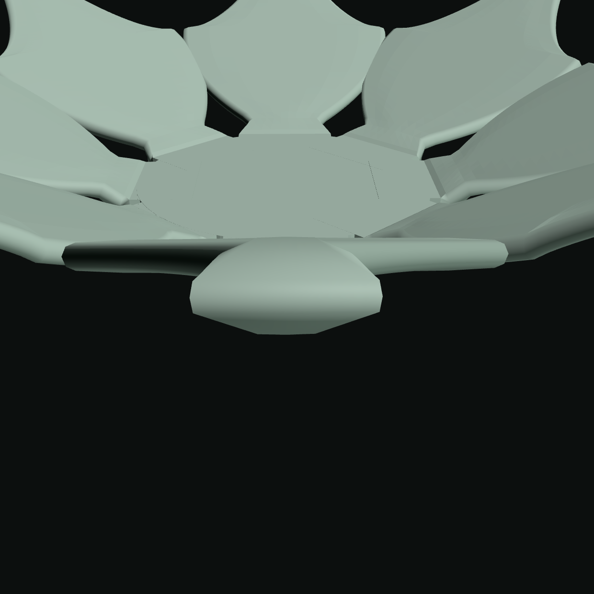
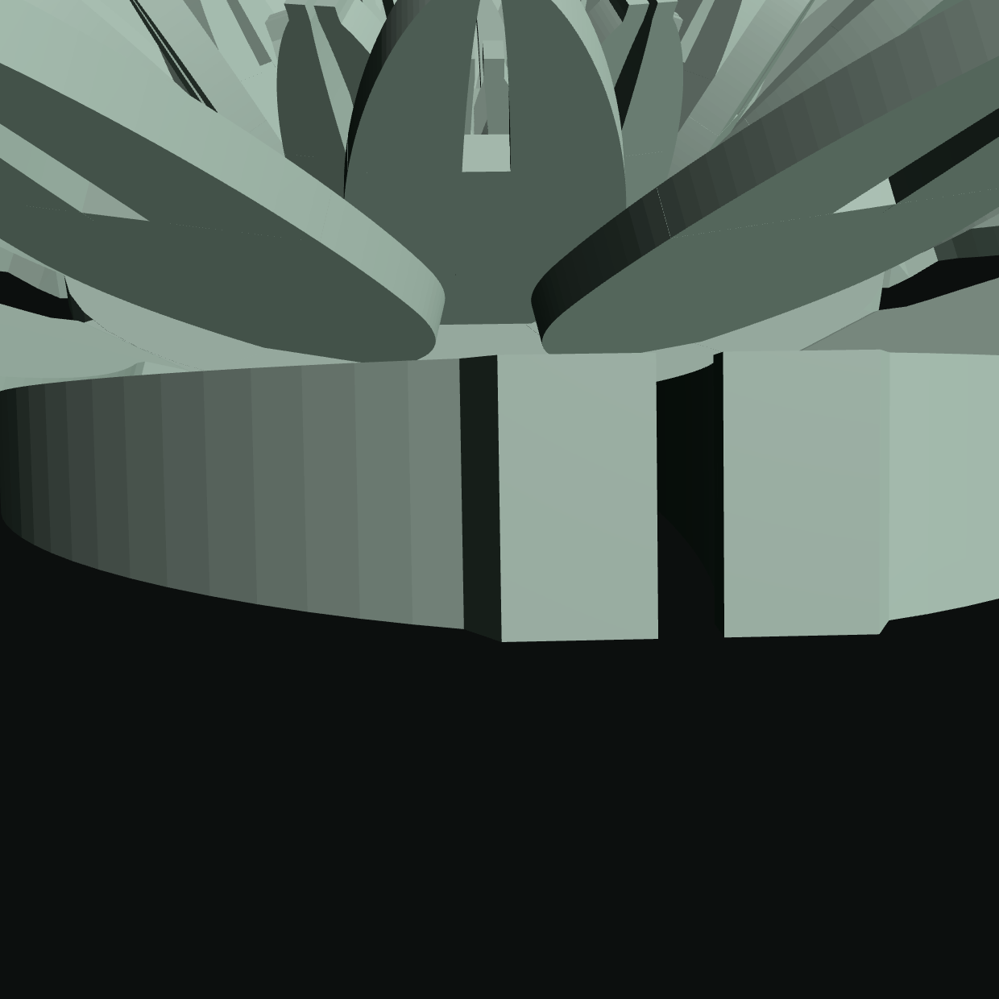
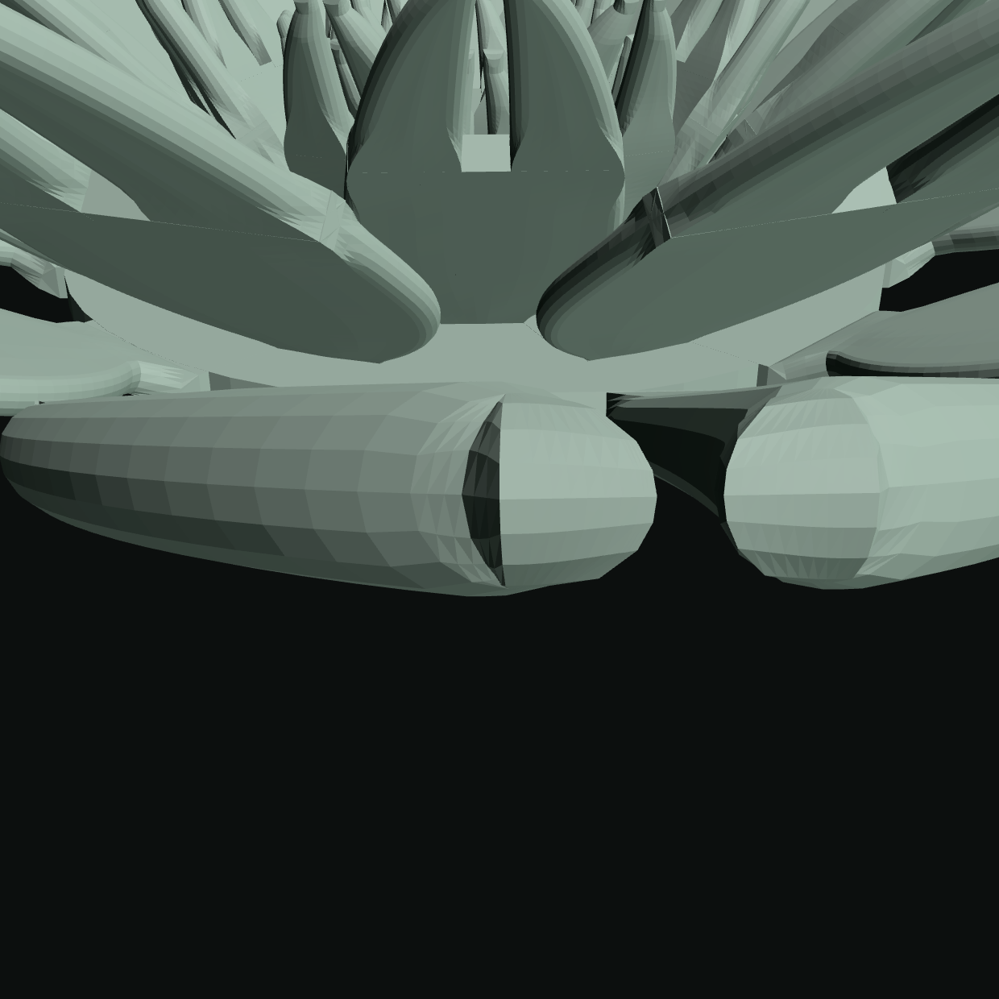

# The petal's edge profile — a thickness taper and a round bead on the rim

Session outcome. Read this before touching `emitPanel`, the `RIM_*` constants,
`tools/verify-bloom-edge-profile.mjs` or `SELF_INTERSECTION_XFAIL`.

## 1. What shipped

`emitPanel` closed every petal with a FLAT WALL one sheet thickness tall — on
the shipping default that is 42 mm of 90-degree cliff down each margin. It now
eases the sheet toward `RIM_FLOOR_MM` over `RIM_TAPER_MM` of **surface distance
in millimetres** and closes it with a half-round bead whose apex is placed AT
the original boundary point, so the silhouette does not move.

**One construction, not two features.** Every perimeter vertex carries a
profile: a half ellipse from the top skin's edge, out through the apex, back to
the bottom skin's. Two lengths decide it — the rim half-thickness `b`, eased by
smootherstep, and the inset `a` — and the perimeter is walked ONCE as a closed
loop, so the corners cost nothing to get right and the buried ends need no
special case: at `a = 0` the profile collapses onto the flat wall's own segment.

    r = min(RIM_BEAD_RADIUS_MM, tBody / 2, RIM_ROOM_FRACTION * room)

carries all three of Eva's rulings at once — the ruled 0.5 mm radius, "no taper
where the body is already at the floor", and the flower's own `addSlab` clamp
for a narrow span.

## 2. Cost, measured at the corner and not at the default

**SUPERSEDED BY §10b — this table is the EIGHT-segment bead, which Eva ruled
down to four. It is kept because the corner-not-the-default method is the point
and because §10b's saving is measured against it.**

| row | main | branch at K = 8 | delta |
|---|---|---|---|
| shipping default (export) | 19,040 | 33,072 | +73.7% |
| `ALL MIN` | 7,260 | 12,522 | +72.5% |
| `ALL MAX` | 2,354,268 | **4,239,920** | +80.1% |
| `INFLO: ALL MAX` | 1,114,828 | **1,886,588** | +69.2% |

**The whole matrix was swept for budget breaches rather than the plausible
candidates checked**: 909 rows built in EXPORT mode, **exactly two over the
1,500,000 budget**, and **not one other row within 20% of it**. `ALL MAX` was
already a declared refusal and is re-recorded; **`INFLO: ALL MAX` is a NEW
refusal** and is declared with its count. The headroom everywhere else is not
marginal, which is the useful half of that sweep.

## 3. The rim is sound

* boundary edges **0**, degenerate triangles **0**, **directed**-edge census
  **0 unmatched** on every smoke row; signed volume positive (+4,188.53 mm³
  against main's +4,415.57 — the bead removes material at the rim).
* the worst turn the treatment **adds** near a rim is **21.50°** against the
  then-typed 30° allowance — **at K = 8; see §10e, where the count and the
  allowance both move.**
* the `/plot` grid glTF is **byte-identical to main over 242 builds**.
* `git diff origin/main --stat -- 'flower*'` is empty.

**The directed census is new and it caught the rim wound inside-out** — 2,112
unmatched directed edges and a volume of −455.58 mm³ while boundary and
non-manifold both read 0. `analyzeStl`'s census keys on a SORTED pair, so it is
undirected and structurally blind to this; ST10's stem-plug finding, one solid
later.

## 4. Where the rim goes under the floor, and by how much

Eva's ruling: on a narrow span the bead shrinks to fit and the rim may dip below
1.0 mm, and every such location is reported with its measured thickness. Read
off the BUILDER's own clamp record over the whole matrix:

* **21 rows of 909** carry at least one clamped location; **39,308 locations**
  in total.
* **thinnest rim anywhere: 0.5990 mm**, on `CAPABILITY: cleft x 6 layers`, where
  the span is 0.660 mm and the body is 1.200 mm.
* only **three** rows go below 0.8 mm and all three are cleft rows
  (0.5990 / 0.6286 / 0.7018 mm); **none goes below 0.5 mm**.

## 5. Three of the brief's premises are contradicted by measurement

1. **"A preset that crosses the live triangle ceiling silently keeps its
   last-good mesh."** The bloom has no live ceiling, no last-good-mesh retention
   and no presets — those are the flower's. What the bloom has is an EXPORT
   budget with a loud refusal path (`EXPORT_TRI_BUDGET`, XR1/XR2).
2. **"Segment count scales with drawn bead radius, 8 down to 3."** Unreachable
   once the count is mode-free. `rimSegments` reads
   `max(sheetMm, MIN_FEATURE_MM)`, because a count derived from the LIVE sheet
   differs live/export at `sheetThickness` 0.60 (6 against 8) and how many
   triangles a shell has is topology. Session 32's mode-dependence refusal, a
   sixth time.
3. **"The narrowest reachable panel span is 1.0000 mm."** Measured **0.660 mm**
   in export and 0.124 mm live — a cleft lobe tip.

## 6. The self-intersection census, re-baselined — SUPERSEDED, MEASURED TWICE OVER

**EVERY NUMBER IN THIS SECTION WAS MEASURED ON THE OLD CENSUS AND ON THE
EIGHT-SEGMENT BEAD, AND BOTH HAVE SINCE MOVED** — the census by #279's
adjacency rule, the bead by Eva's ruling to four segments. §15 carries the
re-measurement against the tree that ships. This section is kept for the ONE
finding in it that is a property of the geometry rather than of the instrument,
and which survives both: the shell re-categorisation below.

`node tools/bloom-xfail-magnitudes.mjs --emit` on the branch, against a worktree
of `main`. Of the 302 entries the list carried:

| | rows |
|---|---|
| HELD exactly (pairs and span) | 38 |
| pair count UP | 134 |
| pair count DOWN | 73 |
| read ZERO — genuinely clean | 37 |
| read ZERO — **re-categorised** | 19 |

302 → 246 entries, then **+3 for the real new folds** (§7) = **249**.
Total declared within-shell pairs **1,565,794 → 1,252,860**.

**The 56 zeros split in two and the split is measured, not assumed.** 37 are
rows whose shell decomposition is unchanged on both trees and whose pairs
genuinely went (the largest was 724). The other **19 are every multi-panel row**
— every FRINGE row, every CLEFT row, and `TIP SHAPE: 3.00 x a cleft margin` —
and they did not stop overlapping. The census finds shells by VERTEX WELDING,
and the bead closes each panel with its own boundary, so a tooth panel and the
base panel it overlaps BY DESIGN are two shells here where they were one on
main:

    FRINGE: THE CARNATION   shells 13 -> 41    within 7,288 -> 0    cross 5,992 -> 15,464
    FRINGE: x 40 petals     shells 45 -> 201   within 40,759 -> 0   cross 129,568 -> 197,152
    CAPABILITY: cleft x 6 layers  shells 49 -> 145  within 27,990 -> 0  cross 29,872 -> 67,984

**205,930 of the 312,934 within-shell pairs the list loses are that
re-categorisation and not a repair.** What it costs, said plainly: a tooth
folding through its own BASE panel would now be cross-shell and invisible to
this census. A panel folding through ITSELF is still caught.

## 7. WITHDRAWN AND SUPERSEDED — two rows fold, not three, and the grounds were wrong

**THIS SECTION SAID THREE ROWS GENUINELY FOLD AND SEPARATED THEM FROM 108
ARTEFACTS "BY THE ONE QUANTITY THAT IS PHYSICAL, THE WORST SPAN". The
separation was sound in outline and wrong in one row, and the quantity it
leaned on is not what it was taken to be.** PR #279 (`8f5e209`) measured it
three ways that share no code, on this branch's own stored pairs:

* **`VARIANCE: size ±50% x 40 petals` is NOT a fold.** All 66 pairs are
  adjacency artefacts — every surviving point came from an edge incident to a
  shared corner, 0 of 66 has a free-edge point, none overlaps in plane, and
  every point sits 1.16e-9 to 2.41e-9 mm from a shared corner. **The pair that
  set the row's "0.8187 mm" shares an EDGE, and its two surviving points sit
  1.2168e-9 mm and 1.3312e-9 mm from that edge's two ENDS. 0.818700 mm is the
  length of the shared edge.** The span was reporting the mesh's own topology,
  at full scale, which is exactly why it looked like most of a sheet.
* **The other two are real and stand**: `DOME: the mum x rise 1 — a hemisphere`
  reads 0 artefact / 84 genuine, and `BUCKLE: THE IRIS look` 0 artefact / 4
  genuine. Both are MUST-STILL-FOLD fixtures in #279's own gate now. Note the
  counts this section published for them (208 and 8) were the artefact-inflated
  ones; the genuine halves are 84 and 4.

**AND THE GROUNDS FOR REJECTING THE EPSILON ROUTE DO NOT HOLD.** This section
argued that scaling the discard bar by coordinate magnitude "takes
`VARIANCE: size ±50% x 40 petals` with them, whose 0.8187 mm fold is real" —
the damage it did to that row was damage to an **artefact**. The conclusion
(don't reach for a relative epsilon) survives; the reason given for it does
not, and it was the load-bearing one. The route #279 took is neither that nor
the "verify the point" this section proposed: it is **connectivity plus one
scale-free angle** — a hit produced by an edge one of whose endpoints the other
triangle also carries is discarded, licensed by transversality, with
`offPlane()` as the other half (without which the rule loses 89 real pairs on
18 main rows).

**WHAT THIS SECTION GOT RIGHT, kept because it is the half that generalises:**
that the 108 rows were the *instrument* rather than the geometry, that an
absolute `PT_EPS` of 1e-9 mm on coordinates of 20–40 mm is the solve's own
conditioning rather than a tolerance, and that the bead makes many more
near-tangent facets meet at one vertex than the flat wall did — which is why
this branch surfaced a defect that had been latent on `main`.

**A SPAN IS NOT A DEPTH, and that is the durable lesson.** The worst span is
the largest chord an intersecting pair carries; where both reported points are
adjacency artefacts sitting at the two ends of one shared edge, it is that
edge's length and nothing about the geometry. This section used it as the
physical discriminator and it is not one. `tools/bloom-census-sweep.mjs`'s own
header now carries the same sentence, with this row as its example.

## 7b. X0: the inset bisection's tie was decided by the last bit

**Found by running the browser smoke subset, and invisible to every Node-only
instrument by construction** — in Node the page's build and the rebuild share
one call chain and the difference is exactly 0. CI reported X0 on two rows;
the local `bloom-smoke --conn` reproduced both, at **1.87e-4 mm** and
**9.06e-6 mm** between the exported STL and the builder's own doubles. Those
are not last-bit differences.

`rimInsetV` walks in from the margin to where the chord from the edge point is
`want`, by twelve halvings. **On a flat cross-section `rimDist` is LINEAR in
`v`, and `want` is `g * r` with `r` usually exactly `RIM_BEAD_RADIUS_MM`** — so
the target lands on a DYADIC point of a linear function and the comparison is
an **exact tie**. Measured over the matrix: **102 of 909 rows carry a
comparison with `d === want` to the bit**, at halving 2 or 3, where the bracket
is still a quarter or an eighth of the span. Both rows CI named are in that
set. A tie decided by `<` is decided by the last bit of `sect(mid).P`, the
frame runs transcendentals, and V8 versions disagree there — so the page's
Chromium and Node take different branches and the inset moves by a quarter
bracket.

**The first instrument conflated two things and had to be corrected**: it
counted the buried case, where `want` is 0, `d < 0` is false at every halving
and both engines return the same thing. Excluding it left the real population.

The bar now carries a slack **derived from the quantity's own conditioning, in
the unit the quantity has** — `d` is a hypot of coordinate differences, so its
error is a few ulp of the COORDINATE magnitude (~30 mm), not of `want`
(~0.5 mm). `RIM_INSET_TOL_ULPS = 8`. **Verified in the browser: both rows now
read `X0-identical to the STL` and the export gate passes on them**, and the
declared one still meets its recorded magnitude.

**It moves bytes and the partition is declared: 105 of 909 rows move, 804 hold
bit-identical, 0 triangle counts move, worst 1.953e-3 mm** over 776,623,698
floats compared positionally under `Object.is`. Two microns. The movement is
inherent rather than a badly-sized slack: after an exact tie on a linear `d`,
the later halvings land on dyadic points too, so several comparisons per row
sit within a few ulp of the bar and any slack robust to an engine ulp flips
some of them. **Seventh instance of the discrete-decision-on-a-continuous-
quantity class in this project; do not write an eighth.**

**It also moved the census, which is why it had to land before the list was
final**: six rows came off the new-fold list, and three declared magnitudes
improved — `DOME: the mum x rise 1` 210 -> 208, `GYNOECIUM: style x the mum`
and `STIGMA: a shaped stigma x the mum` 275 -> 272 each. Re-recorded, and the
tool's verdict on the whole list is that every declared magnitude reproduces.

## 7c. The renders

`node tools/shot-bloom-edge-profile.mjs <dir> --base <worktree>` —
`docs/img/edge-profile/`. The three cells the brief named, each a pair:

| | before | after |
|---|---|---|
| **a wide petal**, the margin at half length (`petalWidth` 30) |  |  |
| **a pointed apex** (`petalTipShape` 0.60, the acute floor) |  |  |
| **the narrowest span** (a cleft at six whorls, the bead shrunk to fit) |  |  |

**The pair shares ONE camera and that is an identity, not a promise.** The
target is a point of the captured MID-SURFACE, computed on the base tree — and
the mid-surface is byte-identical between the trees, which is exactly what
`verify-bloom-grid-bytes.mjs` proves over 242 builds. So the base tree owns a
number this session's geometry writes, and neither cell is told a camera by
the sheet. Print preview is ON in every cell, with the app's own `shownMode`
asserted `export`.

**No pixel delta is quoted for any pair** — two trees, two servers, two page
sessions. The one pixel number is the same-tree control: the wide cell on this
tree, one camera, shot twice, **1 px of 384,400**. Reported, never a bar; a
single control draw is not a floor.

**THE CAMERA DIRECTION WAS BACKWARDS IN THE FIRST DRAFT AND THE SHEET RENDERED
BLACK.** `__bloomFrame`'s `dir` is the vector FROM the target TO the camera
(the stem-plug sheet's "from below" is a negative z), so the first version put
the eye inside the solid. Recorded because a black cell is the loud failure;
the quiet one would have been a camera slightly inside a petal.

## 8. Gates

New: `tools/verify-bloom-edge-profile.mjs` (E0–E5, five must-fails) and
`tools/verify-bloom-grid-bytes.mjs`. Four existing gates were **re-derived onto
the new offset law rather than loosened**: `verify-bloom-grid` clause 2 (now
2a–2e), the stem channel's ST9 witness, `verify-bloom-surface-offstation`'s
clause A and `verify-bloom-rim-arc`'s R1.

**`verify-bloom-grid`'s negative control found two things after the geometry
settled**, both recorded in that file: `the-bead-apex-is-recomputed`'s anchor
was disarmed by the flat-profile branch landing between the two statements it
matched as one line (the anchor pre-check refused the whole run before any
mutant executed, which is the survivable half of a refactor disarming a mutant);
and `grid-stores-the-row-normal` legitimately reddens the widened 2a, because
2a's second half reconstructs `P ± n·t/2` and therefore reads the stored normal
— 112 of 1072 points, all at `row 0 u = 0`, and only on the three rows where the
row normal and the per-column normal actually differ. The claim was widened, the
clause was not loosened.

## 9. Frozen phase

**None owed.** No matrix row is added or removed by this change (909 rows on
both trees), so `frozen/phase37` stays the newest baseline. Every frozen tag's
BYTES stop reproducing on every row with a petal, which is expected of a change
that re-triangulates every perimeter and is named here rather than in the list.

---

# Eva's three rulings on the shipped branch

## 10. Ruling 1 — the bead is four segments, with its own normal

> *"cap at 4 at full radius (0.5 mm), scaling down with drawn radius to a
> minimum of 3, with smooth (averaged) normals across the bead. Reason: 8
> segments puts facets at about 0.2 mm, below Nylon 12 White's ~0.35–0.4 mm
> resolvable detail."*

**The cap ships and it is the whole of the saving. The other two clauses are
unreachable, and each is blocked by something this project has already ruled
on** — reported rather than quietly implemented or quietly dropped.

**(i) The scaling never fires, because the only radius `rimSegments` is allowed
to read is a constant.** The DRAWN radius is
`min(RIM_BEAD_RADIUS_MM, tBody/2, RIM_ROOM_FRACTION * room)`, and every arm past
the first is MODE-DEPENDENT: `tBody` carries the export sheet floor and `room`
carries the tip floor (0.15 mm live against 0.80 mm export). A segment count
read off it would make the TRIANGLE COUNT mode-dependent, which both STL gates
assert against by name and which this project has refused six times. What is
left to read is the sheet through `max(t, MIN_FEATURE_MM)` — and that makes the
cap an **identity**, not a measurement: `max(t, MIN_FEATURE_MM) / 2 >=
MIN_FEATURE_MM / 2`, which *is* `RIM_BEAD_RADIUS_MM` on this tree (1.0/2 = 0.5),
so the first arm binds for every finite input and the ratio is exactly 1.
Checked over 100,001 sheet values from 0 to 10 mm plus the extremes: **K = 4 on
every one.**

**(ii) Three is not an available count at all**, and that is structural rather
than a rounding preference. The apex must be an EMITTED vertex at the profile's
own midpoint — `pts[APEX] = apex` with `APEX = K/2`, which E4 and
`verify-bloom-grid`'s clause 2a both read as an IEEE-754 identity — so K is even
or the apex is not on the profile at all. At K = 3 the tangent-angle samples sit
at 0, 60, 120 and 180 degrees and 90 is not among them, so the bead would stop
being symmetric about the mid-surface. **Four is the smallest even count at or
above the ruled minimum, and it is also the cap, so the two ends of the ruled
range meet.**

The min and the ratio are KEPT rather than deleted: they are the ruled law, they
cost nothing, and they become live the day `MIN_FEATURE_MM` drops below the
bead's diameter.

### 10a. The normals are a CHANNEL, because the viewer cannot smooth anything

`bloom.js` builds a **non-indexed** `BufferGeometry`, and `computeVertexNormals()`
on one of those is a FLAT normal per triangle — it cannot average. The three.js
remedy (`mergeVertices` then recompute) averages across EVERY shared edge, which
would round off the foot-to-blade seam and the hub and make the solid read as
wax; smoothing under a crease angle instead needs a position search over up to
four million triangles on every slider drag.

So the bead's normal is emitted where it is known, in closed form. In the
`(n̂, ŵ)` plane the profile is the ellipse `(b cos θ along n̂, aLen sin θ along ŵ)`,
whose outward normal is `(aLen cos θ, b sin θ)` — **the semi-axes swapped, and
that is the whole of it.** Two ends fall out rather than being special-cased: at
θ = 0 it is `+n̂`, which is the top skin's own normal (the bead leaves the skin
tangentially, so the two agree), and at θ = π it is `−n̂`.

**What it leaves out, said rather than hidden:** the term along the SWEEP, which
is non-zero wherever the profile's size changes from one column to the next. It
is a shading approximation and it decides no geometry.

`MeshBuilder({ captureNormals })` is OFF by default and set by the **viewport's
build alone** — the STL writes its own per-facet normal and the grid export
writes line strips, so neither pays for the array.

Measured, rather than argued:

* **0 positions moved** with the channel on, over five states in both modes
  under `Object.is` (DEFAULTS, `petalTipShape` 0.60, the cleft at six whorls, an
  inflorescence, a sphere head with a stem).
* every emitted normal is unit to **4.4e-16**.
* across every bead-to-bead edge the two triangles' own emitted normals agree to
  within **2.1e-6 degrees** — 53% of them to the bit, the residue being the
  probe's own `fround`-keyed vertex lookup. **And that classification had to be
  PER VERTEX**: the first cut of the probe called a triangle "bead" if its three
  normals were not all equal, which catches every triangle straddling the end of
  the treatment and reported half the bead as discontinuous at 21.3 degrees.

### 10b. The cost

Whole live matrix, **909 rows, EXPORT mode, three trees**:

| | main | K = 8 | K = 4 (ships) |
|---|---|---|---|
| matrix total | 50,377,084 | 86,291,522 (+71.3%) | **64,789,898 (+28.6%)** |
| `DEFAULT` | 19,040 | 33,072 | **24,688** (+29.7% / −25.4%) |
| `ALL MIN` | 7,260 | 12,522 | **9,378** (+29.2% / −25.1%) |
| `ALL MAX` | 2,354,268 | 4,239,920 | **3,090,816** (+31.3% / −27.1%) |
| `INFLO: ALL MAX` | 1,114,828 | 1,886,588 | **1,425,468** (+27.9% / −24.4%) |

**The bead's own added triangles fall from 35.9M to 14.4M — a 60% reduction**,
more than the naive halving of K would give, because the corner fans and the
degenerate-skipping scale with it too.

**THE BLOOM HAS NO PRESETS, and that is a fact about this generator rather than
a step skipped.** `bloom-view-presets.js` is the VIEW box's dropdown — camera
position and fov, read by `presetDistance`, building no geometry and carrying no
triangle count; `flower-presets.js` belongs to the other generator, which has its
own three gates. The named matrix corners above are what stands in their place,
and `ALL MAX` is the corner this project's own rule says to measure.

**0 of 909 rows differ between live and export.**

### 10c. `INFLO: ALL MAX` is no longer a refusal

At eight segments it was a NEW refusal and was declared. At four it builds
**1,425,468 — 95.0% of the 1,500,000 budget, under it** — so it exports, and XR2
would fail on a declaration that stayed. Its entry is **withdrawn**, and the
withdrawal is recorded in the block's own header rather than leaving the list
one row shorter with no explanation. It is now the closest any row comes to the
bar; the re-swept matrix puts the next highest at 46%.

### 10d. The gate runtime, projected

Measured on this branch at K = 8: `bloom-export-watertight` **5 h 32 m** (matrix
step 5 h 26 m) and `bloom-connectedness` **3 h 20 m** — **27.7 minutes of
headroom under the 6-hour job timeout**, which was the real risk.

Fitting `t = a + b·T` through main's recent cluster (CLAUDE.md's own last five
successes, 214.8–221.4 min, median 218 at T = 50.38M) and this branch's measured
332 min at T = 86.29M gives b = 3.18 min per million triangles and a = 58 min,
so at T = 64.79M:

| | K = 8, measured | K = 4, projected |
|---|---|---|
| `bloom-export-watertight` | 332 min | **~264 min (4 h 24 m)** |
| `bloom-connectedness` | 200 min | **~153 min (2 h 33 m)** |
| headroom under the 6 h timeout | 27.7 min | **~96 min** |

**The projection carries the spread of the number it is fitted through**, and
that spread is wide by this project's own record: at main's historic low of
151.8 min the same fit gives 225 min instead of 264. So read it as *roughly four
and a quarter hours, with the timeout no longer close* — and **size the actual
wait off `actions_list`'s own recent completed runs at the time**, which is the
rule CLAUDE.md states and which no figure here replaces.

### 10e. E2's typed 30-degree bar was in conflict with this ruling

A half round sampled at K segments turns **180/K** between adjacent facets BY
CONSTRUCTION — that is exactly what the tangent-angle sampling buys, and it is
the bead drawing itself rather than an edge the treatment added. At K = 4 that
is 45 degrees, so **a typed 30 forbids the count Eva ruled**; the two rulings
cannot both be satisfied by a constant. The later one, which states its reason,
governs.

The bar is now the bead's own resolution, read through `RIM_BEAD_SEGMENTS`.
**ACCEPTED BY EVA AS `180/K`, AND ON THE SHIPPING TREE THAT IS 45° — A
RELAXATION FROM THE TYPED 30°, SAID PLAINLY BECAUSE IT IS THE THING A READER
WILL WANT TO KNOW.** The tree ships at K = 4, so the allowance E2 actually
enforces is fifteen degrees looser than the number it replaces, and no amount of
saying it is stricter at K = 8 changes what runs.

**WHAT STILL GUARDS IT IS `the-flat-wall-is-restored`** — the negative control
mutation that takes the treatment away entirely and leaves main's own 90° cliff
at the rim. At the 45° bar it fires E2 with room to spare: the declared buckle
row's excess moves from 6.236137 to **53.591109 deg**, an order of magnitude
past the band. So the clause is not close to vacuous at the looser number, and
that is a measurement rather than a reassurance. It is the only thing standing
between E2 and a bar wide enough to admit a cut edge, which is why it is named
here rather than left in the control's output.

The secondary point, kept because it is the test that says this is a
re-derivation and not a bar fitted to the data in hand: at K = 8 the same
formula gives 22.5 against the typed 30, and the shipped tree measured 21.50
there — so it would have held on the geometry it replaces as well as on this
one. And the SHADING half of the old bar's job is answered by the other half of
the same ruling: the bead now carries its own smooth normal, so a facet edge is
no longer something the eye can find.

**Four rows exceed it and are DECLARED with their magnitudes** (#213's idiom, in
degrees), because the SURFACE itself turns faster than the outline's PLAN turn
can see:

| row | excess over 45° | why |
|---|---|---|
| `BUCKLE: the default frequency at a strong amplitude (0.30 x, f 3)` | **6.236137** | the wave curves the margin OUT OF PLANE; raw 60.05°, outline 8.81° |
| `TIP SHAPE: 0.60 x the thickest sheet (2.40 …)` | **0.005430** | the taper runs 2.40 → 1.00 mm over `RIM_TAPER_MM`, so the profile's own half-thickness changes along the sweep and the quad is not planar |
| `FRINGE: THE CARNATION — 7 teeth …` | **0.000168** | a tooth's terminal; the frame rotates a hair between adjacent columns |
| `FRINGE: GATED — LOBES asked for under a fringe …` | **0.000168** | the same fringe |

Both directions, band 5e-5 deg (#213's own 5e-5, in the unit this quantity
carries, eight orders above the float floor of an angle taken from two unit
normals and well inside the smallest excess declared). Plus a clause that fails
on a declaration naming a row the gate never ran — the combination gate's CG5,
one instrument later.

## 11. Ruling 3 — the bead does not fold at a pointed apex

> *"the after-render shows a dark notch at the tip of a torpedo-shaped petal
> (lower ring) and a sliver near an upper-right pointed tip. Determine whether
> the bead folds or self-intersects at pointed apexes. Measure it from the
> exported mesh; don't judge it from shading."*

**Measured from the emitted mesh on BOTH trees, and the answer is no on every
instrument.** Every site is located against the petal's own TIP read off the
builder's captured mid-surface, so "at the apex" is the builder's answer and not
the session's.

| | `petalTipShape` 0.60 | cleft × 6 whorls | DEFAULTS | `petalTipShape` 3.00 |
|---|---|---|---|---|
| within-shell census sites within 2 mm of a tip | **0** | **0** | **0** | **0** |
| unmatched DIRECTED edges (an inside-out facet) | **0** | **0** | **0** | **0** |
| triangles at or under the gate's own degeneracy bar (1e-9 mm²) | **0** | **0** | **0** | **0** |
| hairpins (> 150°) within 2 mm of a tip | **0** | **0** | **0** | **0** |

The census was also run on `petalTipShape` 0.60 × the thinnest sheet, × 60 mm
long, and on the cleft at one whorl: **0 sites near a tip on all seven states.**

**The one thing that looked like a finding was the probe's own bar.** At a
threshold of 5e-5 mm² the cleft-at-six-whorls state showed 64 near-tip "slivers"
where main showed none — but the gate's own `DEGENERATE_AREA_MM2` is **1e-9**,
four orders below that, and at the project's own bar the count is **0**. The
smallest facet there is 3.99e-5 mm²: a small triangle on a finely subdivided
bead, not a degenerate one.

**The 174.27° hairpin on the cleft state is MAIN'S OWN** — the identical value
at the identical distance on both trees, 3.20 mm from a tip, with main carrying
72 of them and the branch 88. Pre-existing, and not at an apex.

**And near-tip facet turns are strictly BETTER than main's**, which is the
measurement that settles it (turns over 60°, within 2 mm of a tip, export):

| | main | K = 8 | K = 4 |
|---|---|---|---|
| `petalTipShape` 0.60 | 224 (150 of them 90–120°) | 96 | **32** |
| DEFAULTS | 344 (168 at 90–120°) | 72 | **32** |
| `petalTipShape` 3.00 | 184 (96 at 90–120°) | 16 | **0** |
| cleft × 6 whorls | 12,800 (7,216 at 90–120°) | 7,368 | **6,736** |

Main's worst near-tip turn is **exactly 90.00°** — the flat wall meeting the
skin, which is what the treatment exists to remove.

### 11a. So what was in the render

**Shading, and the ruling's own other half fixes it.** `bloom.js` builds a
non-indexed buffer, so every triangle rendered with its own FLAT normal: an
8-segment bead steps 22.5° a facet at about 0.2 mm, which is a rosette of
discrete shading bands wrapping a pointed tip over roughly a millimetre of
screen. Measured as the Lambert jump across each near-tip edge under one fixed
light, `petalTipShape` 0.60: main 154 edges over a 0.20 jump at a 0.963 mm mean
facet; K = 8 **490 edges at 0.464 mm**; K = 4 367 at 0.770 mm. Three times
main's count at half its facet size is what reads as stippling — and **on the
bead those edges now carry no jump at all**, because the normal is continuous
across them (§10a's 2.1e-6 degrees).

The images are re-rendered at four segments with the bead's own normals:
`docs/img/edge-profile/`.

**No geometry change was made for this ruling, because the measurements say
there is no defect to fix.** That is the finding, not an omission.

## 12. The census, after the rebase onto #279

`SELF_INTERSECTION_XFAIL` was deliberately NOT re-measured before the rebase.
Eva's ruling 2: *"do NOT declare the 108 rows here. A separate session is fixing
the census instrument as its own PR. Do not touch the census code in this
branch."* Re-recording then would have baked in numbers the census fix changes
again, so the list was measured **once**, after the rebase, against the
instrument that actually runs it. **§15 is that measurement.**

### 12a. The three rows X2 flagged read ZERO under the fixed census

Before the rebase, a nine-row subset run on this tree read three rows with
pairs that were not on the declared list — 14, 2 and 2, every span measured at
full precision as exactly `0.000000e+0`. Eva's instruction was to attribute
them rather than dismiss them: *"report which two pieces touch, where, and
whether they are meant to be connected. Do not declare them as artefacts;
bring them to me as WAITING ON EVA if they're real contacts."*

**There is nothing to attribute: under #279's census all three read 0
within-shell pairs.** Measured on this tree by `tools/bloom-census-sweep.mjs`,
EXPORT mode, the row built once and handed to the census:

| row | within | cross | worst | shells |
|---|---|---|---|---|
| `TIP SHAPE: 0.60 x a far-out widest point` | **0** | 3,216 | 0 | 9 |
| `TIP SHAPE: 0.60 x the thickest sheet (2.40 …)` | **0** | 2,272 | 0 | 9 |
| `SPHERE STEM: the default sphere at the shipped stem (60 mm x 6 mm)` | **0** | 2,793 | 0 | 9 |

All three were the shared-corner class #279 was built to remove: a hit produced
by an edge one of whose endpoints the other triangle also carries, which is the
mesh's own topology rather than a fold. The cross-shell counts are the export
contract's own overlapping closed solids and are reported, never gated.

**So no contact needed a ruling on THESE THREE.** What would have been wrong is
concluding *from that zero* that they were artefacts — the span was not evidence
either way, as §7 above now records at length.

**AND THE GENERALISATION FROM THESE THREE TO THE MATRIX WAS THE SESSION'S OWN
ERROR — see §12b.** This section originally closed by reporting that no 8.9 µm
contact existed. That was measured over *these three rows* and said nothing
about the other 906; the full 909-row sweep finds one at **8.8707e-3 mm**.
Eva had meanwhile relayed a partial 133-row report as the full picture and
withdrawn her own figure, so the error ran in both directions at once. **It
resolves in favour of the original measurement: the 8.9 µm contact is real.**
A subset is evidence about the subset.

### 12b. THE FULL SWEEP: five undeclared rows read non-zero, and three are real contacts

**AND THE 8.9 µm CONTACT EXISTS AFTER ALL — the concession in §12a was accepted
too readily and is withdrawn.** §12a measured the *three rows the OLD census
flagged on a nine-row subset* and found every span exactly `0.000000e+0`. That
was true of those three and says nothing about the other 906. The full sweep of
all 909 rows under #279's census finds a fifth row at **8.8707e-3 mm**, which is
the figure to four significant places. **Eva's expectation was right and the
correction was mine to make, not hers.**

`tools/bloom-census-sweep.mjs`, this tree, EXPORT mode, **909 of 909 rows, 0
missing, 628 deduplicated shard overlaps, 0 disagreeing**:

| declared rows | |
|---|---|
| held exactly (pairs and span within ±5e-5 mm) | 40 |
| pair count UP | 94 |
| pair count DOWN | 91 |
| read ZERO — entry must go | 65 |

**Five UNDECLARED rows read non-zero, every one of them 0 on `main`** (measured
on a worktree of `8f5e209`, same tool, same mode — so all five are this PR's):

| row | pairs | worst span | what touches what |
|---|---|---|---|
| `DOME: the mum x rise 1 — a hemisphere` | 168 | **0.2424 mm** | **one petal against ITSELF at its own root blend** (u 0.000–0.018), 0.500–0.505 mm off the mid-surface, on 120 petals over a hemisphere |
| `BUCKLE: THE IRIS look` | 8 | **9.63e-3 mm** | **one petal against ITSELF at its own TIP** (u 0.982–1.000), 0.314–0.521 mm off mid |
| `DEPTH: the mum at 6 turns (D_max 19, CROWDED)` | 27 | **8.87e-3 mm** | **one petal against ITSELF at its own foot-to-blade seam** — corners at u 0.000 and u 0.036, r ≈ 1.92 mm, z ≈ 0.49 just under the hub's top face, on the innermost petals of a 240-petal head |
| `DOME: rise 1 x petalTilt 0` | 32 | 2.70e-17 mm | same petal, root blend — a tangency at the float floor |
| `TILT: 90 (the right angle)` | 32 | 2.00e-15 mm | same petal, root blend — a tangency at the float floor |

**ARE THEY MEANT TO BE CONNECTED? No.** In all five the two triangles belong to
**the same petal**, and a petal's two skins are meant to be one sheet closed by
the bead at its rim. A sheet passing through itself is not a designed
connection — unlike a tooth panel overlapping its base panel, or a sepal foot
sharing the petal foot's rim, both of which this list declares by name. So the
top three are genuine self-intersections of the class X2 exists to catch, and
the bottom two are tangencies at 1e-15 and 1e-17 mm, which is the float floor
on coordinates of this size.

**Two of the three were already known to be real**: #279's own fixtures
re-measured `DOME: the mum x rise 1` and `BUCKLE: THE IRIS look` on this
branch's pairs and found 84 and 4 genuine (0 artefact) at eight segments; at
four they read 168 and 8. `DEPTH: the mum at 6 turns` is new to this
measurement and is the deepest-crowding row the matrix builds.

**The attribution took two passes and the first one misnamed a piece.** It
required a triangle's three corners to sit within 1.2 sheets of ONE petal's
captured mid-surface, and on the 240-petal mum the feet are so crowded that a
neighbouring petal's lamina sits **0.093 mm** away — so one corner matched
petal 210 while the other two matched 239, and the triangle came back as "not a
petal lamina". Named per CORNER instead, it is petal 239 throughout. A
classifier that reports an unknown when the answer is "crowded" is the kind of
result to re-read rather than publish.

### 12c. Eva's ruling: DECLARE, don't fix — and the mechanism, named

**All five are declared with their magnitudes, locations and petal counts, and
`SELF_INTERSECTION_XFAIL` is re-recorded from this tree's own sweep.** The
tessellation is not moving, so this is not work that will be done twice.

**THE MECHANISM.** A sheet offset by half its thickness self-intersects wherever
the surface curves tighter than that half-thickness — the offset surface folds
through itself, which is the same class session 38 named at the foot-to-blade
kink. The bead **adds material at exactly those places**: it is a half-round of
radius 0.5 mm swept around the rim, and the rim is where the surface's own
curvature is highest. **The root blend and the foot-to-blade seam are the
tightest curves a petal has**, and that is where four of the five sites sit; the
fifth is the buckled tip, where a wide ruffle reaching in from the margin puts
its crests inside the 3 mm taper band.

| row | pairs | worst | where | petals |
|---|---|---|---|---|
| `DOME: the mum x rise 1 — a hemisphere` | 168 | **0.2424 mm** | own root blend, u 0.000–0.018, 0.500–0.505 mm off mid | 120 |
| `BUCKLE: THE IRIS look` | 8 | **0.0096 mm** | own tip, u 0.982–1.000, 0.314–0.521 mm off mid | 8 |
| `DEPTH: the mum at 6 turns` (D_max 19) | 27 | **0.0089 mm** | own foot-to-blade seam, u 0.000 and 0.036, r 1.92 mm, z 0.491 | 240 |
| `DOME: rise 1 x petalTilt 0` | 32 | 2.70e-17 mm | own root blend, 0.600 mm off mid — **NOISE**, the float floor | 8 |
| `TILT: 90 (the right angle)` | 32 | 2.00e-15 mm | own root blend, 0.594–0.600 mm off mid — **NOISE**, the float floor | 8 |

The bottom two are recorded as noise and say so in their own entries: 2.70e-17
and 2.00e-15 mm are the float floor on coordinates of 20–40 mm, eleven or more
orders under the printable gap, and both sit at **0.600 mm off the mid-surface
— exactly half the sheet**, so the two skins are TANGENT rather than crossing.
They are declared only because X2 gates the COUNT and a tangency still produces
one.

**THE FIX IS A CLAMP ON THE BEAD RADIUS AT TIGHT CURVATURE, AND IT IS DEFERRED
TO ITS OWN SESSION** (Eva's ruling on the rebase). **Deferring it means a
tighter state reached later will fold the same way** — that is the accepted cost
and it is written here and in all five entries rather than left to be
rediscovered. What the clamp would read is the local curvature of the
mid-surface at each perimeter vertex and take `r` below `RIM_BEAD_RADIUS_MM`
where the offset would fold; the ingredients are already in `emitPanel` (the row
frames and the emitted polyline), and it composes with the three arms the radius
already has.

### 12d. CA5's scope step failed this PR, and would have failed every geometry PR

**RULED AND FIXED — see §16.** Left here as the finding and the measurement
that produced it; Eva's ruling was to apply the gating proposed at the end.

#279 added three steps to `bloom-export-watertight.yml`. Two (CA0–CA3 and its
negative control) are instrument checks and are fine on any PR. The third is

    - name: ... and only census and instrument files moved
      if: github.event_name == 'pull_request'
      run: node tools/verify-bloom-census-adjacency.mjs --scope --base origin/${{ github.base_ref || 'main' }}

which asserts the PR's diff against its base names only files on a predeclared
census/instrument allowlist. **That is a claim about #279's own scope**, and it
was true of #279. On any later PR it diffs *that* PR's whole change against the
same allowlist. Run on this branch:

    CA5 scope — 17 file(s) changed against origin/main:
      STRAY bloom-geometry.js
      STRAY bloom.js
      ... 14 more ...
      ok   tools/bloom-harness.mjs
    CA5 FAIL — 16 file(s) outside the predeclared census/instrument allowlist.

The allowlist's own comment says the scope it holds is GEOMETRY: *"no
`bloom-geometry.js`, no `bloom.js`, no `bloom-registry.js`, no `flower.*`"* — so
as a standing gate it says no bloom PR may ever change geometry, which is not a
property any future PR can have.

**THE COST IS MINUTES, NOT A GATE CYCLE, and that is worth saying plainly
because it changes how urgent this is.** The step sits at line 151, *before* the
npm install of playwright (164), the browser install (187) and the matrix (189),
so it reddens in the first couple of minutes. It does not burn four hours. What
it does do is make the export gate unable to go green on this PR, or on any
later one that touches geometry.

**THE FIX THAT LOOKS RIGHT, offered rather than applied:** gate the step on the
census rule itself having moved —

    if: github.event_name == 'pull_request' && contains(github.event.pull_request.changed_files, 'tools/bloom-self-intersection.mjs')

or, more simply and without the fragile `contains`, add a `paths` condition or
drop the step and keep `--scope` as the hand-run tool #279's outcome doc already
documents. A census-rule PR is still checked; a geometry PR is not, and a
geometry PR was never its subject. Nothing gets through that the check was
catching: the only PR it could ever have caught is one that smuggles geometry
*while changing the census rule*, and that case stays covered.

**What must NOT happen is the two obvious shortcuts**: adding this branch's
files to `SCOPE_ALLOW` would empty the check of the thing it exists to prove,
and deleting the step without saying so would lose #279's reasoning.

## 13. The negative control found two holes, and neither was visible on a green run

`node tools/verify-bloom-edge-profile.mjs --control` is required before quoting
a pass from a changed harness, and it earned its keep twice here.

**(i) The new stray-declaration clause misfired in the control itself.** It was
keyed on `!ONLY`, and the control runs five hand-picked rows with no `--only`
flag in sight — so every mutation reported E2 on the four declared rows the
subset does not carry, and four of five mutations read FAIL for a reason that
had nothing to do with the mutation. `runRows` takes a `fullSet` argument now
and the caller says which run it is.

**(ii) E5's only mutant went UNREACHABLE, and that is arithmetic rather than
luck.** `the-segment-count-reads-the-live-sheet` strips the mode-free floor out
of `rimSegments`; at eight segments that took `sheetThickness` 0.60 to six live
against eight export and fired E5. At four, `min(4, max(3, raw))` rounded up to
even is **4 for every raw**, so no input to that function can move K at all —
the mutation still applies, still changes the radius, and changes no count.
`bore-is-not-evas-rule`'s lesson (a mutation is invisible wherever the law it
replaces happens to agree with it), arriving because a later ruling collapsed
the law's range to a point; session 32's retired lerp mutations, one gate later.

It is replaced by the defect `RIM_TIP_ROWS`' own header warns about in so many
words — *"a `drop rows until the gap clears the radius` rule would be this
project's sixth discrete decision on a continuous quantity"* — which reads the
emitted half-width, which carries the TIP FLOOR (0.15 mm live against 0.80 mm
export), so the two modes drop different numbers of rows. A plausible defect
rather than an injected one, and it fires E5.

**And E2's new magnitude clause had no mutant at all.** The control's regex
names `FRINGE: THE CARNATION` and `.slice(0, 5)` took five earlier matches, so
the two clauses holding a declared row to its recorded excess were exercised by
nothing while the run reported 5 of 5. **Found by asking which messages the
control actually printed, not by a failure.** The control now REFUSES unless a
row carrying an `E2_TURN_XFAIL` label is in its set, and appends one if not;
with `BUCKLE: 0.30 x, f 3` present, `the-flat-wall-is-restored` moves its excess
to 53.591109 deg and the clause fires.

`the-rim-floor-is-lowered-to-0.4` legitimately reddens E2 as well — a smaller
bead radius is a different surface, so that row's excess moves 6.236137 →
6.526126 deg. **Named as collateral rather than loosening the clause.**

## 14. Local gates on this tree

* `node tools/verify-bloom-edge-profile.mjs` — **PASS**, 110 rows, 645,428
  treated profiles, 4 of 4 declared surface-turn rows seen.
* `node tools/verify-bloom-edge-profile.mjs --control` — **PASS**, 5 of 5
  mutations redden exactly the clauses they name.
* `node tools/verify-bloom-grid.mjs` — **PASS**, 736 checks over 19 rows.
* `node tools/verify-bloom-panel.mjs` — **PASS**.

Not run locally and not claimed: the full matrix on either STL gate, and
`bloom-smoke --conn`, which exceeds the foreground budget this container
allows. The merge criterion is the full matrix in CI, after the rebase.

## 15. The re-record, and what the list reads now

`node tools/bloom-census-sweep.mjs --geom . --harness . --a . --b .`, EXPORT
mode, sharded three ways over the same resumable JSONL: **909 of 909 rows, 0
missing, 628 deduplicated shard overlaps, 0 disagreeing.** A row is built once
and handed to the census, so nothing on the build side can account for a reading.

Against the list as `main` left it (291 entries, #279's own re-baseline):

| | rows |
|---|---|
| held exactly — pair count and span within ±5e-5 mm | 40 |
| **re-recorded**, pair count UP | 94 |
| **re-recorded**, pair count DOWN | 91 |
| read ZERO — entry removed | 65 |
| **added** (§12c) | 5 |

**291 → 231 entries.** Verified after the rewrite by re-importing the list and
comparing every entry against the sweep: **230 of 231 agree exactly, 0
disagree.** The 231st is `ALL MAX`, which the generator refuses to export
(3,090,816 triangles against a 1,500,000 budget), so no STL exists to census
and X1 cannot gate it while that refusal stands (XR1) — the gate says so on
every run. It is measured in Node instead, `--include-refused`, and re-recorded
with the rest: **195,996 → 107,485 pairs and 5.7609 → 10.1332 mm**, on 2,048
shells.

**The count falls while the span rises, and both are one cause.** The bead
closes every tooth and cleft panel with its own boundary, so the vertex-welded
decomposition splits them — 2,048 shells on this row — and much of what was
WITHIN-shell moves into the CROSS column (1,143,351 there). What remains inside
one shell is the deeper folding a 240-petal head with every control at maximum
has always had. Leaving `main`'s figure would have been the stale record #213
exists to prevent, on the one row no gate can check.

**The one finding of §6 that survived both the census fix and the segment
change is the shell re-categorisation**, re-measured here at four segments under
#279's census:

    CAPABILITY: cleft x 6 layers   shells  49 -> 145   within 27,990 -> 0   cross 29,872 -> 60,696
    FRINGE: THE CARNATION          shells  13 ->  41   within  7,286 -> 0   cross  5,992 -> 13,728

The census finds shells by VERTEX WELDING and the bead closes each panel with
its own boundary, so a tooth panel and the base panel it overlaps BY DESIGN are
two shells here where they were one on `main`. Their overlap moves into the
CROSS-shell column, which the export contract permits. **What it costs, said
plainly: a tooth folding through its own BASE panel would now be cross-shell and
invisible to this census. A panel folding through ITSELF is still caught.**

## 16. CA5's scope step, fixed

Eva's ruling: gate it on the census rule having moved. Applied — the step now
runs `git diff --name-only origin/<base>...HEAD` (the same form
`verify-bloom-census-adjacency.mjs` uses for its own subject, so the predicate
and the tool cannot disagree) and runs `--scope` only when
`tools/bloom-self-intersection.mjs` is in that diff.

Verified both ways on this branch: with the real diff it **skips** (17 files, no
census rule); with `tools/bloom-self-intersection.mjs` planted in the list it
**runs and FAILS with 16 strays**, which is correct — a PR changing the census
rule *and* geometry is exactly what the allowlist exists to catch. The only PR
the step could ever have caught is still caught, and `--scope` remains a
hand-run tool.

## 17. THE EXPORT GATE DESTROYED ITS OWN DIAGNOSIS, AND THE RUN READ AS A CRASH

`bloom-export-watertight` run 35778167004 on `6f95235` exited 1 after 3h37m in
the matrix step, having printed **201 of the 909 rows, no summary and no failure
block**. The last stdout line is a row's `SAGITTA`, and the last five gates in
the tail all print `ok`. Read naively that is a crash at row 202 —
`ZYGO: 3 layers x ALL INNER MAX x ALL FORM MAX (every clamp binds)`.

**It is not. The output was TRUNCATED, and the tell is that the cut is
MID-BLOCK.** Every row prints its `ok` line then a fixed run of annotations
ending `feet/petals …` and `SOLID: …`; the last row printed stops after
`SAGITTA` with those two missing. A process that died between rows would have
emitted a complete block. Row 202 itself passes locally in 28 seconds with X1
green at its recorded 28,016 pairs / 1.7947 mm.

**THE MECHANISM: `process.exit()` DOES NOT FLUSH A PIPED stdout, AND A CI LOG IS
A PIPE.** Writes to a pipe are asynchronous, and this gate prints every row only
after the whole matrix has run, so the entire report is in flight when the
verdict fires. On a PASSING run the module runs off its end and node drains
normally — which is why the defect has never been visible. On a FAILING one
`exit(1)` discards whatever has not reached the pipe: the rest of the rows, the
`console.error` failure block, and the verdict `#220` added specifically so that
"the last line can never read as a pass on a failing run".

**Measured, against a written-down control rather than the idiom's reputation:**
200,001 buffered lines through a pipe followed by `exit(1)` — **3,796 survive
today and 200,001 survive with the streams drained first**, the summary line
among them. On the gate itself, with one xfail record bent by a single pair, the
fixed path gives exit 1, the verdict on stdout, and the X1 detail plus the row
census on stderr.

`flushAndExit()` drains both streams before exiting, in **both** STL gates —
one defect in two copies of one instrument, and this project moves them
together. The browser is closed well before the verdict in each, so nothing is
waiting on the drain.

**This is #220's own finding one layer down.** That session made a failing run
say so; the exit call was throwing the sentence away. It also explains why the
failure is diagnosable only by re-running: `get_job_logs` 404s while a job runs,
the blob URL is proxy-denied, and the surviving tail is the part of the report
that was *fine*.

**AND IT NARROWS THE SUSPECT LIST BY ITSELF.** `bloom-connectedness` passed on
the same tree and the same 909 rows, and `X0`/`X1`/`X2` ride in the **export
gate only** (on cost — the charter's own note). The families unique to the
failing gate are therefore the census ones, which is exactly the population this
session re-recorded — **231 entries, measured in Node**, against the charter's
standing rule that *a re-record measured in Node is not confirmed until the
browser agrees*, because X1's band on pairs is exactly 0 and the gate's census
reads the doubles Chromium's V8 computes. `X1 coverage` is not the failure: every
one of the 231 declared labels exists in the 909-row matrix and the single
`EXPORT_REFUSED_XFAIL` label does too, checked statically.

## 18. THE RED IS DEGENERATE TRIANGLES, NOT THE CENSUS — TWO ROWS, ONE MECHANISM, AND IT IS THE CORNER FAN

The failure `#17`'s truncation hid is not X1 and not X2. **It is `degenerate`, which this
gate RATES** (the DOME's own defect, Sep 1), on two rows of 909:

| degen (export) | tris | row |
|---|---|---|
| 169 | 735,072 | `DEPTH: 6 turns x layerSize min x petalCount 40 (the deepest continuous foot)` |
| 56 (118 in LIVE) | 153,696 | `SPHERE: 6 turns x layerSize min (the 0.18 mm blade at the face pole)` |

**IT IS THIS SESSION'S.** A worktree of `8f5e209` reads **0** on both, with a minimum
triangle area of **2.899e-6 mm² — 2,899x the bar** — on the SPHERE row. The census is NOT
implicated: the at-risk browser sweep cleared **135 declared rows with zero X0/X1/X2
failures** before it was stopped, and `X1 coverage` is clean by static check.

**THE INSTRUMENT, and it took three wrong questions to arrive at:** the gate reads the
exported STL, so the quantity is `area <= DEGENERATE_AREA_MM2` (1e-9 mm²) computed on
**float32**, not on doubles and not at exact zero. Asking for exact zero on doubles reads
**0**; asking at the bar on doubles reads **858**; asking at the bar on float32 reads
**169**, which is CI's own number to the integer. The two wrong readings each looked like a
clean answer.

**THE MECHANISM.** Consecutive profiles inserted by the corner fan are **bit-identical
except at the apex** — same skin point, same normal, same half-thickness — so every strip
triangle away from the apex is already skipped by `rimSameP`, and the two that touch the
apex are slivers whose height is the outline segment between the two real apexes divided by
`RIM_CORNER_STEPS`. On a cramped petal that segment is microns. Measured: the fan is the
site on both rows — `RIM_CORNER_STEPS` 3 / 2 / 1 gives **56 / 22 / 0** on SPHERE (export)
and takes DEPTH from **169 to 23**.

The fan's own comment states the assumption that fails: *"At a buried end the profile is the
flat wall and `w` is the zero vector, so every inserted profile is IDENTICAL to the one
before it and its whole strip is skipped as degenerate."* That is true at the exact-zero
branch and false in its neighbourhood — `rimSameP` is `===` on all three coordinates, so a
profile pair that differs by a micron is not skipped. **This project's own recurring class:
a discrete decision on a continuous quantity.**

**THE CONSTRAINT THAT RULES OUT THE EASY FIXES: both STL gates fail a row whose LIVE and
EXPORT triangle counts differ.** So nothing may be skipped in export alone. Measured
candidates:

* **A floor on the drawn bead radius where it is already non-zero** keeps the skip set at
  `{a === 0}` — structural, hence mode-free — and triangle counts stay identical in both
  modes at every floor tried. It clears DEPTH (`RIM_BEAD_RADIUS_MM/512` gives 0 at a x1.7
  margin, `/256` at x3.9) and **makes SPHERE monotonically WORSE — 56 -> 64 -> 80 -> 138** —
  because a larger inset makes `apex !== skin` more often, which is the pivot gate's own
  condition, so more fan strips are inserted. **Incomplete.**
* **Gating the fan on float32 distinguishability of the inserted apex** changes **nothing**
  (169 / 56 / 118 unchanged): the apexes ARE distinguishable, so representability is not the
  problem and this was the wrong reading of it.
* **`RIM_CORNER_STEPS` -> 1** clears both and regresses what the fan was added for — the
  default's worst corner turn returns to 65.63 degrees, over E2's bar.

**WHAT IS OPEN.** The only complete fix is to not subdivide a corner whose subdivision is
meaningless, and every form of that changes the triangle count — so it is safe only if the
predicate fires identically in both modes, which needs a 909-row two-mode sweep to
establish, plus a byte partition and possibly census re-records. It also trades against a
constant whose value was itself set by measurement. **Recorded and put to Eva rather than
chosen unilaterally.**
