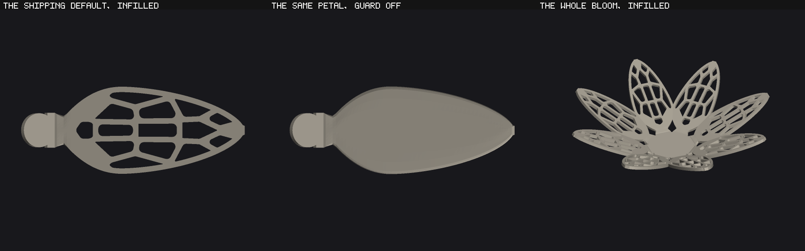

# The Voronoi infill, S3 — the builder, the guard and the material mask

S1 made the emitter conform to the surface. S2 made every length in the plan a
surface length. S3 is the one that ships: the pattern comes out of
`buildPetalInto`'s own panel loop, behind a CHOICE, with one slider, and the
shipping default does not move a byte.

Read `docs/bloom-infill-port-plan.md` §0 for Eva's seven rulings and
`docs/bloom-infill-metric-plan.md` for the metric this builds on.

`node tools/shot-bloom-infill-shipped.mjs <dir> --png docs/img/infill-shipped.png`
renders it from `buildBloomInto` in EXPORT mode, with every figure in every
caption read off the builder's own record. It is NOT `shot-bloom-infill.mjs`,
which photographs the prototype's meshes because S2 had no builder to
photograph; neither picture in that sheet's §1 is this one. The shipping petal
asks 16 and builds **17 cells, 14 holding a hole, 3 left solid**, holes
1.85–3.12 mm across with a median of 2.63.

---

## 1. What ships

| | |
|---|---|
| `petalInfill` | a CHOICE — `NONE` / `VORONOI`, default **NONE**. The guard. |
| `infillDensity` | 8–40, step 1, default **16**. Hidden AND inert at the guard. |
| section | `Infill`, a drop-down inside **Petal**, declared after `roles` and all nine of its children |
| wall | `INFILL_WALL_MM = MIN_FEATURE_MM` (1.00 mm), not a control |
| hole bar | `INFILL_HOLE_MM = 1.50` mm, not a control |
| drop passes | `INFILL_DROP_PASSES = 2`, the cap ruling 3 asks to be named |

`buildPetalInto`'s panel loop is a **two-arm choice**: with the guard off, or on
a blade the plan refuses, every panel goes through `emitPanel` exactly as
before; with the guard on and one panel, the first panel goes through
`emitInfillPanel`, which calls `emitPanel` **verbatim** on the basal sub-panel
and draws the cells above it. `trimPanels` is untouched.

**The guard is the `inflorescence` NONE shape and not the `lobeDepth` 0 shape,
which is Eva's ruling and has a structural consequence**: `SWEEPABLE` filters
`SLIDERS()`, so a CHOICE is out of the blanket sweep by construction and
`ALL MAX` never turns the infill on. Measured: `ALL MAX` reads **24,688
triangles with the guard off** on this tree, unchanged, and its declared export
refusal is untouched. The four sub-slider ids are kept out of block 1 and out of
`SWEEPABLE` through `INFILL_SUBS` / `INFILL_SUB_IDS`, the `CURL_SUBS` shape.

**Ruling 4 — the sepals are pinned off**: `sepalBladeState` sets
`petalInfill: 'NONE'`, so nothing inherits through it. Ruling 3 — density is a
REQUEST — is on screen in **both places this project tells a clamp**: the
read-out's `INFILL` line and the density control's own value read-out, each read
from the builder's record. At the ruled default the blade asks 16 and builds 14
holes in 17 cells; at 40 it builds 16.

---

## 2. Zero bytes at the guard, measured

`node tools/verify-bloom-infill-bytes.mjs --base <worktree>` — **PASS: 15
HOLDERS × 2 modes over 21,322,224 export floats and 3,299,136 captured-grid
values positionally under `Object.is`, 0 moved**, with the material mask
asserted in a clause of its own (a holder's every station is material) because
the mask is a NEW channel the base tree does not have and a two-clause
comparison would have reported it as movement. Three predeclared MOVERS must
move. Both controls fire: `--control` perturbs a holder and reports on all three
clauses, `--control-only` fills a mover's mask in and reports on the mask clause
alone.

---

## 3. THE MATERIAL MASK, and the tempting fix that was not taken

Every captured grid row carries `material[]` beside `mid` and `normal` — one
boolean per column, true where the emitter drew skin. `measureWall` REFUSES a
row with no mask, skips a non-material query point, and builds a bottom-skin
quad only where all four corners are material.

The brief names the fix not to take: sweep the full `NV` columns and capture the
rectangle as today. It is tempting because it needs no new channel, and it makes
**V5 green on an infilled row by defining its subject to exclude the thing it
doubts** — a hole measured as solid is a wall that is not there. That is this
project's fifth durable rule, and the mask is the answer to it.

Three readers were taught it, and the third is the reason the second had to be:

* `tools/bloom-wall-thickness.mjs` — the wall instrument, and through it the
  whole combination gate.
* `tools/verify-bloom-grid.mjs` — `walkGrid` skips masked-out columns and
  **clause 2f** is new: the mask is present on every captured row, excludes
  nothing on a row with no infill and something on a row with one. Two new
  rows carry it. PASS, 851 checks over 21 rows.
* `bloom-grid-gltf.js` keeps recording **BODY** thickness, unchanged — the grid
  describes the mid-surface, and a hole is not a change to it.

---

## 4. The seam — 346 pairs, and three cuts to get to 0

The basal panel and the cell region meet at the split row. The first cut had the
region start one row BELOW the split while the basal panel ran to it, so the two
overlapped by a whole lattice strip; and because the outline's seam vertices are
the lattice's own doubles, the two shells WELD and the census reads a by-design
overlap as a within-shell fold. **346 pairs on the shipping default, every one
at rows `mSplit-1` and `mSplit`.**

1. **The seam columns.** The outline walks back across the split row through the
   lattice's own columns — the clause the terminal face already had, at the
   other end. Without them the basal panel's top edge is ten points and the
   cells' bottom edge is one segment containing eight of them: 252 span-0.0000
   T-junctions.
2. **The snap.** A Voronoi bisector crossing the seam puts a cell vertex
   wherever it likes. The lattice owns that boundary and the cells read it:
   a cell vertex on the seam snaps to the nearest lattice column. 108 → 0.
3. **The region starts AT the split row.** Shortening the basal panel instead
   was tried and made `emitPanel` draw a panel one row shorter, which produced a
   collinear-on-float32 triangle per petal at its own top edge — degenerate
   geometry in code this feature does not own.

`wants()` never subdivides a segment both of whose ends are on the seam: it is a
lattice edge, drawn unsubdivided on the other side.

---

## 5. THE SPLIT IS DECIDED IN THE PLAN, because the surface is the mode's

S1's conformance rule asked `chordDev(A,B) > tolMm` — how far the facet edge
stands from the surface. `surface.at` places a point through the MODE's own
half-width (floored at `TIP_HALF_MM`, 0.15 mm live and 0.80 export) and `skinAt`
offsets it by the mode's own floored sheet, so the **triangle count moved
between the modes on 13 of 13 states measured** — the shipping default by 40,
`petalWidth` 30 by 232, `petalCup` 1.2 by −764. The export gate fails that
outright: *the export floor is meant to change geometry and never topology.*
Sixth refusal of a mode-dependent topology in `bloom-geometry.js`.

What replaces it is the **lattice's own longest plan edge** over the same region
(`latMaxEdge`, from `rows[i].u` and `laminaHalfAt`, both mode-free): every
emitted edge is at most as long, in the plan, as the coarsest edge the shipped
mesh already draws there. **0 of 13 states move now.** `tolMm` is no longer the
decision; it is the claim, and the gate is where it belongs.

It costs triangles: the shipping default petal goes 4,612 → 6,596 (+43%).

---

## 6. THE PLAN LIVES ON A POWER-OF-TWO GRID, and X0 is why

The fillet is an arc — `Math.sin`, `Math.cos`, `Math.atan2`, none of them
required to be correctly rounded and none implemented identically in Node's V8
and the gate's Chromium. Nothing downstream is a tolerance: the hole's width
against the ruled 1.50 mm bar, the edge length against the lattice's longest, a
bisector against a wall. A last-bit difference on either side of one of those is
a different cell.

**X0 measured it**: the exported STL against a rebuild of the page's own state
in Node read **39,328 triangles against 36,064** on `INFILL: x density 8`, and
**681,952 against 716,352** at forty petals over three whorls; `footDelicacy`
0.25 held its count with a vertex **0.93 mm** away.

Replacing `Math.hypot` with `Math.sqrt(dx*dx+dy*dy)` (`infillLen`) and skipping
`Math.pow` at `INFILL_TIP_GAMMA === 1` is right and is kept — and it **moved
none of those numbers**, which is what pointed at the trigonometry.
`INFILL_PLAN_GRID = 2^-20` mm quantises the cell polygons, the capacity insets
and the filleted holes: three orders under what the census resolves, eight
orders over what the engines differ by. **X0 is silent on all six rows, and
Node and Chromium now agree to the digit on every declared pair count.**

---

## 7. Degeneracy — four fixes, and one that had to be undone

`analyzeStl` counts a triangle at or under `DEGENERATE_AREA_MM2` on **float32**,
and the export gate fails on a non-zero count.

* **A collinear triangle cannot be dropped.** It was, and it opened the shell:
  its three corners are distinct, so its three EDGES are real and the census
  counts them — **8 and 48 boundary edges on two rows**. Reverted.
* `infillEarClip` **retries from each starting vertex** until it returns a
  triangulation with no flat triangle. A rotation is a different triangulation
  of the same polygon with the same area and the same boundary.
* `infillFan` — the fallback — **picks an apex** the same way.
* The merge-walk and the sector walk are both **rejected if any of their
  triangles is flat**, and the merge-walk is additionally area-validated (see
  §8).
* **Flatness is measured in the PLAN, on float32.** Measuring it on the EMITTED
  corners is what `analyzeStl` does and it was written that way first — and the
  export gate refused it, correctly, because the emitted point goes through the
  mode's sheet and the mode's tip floor: `INFILL: x CONTINUOUS x 3 turns` came
  out 131,692 live against 131,004 export. What the plan test gives up is stated
  rather than hidden — a plan triangle that clears the bar can still draw a
  facet that does not — and the gate's own degeneracy clause reads **0 on all
  twenty-two block-39 rows in both modes**.

---

## 8. The merge-walk drew skin over its own hole

Its `advA` step spans two consecutive OUTER vertices, so on a wide angular
sector the triangle reaches across the hole — **S1's own second defect, in the
shipping emitter's last resort**. It draws surface where there is no material,
which is a fold rather than a crack, so no boundary-edge or degeneracy clause
can see it: the census read **182 pairs at `infillDensity` 8 and 112 at
`petalWidth` 8, worst span 1.1374 mm**, on states whose plain petal reads 0.

Where no arm can tile the annulus **the cell keeps its material**. A solid cell
is an outcome ruling 3 already has and already reports; `plan.achieved` and
`plan.solid` are corrected so the count on screen is the count the artefact
carries, and `cellOpen` is cleared so the MASK does not call a solid cell a
hole. Bridging the hole to the outer ring and ear-clipping the result is the
tessellation that would keep it; it is S4's, beside the non-convex cell it
shares a cause with.

---

## 9. The census — ten declared of twenty-two, twelve at exactly 0

Every entry carries its PLAIN control, because *the infill folded it* and *the
petal was already folded and now has more triangles* are two findings and only a
two-sided build tells them apart.

| row | infilled | plain | class |
|---|---|---|---|
| `x cup 1.2 x spine curl 360` | 11,384 / 0.9269 | 8,184 / 0.9263 | the petal's own fold |
| `x ALL FORM MAX` | 14,601 / 1.8477 | 10,632 / 1.7679 | the petal's own fold |
| `x roll 330` | 34,856 / 1.2263 | 15,280 / 1.5539 | the petal's own fold — **span falls** |
| `x petalWidth 8` | 1,408 / 0.4160 | 0 | conformance |
| `x petalWidth 30` | 720 / 1.2731 | 0 | conformance |
| `x footDelicacy 0.25` | 1,408 / 0.5350 | 0 | conformance |
| `x buckle 0.60 f 3` | 802 / 1.2266 | 0 | conformance |
| `x 40 petals x 3 whorls` | 6,720 / 0.5985 | 0 | petals overlapping, welded |
| `x CONTINUOUS x 3 turns` | 1,114 / 1.2000 | 0 | turns overlapping, welded |
| `x a SPHERE head with a stem` | 683 / 1.2000 | 0 | poles overlapping, welded |

**Twelve rows read exactly 0** — the shipping defaults, BOTH ends of the density
range, the short blade and the long one at the densest pattern, the thick sheet,
the thin tip, the sharpest apex, the sepals and all three guard and refusal
rows — so the block is not a set of rows that all happen to be declared, and X2
holds every one of those twelve to zero.

The three "conformance" rows are the cost of sizing cell facets from the lattice
rather than from the surface (§5). **Halving and thirding `INFILL_EDGE_SHARE`
moved none of those counts**, so it is the lattice's own step and not the
tolerance. The last three have a worst span of exactly the sheet thickness,
which is a top skin meeting a bottom skin rather than a sheet folding.

---

## 10. O2's parity ray had to declare itself undefined

`orientation()` fires its second-opinion ray from one facet's centroid stepped
1e-4 mm along its own normal, on the premise that the step leaves the solid. On
a sheet that COILS the premise fails — `petalCup` 1.2 × `petalSpineCurl` 360
passes within 0.0002 mm of itself — so the step lands inside the neighbouring
turn and the parity is counted from a point in the material.

A shell whose nearest other triangle is within the ray's own step is now
`parityUndefined`: **declared and counted, never silently excused**, and the
read-out says so. Found when the infill's holes removed the census pairs from
that state and left O2 asserting on a geometry it cannot measure — the clause's
subject, not its strictness.

---

## 11. Cost

Export mode, whole bloom, measured on this tree:

| state | triangles | % of the 1,500,000 budget |
|---|---|---|
| shipping default, guard OFF | 24,688 | 1.6 % |
| shipping default, guard ON | 53,536 | 3.6 % |
| guard ON at density 40 | 46,848 | 3.1 % |
| 40 petals × 3 whorls, guard OFF | 367,632 | 24.5 % |
| **40 petals × 3 whorls, guard ON** | **723,520** | **48.2 %** |
| `ALL MAX` (a CHOICE away, uninfilled) | 24,688 | unchanged |

The infilled default is **2.17×** the plain one. `docs/bloom-infill-port-plan.md`
projected ~41,000 triangles before S3 measured the mode-free subdivision the
gate forced; the honest figure is 53,536 and the projection is superseded.

**The corner that matters is `INFILL: x 40 petals x 3 whorls`, at 48.2 % of
budget** — this feature's own `ALL MAX`, and the row a future per-petal feature
should check first.

---

## 12. What is NOT done, named rather than left to be discovered

* **The lobe refusal.** A lobed blade's notches make the cells non-convex and
  the emitted solid carries more handles than holes (genus 9 against 4 cut).
  It is a REFUSAL with a word, not a silent pass, and making the two compose
  wants a cell construction that does not assume a convex region — S4's.
* **The cell SIZE is still flat** (S2's own recorded gap): a compressed state
  keeps fewer holes because the plan refuses to cut where a 1.00 mm wall does
  not fit. Making the Voronoi itself metric is S4's, beside the relaxation and
  anisotropy rulings.
* **`INFILL_DEGENERATE_AREA_MM2` is a deliberate duplication** of the harness's
  `DEGENERATE_AREA_MM2`, with its owner named in the source. The geometry may
  not import from `tools/`, and an emitter that cannot know the bar it must
  clear is worse.
* **The mutant table does not name an I clause.** `verify-bloom-infill.mjs`
  carries its own six must-fails and every one fires; the apex table was not
  extended. Recorded as a gap rather than claimed closed.
* **`ALL MAX` times out `settleBuild`'s 30 s budget on this container, on the
  BASE tree as well** (33.6 s at 55ca84c, 34.5 s here) — a property of the box,
  not of the branch, and the reason the local smoke run is quoted without it.
