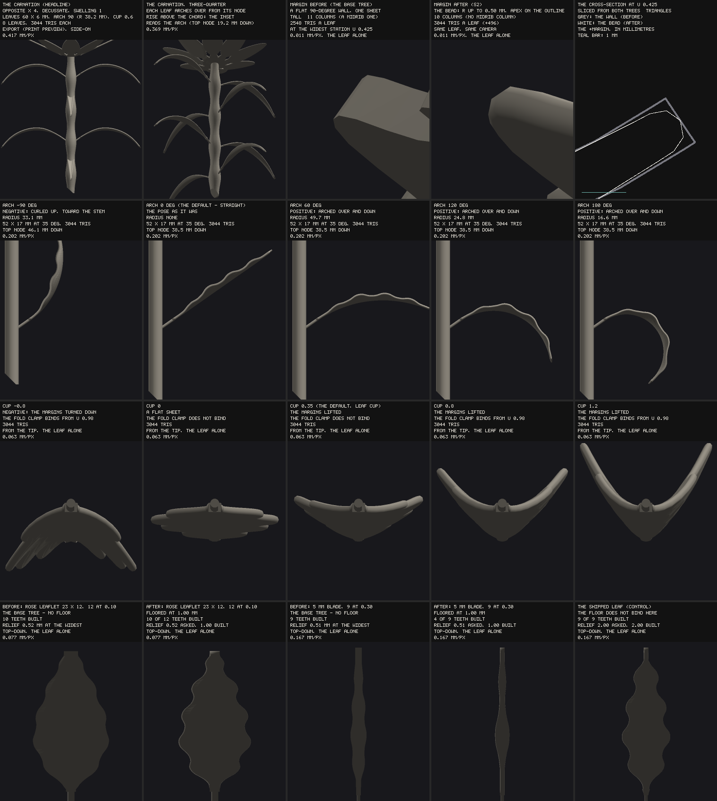

# Leaf/stem build S2 — leaves through `emitPanel`, an arch and a cup, the tooth floor

**Eva's rulings, Oct 6** (taken from the brief verbatim: the project doc `claude/leaf-rulings-oct-6.md`
is not in this repository, as S1's outcome doc already records):

1. **Leaves route through `emitPanel`** — the bead edge, no 90° wall. Every shipped leaf's bytes change,
   and that is DECLARED: the movers are predeclared from the BASE tree's own builder record, and every
   holder holds.
2. **The pose gains an ARCH along the leaf, and the CUP becomes a control.** The defaults reproduce
   today's pose (arch 0, cup = `LEAF_CUP` 0.35), so at the defaults only the edge changes.
3. **Tooth depth is ALWAYS floored at `MIN_FEATURE_MM`, design view included.** Fine serration
   coarsens, and that is accepted.

Read `docs/bloom-leaf-stem-discovery.md` §1a / §1c / §1e / §5 / §8 F5 for the audit this builds on.
**Out of scope and untouched:** the compound tree, rachis and leaflets (S3), the chevron (S4), a leaf
apex nib, stipules, serrate skew, WHORLED `n`, the florets' divergence. None of them blocked anything.

`node tools/shot-bloom-leaf-edge.mjs docs/img/leaf-edge-arch-cup.png --base <worktree of eb75119>` —
**row 1** the carnation (opposite and decussate × 4 nodes, swelling 1, arched linear leaves 60 × 6 mm
at arch 90 and cup 0.6, entire) side-on and three-quarter as the headline; then the leaf margin at its
widest station BEFORE (the base tree's flat wall) and AFTER (the bead), same leaf, same camera, macro on
the edge; and the cross-section there, sliced out of BOTH trees' emitted triangles and drawn in
millimetres. **Row 2** the arch sweep −90 / 0 / 60 / 120 / 180. **Row 3** the cup sweep −0.8 / 0 / 0.35
/ 0.8 / 1.2, looking back down the blade from its tip. **Row 4** the tooth floor BEFORE and AFTER on
the rose leaflet (23 × 12 mm, 12 asked at depth 0.10) and on a 5 mm blade (9 asked at 0.30), with the
shipped leaf as the control the floor does not touch. Print preview ON throughout: EXPORT mode with the
builder's own normals (the bead's closed-form normal), deterministic renderer, no pixel delta quoted.

---

## 1. What shipped

| control | section | range | default | what it is |
|---|---|---|---|---|
| `leafArch` | Leaves | −90..180°, step 5 | 0 | the blade's TOTAL TURN along its length, a uniform arc; **positive arches the tip DOWN** (the carnation's fall), negative curls it up toward the stem |
| `leafCup` | Leaves | −0.8..1.2, step 0.01 | 0.35 (`LEAF_CUP`) | the petal cup's own coefficient on the leaf — the retired constant is the default |

New ids, nothing retired. Both are hidden and inert behind `leafPresent`, so they are `STEM_SUBS`, out of
the blanket sweep, and `ALL MAX` never reaches them (measured: `ALL MAX` carries no leaf). The cup's
range is the petal cup's own (`[-0.8, 1.2]`). **Both ranges are RULED KEPT (Eva, Oct 7, from the deploy
preview)**, and so is the floored serration — see §8.

**The read-out** gains three leaf lines, every number off the BUILDER's record: `POSE` (the arch, its
radius from the spine law, "UNDER ONE SHEET THICKNESS" told never clamped; the cup and the fold clamp
from the form's own `cupClamp`), `EDGE` (the drawn bead radius and segment count off the rim record,
the stub's end, any rim clamp with its thickness), and `TEETH` (asked against built, the relief at the
sinuses, the floor and which cause gave the count). Two pre-existing read-out defects found while doing
it and fixed: a `TEETH CLAMPED` clause read `teethAsked`/`teethBuilt` off the PLAN, which never carried
them, so it **had never once printed**; and the tooth-count label said "along each margin" where the
count is the teeth over the whole rim (session 42's MODEL B: 9 is four a margin plus one at the tip) — it
says "in all — both margins and the tip" now.

## 2. The blade through `emitPanel`

`leafSurface(acc, plan, state, nodeIndex, az)` is the leaf's surface law (the petal's `petalSurface`
shape): `rowAt(u)` is the row plan — spine centre, frame, half-width, the row's own `sect(v)` — and
`buildLeafInto` hands `nu + 1` of them to `emitPanel` with `{ rowFrom: 0, rowTo: nu, spanAt: () => [-1, 1] }`.
`emitPanel` is the one owner of how a panel's skins and rim are emitted; the leaf was the last organ in
the bloom with a wall of its own.

**What `emitPanel`'s contract takes, each handled:**
- **Row 0 is BURIED**: the bead ramps in over `RIM_TAPER_MM` (3.0 mm) of margin from the panel's start.
  For a petiolate leaf that is right — row 0 is the end the petiole holds. A free blade base (a leaflet
  on its petiolule) is S3's and was not built.
- **The last row is the exposed tip**: the last `RIM_TIP_ROWS` (2) rows become the apex ring.
- **Columns go 11 → `NV` = 10, and the MIDRIB COLUMN IS LOST.** The old builder sampled `v` at
  `-1 + 2j/10`, so `j = 5` lay on the midrib; `NV` is even, so no column lies on `v = 0` (the petal's own
  reason, session 28: the grid export carries the spine separately for exactly this). Consequences
  measured: the shared node's blade-reach search already walks EDGES not vertices (`bladeReachMm`'s own
  header), so it is unaffected; no LF clause read the midrib column; the mid-surface identity below is
  asserted at the OLD 11-column lattice, which the new surface reproduces exactly.
- **The leaf still ends on the 1.60 mm stub** (the apex nib is not ruled for leaves and was not built):
  the last 1.07 mm of the shipped leaf (2.06% of its length) is a 1.60 mm parallel strip, and it now
  closes on the bead's nose rather than a flat face. On the shipped leaf the bead is the full
  0.50 mm half-round in 4 segments everywhere — **0 rim clamps** — because the stub's 1.60 mm span
  leaves `0.45 × room` = 0.72 mm, over the radius.

**AT THE DEFAULTS ONLY THE EDGE CHANGES, AS AN IDENTITY**: every skin vertex the BASE tree emitted at its
own 11-column lattice is reproduced EXACTLY by the branch's `leafSurface` at the same `(u, v)` offset
`±t/2` along its normal — **551,760 of 551,760**, over every mover row the floor does not reshape, both
modes, under string equality of the coordinates (the byte tool's clause 3, §5).

**Cost: 2,548 → 3,044 triangles a leaf (+496, +19.5%), fixed** — the lattice does not vary with size,
arch or cup (measured 3,044 at every arch and cup end), and live equals export. The shipped 3-leaf stem
goes 34,534 → **36,022** triangles (1.72 MiB of STL, 2.40% of the budget). **The worst reachable leaf
corner, 24 leaves (whorled × 8 at 120 × 40 mm), is 61,152 → 73,056 leaf triangles and 88,042 → 99,946
for the bloom — 6.66% of the 1,500,000 budget, 4.77 MiB**, at any arch and cup. The shipping DEFAULT
bloom has no leaf and is untouched (24,688).

## 3. The arch

The arch is the **petal's own uniform arc** on the leaf's frame: `leafBladeState` maps `leafArch` to
`petalSpineCurl = −leafArch` (a branch at 0, never `−0`), `petalForm` builds the frame, and `rowAt` lays
each row at `phi = th + kC·s` through `arcStep` — the one owner of an arc's displacement (the
arc-stability session) — with `kC = curlRad / L`. It **transfers without restructuring**, with one
consequence for an existing assumption: `leafBladeLocalTris` says the blade in its own frame is a RIGID
motion of itself at every angle and azimuth, and that stays true because the turn is measured FROM the
blade's start direction (comment updated). The spine LAW runs beside it for the read-out (the radius,
and whether it is under one sheet thickness — told, never clamped, the petal's doctrine for a uniform
curl), at the leaf's own `LEAF_BLADE_ROWS`, never the module's `NU` (#303's coupling, refused again).

**An arched blade rises above its chord, so the inset law became arch-aware**: `leafArchRiseMm(L, θ, arch)`
is the highest point of the arc over the node (an interior maximum where the arc passes horizontal), and
`leafNodeLayout` reads it; **at arch 0 it is `L sin θ` verbatim** (a branch). The harness restates it
(`restatedLeafRiseMm`) from the controls, never importing it (the fourth durable rule). Measured on the
sheet's 52 × 17 mm leaf at 35°: arch −90 (curled up, the tip climbing past its chord) takes the top node
38.5 → 46.1 mm down; the positive arches LOWER the rise, the stem's own node layout then binds, and the
top node stays at 38.5.

**SN4 IS RE-DERIVED, NOT RELAXED.** It held each shared-node leaf's emitted blade to reach exactly
`petiole + built length` along its own axis — and an arch SHORTENS a straight projection (15.35 mm against
the plan's 20.52 at arch 90 on the shipped raceme's capped blade), which is a measurement of the arch and
not of the length. It went red on block 53's arched raceme row first. The builder now feet each emitted
vertex on the arc's own circle and reports ARC LENGTH from the base (exact, for the reason the straight
projection was: every section offset is square to the arc's tangent there, so the tip row feet at the
built length and the bead only insets toward the base); the straight blade takes the projection verbatim
(a branch). Measured: 58.240000000 mm at arch 0, 90, 180 and −90 on the 52 mm leaf, and the raceme row's
20.519668579 to nine decimals.

## 4. The tooth floor — EXACTLY what is floored

Eva's ruling: "tooth depth is ALWAYS floored at `MIN_FEATURE_MM`, design view included". On this tree a
tooth's depth is its **RELIEF** — the millimetres the cut removes at a sinus — so that is what is floored:

- **The relief at every MARGIN sinus is at least `MIN_FEATURE_MM` (1.00 mm).** The relief asked is
  `depth × (peak half-width − TIP_HALF_MM)` (session 42's law); it is raised to the floor where under it
  (`reliefBuiltMm = max(asked, floor)`), and the per-period headroom guard still applies — so where a
  sinus's headroom is under the floor, that tooth cannot exist.
- **So the COUNT GIVES**: the largest count whose every margin sinus has the floor's worth of material
  (headroom ≥ 1.00 mm) is built; the slider keeps its asked value; the read-out says asked against built
  and names the relief floor as the cause. No count fits → NO ROOM, cause `'relief floor'`, told, never
  refused.
- **The even-count face notch is EXEMPT** — it sits on the terminal face at zero relief by construction
  (session 42: "an even count's apex notch has nothing to cut"), and floors exempt it rather than refuse
  every even count.
- **The PITCH was already floored**: `lobePitchFloor = max(sheet, MIN_FEATURE_MM)` covers leaves as it
  covers petals, so nothing new there.
- **Leaves only.** It is the leaf's `cap.toothReliefFloorMm`; **petal lobes are untouched by this ruling**
  (whether the same floor should reach petals was not part of Eva's Oct 7 ruling, §8).
- **The constant, never the mode's floor**, so live and export cut the same teeth — which teeth exist is
  topology.

| leaf | asked | before (no floor) | after |
|---|---|---|---|
| the shipped leaf, 52 × 17, 9 at depth 0.26 | relief 2.00 mm | 9 teeth | **9 teeth, unchanged** (the floor never binds) |
| depth 0.05 on the shipped leaf | relief 0.385 mm | 9 at 0.385 | 9 at **1.00** |
| a 5 mm blade, 9 at 0.30 | relief 0.51 mm | 9 at 0.51 | **4 of 9** at 1.00 — the count gives |
| a 3.5 mm blade | — | teeth | **NO ROOM** — the widest point has 0.95 mm over the print floor |
| the rose leaflet 23 × 12, 12 at 0.10 | relief 0.52 mm | 10 at 0.52 | 10 of 12 at **1.00** (the rows cap at 10 either way) |

The drawn depth is reported beside the law's (`rowReliefMm`, the deepest emitted ROW in each period,
which samples the cut between stations and so reads at or under the relief); it is never floored itself.

## 5. The byte partition — 50 MOVERS / 1,106 HOLDERS, PASS

`node tools/verify-bloom-leaf-bytes.mjs --base <worktree of eb75119> --change emitter [--shard k/n]`,
the whole live matrix in **32 shards**, both modes. The 18 block-53 rows are ADDED (the base matrix does
not hold them; the tool proves the base's 1,156 rows lead the live matrix deep-equal, and refuses
otherwise). **The movers are predeclared from the BASE tree's own builder record** — a row moves iff the
base build emits a leaf in either mode — before any comparison.

- **Clause 1, the partition: 50 movers moved, 1,106 holders held**, over 1,426,356,000 base floats per
  side under `Object.is`; 0 rows excluded.
- **Clause 2: everything OUTSIDE the leaf block is identical** on every mover — the prefix before the
  leaves and the suffix after them, float for float (the base's block starts where the branch's
  `leafTriRange` says and spans the base's own leaf tally).
- **Clause 3: the mid-surface LAW did not move** — 551,760 of 551,760 base skin vertices reproduced by the
  branch's surface evaluated on the BASE's own plan. **5 rows exempt, declared from the base's own
  profile record** (a margin sinus under the floor): `LEAVES: tip shape ACUTE`, `LEAVES: tip shape 0.60 x
  serration at maximum`, `LEAVES: tip shape 3.00 on the NARROWEST leaf`, `STEM NODES: a thin sheet on a
  short stem`, `NODE LAWS: SHARED NODE x a 5 mm pedicel` — and on every one the surface DID move (the
  floor reshaped its teeth), so no exemption is vacuous.
- **Clause 3b: the seating.** Every placing field of the plan is the base's exactly, except on the **11
  rows the base calls a SHARED NODE** (a raceme with a leaf under every pedicel), where the seating
  offset reads the emitted blade's own reach under the pedicel (`bladeReachMm`), and the bead changes
  that reach: **worst 0.196381 mm of node depth**, no kept-count moved. Declared, reported, never hidden.
- **Clause 4: the /plot grid export did not move** — `buildGridGltf` over each tree's captured build, with
  the same recorded state handed to both, byte for byte on all 100 mover row-modes. (The leaf panel's
  `emitPanel` grid is local to the call and the leaf never hands it on; the guard says so in bytes.)

Every clause is shown able to fail: `--control` (a holder perturbed, clause 1), `--control-only` (a
mover's shared prefix, clause 2), `--control-surface` (one queried surface vertex by 1e-9 mm, clause 3)
and `--control-grid` (one bit of the branch's file, clause 4) — each fired its own clause.

## 6. The gates

**Seen red first, never loosened.** LF11, LF12 and LF13 were written before the geometry and run on a
scratch tree with the controls wired to nothing: all three fired. On the real tree:

- **LF11 — the arch.** The sum-of-sines arc restated from the CONTROLS (arch, angle, built length) against
  every emitted row's centre and frame normal, within 1e-9 mm, from the emitted petiole's outer centroid
  (`petioleAxes`); plus the builder's declared turn and the plan's arch.
- **LF12 — the cup.** Each margin's lift `c·h²/hb` against the restated fold clamp
  (`|c| ≤ hb / (FOLD_CLAMP_MARGIN · t)`), on rows past `FORM_ONSET_END`, within 1e-9.
- **LF13 — the floor.** The record's floor IS `MIN_FEATURE_MM`; the necessary condition
  (`width/2 − TIP_HALF_MM < floor ⇒ NO ROOM`); asked and built relief restated; every margin record relief
  and every emitted sinus relief (base minus drawn half-width at the sinus station) at or over the floor;
  the clamp cause a biconditional.
- **LF7 re-derived** onto the floor (a narrow leaf whose teeth the floor removes entirely is NO ROOM by
  `'relief floor'`, not a missing serration); **SN4 re-derived** (§3); **LF8 stays 0** on every leaf row.

**Block 53 is eighteen rows** (1,156 → 1,174): the carnation first (the smoke census's anchor rule), arch
at 180 / −90 / −30 / 90, arch 180 at leafAngle −60, cup at 1.2 / −0.8 / 0, the two together, the whorled
× 8 corner arched and cupped, the tooth floor binding (depth 0.05, a 5 mm and a 3.5 mm blade, the rose
leaflet), the arched raceme under a shared node, and the GATED row. **Smoke block 53 is five rows**
(178 rows over 49 blocks, 154 families claimed both ways). **The census reads 0 within-shell pairs on all
68 leaf rows** (the 50 movers and the 18 added) in Node, so **no `SELF_INTERSECTION_XFAIL` entry is
re-recorded** — none of the movers was ever declared. **Browser-confirmed**: all 68 through
`verify-bloom-export.mjs --only` (X0, X1, X2, the LF/SN families and the export all clean), and all 68
ONE connected piece through `verify-bloom-connectedness.mjs --only`.

**The E family covers leaves now** (`verify-bloom-edge-profile.mjs`): the leaf rims are in its subject, a
leaf row whose leaves carry no treated rim is E0's, and the control set carries a leaf row and a
leaf-only mutation (`the-leaf-rim-is-not-recorded`, E0). A second leaf-only mutation (the leaf handed
half its sheet) was tried and fires nothing, correctly: the taper never raises a sheet already under the
floor, so a thinner body is a law-abiding rim. **Four smoke rows exceed E2's 45° allowance and are
DECLARED at their measured magnitude, never widened**, every one where the blade is NARROW (1.6–2.9 mm
across against a 1.2 mm sheet, where the narrow-span clamp shrinks the bead):

| row | adds | site |
|---|---|---|
| `LEAVES: tip shape ACUTE` | 45.501270° | a sinus cut to the print floor, h 0.80 mm, u 0.652 |
| `LEAF POSE: the CARNATION` | 46.666347° | the 6 mm blade near its base, h 1.45 mm, u 0.099 |
| `TOOTH FLOOR: a 5 mm blade` | 45.446864° | a floored sinus, h 1.06 mm, u 0.848 |
| `TOOTH FLOOR: a 3.5 mm blade` | 46.321726° | the blade near its base, h 1.43 mm, u 0.224 |

Three non-smoke rows read the same class (`LEAVES: serration at MAXIMUM` 51.98°, `LEAVES: tip shape 3.00
on the NARROWEST leaf` 46.38°, `LEAF POSE: cup MINIMUM` 46.98°); the E gate runs the smoke subset in CI,
so they are recorded here rather than declared. **The flat wall they replace turned 90° at every one of
these sites.** The E2 message now carries the site's coordinates.

**The mutant table** (`verify-bloom-apex-mutants.mjs`) gains four, each witnessed on the MUTATED module's
own builder output on a new table row (arch 90, cup 0.8, a 5 mm blade at depth 0.3 — apart from both
defaults, where the floor binds): `the-leaf-arch-is-ignored` (LF11), `the-leaf-cup-is-the-constant`
(LF12), `the-tooth-floor-is-removed` (LF13) and `the-floor-is-recorded-and-not-cut` (LF13). **All four
fire their family and the clean tree is silent.** The eight pre-existing leaf and lobe-relief mutants
were re-run because the leaf builder and the lobe block changed under them — all eight fire their family
(`relief-target-is-not-the-widest-half-width` also fires LF13, true about it) — and
`guard-reads-the-widest-period` was **disarmed** by the floor (its anchor read the asked relief in the
line that now reads the built one) and the anchor pre-check said so before any mutant ran; re-anchored.
111 mutants, every anchor matching exactly once. The table was run as a SUBSET (12 of 111), and is
reported as one.

**The combination gate** re-records six leaf-stem cells, every one at `leafAngle 70` and every one
CLOSER (the near point is the blade's base margin, where the bead replaces the wall's corner):
`leafangle-x-stem` 0.824 → 0.821, 0.826 → 0.822, 0.822 → 0.821; `leafangle-x-tooth` 0.824 → 0.821 × 3.
**A new pair, `leafarch-x-angle`** (tier 2, `leaf-stem`, the arch's ends × the angle): positive arches
move the measure by exactly nothing (they lay the blade away and the near point stays its base); **one
cell is a product no single axis reaches — arch −90 on a leaf at 60°, 1.851 mm alone and 0.000 curled**
(the tip comes round onto the stem above its own node), declared; four more are the 85° column the angle
reaches alone. Totals: 32 pairs and 5 triples, 529 cells, **184 under the bar, all declared**, verdicts
unchanged. Run as two halves (the whole gate has passed the 590 s a foreground call allows on this box);
CI runs it whole.

**Every other gate the change could reach was run and is green**: the panel gate and its negative control
(21 routes), the grid gate and its negative control (915 checks), the rim-owner gate and control, the
leaf and sepal decoupling tools, the defaults bar (8 states), the stem channel, stem nodes and stem cut
must-fails, the smoke census and its negative control, and the apex table's anchor pre-check.

## 7. Frozen phase

**`frozen/phase55` is the 1,156 rows at `eb75119`** (main's head before this session), registered in
BOTH `FROZEN_MATRICES` and `FROZEN_BASE_COMMITS`; `--verify-frozen --phase55` reads deep-equal against
the base commit's own `buildMatrix()`. Owed because block 53 changes the row set. **phase55's bytes do
not reproduce on its 50 leaf rows** (the partition above, exactly), and neither do those of every older
tag that names a leaf row — definitions untouched, the class phase17 / 19 / 21 / 23 / 24 already belong
to. No workflow file is edited, so phase55's dispatch is not expected to be refused.

## 8. Rulings (Eva, Oct 7, from the deploy preview)

Three questions were open when this PR went up. Eva ruled on all three from the deploy preview, and no
code changed as a result: each ruling keeps what shipped.

1. **`leafArch` −90..180°, step 5: KEPT AS SHIPPED. The extremes stay reachable and declared.** At 180 a
   52 mm blade turns back on a 16.6 mm radius and its tip points down and in (row 2's last cell of the
   sheet). At −90 the tip curls up and reaches the stem at steeper angles. That is the combination gate's
   `leafarch-x-angle` pair, whose five cells under the bar are declared by value in `COMBINATION_XFAIL`
   and never clamped. Both ends export watertight and as one piece.
2. **`leafCup` −0.8..1.2 (the petal cup's own range): KEPT.** The fold clamp binds near the tip at both
   ends and at 0.8, and the read-out says so.
3. **The floored serration: ACCEPTED AS BUILT.** Every margin sinus is cut at least `MIN_FEATURE_MM`
   (1.00 mm) deep. Fine teeth therefore coarsen to 1 mm notches, and a narrow blade builds fewer teeth than
   it was asked for. The read-out reports asked against built, with the cause (row 4 of the sheet; §4).
   Whether the same floor should reach PETAL lobes was not part of the ruling and was not done.

**Notes carried with the PR, not rulings:**

- **The narrow-blade bead turns harder than E2's 45°**, by 0.4–7° on leaves 1.6–2.9 mm across (§6). This is
  declared. The flat wall it replaces turned 90° there. A thinner sheet or a wider leaf removes it.
- **The midrib column is gone** (11 → 10 columns, §2). Nothing measured depends on it.
- **The leaf still ends on its 1.60 mm stub**, now beaded. A leaf apex nib needs its own ruling.
