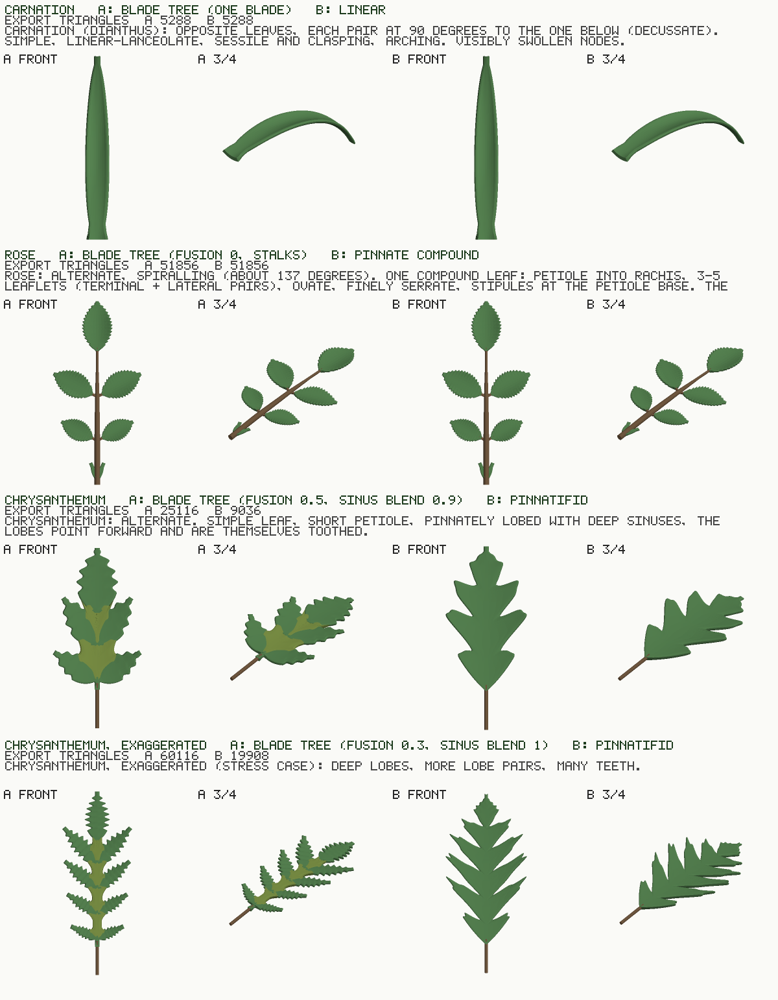
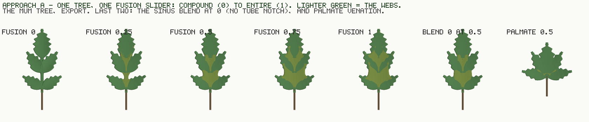
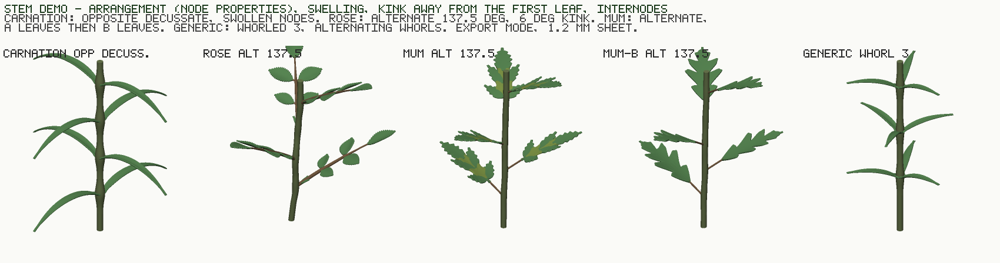
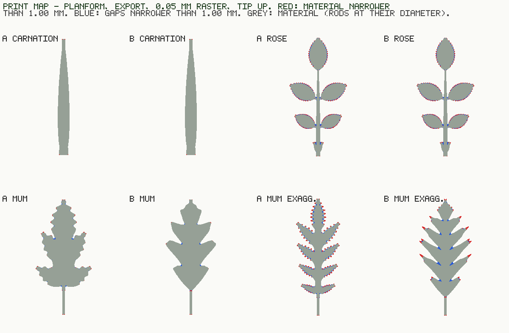

# Leaf + stem: discovery

**Discovery only. Nothing ships into the generator.** This PR adds a standalone prototype under
`tools/` (`leaf-lab-core.mjs`, `leaf-lab.html`, `shot-leaf-lab.mjs`), four images under `docs/img/`
and this document. It modifies no shipped file: `bloom-geometry.js`, `bloom-registry.js`, `bloom.js`,
`bloom-grid-gltf.js`, the harness and every gate are untouched. No leaf id or registry row was renamed.
The prototype reads the shipped geometry module and reuses two module-private functions,
`emitPanel` and `tubeNotchDepth`. It gets them by loading an in-memory copy with one
`export { … }` line appended, so nothing on disk changes. Patch anchors that do not match exactly once
throw an error.

Eva's three references (carnation, rose, chrysanthemum) are used as described in the brief. The photos
are not in the repository and nothing was fetched. Vocabulary follows the *Manual of Leaf Architecture*
(Ellis et al. 2009): lamina, petiole, petiolule, rachis, stipule, sinus, pinnate / palmate,
pinnatifid, serrate, sessile, decussate, distichous.

**Every number in this document is EXPORT mode at the shipped 1.20 mm sheet**, from one run of
`node tools/shot-leaf-lab.mjs --control`. That run takes 18 s, needs no browser, and ends `ALL CHECKS PASS`.
Wherever a measurement depends on its sampling, the sampling is named beside it.

---

## 0. The answer in brief

1. **The hypothesis is CONFIRMED for the shipped construction, and it is a statement about ROW
   DIRECTION.**
   - The shipped leaf, like the petal, draws one span of material per row, and every row is
     perpendicular to the midrib.
   - Test: the emitted planforms are cut by those same perpendicular lines and the runs of material
     per side are counted.
     - mum: up to **4** runs per side (12.4% of rows);
     - exaggerated mum: **4** (33.7%);
     - rose: **6** (29.8%).
   - Tilting the lines forward to the lobe angle changes the result. A once-lobed mum is then
     single-valued: **1 run per side at 38°** on the mum and **1 at 40°** on the exaggerated mum.
   - So "the width law cannot draw a lobed leaf" is true only of perpendicular rows. A row ladder
     tilted forward (approach B's chevron) draws one level of forward lobing as one surface.
   - It stops at the second level. Teeth on the lobe flanks have to stay shallow, because the chevron's
     innermost cell folds across the V where the half-width falls steeply (§3d).
2. **A (blade tree + fusion) is built and works end to end.**
   - One slider runs from a compound leaf to an entire one.
   - The TUBE's notch transfers as a law: it is `Object.is`-identical to the shipped `tubeNotchDepth`
     over 2,564 samples. It transfers because the fusion web uses the TUBE's own frame.
   - Its one-lean assumption does NOT transfer: a leaf sinus leans 44–54° on one side and −11 to −25°
     on the other.
   - A is a union of overlapping shells: 11 on the mum, 19 on the exaggerated mum. Building it
     surfaced **three failure modes**, each found by measurement:
     - pinholes at lobe junctions;
     - pockets beyond the rim;
     - overlapping toothed blades that enclose their own tooth notches.
   - The first two have construction rules. The third is a declared failure at fusion 0.25.
3. **B (separate builders behind a type dropdown) is built for three types.**
   - For the carnation and the rose, **A and B emit the same mesh to the float** (`Object.is` over
     every coordinate). The rose's compound builder in B is the same union of panels as A's tree at
     fusion 0.
   - **So the choice between A and B is only about the lobed leaf.** That is where B is one lattice
     and A is a union of shells.
   - B's mum reads like an oak leaf, with lobes but barely any teeth. That is B's honest limit.
4. **Print.**
   - The rose's serrate margin is the weak point: **312 regions under 1.00 mm, 10.90 mm²**, worst
     0.75 mm long.
   - The carnation's 60 mm blade is **50 sheet thicknesses** of cantilever ending on the 1.60 mm tip
     floor, with essentially nothing sub-millimetre.
   - The rose's leaflet stalks are short at 2.5 mm, so they are not the weak point. The rachis's
     last 14 mm at 1.20 mm (L/d 11.7) is.
   - No rim bead thins below `RIM_FLOOR_MM` on any leaf. Numbers are in §5.
5. **/plot.**
   - Every leaf's captured panels go through the shipped grid writer (C4).
   - /plot's per-petal warp builds its axis by pooling u-lines across panels.
   - On any multi-panel leaf that axis is a zig-zag **30–86× the leaf's own length**: the rose either
     way, and A's mum.
   - Single-panel leaves read correctly: the carnation, and B's chevron to within its forward offset.
     Details in §1d.
6. **Nothing is decided.**
   - §6 has the parameter trees and §7 the A-versus-B comparison. §8 lists five places where the brief
     meets a shipped ruling; they are flagged, not resolved. §9 is the list of rulings needed.
   - My lean, offered not taken, is in §7c.



---

## 1. Audit — how leaves and the stem are built today

### 1a. The leaf (`buildLeafInto`, `bloom-geometry.js:14532`)

- **One leaf = a petiole rod plus one blade**, attached by `leafPlan` (`:14288`) at nodes that
  `leafNodeDepthsMm` places.
- **The blade is the petal's outline machinery on its own control set.**
  - `leafBladeState` (`:14483`) spreads the state and overrides everything a petal control could
    reach. That is structural decoupling, checked as an identity by
    `tools/verify-bloom-leaf-decoupled.mjs`.
  - The outline comes from `widthProfile` (`:14548`) with `cap.petiole: true`, which stands down the
    foot-continuity floor.
  - Cup comes from `petalForm` (`:14545`) at the fixed `LEAF_CUP` 0.35 (`:13973`).
  - Serration is the shipped lobe cut (`lobeDepth` / `lobeCount` / `lobeCrestShape` /
    `lobeNotchShape`), driven by the leaf's own `leafTooth*` controls.
  - `leafBladeState` pins the curl, twist, roll, buckle, tilt and `tipThinning` to 0. So **the shipped
    leaf cannot arch along its length** (the carnation's defining pose); only the cup bends it.
- **The rows are uniform:** `nu = LEAF_BLADE_ROWS` (`:14546`, `= NU_BASE`, 56). There is no ladder.
- **One span per row:**
  - `:14593` `for (let i = 0; i <= nu; i++)`;
  - `:14597` `const h = Math.max(prof.halfWidthAt(u), TIP_HALF_MM)`;
  - `:14602–14603` `for (let j = 0; j <= NV; j++) { const v = -1 + (2 * j) / NV; … }`.
  - That is eleven columns *including the midrib* (`v = 0` at `j = 5`).
- **It is its own emitter, not `emitPanel`:**
  - top and bottom skin quads at `:14620`;
  - **flat-wall rims**, two side walls (`:14635`) and two end walls (`:14641`).
  - There is **no bead and no edge profile**. Since the edge-profile session the petal closes every
    margin on a half-round bead; the leaf still has the 90° wall that session removed.
- **No grid capture.** `buildLeafInto` never calls `emitPanel`, so a leaf records nothing for /plot,
  and `bloom-grid-gltf.js` has no leaf node kind (§1d). **Leaves are absent from every /plot `.glb`.**
- **The tip ends on the print floor:** `h ≥ TIP_HALF_MM` (0.8), so every leaf ends on a 1.60 mm stub.
  The apex-nib session excluded leaves "by declaration" (its §11 backlog). That stands.
- **The petiole rod** has 12 sides and a half-step ring (the weld fix), and is rooted at the wall's
  mid-thickness (`rodWallRootMm`, `:14039`).
- **Cost:** 2,548 triangles a leaf, fixed (CLAUDE.md).

### 1b. The stem and its nodes

- **Phyllotaxy, shipped (`leafAzimuths`, `:14050–14054`):**
  - `'alternate'` returns `[i * π]`, so 180° each node. That is **distichous**, not spiral. **The
    rose's ~137° spiral is unreachable today.**
  - `'opposite'` is decussate (`b = i·90°`, pair at `b, b + 180°`). The carnation is reachable.
  - `'whorled'` is a **fixed 3** at 120°, turning 45° a node. There is no `n`.
  - So `leafPhyllotaxy` mixes two things that are separate here: how many leaves stand at a node, and
    the divergence between nodes.
- **Nodes (`stemNodeLaw`, `:12627`):**
  - One control, `stemNodeProminence`, drives both the swelling (`STEM_NODE_SWELL` 0.6 × prom, a
    Gaussian over 3.2738 stem radii) and the kink (`atan(0.13 × prom)`).
  - **So swelling and kink are coupled.** The carnation wants swelling without kink; the rose wants a
    few degrees of kink and almost no swelling.
  - The kink turns away from the node's first leaf (`:12636`
    `const az = bare ? i * GOLDEN_ANGLE : leafAzimuths(phyllo, i)[0] + Math.PI`). A bare node turns at
    the golden angle (stem session 2). Rings stay horizontal and only their centres move.
- **The node count is one control (`leafNodes`, under Stem) for nodes and leaves both.**
  `leafNodeDepthsMm` spaces nodes evenly between an inset and 0.86 L. There is **no internode growth**
  (real stems lengthen or shorten their internodes up the axis).

### 1c. What the leaf shares with petal code

| shared | how | not shared |
|---|---|---|
| outline | `widthProfile` with `cap.petiole` | the ladder (`bladeStations`), the apex nib, fringe, squared terminal |
| cross-section form | `petalForm`, cup only | curl, twist, roll, buckle, tilt, `tipThinning` — all pinned 0 |
| serration | the shipped lobe cut, the leaf's own four controls | coverage (pinned 1), the lobe demand table |
| skin offset | `acc.floorThickness(sheetThickness)` — the one material | — |
| emitter | **none** — its own quad loop | `emitPanel`, the bead, the grid capture |

### 1d. What the /plot grid capture depends on

- **Capture lives in `emitPanel` and nowhere else** (`:9442`; the row loop samples
  `v = sp[0] + (sp[1] − sp[0]) · j / (NVp − 1)` at `:9481–9482`).
  - It records per row `{row, u, halfWidth, thickness, v, mid, normal, material}`, with ten columns
    (`NV = 10`, `:4840`).
  - `material: GRID_ALL_MATERIAL` (`:4846`) is a frozen array of length `NV`. **A panel with an `nv`
    override cannot be captured**: the writer checks the material row against the column count.
  - Note that `emitPanel`'s ten columns are **nine intervals with no column on `v = 0`**, while the
    shipped leaf's own loop has eleven with one. This matters for the chevron (§3d).
- **The writer (`buildGridGltf`, `bloom-grid-gltf.js:189`) is petal-shaped.**
  - It reads `built.petalsAll` (`:219`) and requires, per entry, `grid`, `footRows`, `attachment`,
    `spine` and `tipCap`, plus `ring.radius` and `hub.radius`.
  - It names nodes `petal_N` (`:266`, `:304`).
  - The prototype's adapter (`gridBuilt`) feeds it leaves and **lists every field it had to fake**
    (`GRID_FAKED_FIELDS`): spine, `tipCap` null, ring and hub radius 0, attachment and the node name.
    That list is the finding: a leaf needs its own node kind.
- **/plot's petal warp would mis-read a multi-panel leaf. Measured, not inferred.**
  - `plot-petal.js`'s `petalFrame` pools every u-line point sharing a declared `u` *across a petal's
    panels* and takes the centroid as the axis.
  - That is right for a cleft petal, whose panels are v-sub-intervals of one row ladder. It is wrong
    for a leaf whose panels each run `u` along their own vein.
  - Method: the shipped `petalFrame` was run on each leaf's captured panels. Sampling: every captured
    row, all ten columns; midrib sampled at 400 points.

  | leaf | panels | the axis /plot builds vs the leaf's own length (petiole root to tip) | backward steps |
  |---|---|---|---|
  | carnation A/B | 1 | 60.3 / 60.0 mm (×1.01) | 0 |
  | rose A/B | 7 | 2,518 / 84 mm (**×30**) | 40 |
  | mum A | 10 | 2,799 / 57 mm (**×49**) | 106 |
  | mum B | 1 | 46.6 / 58 mm (the petiole is a rod, uncaptured) | 1 |
  | mumX A | 18 | 5,664 / 66 mm (**×86**) | 156 |
  | mumX B | 1 | 68.0 / 64.5 mm (×1.05) | 40 |

  - The chevron's backward steps are its own geometry. A V row's centroid sits forward of the midrib
    by about `h̄ sin τ`, so it moves back wherever `h` falls fast (the sinus flanks).
  - **The file carries a spine; /plot does not read it.** A leaf axis read from the declared spine
    would fix both cases. That is /plot's change, not the generator's (§9).

### 1e. What reusing the edge profile, the thickness taper and the serration would need

- **Edge profile (#278's bead):** route the leaf through `emitPanel`. The prototype does exactly this,
  and on every leaf **0 skin points thin below `RIM_FLOOR_MM`** (the rim's own `clamps` telemetry).
  Two consequences:
  - **`emitPanel` buries row 0 and treats the last row as the exposed tip.** That is its contract,
    built for a petal foot: the base wall ramps over `RIM_TAPER_MM` (3 mm) and the apex closes over
    `RIM_TIP_ROWS` (2). For a sessile leaf that is right. For a **free leaflet base** (the rose's
    leaflets on their petiolules) the base gets the buried treatment it does not need. A per-end
    flag would be needed.
  - The leaf's row count must be the grid writer's 10 columns. The shipped leaf's 11 do not fit.
- **Thickness taper:** two different things go by that name.
  - The rim's own taper is inside `emitPanel` and comes free with it.
  - The petal's `tipThinning` (`t(u) = base · (1 − tipThinning · u)`) arrives through `emitPanel`'s
    `tAt` argument. The prototype passes a constant (tipThinning 0, which is what `leafBladeState`
    pins). A leaf thickness taper would be one function and one control.
- **Serration:** the shipped `lobeCutProfile` (`:6635`) is **symmetric** in its phase (`:6637`
  `const r = 1 - Math.abs(2 * ph - 1)`).
  - The rose's teeth are serrate, which means asymmetric: they point forward. The prototype adds a
    `skew` (the crest at fraction `skew` of the period). **At skew 0.5 it is `Object.is`-identical to
    the shipped law** over 6,416 samples (C5). The branch is written so that `2·ph` and
    `1 − (1 − 2·ph)` never differ in the last bit.
  - Reuse would need that one parameter added to the law, or a third exponent.
  - The **demand table** (`LOBE_DEMAND_ROWS`) is a ladder concept. A leaf with uniform rows does not
    read it, and the prototype sizes rows from the tooth count instead (`rowsFor`: count × 12 + 20).

### 1f. The width-law hypothesis, on the code

- **The petal's outline is single-valued by construction.** `halfWidthAt(u)` (`:5929–5942`) is a
  `Math.max` of shape, root blend and tip floor: **one number per `u`**.
- **The ruling text says so outright** (`:6407–6411`): *"lobes are CUT IN, never built out … the
  outline stays SINGLE-VALUED, one span of material at every u."* The per-period relief guard
  (around `:5309`) exists to keep it so.
- **The one escape hatch is `trimPanels`** (`:6166`): several v-span panels per row (cleft lobes,
  fringe teeth).
  - Every sub-panel is a v-sub-interval of the parent's rows, so its axis runs along the parent's
    `u`.
  - **It can split a row into several runs, but every run is still perpendicular to the midrib.** A
    forward-pointing lobe needs its material to lean forward, which a v-sub-interval cannot do.
  - That is why `trimPanels` is not the answer either: a deep forward sinus cut into perpendicular rows
    is a sheared channel whose trailing wall reverses in `x`.

**Verdict: CONFIRMED** for every construction the generator has. The precise statement is "a ladder
of rows perpendicular to the midrib, one span each, cannot draw a forward-pointing lobe with a deep
sinus". §2 has the numbers. The hypothesis does *not* extend to "one surface cannot": a forward-tilted
ladder can, to one level of lobing.

---

## 2. The width-law test, measured

- **What is counted:** the number of separate runs of material a line crosses on one side of the
  midrib, on the emitted planform union.
- **Sampling:** EXPORT mode; 0.05 mm raster before arch and cup; runs separated by a 3-pixel
  hysteresis. Without the hysteresis, raster flicker on lines nearly parallel to a tooth flank read 4
  runs where exact point-in-polygon reads 1.
- A single-valued half-width can draw exactly 1 run everywhere.

| leaf | perpendicular rows: max runs/side (rows cut >1×) | rows tilted forward at B's row angle |
|---|---|---|
| carnation A/B | 1 (0%) | — |
| rose A/B | **6** (29.8%) | — (compound: separate blades, no row angle) |
| mum A | **4** (12.4%) | 4 at 38° (7.9%) |
| mum B | **2** (7.3%) | **1 at 38° (0%)** |
| mumX A | **4** (33.7%) | 8 at 40° (38.0%) |
| mumX B | **3** (40.5%) | **1 at 40° (0%)** |

- The width-law instrument has its own must-fail: a synthetic two-run outline reads 2, and the clean
  carnation stays silent.
- A's tilted-row figure is high because A's lobe teeth point every which way. No single row angle
  suits them. That is a property of A, not a failure of it: A never needed a row angle, because each
  blade has its own.

---

## 3. The prototype

```
node tools/shot-leaf-lab.mjs [--out docs/img] [--control] [--no-sheets]   # Node, 18 s, no browser
tools/leaf-lab.html                                                         # live page (any static server)
```

- **`tools/leaf-lab-core.mjs`** is the one owner of both builders, the stem demo and emission. The page
  and the Node tool both import it.
- **One surface map per leaf.** `leafMap(archDeg, lengthMm)` bends the planform onto a
  constant-curvature arch: this is POSE's "arch along the leaf". Cup is a lift `c·d²/s` about a vein
  line. Normals come from the map's analytic derivatives, not by differencing.
- **The leaf's length has one owner, `leafExtentMm`.** The first cut arched A over the rachis
  (54 mm) and B over the whole leaf (84 mm), and the rose came out 430,549 floats apart. C6 caught it.
- **Every panel goes through the SHIPPED `emitPanel`**, so every leaf carries #278's bead, the rim's
  thickness taper and the grid capture. Rods are the prototype's own closed 12-sided tubes, densified
  to 2 mm. The rachis tapers by the **area rule** (`r² = Σ r_child²`).
- **The live page** (`tools/leaf-lab.html`, `noindex`):
  - A and B side by side under one camera, a species picker, export/live mode;
  - a **Grid `.glb`** download for each approach, through the shipped writer;
  - every parameter as a live slider, grouped as §6;
  - a stem-demo view.
  - Headless check: no page errors, the fusion slider rebuilds, and the download starts with the
    `glTF` magic (241,392 bytes).

### 3a. A — blade tree + fusion

- **The primitive:** one blade on a vein. Its half-width law is the shipped petal core
  `u^a (1−u)^b` (normalised), with an optional broad base, the (skewed) shipped tooth cut, and a
  floor at the shipped `TIP_HALF_MM`.
- **A leaf is a tree of blades:**
  - a **root** (the midrib: lamina on for simple and lobed leaves, off for a compound rachis, plus a
    petiole);
  - **child pairs** placed pinnately (stations from `firstMm` to `lastMm`, angles from `angleBaseDeg`
    to `angleDeg`) or palmately (all from one point — **`venation` is an enum, PINNATE / PALMATE**);
  - an optional **terminal** child;
  - optional **stipules** at the petiole base.
- **Fusion (0 to 1)** decides how far a child's blade is joined back to its neighbours.
  - At 0, children are free blades (compound). Above 0 they read the parent's cup instead of their
    own.
  - Between consecutive fused children on one side, a **web** panel is built. Its columns run from one
    vein to the next and its rows run outward along the interpolated vein direction (the TUBE's
    meridian) to the fusion reach.
  - The free rim is cut by the TUBE's notch (§3b).
  - At 1 the lobes are joined to their tips. That is **crenate, not entire**: the notches between
    tips remain (see the fusion sheet).
- **Three construction rules, each learned from a failure the print map or C7 showed:**
  1. **The web spans vein to vein, not just the sinus.** The first cut spanned the open sinus plus a
     pad, and left **pinholes** through the leaf at every lobe junction near the midrib. Connectivity
     (C3) cannot see a hole, which is why C7 exists. The ten columns are concentrated across the sinus
     by a knot map: one interval from each vein to the sinus, seven across it.
  2. **A closed sinus still gets its web, without a notch.** Building nothing there (the TUBE's
     "inert") left enclosed pinholes between narrow-based lobes that overlap further out.
  3. **The pocket rule.**
     - If the sinus's centre meridian re-enters a blade beyond the rim (`closedBeyond`), the region
       between the rim and the crossing belongs to no panel. The exaggerated mum had a **1.398 mm²**
       hole there.
     - On such a sinus each web column runs out to its last outside-to-inside transition plus 0.3 mm,
       and the notch is inert.
     - `--control` switches the rule off and requires the pocket to return.
- **The failure A keeps: overlapping toothed blades enclose their tooth notches.**
  - When the terminal lobe's margin crosses a neighbour's teeth, the notches between those teeth
    become enclosed holes.
  - On the mum's tree at **fusion 0.25** it leaves **3 pinholes (0.203, 0.070, 0.063 mm²)**. That is
    declared in `SWEEP_XFAIL` and held to its count both ways.
  - It is inherent to building blades out and overlapping them. The exaggerated-mum preset was
    re-tuned off it (§5 records the first-cut values), which hides it rather than solves it.



| fusion sweep (mum tree, EXPORT) | tris | webs (notched) | perpendicular runs/side | checks |
|---|---|---|---|---|
| 0 (compound) | 19,772 | 0 | 4 | clean |
| 0.25 | — | — | — | **declared: 3 pinholes** |
| 0.5 (the preset) | 25,116 | 4 (2) | 4 | clean |
| 0.75 | 26,260 | 4 (4) | 3 | clean |
| 1 | 28,236 | 4 (4) | 3 | clean |
| blend 0 at 0.5 (no notch) | 25,116 | 4 (2) | 3 | clean |
| PALMATE at 0.5 | 23,348 | 4 (0) | 3 | clean |

### 3b. Does the TUBE's notch transfer?

- **The law transfers exactly.**
  - `tubeNotchDepth` (`:17386`) is a U cut into an open sinus: corner arcs tangent to each margin at
    lean β, a flat bottom, and `r = BLEND · W / cos β`.
  - `notchDepthAt` restates it as a function of distance along the rim. Fed `|wrapPi(φ)|` exactly
    as the shipped code is, **it is `Object.is`-equal on 2,564 of 2,564 samples** (C5; the must-fail
    perturbs it by 1e-9 and C5 fires).
- **It transfers because the web uses the TUBE's own frame.** The TUBE draws its notch in the ring's
  (azimuth, meridian) frame, where meridians are the petals' veins. The A web is parameterised the same
  way: columns between two veins, rows along interpolated vein directions. The lean is measured in
  that oblique frame, and tangency is affine-invariant, so a U tangent there is tangent in the
  planform.
- **What does NOT transfer:**
  1. **One lean per sinus.** The TUBE's sinus lies between two petals of one whorl and is symmetric. A
     leaf's sinus lies between a basal lobe and an apical one. Measured on the mum: the basal lobe's
     margin leans **β_a = 44.0°** away from the sinus while the apical lobe's leans **β_b = −11.4°**
     toward it. On the exaggerated mum it is 47–54° against −19 to −25°. The prototype averages and
     clamps to ±60° (16.3° on the mum), so **the U is tangent to neither margin exactly.** A two-lean U
     (one arc per side) is the generalisation. It is not built.
  2. **The frame.** In the petal's perpendicular-row frame a forward sinus is a sheared channel.
     The notch has nowhere to sit.
  3. **The owner.** In the TUBE one ring owns every sinus. In A each web owns one, so the "one owner
     per boundary" question is open (§9).
- **What it does on the mum.** L1–L2 is open: W 2.02 mm, r 1.90 mm, depth 1.36 mm. L2–T is open at
  the rim but closed beyond it, so the notch is inert and the pocket rule covers it. On the
  exaggerated mum, L1–L2's depth is clamped on 39 of 129 table columns so the reach never cuts inside
  the midrib's own width plus 0.6 mm.

### 3c. B — separate builders behind a type dropdown

Three types: **LINEAR** (carnation), **PINNATE_COMPOUND** (rose) and **PINNATIFID** (mum).

- **LINEAR and PINNATE_COMPOUND are written independently of A** (their own placement code). C6 still
  finds them the same mesh as A's tree to the float. B's compound builder is A at fusion 0 by another
  name. It is not one lattice: it is seven blades and six rods.
- **PINNATIFID is the chevron: one lattice, one panel, one bead, one grid.**
  - Every row is a V tilted forward by `τ(u)`. Row `u` leaves the midrib at `x(u)` and runs out to
    `(x + h·sin τ, ±h·cos τ)`.
  - The lobes are bumps in `h(u)` and the sinuses are dips. The teeth are a second, finer modulation
    by the same tooth law.
  - `τ` eases to 0 over the terminal lobe so it ends on the midrib.

### 3d. How the chevron folds (C2)

- **In the continuum the planform Jacobian is `h (L cos τ + v h τ')`.** The `h'` terms cancel
  exactly, so a steep `h` cannot fold the surface. Only a tilt that eases faster than
  `L cos τ / (v h)` can, at the outer cells.
- **The lattice is what folds.** `emitPanel`'s ten columns are nine intervals, so no column lies on
  `v = 0` (session 28 recorded this as "there is no midrib line in the grid").
  - The innermost cell therefore spans `v ∈ [−1/9, 1/9]`, **across the V's apex**. Its two sides sit at
    `x + (h/9) sin τ`.
  - **It folds where `h` falls faster than `(NV − 1) / sin τ` per mm of midrib**, which means steep
    teeth or a steep sinus flank.
  - The presets stay clear (minimum cell 4.14e-2 mm² on the mum, 1.95e-2 on the exaggerated one).
    C2's plant, the exaggerated mum with **40 teeth at depth 0.5**, folds.
- **The fix is available but not built:** two half-panels meeting on the midrib, each with ten columns.
  That puts a column on `v = 0`, needs no `nv` override (so the grid can still carry it), and doubles
  the grid's panel count.
- **The consequence that matters:** B's teeth must stay shallow, and that is why its mum reads as an
  oak leaf. The reference's "lobes are themselves toothed" is out of B's reach at any depth that
  shows.

### 3e. The stem demo

- **Node properties only:**
  - **ARRANGEMENT:** ALTERNATE (a divergence angle), OPPOSITE (a decussate toggle) or WHORLED (`n`,
    with whorls alternating by half a step).
  - Node count, first-node inset, internode length, and an **internode growth** factor per node.
- **Swelling and kink are separate sliders.**
  - The constants are restated from the shipped law: 0.6, 3.2738 stem radii, and ramps of 0.12 / 0.055
    spreads.
  - The kink turns away from each node's first leaf (the shipped rule).
- **Leaves are rooted at the wall's mid-thickness** and use either approach's leaf. **Leaflet count
  never appears here.**

| stem cell | nodes | leaves | tris | pieces at 0.40 mm | azimuths (°) |
|---|---|---|---|---|---|
| carnation: opposite, decussate, swell 1 | 4 | 8 | 49,548 | 1 | 0/180 · 90/270 · 180/0 · 270/90 |
| rose: alternate 137.5°, kink 6° | 4 | 4 | 214,668 | 1 | 0 · 138 · 275 · 53 |
| mum A: alternate 137.5° | 5 | 5 | 132,824 | 1 | 0 · 138 · 275 · 53 · 190 |
| mum B | 5 | 5 | 52,424 | 1 | (same) |
| generic whorled 3, alternating | 3 | 9 | 34,712 | 1 | 0/120/240 · 60/180/300 · … |

Every stem cell has 0 bad shells.



### 3f. The self-checks, and the must-fails that prove them

**Each check aborts the run on failure.**

| check | what it asserts |
|---|---|
| C1 | every primitive is a closed, consistently wound shell: 0 unmatched directed edges, signed volume > 0 per shell. A directed census, because `analyzeStl`'s sorted-pair census is undirected. |
| C2 | no lattice cell has a planform area ≤ 0 |
| C3 | one connected piece: voxel flood fill at 0.30 mm, re-read at 0.15 mm before calling a split |
| C4 | every captured panel comes back through the shipped `buildGridGltf` with one u-strip per column and one v-strip per row |
| C5 | the tooth law at skew 0.5 and the notch are `Object.is`-identical to the shipped laws |
| C6 | A and B emit the same mesh for the carnation and the rose |
| C7 | the planform union has no pinhole. An enclosed not-material region is a hole through the print, and C3 cannot see one. Regions under 0.01 mm² are reported as raster-scale pinches, not failed (three on mumX B, at sinuses narrower than the 0.05 mm raster). |

**`--control` plants one defect per clause** and requires each clause to fire on its plant and stay
silent on the clean build:

- a reversed panel;
- the 40-tooth chevron;
- a lobe moved 6 mm off its vein;
- the first-cut exaggerated mum (overlapping toothed blades);
- the pocket rule off;
- both laws perturbed by 1e-9;
- a synthetic two-run outline;
- a 0.6 mm strip beside a 2 mm one for the print instrument.

All eight behave.

---

## 4. Render sheet

- **`docs/img/leaf-lab-sheet.png`** shows each species × approach, front and three-quarter, with the
  reference description and export triangle counts.
  - The exaggerated mum is the fourth row.
  - Webs are drawn lighter so the construction is legible. In a print they are the same material.
- **`docs/img/leaf-lab-fusion.png`** is A's continuum.
- **`docs/img/leaf-lab-stems.png`** is the stem demo.
- **`docs/img/leaf-lab-print.png`** is the print map: material narrower than 1 mm in red, gaps
  narrower than 1 mm in blue.
- All four are rendered by `tools/bloom-soft-render.mjs`, which is deterministic. **No pixel delta is
  quoted anywhere.**

Read honestly against the references:

- **Carnation:** both approaches arch and clasp as described. "Clasping" is approximated by a broad
  sessile base 4.8 mm across. **The blade does not wrap the stem.**
- **Rose:** both approaches show petiole into rachis, two lateral pairs plus a terminal, ovate leaflets,
  serrate teeth pointing forward (skew 0.3) and stipules at the petiole base.
- **Mum:**
  - A reads as a chrysanthemum leaf: forward lobes, themselves toothed.
  - B reads as an oak leaf: forward lobes, almost untoothed.
  - The exaggerated A is fern-like and busy. The exaggerated B is a spiky oak with lobe-tip spikes
    (the print map shows them red).

---

## 5. Print report — SLS PA12 against `MIN_FEATURE_MM`

- **Bars:**
  - `MIN_FEATURE_MM` = 1.00 (`bloom-geometry.js:30`, read from the module);
  - SLS PA12 wire ≥ 1.0 mm unsupported, ≥ 0.8 mm supported.
- **Sampling:**
  - in-plane thickness is measured on the **planform union** at 0.05 mm, by morphological opening at
    diameter *d* (material narrower than *d*) and closing (gaps narrower than *d*, counted only if
    longer than 1 mm, because two edges that close a gap would fuse);
  - the sheet is the export 1.20 mm;
  - rods are measured per segment at the segment's thinner end;
  - the 3D rim is read from `emitPanel`'s own `rim.clamps`.
- **Locations** are planform millimetres, x along the midrib from the leaf's base (petiole root) and y
  across.
- **These are numbers, not fixes.**

| leaf | sheet cantilever | material < 1.00 mm | < 0.80 mm | gaps < 1 mm that would fuse | rim bead < 1.00 mm |
|---|---|---|---|---|---|
| carnation A/B | 60.0 mm blade = **50.0** × 1.20 mm | 4 regions, 0.12 mm²; largest 0.28 mm at (0.1, −2.3), the sessile base's corner | 4, 0.08 mm² | 0 | 0 |
| rose A/B | 23.0 mm terminal = 19.2× | **312 regions, 10.90 mm²**; largest 0.75 mm at (49.7, −6.3) on leaflet R2: serrate teeth | 335, 6.61 mm²; largest 0.60 mm at (68.2, −6.2) on T | **5**; longest 2.09 mm at (9.3, −1.6): the stipule/petiole wedge | 0 |
| mum A | 44.0 mm midrib blade = 36.7× | 57 regions, 0.88 mm²; largest 0.49 mm at (40.9, 10.0) on L2's teeth | 68, 0.60 mm² | 2; longest 1.29 mm at (37.6, −4.5) | 0 |
| mum B | 46.0 mm chevron = 38.3× | 22 regions, 0.27 mm²; largest 0.41 mm at (12.1, 0.0), the blade/petiole junction | 16, 0.17 mm² | 3; longest 1.28 mm at (12.2, 0.0) | 0 |
| mumX A | 54.0 mm = 45.0× | **249 regions, 13.79 mm²**; largest 1.13 mm at (55.6, −4.0) on T's teeth | 240, 7.84 mm² | 2; longest 1.31 mm | 0 |
| mumX B | 54.0 mm chevron = 45.0× | 62 regions, 9.38 mm²; largest **2.69 mm** at (33.1, −13.3): lobe-tip spikes | 74, 5.80 mm²; largest 1.94 mm | **13**; longest **3.05 mm** at (28.6, −3.6): sinus slits | 0 |

**Every blade on every leaf ends on the 1.60 mm tip floor** (`2 × TIP_HALF_MM`). That is the shipped
leaf's own stub, inherited and not fixed.

**Rods** (segments with L/d > 4 listed):

| leaf | segment | diameter × length | L/d |
|---|---|---|---|
| rose | petiole, 0–14 mm | 2.68 × 14.0 mm | 5.2 |
| rose | rachis, 20–40 mm (after the first pair leaves) | 2.08 × 20.0 mm | 9.6 |
| rose | **rachis tip, 40–54 mm** | **1.20 × 14.0 mm** | **11.7** |
| rose | terminal petiolule | 1.20 × 7.0 mm | 5.8 |
| rose | lateral petiolules | 1.20 × 2.5 mm | 2.1 |
| mum A / B | petiole | 1.20 × 12.0 mm | 10.0 |
| mumX A / B | petiole | 1.20 × 10.0 mm | 8.3 |

**The two expected weak points:**

- **The rose's leaflet stalks are NOT the weak point** at 2.5 mm (L/d 2.1). The rachis tip is, at
  L/d 11.7 on the 1.20 mm floor, carrying the terminal leaflet. So is the serrate margin: 312
  sub-millimetre regions, and a slicer will either drop them or round them off.
- **The carnation's length is a cantilever, not a thin feature.** It is 50 sheet thicknesses
  unsupported. Nothing in this project has been printed, so whether 50× at 1.2 mm holds its arch is
  `UNMEASURED — no coupon has been printed`, verbatim, like every slenderness figure here.

**First-cut exaggerated mum, recorded because a preset was tuned off a failure.** At `angleDeg` 34,
`childLenMm` 20 and `terminalWidth` 10 it had 2 enclosed holes with the pocket rule (largest
0.378 mm²) and 2 without it (largest 1.398 mm²). C7's must-fail rebuilds exactly that state.



---

## 6. Draft parameter trees

Notation:

- **▼** marks a dropdown preset that **writes slider values** and is not itself a parameter.
- **◆** marks a structural choice (an enum the geometry branches on).
- `(shipped: leafX)` names an existing control the slider corresponds to. **No id is renamed here.**
  A real build would map, add or retire through `RETIRED_IDS`, and that is a ruling (§9).

### 6a. A — blade tree + fusion

```
STEM
  stem length, diameter, cut                    (shipped: stemLength, stemDiameter, stemCut)
  node swelling   0–1                           (shipped: half of stemNodeProminence)
  node kink       0–20°                         (shipped: the other half)
ARRANGEMENT — node properties only
  ▼ arrangement preset: carnation / rose / mum / whorled …   writes everything below
  ◆ type: ALTERNATE / OPPOSITE / WHORLED        (shipped: leafPhyllotaxy — distichous / decussate / 3)
    divergence °           (ALTERNATE)           new: 137.5 for the rose; 180 = today's alternate
    decussate              (OPPOSITE)
    leaves per whorl n, whorls alternate (WHORLED)
  nodes                                         (shipped: leafNodes)
  first node from top, internode, internode growth / node
LEAF — leaf properties
  ▼ leaf preset: linear / lanceolate / ovate / pinnate compound / pinnatifid / palmatifid …
  ◆ venation: PINNATE / PALMATE
  length (midrib / rachis)                      (shipped: leafLength)
  petiole length
  lamina on the midrib (off = compound rachis)
  child pairs, first pair at, last pair at
  FUSION 0 … 1  — compound → lobed → crenate     the continuum
  sinus blend   0 … 1                           the TUBE notch (or fixed, §9)
  terminal child on/off
  stipules on/off: at, angle, length, width
BLADE — one block per role (midrib · children · terminal)
  width                                         (shipped: leafWidth — midrib role)
  base taper, tip taper, broad base
  tip shape                                     (shipped: leafTipShape)
  children only: angle apical, angle basal, length, basal size ratio, petiolule
  TEETH, per role
    ▼ margin preset: entire / serrate / dentate / crenate / doubly serrate
    count, depth, crest shape, notch shape, skew, from, to
                                                (shipped: leafToothCount, leafToothDepth,
                                                 leafCrestShape, leafNotchShape; skew is new)
POSE
  leaf angle from horizontal                     (shipped: leafAngle)
  arch along the leaf                            new (shipped leaf is flat)
  cup                                            new as a control (shipped: LEAF_CUP constant 0.35)
  rods: petiolule radius, petiole radius         or derived — §9
```

- **In A every leaf form is one slider set**, so the "type dropdown" is a ▼ preset like any other.
- The page exposes 50 A sliders plus a venation select and three toggles. A shipped panel would
  want most of them behind presets, or tiered.

### 6b. B — separate builders

```
STEM, ARRANGEMENT — identical to A
LEAF
  ◆ leaf type: LINEAR / PINNATE_COMPOUND / PINNATIFID   the dropdown SELECTS A BUILDER;
                                                           each swaps the BLADE block below
  ▼ species preset within a type                          writes that type's sliders
  LINEAR            length, petiole, width, base taper, tip taper, broad base, TEETH (as A)
  PINNATE_COMPOUND  petiole, rachis, leaflet pairs, first at, last at,
                    leaflet angle, length, width, basal size ratio, base taper, tip taper,
                    lateral petiolule, terminal length / width / petiolule,
                    TEETH (one set for all leaflets), stipules
  PINNATIFID        length, petiole, envelope width / base taper / tip taper,
                    lobes per side, lobes from u, lobes to u, sinus depth, lobe shape,
                    row tilt (lobe angle), tilt eases from u, TEETH (shallow only — §3d)
POSE — identical to A (arch, cup, leaf angle)
```

- **In B the type dropdown is a ◆ structural choice, not a ▼ preset.**
  - Switching it hides one slider block and shows another, and the hidden block's values are kept
    (the shipped "hidden AND inert" rule).
  - A palmately lobed leaf would be a fourth type. A pinnatisect leaf is the PINNATIFID type at a deep
    sinus, until its chevron folds.

---

## 7. A vs B, honestly

### 7a. What A does badly

1. **It is an appendage construction.** Blades are built out and overlapped; nothing is cut in. That
   runs straight into session 38's ruling for petal lobes (flag F1).
2. **A union of overlapping shells needs rules to stay a solid.** C3 holds (one piece at 0.3 mm on
   every build and every sweep cell), but staying one piece is not enough:
   - the pinhole rule;
   - the closed-sinus rule;
   - the pocket rule, whose 0.3 mm overlap is typed rather than derived;
   - and one failure no rule fixes: overlapping toothed blades enclose their notches (declared at
     fusion 0.25).
   A future preset or slider position can find the next one. C7 is what would have to ride in the
   gates.
3. **About 2.8× the triangles of B on a lobed leaf:** 25,116 against 9,036 on the mum, 60,116 against
   19,908 exaggerated. It is still small against the 1,500,000 budget, but a whorled stem of
   exaggerated mums is 9 × 60,116.
4. **Its /plot grid is an atlas.** /plot's warp reads it as a 30–86× zig-zag (§1d).
5. **Webs are limited to ten columns**, because the grid capture cannot carry `nv`. The knot map
   spends seven of them on the sinus.
6. **The notch's one-lean assumption does not hold on a leaf** (§3b). It is averaged, so it is not
   exactly tangent.
7. **Buried bases everywhere.** Every blade's row 0 gets `emitPanel`'s buried treatment, including
   free leaflet bases.

### 7b. What B does badly

1. **No continuum.** Compound to lobed to entire is three builders, and the forms in between need new
   ones. Palmate is a fourth builder; in A it is an enum.
2. **Its compound builder is A anyway.** It produces the same mesh as A's tree at fusion 0, so "one
   lattice" is true only of the pinnatifid type.
3. **The chevron cannot carry real teeth on its lobes.** Its innermost cell folds across the V
   (§3d). **B's mum misses the reference's "lobes are themselves toothed"**, and it shows on the
   sheet.
4. **Its lobe orientation is one angle per leaf** (`τ`), eased to 0 at the tip. A leaf whose lobes
   change angle more than the ease allows (basal lobes spreading, apical lobes forward) is out of
   reach. A sets every pair's angle independently (basal 58°, apical 36° on the mum).
5. **Its exaggerated form fails print worse than A's.** It has 13 gaps that would fuse, the longest
   3.05 mm, plus 2.69 mm lobe-tip spikes. The chevron makes a deep sinus a slit.
6. **The type dropdown is a structural switch whose hidden values are kept.** A user changing type
   and back gets the old leaf, which is right by the shipped rule, but every type is its own parameter
   space to tune and gate.

### 7c. A lean, offered and not taken

The carnation and the rose come out the same mesh either way, so **the choice is the mum's**. Only A
draws the mum the reference describes.

The lean is **A as the engine, with B's type dropdown shipped as ▼ presets that write A's sliders.**
That gives a type picker in the UI and one continuum underneath, and it is also the "dropdown presets
that write slider values" the brief asks for.

The cost is real:

- F1 must be ruled on;
- C7 would have to ride in both STL gates;
- the overlapping-teeth failure needs a guard or a declared region;
- /plot needs a leaf axis.

If a single cut-in surface, /plot warpability and gate simplicity outweigh toothed lobes, then B,
accepting an oak-like mum. A hybrid (B's chevron for one-level pinnatifid leaves, A for everything
else) is reachable too. It is B with one more builder and gets the worst of both: two constructions
to gate.

---

## 8. Flags — where the brief meets a shipped ruling (not resolved)

- **F1 — "lobes are CUT IN, never built out".**
  - Session 38's ruling (`bloom-geometry.js:6407–6410`, quoted in §1f) cites "the appendage
    construction is what put 19 and 37 detached components into the flower at boundary === 0".
  - The brief asks for A, which is an appendage construction. Both were built, as asked.
  - Whether the ruling is about petal lobes or about any lobed outline is Eva's. The prototype's C3
    (one piece on every build) is evidence about connectivity, not about the ruling.
- **F2 — `leafPhyllotaxy`'s ALTERNATE is distichous (180°), not a divergence angle**
  (`leafAzimuths`, `:14053`). The brief's ALTERNATE takes an angle. The id was not touched; a real
  build changes its meaning or retires it (`RETIRED_IDS`).
- **F3 — the shipped WHORLED is fixed at 3** (`:14052`), turning 45° a node. The brief asks for `n`.
- **F4 — the shipped node is ONE control for swelling and kink** (`stemNodeProminence`, ruled in
  #299 as "the flower's swelling and kink as one control"). The brief lists them separately, and the
  carnation and rose references need them apart.
- **F5 — the shipped leaf has no bead.** The edge-profile session ruled the petal's flat wall gone.
  The leaf kept its flat wall, since it never went through `emitPanel`. Routing leaves through
  `emitPanel` (both approaches do) changes every shipped leaf's bytes. That is a partition event,
  not a free side effect.

Two consistent points, recorded so they are not re-checked: **leaflet count is never a node property**
in either tree, and the leaf still ends on the shipped 1.60 mm stub, as the apex-nib session's
declared leaf exclusion says it does.

---

## 9. Open questions for Eva — rulings, listed in rough order

1. **Blade tree (A) or separate builders (B)?** Or A's engine with B's dropdown as presets (§7c).
2. **Does session 38's "cut in, never built out" bind leaves?** (F1)
3. **If A: the overlapping-toothed-blades failure.** Guard it (refuse the state, told), clamp it, or
   declare its region?
4. **If B: is an oak-like mum acceptable?** Its lobes cannot carry teeth that show (§3d).
5. **Sinus blend: a leaf control, or fixed like the TUBE's `BLEND`?** And if A, which owner has a
   sinus: the web, or the two blades it joins?
6. **Arrangement:** replace ALTERNATE's 180° with a divergence slider (137.5° rose, 180° today)? Give
   WHORLED an `n`? Both are id questions (F2, F3).
7. **Split `stemNodeProminence` into swelling and kink?** (F4)
8. **Internode growth per node:** a STEM property, an ARRANGEMENT one, or not wanted?
9. **Leaf size along the stem.** Real plants shrink their leaves up the axis. Is that a node gradient
   or out of scope?
10. **POSE:** add "arch along the leaf"? The shipped leaf is flat, and the carnation's arch is its
    defining look. Expose cup (today a constant)?
11. **Edge profile on leaves:** route leaves through `emitPanel`, with the bead and a partition (F5)?
    If so, a free leaflet base needs a "not buried" flag.
12. **Serrate skew:** add a skew (or a third exponent) to the tooth law? The shipped one is symmetric
    and the rose's teeth point forward.
13. **Tooth floor:** the rose's serrate margin is 312 sub-millimetre regions. Should tooth depth be
    floored by `MIN_FEATURE_MM`, as the lobe pitch is floored, or left to the slicer?
14. **Stipules:** build them (rose), or leave them out?
15. **Carnation clasping:** a broad sessile base (what is built) or a true sheathing wrap around the
    stem?
16. **/plot:** a leaf node kind in `bloom-grid-gltf.js`, and /plot reading the declared spine for a
    leaf's axis rather than pooling centroids (§1d)?
17. **Rod sizing:** petiolule and rachis radii as controls, or derived (area rule, floored at the
    1.2 mm wire)?

---

## 10. What this did not do

- **No gate runs on any of it.** No workflow names a leaf-lab path. The tool is run by hand.
- **Nothing was printed.** Every slenderness and cantilever figure is `UNMEASURED — no coupon has been
  printed`.
- **The prototype's rods are its own tubes**, not the shipped `rodWallRootMm` petiole. The stem demo's
  stem is a restated node law, not `buildStemInto`. Neither is evidence about the shipped builders.
- **The stem demo was not run through the bloom's connectedness gate.** Its one-piece reading is the
  prototype's own C3 at 0.40 mm.
- **Two-lean notch, chevron half-panels, a leaf grid node kind, the tooth floor:** each is costed or
  described above, and none is built.
