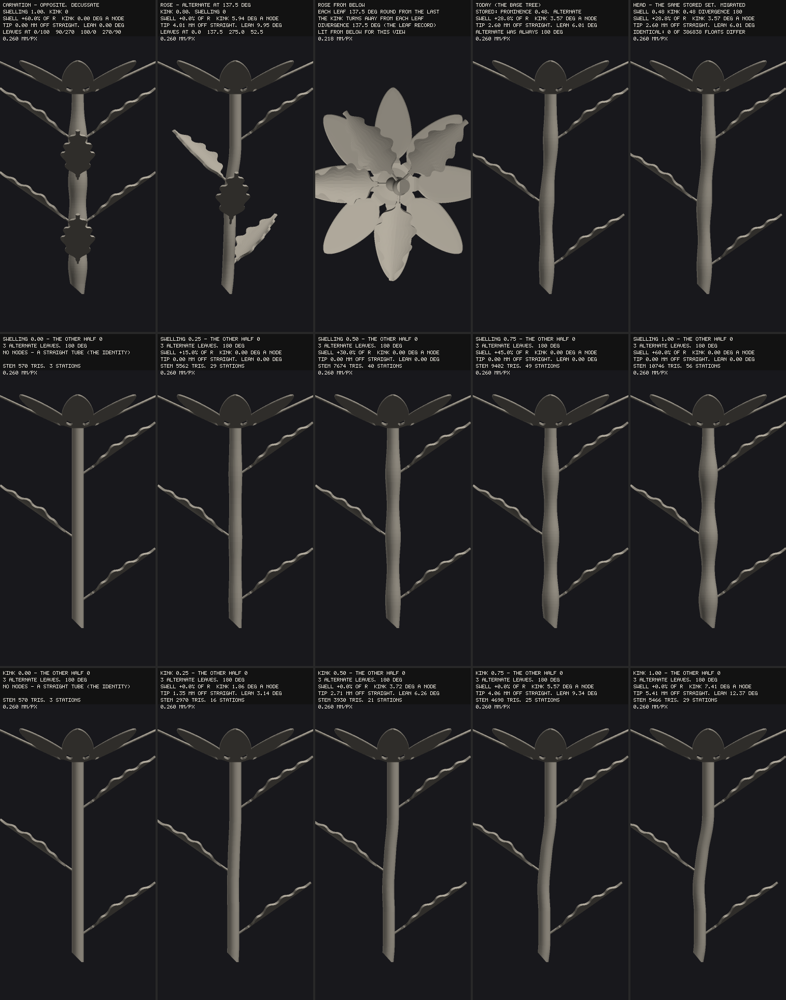

# Leaf/stem build S1 — the node split and the alternate divergence

**Eva's rulings, Oct 6** (the brief; the project doc `claude/leaf-rulings-oct-6.md` is **not in this
repository** — like `claude/lobes-serration-status.md` before it, it lives in a Cowork project the
sessions cannot read, so the rulings were taken from the brief verbatim):

1. ALTERNATE becomes a divergence-angle slider. The rose is ~137°; 180° (today's distichous
   ALTERNATE) stays reachable and is the value every existing saved design resolves to.
2. The node control splits into two: SWELLING (the carnation) and KINK (the rose's few-degree
   zig-zag). This supersedes #299's "swelling and kink as one control".
3. Rename labels, never IDs. An id whose meaning has to change is retired through `RETIRED_IDS`
   and migrated, never repurposed.

Read `docs/bloom-leaf-stem-discovery.md` §1b / §3e / §8 F2–F4 for the audit this builds on.
Out of scope and untouched: leaf geometry, `emitPanel` routing, arch/cup, the tooth floor, the
compound tree, the chevron, WHORLED `n`, internode growth, leaf size along the stem.



`node tools/shot-bloom-node-split.mjs docs/img/node-split.png --base <worktree of f4b5baa>` — row 1
the carnation (opposite, decussate, swelling 1, no kink), the rose side-on (alternate at 137.5°, kink
0.8 ≈ 5.94°, no swelling) and from below, and the 180° pair: TODAY (the base tree building the stored
set `stemNodeProminence 0.48`) beside the HEAD (the same stored set through the migration) — **0 of
386,838 floats differ**, measured by the tool itself, which refuses to write the sheet otherwise. Row 2
a swelling sweep 0 → 1 with no kink; row 3 a kink sweep 0 → 1 with no swelling, both on one 100 × 6 mm
stem with three alternate leaves. Deterministic renderer, EXPORT mode, no pixel delta quoted.

---

## 1. What shipped

| control | section | range | default | what it is |
|---|---|---|---|---|
| `stemNodeSwelling` | Stem | 0–1, step 0.01 | 0 | the Gaussian swelling, `0.6 ×` the radius over the flower's 3.27-radius spindle |
| `stemNodeKink` | Stem | 0–1, step 0.01 | 0 | the turn below each node, `atan(0.13 ×)` — 7.41° at 1 |
| `leafDivergence` | Stem | 90–180°, step 0.5 | 180 | ALTERNATE's node-to-node turn |
| ~~`stemNodeProminence`~~ | — | — | — | **RETIRED** (`RETIRED_IDS`, `migrateTo: [stemNodeSwelling, stemNodeKink]`) |

- **Both node amounts keep the retired control's 0..1 scale and its law term for term**
  (`swell = STEM_NODE_SWELL × swelling`, `slope = STEM_NODE_SLOPE × kink`, each clamped as before),
  which is what makes the migration a value COPY and exact.
- **Both at 0 is the identity by branch** (`stemNodeLaw` returns null — the `domeIsFlat`
  discipline). **One at 0 is not a branch**: the other still builds a law and the zero term is an exact
  zero inside it (`R(1 + 0·sw)` is R; `0·past·sm` is 0), so a swelling-only stem stays on the axis and
  a kink-only stem keeps its radius to the bit. ST12(c) holds both at 1e-9 on every ring.
- **The divergence is live only where it reaches a leaf**: the leaves' own node law and ALTERNATE
  (`PREDICATES.leafDivergenceLive`). Under OPPOSITE / WHORLED and on a raceme's shared node it is
  hidden AND inert, and LF5 measures that (§3).
- **A leafed node still turns away from its first leaf**, and at 137.5° the first leaf stands wherever
  the divergence put it — so the rose's kinks spiral with the leaves, each bend on the far side of its
  own leaf, and the bends never contradict the leaves (the flower's forbidden disagreement stays
  impossible). A bare node still turns at the golden angle.
- The read-out says both halves (or that one is absent) and the divergence:
  `NODES 4 at the leaves · no swelling (the stem keeps its radius at the nodes) · kink 0.80: turn 5.94° a node, away from its first leaf …`;
  `LEAVES 4 on 4 nodes · alternate (1 a node, 137.5° between nodes) …`.

## 2. The id decisions, and why

**`leafPhyllotaxy` KEEPS ITS ID, and a new `leafDivergence` slider carries the angle.** The test the
ruling gives is whether the id's MEANING has to change. It does not: `leafPhyllotaxy` still means
"how the leaves stand at a node", its three values are unchanged, and the botanical word *alternate*
has always covered both the distichous and the spiral arrangement — one leaf a node. What changed is
that the node-to-node angle, which was a hidden constant inside one option, is now a parameter of it.
Every stored `alternate` carries no `leafDivergence`, takes the default 180, and draws exactly what it
drew: the turn is formed as `(deg / 180) · π`, and `180 / 180` is exactly 1, so the turn IS `Math.PI`
and node *i*'s azimuth is `i · π` — the pre-ruling expression, the same double (`deg · π / 180` is not:
`180 · π` rounds before the division). A retirement here would have retired a name whose stored value
means the same thing under the new law, which is the opposite of what `RETIRED_IDS` exists for. The
option's LABEL changed ("Alternate (one a node, at the divergence angle)"), per ruling 3.

**`stemNodeProminence` IS RETIRED.** Kept as either half, its meaning would change: a stored 0.48
drew a swelling AND a kink, and read as the swelling alone it would silently drop the kink. So the name
is retired (`retiredAt: 54` — sessions stopped carrying numbers after 43; the number is the frozen
phase this session registers, and the entry says so in a `session` field) and the value migrates into
BOTH halves.

**The migration is a declaration with one owner.** `RETIRED_IDS` gains an optional `migrateTo` — the
live controls the retired value is copied into, verbatim — and `migrateControls()` / `migrateSet()` in
`bloom-registry.js` are the one owner of applying it. It is DATA, not a function: the panel gate
serialises `RETIRED_IDS` into the page, and the first cut (a `migrate: (v) => …` closure) crashed it —
which is also the registry's own reason for keeping its predicates introspectable. A retired id with no
`migrateTo` is never touched and still refuses, so a frozen row naming `centerStyle` keeps failing
loudly rather than being stripped into a state that draws something else. `verifySections()` refuses a
`migrateTo` naming anything but live controls, and an empty one (the delete-only "migration" the list's
own header forbids) — checked against the registry's own controls only, because the panel gate's
nesting route hands that function fixture controls to ask about sections. Both refusals were seen to
fire on a planted entry.

**Where it is applied today.** The bloom persists no design, so its consumers are the harness's
`applyConfig` / `fullStateDrift` (a stored row replayed on this tree — applied only when the served tree
lacks the retired id and has every target, so a base tree is handed its own value untouched) and the
byte gate below. The first feature that persists a design applies `migrateControls()` on load.

## 3. The invariant: every stored control set renders byte-identical

**THE PREMISE WAS CHECKED AND IS NARROWER THAN IT READ.** "Every existing saved design and every
registry preset": the bloom has **no saved designs** (no save, no share link, no hash — `RETIRED_IDS`'
own header says `schema: null`) and **no registry presets** (`bloom-view-presets.js` is camera chrome).
The control sets that ARE stored are the matrices — the base tree's live `buildMatrix()` and its 52
frozen phases. That is the population, taken from the BASE tree's own harness so the head cannot choose
which designs it is held to.

`node tools/verify-bloom-node-split-bytes.mjs --base <worktree of f4b5baa>` (sharded, `--resume`,
`--merge`): each distinct stored (set, capability) is built on the BASE tree as stored and on the HEAD
through `migrateSet`, in EXPORT and LIVE, compared positionally under `Object.is` on every export float
and every captured-grid mid/normal value. **There are no movers** — both rulings default to the old
behaviour.

```
MODE shipped-migration · 1404 distinct stored control sets · 1179 compared · 225 not buildable on the base tree (excluded, counted)
  rows those sets stand for: 34,226 matrix rows (live + frozen) · compared 1,835,518,644 export floats and 250,223,966 captured-grid values, both modes, Object.is
  predeclared movers: 0 · moved: 0 · movers that moved: 0 · holders that moved: 0
  excluded   64: names "petalTipBreadth" … 51: "centerStyle" … 46: "labellumTipBreadth" … 16: "innerTipBreadth"
              15: "allTipBreadth" … 13: "stigmaSharpness" … 12: "antherSharpness" … 8: "lobeTipShape"
  control: perturbed "DEFAULT (the shipping configuration)" by 1e-9 — the comparison reported it
PASS — every one of the 1179 distinct stored control sets the base tree can build renders byte-identical on the head through the migration, in both modes.
```

The 225 excluded sets are old frozen rows naming ids **the base tree itself** retired (sessions 20–41);
they cannot be built on either tree and carry no information about this change, so they are listed by
the id that excludes them rather than compared. A set the base can build and the head cannot would be a
FAIL; there were none. Cost: four shards in parallel, ~19 min wall.

**THE NEGATIVE CONTROL — a deliberately wrong migration, the kink defaulted to 0** (`--wrong-migration
--only-retired`: the 23 stored sets naming the retired id, plus the named holder):

```
MODE wrong-migration · 24 distinct stored control sets · 24 compared · 0 not buildable on the base tree
  predeclared movers: 21 · moved: 21 · movers that moved: 21 · holders that moved: 0
  FAIL "STEM NODES: the flower's 0.48 on 100 x 6 mm, three alternate leaves": a predeclared MOVER moved … (EXPORT positions length 386838 against 373878)
  … 21 findings
21 finding(s) — the must-fail FAILED AS REQUIRED
```

The movers are predeclared from the **base tree's own builder record** (a set moves iff the base built
a node law), and the result is exact in both directions: all 21 sets with a base node law move under the
dropped kink, and the two that do not (the raceme rows, where the node is inert) hold. Sets that name no
retired id are untouched by any migration — the shipped run already holds them.

## 4. Gates, all run in the foreground

| gate | result |
|---|---|
| invariant (above) | **PASS**, 1,179 sets / 34,226 rows; must-fail FAILED AS REQUIRED (21/21) |
| `verify-bloom-panel.mjs` | **PASS** — 40 sections, 180 controls, 13 retired ids; `stemNodeProminence` absent from the DOM, the read-out, the metrics and every bloom source file as an identifier |
| `verify-bloom-export.mjs --only` the 55 affected rows (every leaf row — LF5 gained a clause — every noded row, block 52) | **PASS** 55/55, watertight, 0 within-shell self-intersection, orientation baseline met, 0 validity failures |
| `verify-bloom-connectedness.mjs --only` the same 55 | **PASS** 55/55 one piece |
| `verify-bloom-stem-nodes.mjs` (ST12 must-fail) | **PASS** — 22 plants (5 new for the split), baselines silent including each half alone; ID4's pin fires per half |
| `verify-bloom-stem-cut.mjs` | **PASS** |
| `verify-bloom-apex-mutants.mjs --only` 13 of 107 | every one fires its named family; anchors 107/107 exactly once; clean tree silent. **94 not run** — this is a subset, not a sweep |
| `bloom-smoke.mjs --check` | coverage OK — 173 smoke rows over 48 blocks of 1,156 rows; 151 families both ways |
| `diff-bloom-bytes.mjs --verify-frozen --phase54` | **PASS** — deep-equal to `f4b5baa`'s own `buildMatrix()`, 1,144 rows |
| stem channel (+control), defaults bar (+control), leaf / sepal decoupled (+control), edge profile, combination gate, arc stability | all **PASS** (the stem-channel control output identical on the base tree) |

The mutants run: **new** `the-node-halves-are-coupled-again` (ST12, ST2 — also SC3, ST10 on the cut
ring), `the-divergence-never-reaches-the-leaves` (LF5), `the-divergence-leaks-onto-an-opposite-stem`
(LF5); **re-anchored or re-witnessed** `both-node-amounts-zero-is-not-the-identity` (renamed from
`prominence-zero-is-not-the-identity`), `the-node-field-never-reaches-the-stem`,
`the-nodes-are-gated-on-leaves-again`, `the-pedicel-pin-is-dropped` (now drops both halves),
`the-golden-kink-reaches-leafed-stems`, `the-node-term-outranks-the-pins` (plants `stemNodeKink`),
`the-bend-peaks-above-its-node`, `the-spindle-is-a-fraction-of-the-length`,
`the-noded-rings-stay-on-the-world-axis`, `the-petiole-roots-on-the-world-axis`. Three table rows were
added (the halves apart, the rose's 137.5, 90 under OPPOSITE) — the coupled-halves mutant is a no-op on
every state with the halves equal, which is every row the table had.

## 5. What the harness asserts now

- **ST12** reads both amounts. Its phasing arm (d) is split by the half it reads: the BEND arm's
  subject is a stem whose RESTATED kink is above 0, the SWELLING arm's one whose restated swelling is —
  named off the CONTROLS, never the plan, so a plan that dropped a half cannot shrink the subject that
  would see it; the exact absence of a half is (c)'s, at 1e-9. (f)'s merged-swelling report is told
  only when there is a swelling (the geometry's `mergedPairs` likewise — telemetry).
- **LF5** gains the node-to-node turn: node *i*'s first leaf at `i × turn`, the turn restated from the
  CONTROLS (alternate `(divergence/180)·π`, opposite π/2, whorled π/4), never the plan's own
  `divergenceDeg`. A count and the within-node spacing were both blind to a divergence that was ignored
  or leaked. Its subject is a stem whose leaves follow their OWN node law; on a raceme the leaves stand at
  the pedicels' azimuths, which the ID family owns.
- **ID4's pin** asserts both halves 0 on every floret (`PEDICEL_PINS` carries both).
- **Block 52** (12 rows) carries the halves apart and the divergence's axes and gated arms; blocks 41,
  47 and 48 now set both halves to the old value, **labels verbatim** so every label-keyed list (the
  xfail magnitudes, the smoke subset, the named control witnesses) still names the same state — and
  the invariant gate shows those states are byte-identical to what the labels described before.

## 6. Findings, and decisions made without a ruling

1. **ST12(d)'s bend arm sees only one side of a node on a kink-only stem — declared, with (c) as the
   witness.** The station placer spends stations where the SHIPPED law curves; with no swelling there is
   no curvature above a node, so the gap there is the whole straight stretch and a bend moved ABOVE its
   node is located only to within it. The must-fail's first kink-only plant (a bend a ramp early) was
   silent and its cause is the sampling, not the clause; the coupled stem's swelling is what used to put
   stations above the node. The plant now carries a defect inside the arm's resolution (a bend a
   spindle late) and the blind side is named in the tool's own comment; (c) reads every ring against the
   restated law at 1e-9 and catches the moved bend outright.
2. **The divergence range is 90–180°, step 0.5 — a decision without a ruling, one constant to widen.**
   Every spiral fraction a stem shows (1/2, 1/3, 2/5, 3/8, 5/13, the golden limit) lies in [120, 180];
   90 adds the four-ranked case; `d` and `360 − d` are mirror images. 137.5 is reachable exactly; the
   true golden angle 137.508° is not, by 0.008°.
3. **A floret's ALTERNATE stays distichous.** The ruling names the leaves; the floret's arrangement
   shares the leaf's option WORDS (checked at harness load) but not the new slider. Its callers pass
   `DISTICHOUS_TURN` by name — `leafAzimuths` now REQUIRES the alternate turn as an argument and throws
   without one, so a leaf caller that forgot the divergence cannot draw 180 in silence. Extending the
   divergence to florets is its own ruling.
4. **Cost: a split node is cheaper or dearer than the coupled one depending on the half.** The station
   placer reads curvature, so the whole bloom on the 100 × 6 mm bare stem at amount 1 reads 37,066
   triangles with the swelling alone (EXPORT = LIVE, 1,810 KiB) and 31,786 with the kink alone (1,552
   KiB) — the stem's own share is the difference from the plain stem's. The rose (kink 0.8 on a
   137.5 spiral, four leaves) is 43,322 / 2,115 KiB; the carnation (swelling 1, opposite × 4) 57,354 /
   2,801 KiB. **The divergence adds zero triangles** (137.5° and 90° on five nodes: 39,630 both). The
   shipping default has no stem and is untouched (the invariant proves it to the byte).
5. **Labels that say "prominence" are kept.** "STEM NODES: prominence MAXIMUM (1.00)" now reads
   "both halves at 1"; renaming would move every label-keyed list for no change in state.

## 7. Frozen phase

**`frozen/phase54` is the 1,144 rows at `f4b5baa`** (main's head before this session), registered in
both `FROZEN_MATRICES` and `FROZEN_BASE_COMMITS` and proved deep-equal. A phase is owed because the row
set changed (blocks 41/47/48's sets moved onto the new ids; block 52 appended, 1,144 → 1,156). Its
rows name the retired id as ROW DATA and are replayed on today's tree through `migrateSet`. **No
workflow file is edited by this session**, so no `TAG_PUSH_XFAIL` entry is owed; the tag is dispatched
from `main` after the merge and read back.

## 8. Contradictions and flags (not resolved here)

- **`CLAUDE.md`'s stem-nodes block said "ONE CONTROL"** — superseded by this ruling; the block is kept
  with a note pointing here (the root-blend precedent: a reversed claim stays legible).
- **The brief's "every registry preset"** has no referent on the bloom (§3).
- **The Project doc** `claude/leaf-rulings-oct-6.md` could not be read (§ intro).
- Nothing here contradicts the flower-project skill. "Derive, don't expose" is overridden by ruling for
  the divergence and the split, as the brief states.
