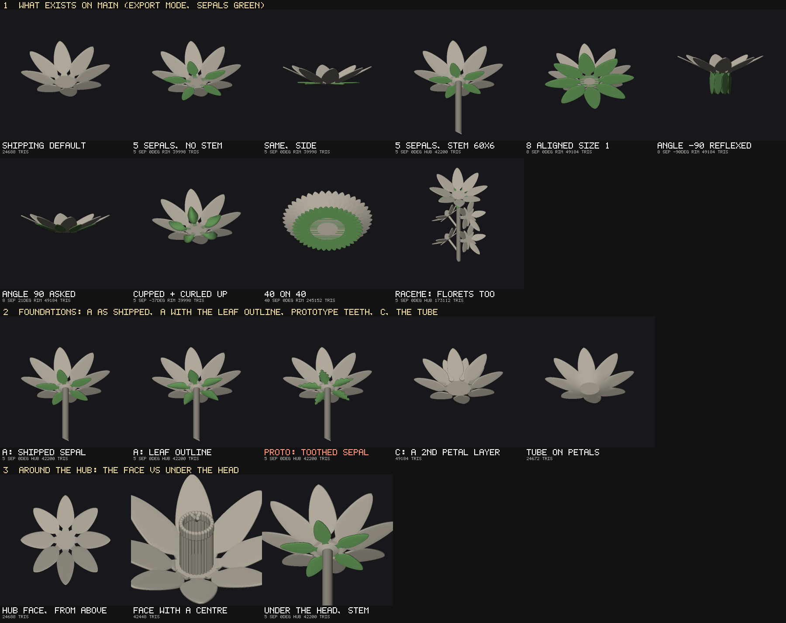
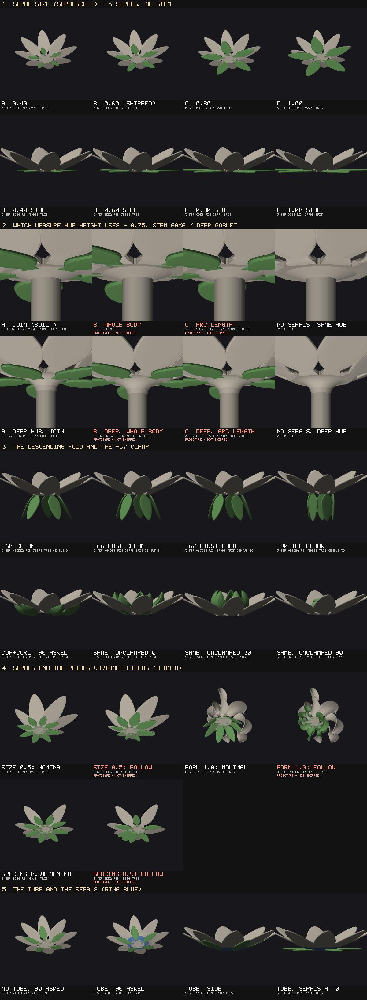

# Sepals — discovery (Oct 9): what exists, what we would build off, what we could do

**Nothing in the generator moved.** `bloom-geometry.js`, `bloom-registry.js`, `bloom.js`,
`bloom.html`, `bloom.css` and `tools/bloom-harness.mjs` are untouched. The deliverables are this
doc, one sheet tool (`tools/shot-bloom-sepal-discovery.mjs`, wired to no gate) and its output,
`docs/img/sepal-discovery.png` with the per-cell numbers in `docs/img/sepal-discovery.json`.
Measured on `main` at `ee91b94` (#385, the lobed leaf), the newest head when this session
branched. The leaf overhaul S1–S4 (#377, #378, #380, #381, #383, #385) and the TUBE (#323 and
after) are all on that head.



The sheet is built in Node through the shipped `buildBloomInto`, in EXPORT mode, and drawn with
the deterministic soft renderer, so the same tree gives the same bytes. **No pixel delta is
quoted anywhere.** Sepals are tinted green. Which triangles are sepals is MEASURED: the tool
builds the same state with `sepalCount` 0 and takes the run from the first differing triangle,
`built.sepals.tris` long. One cell, **PROTO: TOOTHED SEPAL**, is not the shipped geometry; see
§2.

---

## 0. The premise check: sepals already exist, and they ship

The brief says sepals "have never been discussed as a feature". **That is not true of this
repository, and it is the first finding.** The bloom has had sepals since **#243
(`eb2aaa7`, Sep 17), "Sepals, part 1"**. Eva ruled the design over two rounds ("a sepal is a
petal"). The record is `docs/bloom-sepals-outcome.md` (662 lines). The `CLAUDE.md` pointer block
is headed **A SEPAL IS THE PETAL BUILDER ON A SECOND RING**.

What ships today:

- **21 controls in 4 panel sections.** The sections are `Sepals`, `Sepal shape`, `Sepal form`
  and `Sepal curl`, between Center and Stem, all at the Standard tier.
- **72 matrix rows** in block 35, plus 8 cross-feature rows, so **80 of the 1,261 live rows build
  sepals**.
- **9 smoke rows.**
- **The SP0–SP9 assertion family**, in both STL gates.
- **9 mutants** in the apex table.
- **Three verification tools:** the byte tool `verify-bloom-sepal-bytes.mjs`, the decoupling
  sweep `verify-bloom-sepal-decoupled.mjs` and the dense contact re-draw `bloom-sepal-contact.mjs`.
- **A sheet**, `shot-bloom-sepals.mjs`.

The feature ships **OFF**: `sepalCount` defaults to 0, so **the shipping default renders no
sepals at all** (sheet cell 1, `SHIPPING DEFAULT`, 24,688 triangles).

Two further stale premises, for the record:

- **The `flower-project` skill is stale here.** Its "Junction ≠ base ornament" section says of
  sepals and the base ornament "Neither is built yet". Its "Known gaps" section calls sepals
  "Untouched". On the bloom, sepals are built. A base ornament is not.
- **The lace FLOWER generator has its own, separate sepals** (`flower-geometry.js`
  `buildSepalsInto`, `flower-registry.js`, `flower-presets.js`). It is a different generator, out
  of scope here, and nothing below refers to it.

**The brief's framing — "purely as hub decoration … not a structural calyx, not botanically
faithful" — is not contradicted by what shipped.** The shipped sepals are a decorative whorl:
the petal builder's own blade law with its own values. They carry no structural role: the
junction is the hub's, and sepals add nothing to it. What *is* open is whether "around the hub"
means where they ship today. That is Q1.

---

## 1. Inventory

### 1.1 Every reference

| where | what |
|---|---|
| `bloom-geometry.js` (195 lines mention sepals) | The `SEPAL_*` range and default constants (`:16869–16878`, `SEPAL_HEIGHT_*` `:18539`); `SEPAL_TWINS` (`:16887`, 15 pairs); `sepalsEligible` / `sepalsAbsent` (`:16900`); **`sepalBladeState`** (`:16902`); `laminaFromPanels` (the contact lamina); `sepalAttachment` (`:18542`); `sepalAngleLimit` (`:18696`); **`buildSepalsInto`** (`:18777`); `footRing()`'s FOURTH descriptor kind, `fr.sepals`; the budget-cap decision's `sepalTipShape` ramp; the crowding raster's sepal feet (`:3459`). It is called once, from `buildBloomCore` (`:19810`), after the gynoecium and before the inflorescence. |
| `bloom-registry.js` (85) | The predicates `sepalsEligible` / `sepalsPresent` (`:447–448`); four sections (`:1169–1172`); five hand-written rows (`sepalCount`, `sepalScale`, `sepalHeight`, `sepalPhase`, `sepalFootBreadth`, plus `sepalAngle` in Sepal curl, `:3643–3719`); **15 generated twin rows** (`sepalTwinControls`, `:4518`, generated from `SEPAL_TWINS` so a pair cannot drift). |
| `bloom.js` (59) | The read-out lines, the `cap` ticks (count ceiling, angle limit) and the metrics projection. |
| `bloom-grid-gltf.js` (1) | A comment. **The `.glb` grid export does not carry the sepals.** |
| `tools/bloom-harness.mjs` (2,147) | SP0–SP9; block 35; 11 `SELF_INTERSECTION_XFAIL` entries (§1.7); sepal rows in E2 declarations; the decoupling list. |
| Other tools | `verify-bloom-sepal-bytes`, `-sepal-decoupled`, `bloom-sepal-contact`, `shot-bloom-sepals`, the smoke census (block 35, 9 rows), the crowding and coverage instruments (R1 counts sepals through the builder), the defaults bar (one row; see §1.7), and the apex mutants (9 `sepal-*`). |
| Saved designs | **None.** The bloom persists no design and ships no presets. The only stored control sets are the matrix rows and the frozen phases. Sepal ids are named by 76 to 83 rows in every frozen phase from `phase35` to `phase58`. |

### 1.2 How they are built

**Sepals reuse the petal builder. There is no sepal builder and no leaf-builder reuse.**
`buildSepalsInto` does four things:

1. It asks `sepalAngleLimit` how far the sepals may rise.
2. It forms one substate, `bs = sepalBladeState(state, angleBuilt)`.
3. It calls the shared whorl primitive `buildWhorlInto` on the `fr.sepals` ring.
4. For each slot, it calls **`buildPetalInto(acc, bs, sepals.ring, slot, …)`**, the same
   function every petal goes through.

There are no sepal-specific shape ids: the blade is `petalSurface` → `widthProfile` +
`petalForm` → `bladeStations` → `emitPanel`, exactly as a petal's.

`sepalBladeState` is the whole difference:

```js
{ ...state, petalTilt: angleDeg, petalTipEnd: 0, fringeCount: 0, lobeDepth: 0, petalInfill: 'NONE',
  [petalId]: Number(state[sepalId]) for each of the 15 SEPAL_TWINS }
```

Length and width scale through the whorl's `slot.scale = sepalScale`, the same arithmetic as an
inner whorl's `layerSize`.

**Cost: 3,062 triangles a sepal**, fixed, and the same in LIVE and EXPORT. Sheet figures, EXPORT:

| state | triangles | of which the sepals |
|---|---|---|
| default | 24,688 | — |
| 5 sepals | 39,998 | 15,310 |
| 8 sepals | 49,184 | 24,496 |
| 40 sepals on 40 petals | 245,152 | 122,480 |

`ALL MAX` carries 40 sepals and is the declared export refusal.

### 1.3 Controls

| control | range | default | notes |
|---|---|---|---|
| `sepalCount` | 0–40 | **0** (the guard) | Clamped to the petal count of the placement (the outer whorl's n; the fan's k; one turn under CONTINUOUS), and told. |
| `sepalScale` | 0.20–1.00 | 0.60 | One factor for length AND width. **The session's own pick, never ruled** (§1.8). |
| `sepalHeight` | 0–1 | 0.75 | Eva's value. A fraction of the hub-to-stem join's axial extent; INERT, and told, where there is no hub below the head. |
| `sepalPhase` | 0–1 | 0.50 | 0 is aligned with a petal, 0.5 interleaved, 1.0 aligned with the next petal. |
| `sepalFootBreadth` | 0.25–1.50 | 1.00 | Clamped to the foot floors, and told. |
| `sepalAngle` (Sepal curl) | −90..90, step 1 | 0 | Clamped at the **drawn** contact limit, and told. |
| 15 twins | each petal control's own | each petal control's own | Base taper, tip shape, tip taper, cup, cup gradient, the three buckle controls, apex sweep, roll, roll taper, spine curl, curl bias, curl start, twist. |

**Visibility:**

- Every sub-control is hidden AND inert at `sepalCount` 0. SP0 asserts that the registry's
  `sepalsPresent` and the geometry's `sepalsAbsent` agree.
- The whole family is hidden and inert under SPHERE. The read-out says "UNAVAILABLE under SPHERE",
  and SP9 asserts that nothing was built.

**Reachability:**

- The controls are reachable from the panel. The panel gate (`bloom-panel.yml`) passes on `main`,
  and it is the gate that proves every control renders once and still works inside a collapsed
  section.

**Not exposed, deliberately:**

- **Thickness** is the shared `Part thickness` section. One material; asserted by the decoupling
  sweep.
- **Per-sepal roles** do not exist.
- **The capability hook `{ sepalAngleUnclamped: true }`** builds past the limit. No control
  reaches it.

### 1.4 Where they attach, and how count and phase are placed

There are two attachment modes, and `sepalAttachment` is the one owner of the solve.

- **RIM.** Used where there is no hub below the head: no stem (the shipping default), an inert
  join, or a dome whose bowl holds the stem end above the join. The sepal ring is
  `fr.sepals.ring`.
  - It has **the same radius as the petal ring** (8.845 mm on the default) and the petal foot's
    own overhang (3.538 mm).
  - Its foot is **0.60 of the petal foot's width** (3.84 against 6.40 mm), because the foot is
    scaled by `sepalScale`.
  - It sits at `z = 0`.

  So on a stemless bloom the sepals leave **the same circle as the petals**, and differ only in
  angle: 0° against the petals' 25° tilt. Sheet cell 3, `SAME, SIDE`, shows this.

- **HUB.** Used where a stem's hub-to-stem join flares below the head. The whorl attaches
  `sepalHeight` of the way up the join's axial extent, by the join reading (§12a of the sepals
  outcome doc). At the shipped 6 mm stem that is **0.33 mm under the head**. The foot runs inward
  through the whorl primitive's `height` argument.

**Placement:**

- **Count.** `min(asked, ceiling)`.
- **Phase.**
  - On RADIAL and SPIRAL it is a fraction of the petal pitch.
  - On a FAN, a `LIST` arm of `buildWhorlInto` takes the k fan positions nearest the mirror line.
    Mirror symmetry there is measured and told, not assumed.
  - Under CONTINUOUS there is no pitch, and the fraction is applied against slot 0's azimuth.
- **Under the variance fields, the sepals stay at their nominal azimuths.** They take no size,
  form or spacing field, by declaration. Rows: `VARIANCE: x SEPALS`, `FORM VARIANCE: x SEPALS`
  and `SPACING VARIANCE: 0.9 x SEPALS`.

### 1.5 What sepals inherit and what they pin

| treatment | sepals | mechanism |
|---|---|---|
| Edge profile (taper + half-round bead, #278) | **Inherited** | `emitPanel`'s rim block: the same builder. |
| Apex nib (rounded 0.40 mm face, #283) | **Inherited** | `petalTipEnd` is zeroed, so the nib's squared-terminal guard never fires. Row: `APEX NIB: x SEPALS`. |
| Petal tip law (`petalTipShape`) and the apex row ramp | **Own twin** | `sepalTipShape`. The budget decision ramps the sepal ring off its own tip shape. |
| Cup, and the fold clamp on the cup | **Own twin** (`sepalCup`); **the clamp is inherited** | `petalForm` / `cupScale`. `cupClampLine` prints over every sepal. |
| Roll, curl, twist, buckle, apex sweep, cup gradient | **Own twins** | `SEPAL_TWINS`. |
| Lobes / serration (petal) | **Pinned off** | `lobeDepth: 0`. Part 2 is costed, not built. |
| Fringe / squared terminal | **Pinned off** | `fringeCount: 0`, `petalTipEnd: 0`. |
| Leaf tooth-relief floor (S2) | **Not applicable** | It is a leaf cap (`cap.toothReliefFloorMm`) and never set on the petal path. |
| Leaf outline types (LOBED chevron, COMPOUND) | **Not reachable** | They live in `leafSurface` / `lobedSurface` / `buildCompoundLeafInto`. |
| Voronoi infill | **Pinned off** | `petalInfill: 'NONE'` (Eva's ruling 4 of the Voronoi port). Row: `INFILL: x sepals 8`. |
| TUBE (corolla fusion) | **Not wired** | The tube is per petal LAYER (`tubeLayerN`), and the sepal ring is not a layer. **The sepal limit is drawn against FREE petals** — it ignores the tube's ring. That is TUBE open question Q3 (`docs/bloom-tube-outcome.md` §8). |
| Variance (size, form, spacing) | **Not taken** | By declaration. Sepal variance is ruled ("ruling 5: independent sepal amounts, defaulting to the petals'") and not built. The registry has no follow-another-control mechanism. |
| Petal per-slot roles and overrides | **Not taken** | The sepal ring has `overrides: null`. |
| Thickness | **Shared** | `Part thickness`. |

### 1.6 Inflorescence

**Every floret builds the head's sepal whorl too.** This is ruling 10 of the inflorescence work,
and the row is `INFLO: x SEPALS`. A floret is one whole `buildBloomInto` call, and `PEDICEL_PINS`
does not pin `sepalCount`.

Measured, at a 60 mm rachis (one floret fits):

| state | triangles |
|---|---|
| raceme without sepals | 44,308 |
| raceme with 5 sepals | 74,928 |

The difference is 30,620 = 15,310 for the head + 15,310 for the floret. So **sepals multiply
with the floret count**, and the floret's whorl is clamped to its own `floretPetals`. The sheet's
raceme cell (120 mm rachis, 4 florets, 173,112 triangles) tints only the head's sepals.

### 1.7 Print status

**Both long gates are green on `main` at `ee91b94`, with every sepal row in them.**

- `bloom-export-watertight` (run 37865440134) and `bloom-connectedness` (run 37865440127)
  cover the full 1,261-row matrix. That includes all 72 block-35 rows and the 8 cross-feature
  rows.
- **A local foreground re-run of the sepal subset** used `verify-bloom-export.mjs --only` over
  18 rows: the 9 smoke rows, `sepalCount max`, and every cross-feature sepal row except
  `ALL MAX`. Result: **PASS, 18 of 18 watertight**.
  - Live and export triangle counts are identical, with 0 degenerate triangles.
  - Two declared self-intersection xfails held at their recorded magnitudes.
  - 0 rows flagged CROWDED.

**Census (X1/X2): 11 sepal rows are declared in `SELF_INTERSECTION_XFAIL`. None is a sepal
defect.** They fall into four classes:

- **The ALIGNED WELD — 7 rows.**
  - At phase 0, the sepal foot's columns are bit-equal to the petal foot's (0.6 is 3/5).
  - The census welds the two into one shell, so the by-design overlap reads as a fold.
  - The interleaved default reads 0 at every angle.
  - The worst row is the crowded corner: 16,920 pairs.
- **The DESCENDING SEAM — 1 row** (`angle min (-90)`, 50 pairs / 0.3225 mm).
  - The petal builder folds at its own foot-to-blade seam on a blade turned down past about −55°.
  - The clearance law was derived for the top skin. This is the seam owner's, and unscheduled.
- **The head's own hemisphere fold — 1 row.**
- **The petal builder's own roll and curl folds on the shorter blade — 3 rows** (`sepalRoll ±330`,
  `sepalSpineCurl max`).

**Print floors.**

- **Sheet.** The sheet is shared, so a sepal is never thinner than a petal: 1.00 mm export floor,
  1.20 mm shipped.
- **Foot.** The sepal foot is clamped to `[FOOT_MIN_WIDTH_MM 1.60, FOOT_MAX 10]`, and told. The
  `foot breadth min (0.25)` row binds it.
- **Rim.** The rim is #278's bead with its narrow-span clamp. The edge-profile gate draws from the
  smoke subset, which includes sepal rows.
- **Material.** Nothing here has been printed (SLS PA12). Every floor is a declared guess, as
  everywhere in this project.

**ONE INSTRUMENT FINDING — the defaults-bar's sepal row measures a PETAL, not a sepal.**
`tools/verify-bloom-defaults-bar.mjs` lists `the sepals at the shipped whorl` with
`measures: ['self']`. `measureSelf` reads `m.petal.grid`. `m.petal` is the representative
petal, `petalsAll[0]`, and never a sepal (measured: `b.sepals.built.includes(b.petal) === false`).

| reading | self (mm) |
|---|---|
| that row, with the 5 sepals | 1.2377 |
| that row, with no sepals | **1.2377**, bit-identical |
| the sepal's own lamina, through the same `measureWall` | 1.2288 (wall 1.2000) — clears the 1.00 bar |

So **that row cannot fail for any sepal**. This is the fifth durable rule: a clause whose subject
excludes the thing it doubts.

The wall instrument and the combination gate carry **no sepal row at all** (0 mentions). The
sepal twins at their extremes are therefore measured by nothing on `self`. Readings taken this
session, on the sepal's own grid:

| state | self (mm) | wall (mm) |
|---|---|---|
| `sepalCup 1.2` | 1.1522 | 1.1320 |
| `sepalSpineCurl 360` | 1.2180 | 1.1963 |
| `sepalScale 0.2` | 1.2245 | 1.2000 |
| **`sepalRoll 330`** | **0.8764 — under the bar** | 0.8563 |

The `sepalRoll 330` reading is the petal's own `roll-max` class on a shorter blade. Reported, not
fixed: this session ships nothing (Q7).

**Default sweep / `ALL MAX`.**

- `ALL MAX` takes `sepalCount 40`. The blanket sweep hands every top-level slider its maximum.
- The 20 sub-controls are hidden at DEFAULTS and so stay out of the sweep. `ALL MAX` builds 40
  sepals at the sub-controls' DEFAULTS.
- Its census and refusal entries are recorded with the sepals in.
- `sepalCount max (40)` is its own sweep row.
- Block 35 sweeps every twin to both ends.

### 1.8 Open items carried from the sepals sessions, never ruled

These are in `docs/bloom-sepals-outcome.md` §11 and §12i, and are repeated in
`docs/bloom-state-of-play-oct-5.md`:

1. **`sepalScale` 0.60.** The session's pick, from its own sheet.
2. **The two readings of the hub's axial extent.** The join reading is built; the whole-body
   reading would put the shipped default 0.03 mm under the plate's mid-plane.
3. **The descending-seam fold.** Reflexed past about −55°.
4. **Sepal variance's "follow the petals" mechanism.** Ruled, with no registry mechanism to carry it.
5. **TUBE Q3.** The sepal limit ignores the tube's ring.

---

## 2. What we would be building off — the three candidates, measured

**The structural finding first: A and C are the same code, and B shares the same blade law.**
The leaf overhaul did not build a separate blade tree. Both blades end in the same calls:

- `leafBladeLaw` calls `petalForm` and `widthProfile` (with `cap.petiole`).
- `leafSurface` hands the rows to the same `emitPanel`.

What differs is the **entry point**:

| | the petal entry (`petalSurface`) | the leaf entry (`leafSurface`) |
|---|---|---|
| **root** | a foot on a ring (`footRing`) | a petiole rod |
| **seam** | seam clearance | — |
| **row stations** | the turning-rate ladder | `LEAF_BLADE_ROWS` uniform stations |
| **apex** | the nib | the 1.60 mm stub |
| **fold clamp** | the cup clamp | the cup clamp |
| **outline types** | lobes, fringe | serration with the 1 mm relief floor, plus LOBED (chevron) and COMPOUND |

So "which foundation" is really two questions:

- **Which ROOT** does a sepal have?
- **Which OUTLINE FAMILY** can it reach?

| | A — keep/extend the shipped path | B — re-root on the leaf blade path | C — a constrained petal layer |
|---|---|---|---|
| **What it is** | Sepals as shipped. Part 2 adds the rim family as twins. | Build each sepal through `leafSurface` / `lobedSurface` with no petiole, footed on the hub. | Another petal whorl (the `layerCount` system) with a separate state. |
| **Reused for free** | Everything in §1.5: bead, nib, cup clamp, the drawn angle limit, attachment, SP0–SP9, all 72 rows. **Part 2 is zero geometry**: `widthProfile` reads `ps`, so lobes and fringe arrive through the substate. 8 twin rows. | The leaf's outline types (LOBED chevron, COMPOUND), its tooth floor, its arch convention. | The layer roles (`inner*`), the tube (it is per layer). |
| **What breaks / is new** | Nothing. The LOBED chevron and COMPOUND types are not reachable; wiring them to a foot is a new primitive. | **The root.** A leaf blade starts buried in a petiole rod. A sepal on the hub needs a foot, the seam clearance, the drawn angle limit and the attachment solve. All of that is A's, and would have to be rebuilt or carried across. **The nib is lost** (leaves end on the 1.60 mm stub). **Every sepal row's bytes move**: 80 live rows and every frozen phase from `phase35` on. That is a partition event. SP0–SP9 are re-derived. | **Layers step INWARD and smaller** (`layerSize`, the area rule), and nothing places a whorl outside or below the outer petals. Sheet cell `C: A 2ND PETAL LAYER` shows this. An outer "layer" is a new primitive, and it is exactly the sepal ring A already has. Layer controls are shared deltas (`innerCurl` …), not an independent set. |
| **Saved designs** | None persist. New twin ids only; no id renamed; matrix rows untouched where the guard holds (`lobeDepth` 0). | None persist. Ids could stay (labels only), but the frozen phases' BYTES stop reproducing on every sepal row. Their definitions still would. | Would need new ids, or retire the sepal ids (`RETIRED_IDS`). |
| **Fit with "decoration around the hub"** | Good: an independent whorl with its own shape, placed under the petals. The panel says "a sepal is a petal", which is accurate and is Eva's prior ruling. | Good for LEAF-LIKE sepals. Awkward for petal-like ones: it imposes the leaf's rulings (tooth floor, `LEAF_CUP`, the stub). | Poor: it reads as a second corolla, and sheet cell `8 ALIGNED SIZE 1` shows a sepal at size 1 does too. |

**Two cells on the sheet make B's main attraction concrete without leaving A:**

- **`A: LEAF OUTLINE`.** The sepal twins are set to the leaf's own constants: base taper 0.85,
  tip taper 1.15, tip shape 1.30, cup 0.35. These are shipped sliders. **The leaf outline is
  reachable today.**
  - The drawn angle limit drops from 18° to 14°, because the blade is wider near the base.
- **`PROTO: TOOTHED SEPAL` — a prototype, NOT SHIPPED.** It is a patched copy of
  `bloom-geometry.js`, written to a temp directory, in which `sepalBladeState` passes a tooth cut
  (depth 0.26, 6 teeth, coverage 1, crest and notch 2.00) instead of zeroing `lobeDepth`.
  - **The witness:**
    - At tooth depth 0 the patched module is **byte-identical to `main`** (0 floats differ over
      the whole bloom).
    - With teeth, **93,870 floats move, by up to 1.529 mm**.
    - **The triangle count is unchanged at 42,200.** The cut is on a fixed lattice, as the
      petal's lobes are.
  - That is §10 of the sepals doc made visible: **the rim family on a sepal is zero geometry.**
  - **What the prototype does NOT do:** apply the leaf's 1 mm tooth-relief floor (a leaf cap);
    add the 8 twin controls; touch any instrument.
- **What A cannot reach without new work:** the LOBED chevron lattice (a different surface law,
  `lobedSurface`) and the COMPOUND leaf (rachis plus stalked leaflets).

---

## 3. What we could do from here — grouped by geometry mechanism

Grouped by mechanism, not ranked by taste. Each item is tagged with its cost:

- **built** — ships today.
- **free** — the mechanism exists and needs only exposure: a twin row or one value.
- **small** — the mechanism exists and needs wiring.
- **new** — a new primitive.

**Placement on the ring** (the whorl primitive)

- Count and phase relative to the petals: **built**.
- More sepals than petals: **small**. The ceiling is a rule in `fr.sepals`, not a geometric limit.
- Sepals that follow the variance fields (size, form, spacing — "defaulting to the petals'"):
  **small**. `buildWhorlInto` already takes the size field; the registry has no follow mechanism.
- A second sepal whorl (epicalyx): **new**. It would be a fifth descriptor kind. The whorl
  primitive was built so this is "free later" — `docs/bloom-charter.md`'s own claim.
- Per-sepal roles: **new**.

**Outline** (the substate into `widthProfile`)

- Length and width via one size factor: **built**. Separate length and width factors: **small**
  (two rows).
- Tapers and tip shape: **built** (twins).
- A leaf-like outline: **built**, reachable through the twins (sheet cell).
- Lobes, serration, fringe: **free**. 8 twin rows, zero geometry; prototype rendered.
- The 1 mm tooth floor on sepal teeth: **small**. It is one cap field; whether it applies is a
  ruling.
- LOBED chevron or COMPOUND sepals: **new** on a foot.

**Pose** (the blade frame and the angle limit)

- Angle −90..90, clamped at the DRAWN contact limit: **built**.
  - The limit is 21° interleaved / 24° aligned at the rim, and 18° on the shipped stem.
- Cupped or curled up toward the petals: **built, but bounded by contact**.
  - On the sheet, `CUPPED + CURLED UP` (cup 1.2, curl 120, asked 90°) is built at **−37°**: the
    curl carries the blade over the petals, so the limit goes negative.
  - **A sepal that wraps up around the corolla is unreachable**, because the limit forbids
    passing through a petal.
- Reflexed down: **built** to −90°. It folds at the seam past about −55° (open).

**How they meet the hub** (the attachment solve)

- At the rim / partway down the hub-to-stem join: **built** (`sepalHeight`).
- **On the hub's top face, inside the petal roots: new.**
  - Today that face is the bare disc inside the innermost petal row, about 10.6 mm across on the
    default (8.845 − 3.538 = 5.31 mm radius). It is the centre's region.
  - The androecium and gynoecium already decorate it (sheet cell `FACE WITH A CENTRE`).
  - The **CORONA** — "a flared collar between petals and stamens" — is a reserved name there from
    session 20.
  - Blades rooted on the face would cross the petal feet and the stamen roots.
- Sepals on a SPHERE head: **new**. Unavailable today: there is no underside ring.

**Fusion** (the TUBE mechanism)

- A calyx cup (sepals fused partway up): **small to new**.
  - The tube machinery exists and is per PETAL layer.
  - Wiring it to the sepal ring is a new descriptor in `tubePlan`.
  - Q3 (the sepal limit ignoring the ring) would have to be answered at the same time.
  - Sheet cell `TUBE ON PETALS` shows the mechanism on the petals.

**Surface**

- Voronoi infill on sepals: **free** (one pinned value). Gated on Eva's ruling.
- An own sepal thickness: **new** in kind. It is a second material; today the sheet is shared by
  declaration.

**Instancing**

- Sepals on every floret: **built** (ruling 10).
- Head-only sepals: **free** (one `PEDICEL_PINS` entry). That is a ruling.

---

## 4. Open questions for Eva

Each is multiple choice. **All eight are answered by Eva's Oct 9 rulings — §6.** The five old
items Q8 named are §7.

**Q1. "Around the hub" means:**

- (a) **The botanical position.** Under and behind the petal whorl, from the rim or partway down
  the hub-to-stem join. This is what ships.
- (b) **Literally decorating the hub's top face**, inside the petal roots. This is the centre's
  region and the reserved corona.
- (c) **Both**, as two separate features.

**Q2. This work is:**

- (a) **Extending** the shipped sepals (#243).
- (b) **Replacing** them. That is a partition event; the ids would stay and the labels move.
- (c) **A separate decoration** beside them.

**Q3. The foundation:**

- (A) The shipped petal-builder path, extended by twins.
- (B) Re-root on the leaf path. This loses the nib and the drawn limit, and moves every sepal row.
- (A+) A's root, plus the leaf's outline family passed through the substate where it can be.
  Lobes and serration are free; the chevron and compound types would be new.

**Q4. The shipping default:**

- (a) Stays at `sepalCount` 0.
- (b) Gains a whorl. That moves every matrix row whose state has no `sepalCount`: a partition
  event and a frozen phase.

**Q5. Florets:**

- (a) Keep inheriting the head's sepals (ruling 10).
- (b) Pin them off on pedicels.

**Q6. Sepal teeth, if the rim family ships:**

- (a) The petal lobes' rule, with no relief floor.
- (b) The leaf's 1 mm relief floor.
- (c) Its own floor.

**Q7. The defaults-bar's sepal row measures the petal:**

- (a) Fix it to read the sepal's own lamina in the next sepal build.
- (b) Fix it now, in a hygiene PR.
- (c) Also add a sepal row to the wall instrument and the combination gate (`sepalRoll 330` reads
  0.876 mm, under the bar, today).

**Q8. The five never-ruled carry-overs (§1.8):**

- (a) Rule them now (sheet cells on request).
- (b) Fold them into whichever sepal build comes next.

The five are: `sepalScale` 0.60, the axial-extent reading, the descending seam, the follow
mechanism, and TUBE Q3.

---

## 6. Eva's rulings (Oct 9)

Recorded verbatim in substance; §4's questions are answered by them as noted.

| # | ruling | answers |
|---|---|---|
| R1 | **"Around the hub" means BOTH, as SEPARATE features.** The shipped sepals (under and behind the head, at the rim or partway down the hub-to-stem join) stay as they are. A decoration on the hub's TOP FACE is a separate future feature, **not sepals**. Not designed here. | Q1 → (c), Q2 → (a) |
| R2 | **The foundation is A+.** Keep the current root — the petal builder on the sepal ring, the attachment solve, the drawn contact limit, the rounded tip (the nib) — and add leaf-style outlines and teeth where that is possible through the substate. **No re-root onto the leaf path.** | Q3 → (A+) |
| R3 | **The default stays `sepalCount` 0.** No re-baseline. | Q4 → (a) |
| R4 | **Racemes: florets KEEP inheriting the head's sepals** (ruling 10 of the inflorescence work stands; `PEDICEL_PINS` gains nothing). | Q5 → (a) |
| R5 | **If sepal teeth ship, they use the leaf's 1.0 mm tooth floor** (`cap.toothReliefFloorMm`, `MIN_FEATURE_MM`). | Q6 → (b) |
| R6 | **The blind defaults gate is fixed NOW, with coverage** — its own PR (§1.7's finding; the defaults-bar row, a sepal row in the wall instrument and in the two-control gate). | Q7 → (b) + (c) |
| R7 | **The five old unruled items are ruled NOW, from a sheet.** §7 below is that sheet. | Q8 → (a) |

**OPEN QUESTION, recorded for the hub-top-face feature and NOT for sepals:** that face is the
centre's region (androecium, gynoecium), and the name **CORONA** is reserved there since session
20 ("a flared collar between petals and stamens" — the centre-rig retirement, recorded in `CLAUDE.md`). Whether
the hub-top decoration IS the corona, overlaps it, or must stay clear of it is that feature's own
discovery's first question. Nothing here designs it.

---

## 7. The five old items — a rulings sheet



`node tools/shot-bloom-sepal-rulings.mjs docs/img/sepal-rulings.png --json docs/img/sepal-rulings.json --impact`
(about 45 s for the sheet; `--impact` builds every live row that carries sepals and takes a few
minutes more). Same machinery as §0's sheet: Node, the shipped `buildBloomInto`, EXPORT mode,
the deterministic soft renderer, **no pixel delta quoted**. Sepals GREEN, a tube's ring BLUE.

**PROTOTYPE CELLS are captioned in red.** Items 2 and 4 have options nothing shipped can build;
they come from ONE patched copy of `bloom-geometry.js` in a temp directory, every patch behind a
switch read from the state, each anchor required to match exactly once. **The tool checks before
it renders that, with no switch set, the patched copy equals `main` on all 379,800 floats of a
stemmed, size-varied sepal state.** Nothing in the repository is modified.

**Byte impact is a PREDICTION from the builder's own record on `main` at `2e096bf`, not a byte
diff.** Of the **1,265 live rows, 79 build sepals.** None of the options below moves the shipping
default: `sepalCount` is 0 there (R3). A default change moves BYTES, not row definitions, so no
frozen phase is owed by any of them; each frozen phase's sepal rows stop reproducing by the same
predicate, which a session that takes an option names in its outcome doc.

Each item is a multiple-choice question. **No option is recommended.**

### 7.1 The sepal size default (`sepalScale`, 0.60)

**What it is.** One factor on the sepal's length AND width together (`SEPAL_SCALE_DEFAULT` in
`bloom-geometry.js`, the `sepalScale` row in `bloom-registry.js`; range 0.20–1.00). 0.60 was the
sepals session's own pick from its own sheet (`docs/bloom-sepals-outcome.md` §11.1, §12i.4) and
was never ruled. **Measured:** at the rim, on the default petals, the drawn angle limit is
**21° at every value on the sheet** (scale does not reach it there); the triangle count is
**3,062 a sepal at every size** (the factor scales the lattice's coordinates, not its count:
39,998 for 5 sepals in every cell). At 1.00 and phase 0 the sepal foot IS the petal foot and the
census reads the declared weld (§1.7) — interleaved, as here, it does not.

| option | what changes | triangles | bytes |
|---|---|---|---|
| **A** 0.40 | sepals 40% of the petal's length and width | 0 | 72 of 79 sepal rows move (every one that does not pin `sepalScale`) |
| **B** 0.60 (keep) | nothing | 0 | 0 |
| **C** 0.80 | sepals 80% of the petal's length and width | 0 | the same 72 |
| **D** 1.00 | sepals as long and as wide as the petals | 0 | the same 72 |
| **E** another value | — | 0 | the same 72 |

**Q-S1. The sepal size default is: A 0.40 · B 0.60 (keep) · C 0.80 · D 1.00 · E other ___.**

### 7.2 Which measure "hub height" uses (`sepalHeight`'s extent)

**What it is.** `sepalHeight` (default 0.75) is a fraction of an AXIAL extent of the hub; where
the whorl attaches is solved in `sepalAttachment` (`bloom-geometry.js`, the one owner). Built:
the **join** reading — from the stem end (the stem plan's `rootZ`) up to where the hub-to-stem
join meets the head's underside (`docs/bloom-sepals-outcome.md` §12a). Two other readings were
considered and reported, never built: the **whole body** (up to the head's TOP face, so the
plate's own thickness counts) and **arc length** (the same fraction along the underside's
profile rather than along z, §12b). Rendered at the default stem (60 × 6 mm, GOBLET auto) and on
a deep GOBLET bowl (amount 0.5, length 10 mm — where §12b's largest arc difference sits):

| option | default stem: where 0.75 lands | deep GOBLET | limit (default stem) | triangles | bytes |
|---|---|---|---|---|---|
| **A** join, axial (built) | r 5.932, z −0.929 — **0.329 mm under the head** | r 4.834, z −1.700 | 18° | 0 | 0 |
| **B** whole body, axial (PROTOTYPE) | **inside the head's own thickness → the RIM** (z 0; §12a quotes the side face at z −0.03) — the sepals land where they sit with no stem at all | r 6.802, z −0.800 | 21° (the rim's) | 0 | 14 rows move (every row whose sepals attach on the hub) |
| **C** join, arc length (PROTOTYPE) | r 5.936, z −0.928 — **0.004 mm from A** | r 6.511, z −0.881 — **1.867 mm from A** | 18° | 0 | 12 of those 14 (the two ANGLED rows read arc = axial, a straight face) |

Every cell is 42,200 triangles. B's rim fallback is the prototype's construction: the whorl at
z 0 rather than on the side face 0.03 mm lower.

**Q-S2. Hub height is measured: A along z, stem end to where the join meets the head (keep) ·
B along z, stem end to the head's top face · C along the underside's arc length, stem end to
where the join meets the head.**

### 7.3 The descending fold, and the cupped + curled sepal clamped at −37°

**What it is — two halves.**

*The fold.* The petal builder folds at its own foot-to-blade seam when the blade turns DOWN; the
seam clearance law (`seamClearanceMm`) was derived for the top skin, so the descending case is the
seam owner's and unscheduled (§1.7). **The "about −55°" this project quotes is the PETAL's** (a
petal at tilt −60 reads 56 pairs). **Measured here on the shipped sepal (size 0.60), census
within-shell pairs, EXPORT, 5 sepals: 0 at every angle from −40 to −66, then 20 pairs /
0.0031 mm at −67, 20 / 0.0589 at −70, 20 / 0.2018 at −80 and 50 / 0.3225 at −90** — the same
at the rim and on the default stem. So for the sepal **the onset is −67° and the last clean
angle −66°**. One live row builds at or past −67 (`angle min (-90)`, already declared).

*The wrap.* The sepal angle is clamped at the DRAWN contact limit (`sepalAngleLimit`): the last
angle at which no sepal touches a petal. **A curled sepal reaches the petals with its TIP**: on
§0's `CUPPED + CURLED UP` state (cup 1.2, curl 120, 90° asked) contact is "above" at 21 mm out,
so the limit is **−37°**. The parts measured: **curl 120 alone → −36°; cup 1.2 alone → −8°;
curl 60 alone → −6°.** So a calyx that wraps up around the corolla is unreachable — the clamp
rotates the whole sepal DOWN until the curled tip clears. The capability hook
`{ sepalAngleUnclamped: true }` (no control reaches it) builds the asked angle: the census reads
**0 within-shell pairs at 0° and at 30°** (the sepal passes THROUGH the petals — a cross-shell
overlap the export contract permits, visible on the sheet) and **25 pairs / 0.243 mm at 90°**.

| option | what changes | triangles | bytes |
|---|---|---|---|
| **3a-A** keep the floor at −90, the fold declared (as now) | nothing | 0 | 0 |
| **3a-B** narrow `SEPAL_ANGLE_RANGE`'s floor to −66 (the last clean angle on the shipped sepal) | the reflexed extremes go | 0 | 1 row redefined (`angle min`, −90 → −66) and its xfail retired; a frozen phase IS owed (a row definition changes) |
| **3a-C** schedule the descending-seam clearance (the seam owner's) as its own session | the fold is fixed in geometry; the range stays | unknown until built | every row turned down past the onset at least; the seam law is shared with the petals, whose tilt floor is 0, so no petal row is predicted to move |
| **3b-A** keep the drawn limit as a hard clamp (as now) | a wrapping calyx stays unreachable | 0 | 0 |
| **3b-B** expose the hook as a control ("let sepals pass through petals"), default OFF | wrapping is reachable; the sepals interpenetrate the petals visibly (cross-shell, export-legal); a within-shell fold can appear (25 pairs at 90° on this state) | 0 | 0 at the default |
| **3b-C** a different limit law that lets a curled sepal sit OUTSIDE the corolla | needs the limit to know which side of a petal the sepal is on — its own discovery | — | — |

**Q-S3a. The descending fold: A keep the −90 floor, fold declared · B narrow the floor to −66 ·
C schedule the seam fix.**
**Q-S3b. The wrap: A keep the hard clamp · B a "pass through petals" control, default off ·
C a discovery for a limit that allows a calyx outside the corolla.**

### 7.4 How sepals would follow the petals' variance fields

**What it is.** The size, form and spacing fields (organic variance builds 1–3) act on the petal
whorl only; the sepal whorl is built at nominal azimuths with no field, by declaration (rows
`VARIANCE: x SEPALS`, `FORM VARIANCE: x SEPALS`, `SPACING VARIANCE: 0.9 x SEPALS`). Ruling 5 of
the variance discovery ("independent sepal amounts, defaulting to the petals'") is ruled with no
registry mechanism to carry "defaulting to another control". **The prototype is one line**:
`buildWhorlInto` already takes all three fields, so the sepal whorl is handed the petals' own.
Triangle counts are unchanged (49,184 for 8 on 8 in every cell). **What the prototype does NOT
do:** re-draw the angle limit for the moved sepals (the scan still reads the nominal azimuths).
**A finding beside it:** at form 1.0 the NOMINAL sepals are already clamped to **−41°**, because
the limit is drawn against the petals the field has curled.

| option | what changes | triangles | bytes |
|---|---|---|---|
| **A** sepals stay nominal (as now) | nothing | 0 | 0 |
| **B** sepals follow the petals' fields automatically, no new control | each sepal takes the field value at its own azimuth (between its two petals' when interleaved) | 0 | 4 rows move (every row with sepals and a variance amount) |
| **C** three sepal amounts of their own, default 0 | three registry rows; the limit's congruence key must learn the sepals' per-slot terms | 0 | 0 at the default |
| **D** three sepal amounts defaulting to the petals' (ruling 5 as written) | needs a new "follows another control" mechanism in the registry (none exists) | 0 | the same 4 as B |

**Q-S4. Sepals and the variance fields: A stay nominal · B follow the petals', no control ·
C own amounts, default 0 · D own amounts, defaulting to the petals' (needs a new registry
mechanism).**

### 7.5 The tube ignoring sepals

**What it is.** The tube (corolla fusion) is per petal LAYER (`tubeLayerN`); the sepal ring is
not a layer, so sepals are never fused, and **the sepal angle limit is drawn against the FREE
petals in both modes** (TUBE open question Q3, `docs/bloom-tube-outcome.md` §8; the declared
blindness is the ring's OPEN sinuses). **Measured, full tube (`tubeLayer1` 0, the ruled
defaults), 5 sepals, 90° asked: the built angle is 21° with the tube and 21° without it.** To
compare the ring against a free petal, ONE estimator on both sides (census crossing pairs from
the sepal's blade more than 4 mm outside the rim, built past the limit with the hook): **the free
petals are first crossed at 7°, the fused ring at 9°.** These crossings are skins overlapping near
the root, which the drawn limit permits by design (it reads mid-surfaces with the foot and
root-blend rows dropped); they are used here only to rank the two obstacles. So on the ruled
full tube **ignoring the ring is the stricter choice, not the lax one** — the ring is reached 2°
later than a free petal.

| option | what changes | triangles | bytes |
|---|---|---|---|
| **A** keep the limit drawn against the free petals (as now) | nothing | 0 | 0 |
| **B** draw the limit against the emitted ring and lobes | can only loosen it where the ring's sinuses are open; a second contact source in the scan | 0 | 1 row may move (the one live row with a tube and sepals) |
| **C** a CALYX tube: the sepal ring fused by the tube mechanism | a sepal descriptor in `tubePlan` — new | new geometry | 0 at the default |
| **D** sepals unavailable under a fused tube (hidden and inert, told) | the combination goes | −15,310 on that row | the same 1 row |

**Q-S5. The tube and the sepals: A keep the free-petal limit · B draw the limit against the
ring · C build a calyx tube (new feature) · D make sepals unavailable under a fused tube.**

### 7.6 The skill

The `flower-project` skill's two stale sentences (§0) are corrected: sepals are BUILT on the
bloom and ship off, the base ornament is not built, and the hub-top decoration is a separate
future feature (R1). The skill is a synced copy outside this repository; the edited file was
handed over for saving, since a sync overwrites the session's local copy.

---

## 8. Reproduce

```
npm i --no-save playwright-core                      # only for the export gate and --impact; the sheet tools need nothing
node tools/shot-bloom-sepal-discovery.mjs docs/img/sepal-discovery.png --json docs/img/sepal-discovery.json
node tools/shot-bloom-sepal-rulings.mjs docs/img/sepal-rulings.png --json docs/img/sepal-rulings.json --impact
node tools/verify-bloom-export.mjs --only '<the 18-row regex in §1.7>'
```

The sheet takes about 15 s. The tool refuses to render the prototype cell if its
`sepalBladeState` anchor does not match exactly once.

---

## 9. The instrument fix (R6) — what the sepal rows found

**Ruling R6, executed in its own PR with no feature change.** `bloom-geometry.js`,
`bloom-registry.js`, `bloom.js` and `tools/bloom-harness.mjs` are untouched; what changed is
three instruments, which now read the SEPAL's own grid wherever they claim to measure a sepal.
One measure, three owners of nothing new: **`sepal-self`** is `measureWall(grid).self` (the wall
instrument's own, imported) read on EVERY sepal the builder emitted (`built.sepals.built`, each
with its captured grid), the smallest of them, and it REFUSES on a state that builds no sepal.

### 9.1 The defaults bar

The row `the sepals at the shipped whorl` measured `self`, which reads the representative PETAL
(§1.7): 1.2377 mm with or without sepals. It measures `sepal-self` now and reads **1.2288 mm**
(clears, sepal 1, u 0.97). Two new control legs:

- **must-fail** — the row re-pinned to the matrix's `SEPALS: sepalRoll max (330)` reddens DB1 at
  **0.8764 mm** on `sepal-self`, and nothing else;
- **must-pass** — the same re-pinned row asked through the OLD measure (`self`) stays green. That
  is the blindness stated as a check: if the representative petal ever starts seeing a sepal, the
  leg's premise has moved and it says so.

`node tools/verify-bloom-defaults-bar.mjs --control`: **5 of 5 legs behave.**

### 9.2 The wall instrument — eight sepal rows

Rows marked `part: 'sepal'`, each carrying `sepalCount` 5 (the shipped whorl) and one twin at its
extreme, mirroring the petal rows. EXPORT, the shipped 56-row lattice:

| row | WALL (mm) | SELF (mm) | verdict |
|---|---|---|---|
| the shipped whorl (size 0.60) | 1.200 | 1.229 | clears |
| size min (0.20) | 1.200 | 1.224 | clears |
| cup 1.2 | 1.132 | 1.152 | clears |
| **roll 330** | 0.856 | **0.876** | **under the bar — declared** |
| twist 180 | 0.977 | 1.005 | clears, by 0.005 mm |
| curl 360 | 1.196 | 1.218 | clears (the petal's curl 360 reads 0.676 — a 21 mm blade's full turn does not reach its foot) |
| **all form at maximum** | 0.013 | **0.003** | **under — declared** (the petal's `form-max` reads 0.008) |
| **angle −90 (reflexed)** | 1.200 | **0.804** | **under — declared**: the descending seam brings the blade back over its own foot; it reads 1.230 with the foot targets dropped, exactly as `curl-max` does |

The three are in `SELF_XFAIL` with their magnitudes (V5 holds them both ways). A new mutant,
**`sepal-roll-twin-dropped`** (`sepalBladeState` stops mapping `sepalRoll`), fires **V5 and
nothing else** — every petal row is untouched by it, so before R6 nothing in this instrument could
have fired. The foot-dropped record leg now names both foot-dependent rows (`curl-max`,
`sepal-reflexed`) and requires exactly those two. `--negative-control`: every mutant and record
leg behaves.

### 9.3 The combination gate — four sepal pairs

Tier 2 (the petal's own mechanisms, reached through `SEPAL_TWINS`), base `sepalCount` 5, the
petal pairs' own ladders, measure `sepal-self`:

| pair | verdict | cells under 1.00 mm | worst |
|---|---|---|---|
| `sepalcup-x-sepalcurl` | product-only | 4 | **0.008** at cup 1.2 × curl 360 |
| `sepalcup-x-sepalroll` | single-reaches (roll alone 0.876) | 11 | **0.009** at cup 1.2 × roll 270 / 330 |
| `sepalcurl-x-sepaltwist` | product-only | 9 | **0.004** at curl 360 × twist 60 |
| `sepalscale-x-sepalcurl` | product-only | 2 | 0.887 at size 1.00 × curl 270 / 360 |

All 26 cells are in `COMBINATION_XFAIL` with their numbers. One new control leg: a sepal pair
rebuilt with its measure put back to `self` (the representative petal) must make CG1 refuse both
axes as inert — the same blindness, in this gate's own clause.

### 9.4 Questions for Eva (the newly caught sub-bar sepal configurations)

Nothing was fixed and no default moved; each is a question. **Ruled Oct 9 — §9.5, executed in §10.**

1. **`sepalRoll` 330 alone (and 270): 0.876 mm.** The petal's own roll fold on the sepal's blade.
   Keep the range and the declaration · narrow the sepal roll range · treat it with the petal's
   roll-max (one decision for both)?
2. **The sepal at every form twin's maximum: 0.003 mm** (the petal's `form-max` reads 0.008).
   Same three choices, alongside the petal's.
3. **Reflexed −90: 0.804 mm** — the descending fold (§7.3, Q-S3a) seen as an approach. It is
   answered by Q-S3a.
4. **Cup × curl, cup × roll and curl × twist on the sepal reach 0.004–0.009 mm**, and
   **size 1.00 × curl ≥ 270 reaches 0.887**. Keep them declared (the pair gate's standing
   treatment) · bound a range · decide them together with the petal's own declared pairs?

### 9.5 Eva's rulings on §9.4 (Oct 9)

| # | ruling | what it became |
|---|---|---|
| §9.1 | **Narrow the SEPAL roll range so roll alone never goes under the 1.00 mm gap.** Sepal-only; the petal's roll range is unchanged. | `sepalRoll` is **−180..180** (the petal's stays −330..330). Measured, and then ruled again on the measurement: the gap alone allows +190, the census does not (§10.1). |
| §9.2 | **Narrow the sepal ranges so the all-max state clears 1.00 mm.** Sepal-only. | **Not done — ruled "roll only; all-max stays declared"** once the measurement said no one- or two-range trim can do it (§10.3). `SELF_XFAIL['sepal-form-max']` stays, re-recorded. |
| §9.3 | The −90° fold is NOT ruled here; it follows Q-S3a (§7.3). | Untouched. `sepal-reflexed` stays declared at 0.804 mm. |
| §9.4 | The near-zero pairs (cup × curl, cup × roll, curl × twist): treat them the way the petal's recorded pairs are treated; re-measure after the narrowing. | The petal's recorded pairs are DECLARED MAGNITUDES in `COMBINATION_XFAIL`, held both ways by CG3 (`tools/bloom-combination-gate.mjs` — the petal's `cup-x-curl`, `cup-x-roll` and `curl-x-twist` carry 22 such cells; `docs/bloom-combination-gate.md`, the CG table). The sepal cells keep exactly that treatment and their notes say so (§10.4). |
| §9.4 | Size 1.00 × curl ≥ 270 (0.887 mm) is a KNOWN EXCEPTION. | Recorded on both cells' notes; still declared, still held by CG3. |

---

## 10. The narrowing (Eva's §9 rulings, executed)


`node tools/shot-bloom-sepal-ranges.mjs docs/img/sepal-ranges.png --json docs/img/sepal-ranges.json`
(about 50 s). The #386 machinery: Node, the shipped `buildBloomInto`, EXPORT mode, the deterministic
soft renderer, sepals GREEN, **no pixel delta quoted**. Every caption carries the two measures read
on that cell: the GAP (`sepal-self`, the wall instrument's `measureWall(grid).self`, smallest over
every emitted sepal) and the self-intersection CENSUS (within-shell pairs / worst span). Old range
ends are captioned in RED. The measurements are `node tools/bloom-sepal-ranges.mjs` (`--roll`,
`--corners`, `--allmax`, `--control`), all on the shipped whorl: `sepalCount` 5, size 0.60,
interleaved, angle 0, the default petals.

### 10.1 Sepal roll: −330..330 → −180..180

Roll ALONE, 5° steps over the petal's whole range (`--roll`):

| roll | gap (mm) | census (pairs / mm) |
|---|---|---|
| 0 | 1.229 | 0 |
| ±90 | 1.218 / 1.192 | 0 |
| **+180** | **1.128** | **0** |
| +185 | 1.081 | **470 / 0.411** |
| +190 | **1.010** | 600 / 0.461 |
| +195 | 0.963 (under) | 700 / 0.363 |
| +230 … +330 | 0.876 (under, saturated) | 1600 / 0.661 |
| **−180** | **1.136** | **0** |
| −185 | 1.128 | **470 / 0.411** |
| −230 … −330 | 1.077 (never under) | 1590 / 0.661 |

**The two measures disagree, and that is why the bound is 180 and not 190.** By the ruled measure
alone the last clear step is **+190** (1.0102 mm; 0.9886 at 192), and the negative side never goes
under the gap at all. But the census folds from **|roll| 185 on both signs**: the sheet passes
through itself while its mid-surface stays more than a millimetre from itself (CLAUDE.md, the
combination gate: "`self` IS NOT THE CENSUS"). **Put to Eva with the numbers and ruled −180..180**,
the last step clean on BOTH measures on both sides (Oct 9). `SEPAL_TWIN_BOUNDS` in
`bloom-geometry.js` is the one owner; the registry's twin reads it and may only narrow (it throws
otherwise); the panel gate restates −180..180 and refuses anything else.

**The look lost** (§1B of the sheet, one sepal end-on from its tip): at ±330 the two margins curl
round until they MEET — a closed quill, a ring in cross-section — and that is exactly where the
census folds. At ±180 the margins curl in and stop short, an open quill. **The closed quill is
gone from the sepal.** From below at the whole-head framing (§1) the difference is small.

### 10.2 What changed, and what moved

- **Two live rows redefined** (the blanket sweep reads the registry): `SEPALS: sepalRoll max (330)`
  → `max (180)`, `min (-330)` → `min (-180)`. Both read **0 within-shell pairs** now, so their
  census entries (1600 / 0.6614 and 1590 / 0.6614) are **removed** from `SELF_INTERSECTION_XFAIL`.
  Both export at 39,998 triangles, as before. **A third row is redefined with no byte move**: the
  sepal GATED row asked `sepalRoll` 330 at `sepalCount` 0 (an input bounded at 180 can no longer
  hold 330, so the harness's read-back would refuse it); it asks 180 now and is **byte-identical to
  its base self and to the shipping default** in both modes (24,688 triangles).
- **Every other row holds.** `node tools/verify-bloom-defaults-bytes.mjs --base <worktree of 2415048>
  --mover none --pair set` pairs the two matrices by control set: **1,262 pairs, the three redefined
  rows listed by name with no partner on either side, 1,262 of 1,262 pairs carrying deep-equal
  states on the two trees** (the inputs half, over the whole matrix), and the 70 pairs built —
  `DEFAULT` and every paired `SEPALS:` row — **held to the bit in both modes**, the control
  (1e-9 on the default) reported. The remaining pairs hold by construction: identical states, and a
  geometry diff that only adds an export no builder reads.
- **`frozen/phase60` is the 1,265 rows at `2415048`**, registered in both maps and proved
  deep-equal (`--verify-frozen --phase60`). A phase is owed because the row SET changed.
- **No triangle count moves anywhere.** The default bloom is 24,688, untouched.

### 10.3 All form at maximum: kept declared (Eva, Oct 9)

§9.2 asked for narrowed ranges so the all-max sepal clears 1.00 mm. **It cannot be done by
trimming one or two ranges**, measured over the 26 multi-control corners of the five form maxima
(cup 1.2, cup gradient 1.2, roll, curl 360, twist 180; `--corners`): with roll at 190 only two
PAIRS of maxima clear together (cup × gradient 1.152, gradient × twist 1.091) and no triple does;
at the shipped 180 a third pair clears (roll × twist 1.107) and still no triple. So at least three
ranges must move, and far. The smallest cuts along one common fraction (`--allmax`, at the shipped
bound):

| option | ranges cut | maxima | all-max gap |
|---|---|---|---|
| **B** | 3 (cup, gradient kept) | roll 25, curl 55, twist 25 | 1.045 mm |
| **C** | 4 (gradient kept) | cup 0.28, roll 40, curl 85, twist 40 | 1.029 mm |
| **D** | all 5 | cup 0.32, gradient 0.32, roll 45, curl 95, twist 45 | 1.035 mm |

Each costs 75–90 % of the travel it touches. **Eva ruled: roll only; the all-max state stays
declared** (put to her with the table above at roll 190). `SELF_XFAIL['sepal-form-max']` is
re-recorded at roll 180: **0.0007 mm** (was 0.003 at 330 — the narrowing does not help this state,
it moves the contact); the census reads 3530 pairs there. B/C/D are on the sheet (§2) as costed
cuts NOT TAKEN. A one-dimensional fraction is one line through a five-dimensional box, so these are
the smallest cuts along that line, not a global optimum.

### 10.4 The three instruments, re-run

- **Defaults bar** (`verify-bloom-defaults-bar.mjs`): PASS, 10 shipped states; the sepal row reads
  1.2288 mm, unchanged. Control leg 4 re-pinned to `SEPALS: angle min (-90 — reflexed straight
  down)` (0.8035 mm on `sepal-self`), because the roll-max row it used now clears; `--control`
  5 of 5.
- **Wall instrument** (`bloom-wall-thickness.mjs`): the roll row sits AT the bound now — `SEPAL roll
  at its max (180)` 1.128 mm — with a new `SEPAL roll at its min (-180)` row at 1.136; V0 holds both
  rows to `SEPAL_TWIN_BOUNDS`. `SELF_XFAIL['sepal-roll-max']` is **removed** (it was 0.876 at 330);
  `sepal-form-max` re-recorded (0.001). V1–V5 clean.
  **The negative control past the new limit**: a record-control leg hands the roll row **195** and
  requires V5 to call it a new self-approach (0.963 mm) and nothing else — it does. **195, not 185,
  because this instrument is the gap**: 185 and 190 are past the bound and still clear the gap; what
  catches them is the census, re-proved by `node tools/bloom-sepal-ranges.mjs --control` (7 of 7:
  at ±180 the gap clears and the census reads 0; at ±185 the census folds, 470 pairs; at +195 the
  gap is under). `sepal-roll-twin-dropped` now fires V5 through `sepal-form-max`'s magnitude moving.
  `--negative-control`: every mutant and record leg behaves.
- **Combination gate**: `sepalcup-x-sepalroll`'s roll ladder is `[0, 60, 120, 180]` (was the
  petal's `[0, 180, 270, 330]`); roll alone clears, so its verdict is **single-reaches →
  product-only**.

| sepal pair | cells under the bar before | after | which cleared |
|---|---|---|---|
| `sepalcup-x-sepalcurl` | 4 (worst 0.008) | 4 (unchanged) | none — kept declared (§9.5) |
| `sepalcup-x-sepalroll` | 11 (worst 0.009) | **3** (worst 0.162, at roll 180) | the **8** cells at roll 270 and 330, including both near-zero 0.009 cells — gone with the range, not by geometry |
| `sepalcurl-x-sepaltwist` | 9 (worst 0.004) | 9 (unchanged) | none — kept declared (§9.5) |
| `sepalscale-x-sepalcurl` | 2 (0.887) | 2 (unchanged) | none — the known exception |

**26 → 18 sub-bar sepal cells, all declared.** The near-zero cup × curl and curl × twist cells do
not clear on their own: they do not involve the roll. The three surviving cup × roll cells read the
same magnitudes they read at roll 180 before the narrowing.

### 10.5 OPEN — how a saved sepal value outside the new range should load

**Not decided; Eva's question.** The bloom persists no design and ships no presets, so the "saved
designs" are the matrix sets — and **78 frozen rows** hold a sepal roll past ±180: three rows
(`sepalRoll min (-330)`, `max (330)`, the GATED row) in each of the 26 frozen phases phase35 …
phase60. No live row does. What happens today, with nothing built for it: **the geometry does not
clamp** (Node builds 330 as asked; the frozen definitions still deep-compare), **the page's range
input clamps silently** to 180, and **the harness refuses the row** on its read-back ("a value that
did not take"), so those 78 rows can no longer be replayed through the browser. Rendered on the
sheet (§3) for a saved `sepalRoll` 330:

| option | builds | told | gap / census |
|---|---|---|---|
| **(a) clamp silently** | 180 | nothing | 1.128 mm / 0 |
| **(b) clamp with a read-out** (`SEPAL ROLL CLAMPED: ASKED 330, BUILT 180`, the `CUP CLAMPED` shape) | 180 | the line | 1.128 mm / 0 |
| **(c) build as saved** | 330 — past the control | nothing | 0.876 mm / 1600 pairs |

(a) and (b) are the same geometry and differ only by the read-out line. IDs and registry rows stay;
no migration.

**Q-S6. A saved sepal value past the narrowed range loads: A clamp silently · B clamp and tell ·
C build as saved.**

### 10.6 Reproduce

```
node tools/bloom-sepal-ranges.mjs --roll --control      # the bound, from both sides, both measures
node tools/bloom-sepal-ranges.mjs --corners --allmax    # the all-max cuts (minutes)
node tools/shot-bloom-sepal-ranges.mjs docs/img/sepal-ranges.png --json docs/img/sepal-ranges.json
```
