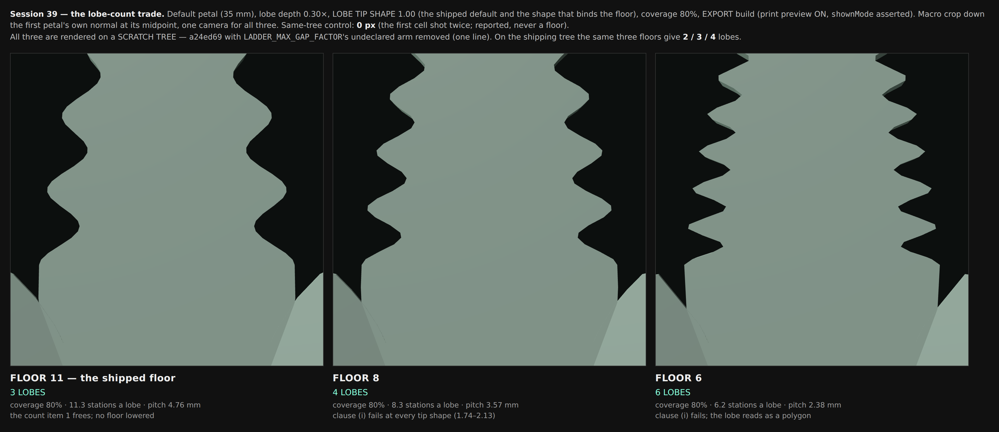

# Session 39 — the lobe-count ceiling: is 1.40 a real number?

Discovery. **Nothing in `bloom-geometry.js`, `bloom-registry.js`, `bloom.js` or any
gate was changed.** What ships here is one measurement tool, one image and this
document. The base is `a24ed69` (`main`, after #211, #212 and #210).

Instrument: `node tools/bloom-ladder-gap-bound.mjs` (~45 s, no browser). It writes a
one-line variant of `bloom-geometry.js` to a temp directory — the mutant tables' own
mechanism — with `LADDER_MAX_GAP_FACTOR` raised so the arm cannot bind, leaves the
buckle arm of the same `min` untouched, and runs **both trees' own** `petalSurface` /
`widthProfile` / `bladeStations` over the live matrix. Nothing is re-implemented; the
chord error is the shipped `sagittaOf` over the builder's own stations.

**NAME THE MODE AND THE SAMPLING.** Every figure below is taken in LIVE and EXPORT
separately and says which. The sampling is the **first slot of layer 0** of each of the
666 live matrix rows (the sagitta instrument's own scope — a multi-layer row's inner
whorls are not measured here), 1,332 row-modes, **0 skipped**, and the sagitta is over
the builder's own 56 stations.

---

## 1. `LADDER_MAX_GAP_FACTOR = 1.4` IS TYPED

Not derived from a physical length, not derived from a row count standing for one. A
bare ratio with no owner. Five lines, every one of them checkable from the tree —
`tools/bloom-ladder-gap-bound.mjs` prints §1c, §1d and §1e; §1a is a `grep` and §1b is
two paragraphs of one comment.

### 1a. There is no derivation anywhere, and its own commit does not mention it

`grep` over the whole tree finds the constant in five places: its definition
(`bloom-geometry.js:3100`, bare, no comment of its own), the one function that reads it,
two prose mentions in comments, one mutant anchor, and **one line in one doc**
(`docs/bloom-session-38-outcome.md:669`, which treats it as a given while proposing to
raise it). The session-32 outcome doc — the session that introduced it — **never names
it at all**, and neither does the commit that added it (`175d001`), whose own summary
describes the shipped function as

> `ladderGapFactor(f)` is `NU / (BAR * f)`, which is EXACTLY 1 at f 7, i.e. uniform.

— with no `min`, no second arm and no 1.4.

### 1b. Its only quantitative justification is the WITHDRAWN figure, 59 lines below its own withdrawal

`bladeStations()`' header says (line 3084):

> THE WIDEST GAP IS BOUNDED at LADDER_MAX_GAP_FACTOR / NU. This is NOT a quality lever —
> **measured, it costs the apex nothing at all (0.1025 mm with the bound and without)**

`0.1025 mm` is the figure the SAME comment block withdraws by name at line 3017:

> NAME THE MODE. An earlier draft of this comment quoted `0.2423 -> 0.1025 mm, 2.36x`
> and attributed it to this sweep. That figure was LIVE mode, measured on a scratch
> re-implementation … and it does not reproduce here.

So the bound's one number is a live, scratch-tree figure, quoted with no mode named, in
the paragraph 59 lines below the paragraph that retracts it — the withdrawal and the
surviving use are in **one comment block**. By the header's own count that makes this the
sixth instance of the project's mode-conflation class.

### 1c. The paragraph describes a bound that did not ship — measured

The same paragraph says *"At the frequency cap the minimum falls 8.00 -> 5.71 with this
bound (4.73 without)"*. `8 / 1.4 = 5.714`, so that sentence is about a tree where the
1.40 arm applied at the buckle's frequency ceiling. It does not, and has not since the
commit that introduced it: `ladderGapFactor(7)` returns exactly **1**.

Measured on the shipped code, EXPORT, `buckleAmp` 0.30, default petal — minimum local
rows-per-cycle at the ladder's widest gap:

| f | declared bound | shipped | the 1.40 arm removed | the bar |
|---|---|---|---|---|
| 3 | 1.4000 | 13.33 | 13.10 | 8 |
| 5 | 1.4000 | 8.24 | 8.24 | 8 |
| 6 | 1.1667 | 8.00 | 8.00 | 8 |
| **7** | **1.0000** | **8.00** | **8.00** | 8 |

### 1d. Removing it takes NO buckled row below the buckle's own bar

The decisive test, over the whole matrix: if the arm is the buckle's protection, removing
it must starve some buckled row. **68 buckled row-modes; minimum local rows-per-cycle
8.00 with the arm and 8.00 without; 0 below the bar.** The buckle's requirement is
`NU / (BUCKLE_ROWS_PER_CYCLE_MIN · f)` — the exact restatement of "no local
rows-per-cycle below the bar" — and it is already the other arm of the same `min`. The
1.40 arm can only bind where the buckle does not ask for it: **f ≤ 4, and f = 0, which
is every plain petal and every lobed one.**

### 1e. The arithmetic coincidence, recorded and dismissed

`56 / (8 × 5) === 1.4` **to the bit** — the constant is numerically identical to the
buckle's own bound evaluated at f = 5. No comment, commit or doc claims that. Even if it
was meant as that, holding a bound at its f = 5 value for every lower frequency and for
no buckle at all is an extension, not a derivation: at f ≤ 4 the buckle's own requirement
is looser, and at f = 0 there is no buckle.

### 1f. What it stands for, and why no single ratio can be it

A widest-gap bound states *"no region of the blade may be sampled below this density"*.
That is a per-FEATURE statement, and the generator has exactly two features that declare
a sampling bar: the buckle (`BUCKLE_ROWS_PER_CYCLE_MIN` rows per cycle) and the lobes
(`LOBE_SAMPLES_PER_LOBE` stations per period). Both are stated in their own terms
elsewhere — the buckle in the other arm of this very `min`, the lobes in the demand the
ladder satisfies inside the window. **On a plain, unbuckled, unlobed petal no feature
declares a bar, so the derived bound is: none.**

And a FACTOR cannot stand for a length in any case: `1.4 / NU` in `u` is 0.875 mm on a
35 mm petal, 1.071 mm on a 60 mm one and 0.357 mm on a 20 mm one. A constant standing
for a physical length would be written in millimetres and the factor derived from it —
the project's own durable rule.

**The constant is doing two different jobs through one name**, and neither is a global
ratio:

* **Job A — the blend in `bladeStations`.** Bound the plain ladder's widest gap. No
  feature behind it; §2 measures what it does.
* **Job B — `ladderOutsideMinima` → `capRows`.** Reserve rows outside a lobe window.
  This is the **only** thing deciding how many lobes the rim carries; §3 measures it.
  It has no derivation at all today — the reserve is `ceil(region / gap)` with a typed
  gap.

---

## 2. WHAT JOB A DOES: it moves quality at random, and is worst where Eva's range is highest

Over 1,332 row-modes the arm **constrains 197** (135 of them plain) — those are the
row-modes whose unbounded ladder would exceed the cap. **157 row-modes end up sitting at
their declared bound** (within 1e-5 of it, as a multiple of uniform; the same rows
§B10.7 named — `petalWidth` min, `petalTipShape` 0.60 and 3.00, `buckleAmp` max, the
rose), and 34 are driven all the way to uniform instead by §4's collapse. The worst
unbounded gap anywhere is 3.555 × uniform. §B10.7's own figure was 348 of 1,226 on
session 38's tree; it is not comparable — 613 rows against 666, and measured before
#210's seam floor existed.

**It changes a sagitta zone on 199 row-modes: worse on 103, better on 87.** That is
noise in both directions, which is the signature of a constant serving no measured
property. The worst degradations, in mm of outline chord error:

| Δ apex | with the arm | without | ratio | mode | row |
|---|---|---|---|---|---|
| +0.1510 | 0.1624 | 0.0113 | 14.3× | live | `TIP SHAPE: 3.00 x the longest, widest petal (60 x 30)` |
| +0.1373 | 0.1644 | 0.0271 | 6.1× | live | `LOBES: x petalTipShape 3.00` |
| **+0.1251** | **0.1341** | **0.0090** | **14.9×** | **export** | `TIP SHAPE: 3.00 x the longest, widest petal (60 x 30)` |
| +0.0958 | 0.1153 | 0.0195 | 5.9× | export | `LOBES: x petalTipShape 3.00` |
| +0.0731 | 0.0868 | 0.0137 | 6.3× | live | `petalTipShape max (3)` |

So *"it costs the apex nothing at all"* is **false on this tree**, and it is falsest at
`petalTipShape` 3.00 — the ceiling of the range Eva ruled reachable, the held-width round
tip. On the SHIPPING DEFAULT the arm is inert: the plain default's widest gap is 1.295 ×
uniform, under the cap, and the ladder is bit-identical at every factor from 1.4 to 1e9.

---

## 3. WHAT JOB B DOES: it is the only thing capping the lobe count, and the ceiling is THREE

The count cap is `floor(ladderWindowCapacity / LOBE_SAMPLES_PER_LOBE)`, and the capacity
is `(NU − HELD_ROWS) − ceil(stretch/gap) − ceil(tip/gap)` = **40 free rows less the
reserve**. The reserve is the only term the constant touches.

Default petal, EXPORT, lobe depth 0.30×, asking 10 lobes:

| coverage | reserve at 1.40 (stretch+tip) | capacity | built | reserve with the arm removed | capacity | built |
|---|---|---|---|---|---|---|
| 0.10 | 19+8 | 13 | 1 | 1+1 | 38 | 1 (pitch floor) |
| 0.40 | 13+8 | 19 | **1** | 1+1 | 38 | **3** |
| 0.80 (default) | 5+8 | 27 | **2** | 1+1 | 38 | **3** |
| 1.00 | 1+8 | 31 | **2** | 1+1 | 38 | **3** |

Over the matrix: **30 of 66 lobed row-modes build more lobes without the arm** (1 → 2 and
2 → 3).

**THREE IS THE CEILING AT FLOOR 11, WHATEVER THE BOUND.** `NU − HELD_ROWS = 40`; the two
outside regions cannot take less than one station each; `floor(38 / 11) = 3`. A fourth
lobe is arithmetically unreachable at the shipped floor — it is not the bound that stops
it. Correspondingly at floor 8 the ceiling is 4 and at floor 6 it is 6.

**And the built sampling stays at the floor.** At three lobes on the default petal the
ladder places 34 stations in the window — **11.33 per lobe**, above the demand of 33. So
the third lobe is bought without dropping below the floor.

### 3a. What it costs, in millimetres

Default petal, lobe depth 0.30×, coverage 0.80, apex chord error:

| | lobes | EXPORT apex | LIVE apex |
|---|---|---|---|
| plain petal, no lobes (reference) | 0 | 0.1054 | 0.0352 |
| shipped arm, 1.40 | 2 | 0.1716 | 0.0778 |
| arm removed | **3** | **0.1808** | **0.1328** |

**+0.0092 mm in EXPORT and +0.0550 mm in LIVE.** The export figure is under a tenth of a
layer height; the live one is about half. Note that the shipped two-lobe state already
costs the apex 0.066 mm (EXPORT) against the plain petal, so the reserve is not holding
the apex at the plain petal's quality today either.

### 3b. Removing the arm entirely is NOT free, and this is the one measured cost

With the arm gone the reserve falls to one station per outside region, and at low
coverage the mass split then gives the tip cap only 3 stations against 10:

| coverage 0.40, 3 lobes vs 1 | EXPORT apex | LIVE apex |
|---|---|---|
| shipped arm (1 lobe) | 0.1681 | 0.0712 |
| arm removed (3 lobes) | 0.1771 | **0.2462** |

That is a real LIVE regression, and it is the reserve's problem rather than the arm's:
**`ladderOutsideMinima` needs an owner of its own.** The honest quantity for it is the
tip cap's own chord error in mm, not a ratio shared with a bound that has nothing to do
with it. That is a scheduled change, not this session's.

---

## 4. A DEFECT FOUND BY THE RIG: the seam floor discards the ladder

`bladeStations`' own widest-gap test opens with the leading gap:

```js
const widest = (r) => { let m = r[0]; for (let i = 1; i < NU; i++) m = Math.max(m, r[i] - r[i - 1]); return m; };
```

`r[0]` is the offset from the seam to the FIRST BLADE ROW — `mUsed / NU`, placed by the
clearance law and pinned by A7. The blend **cannot move it**: `mix()` keeps every held
row by construction (and says so, for the bit-identity reason). So wherever the seam
floor binds (`seamStep ≥ 2`, i.e. `r[0] ≥ 2/NU > 1.4/NU`), `widest(mix(l)) > cap` for
**every** blend, the bisection converges to `lo = 0`, and the ladder is thrown away: the
blade is placed **exactly uniformly**.

The harness's own A8 already ruled that this gap is not the ladder's —

> it is no longer this family's either: the offset from the seam to the first row is
> placed by the clearance law and PINNED by A7 … Counting a structural offset as
> redistribution would fire this family on a gap it does not govern.

— and the geometry's `widest()` was not given the same clause. **Two owners of one
predicate, drifted; §9b(i) of the seam doc, in the same function.**

**Measured, layer 0 only:** 36 row-modes have `seamStep ≥ 2`; **34 of them place the
blade exactly uniformly** (max deviation from the even ladder over `[u0, 1]`
**0.00e+0**). A further 12 are uniform at the buckle's frequency ceiling, which is
uniform **by design**. Only 2 seam-shifted row-modes keep a real ladder.

Confirmed as the cause, not inferred: a variant whose `widest()` starts at `0` instead of
`r[0]` restores a real ladder on exactly those rows and is **bit-identical where the seam
floor does not bind**:

| state (EXPORT) | shipped: deviation from uniform / widest / apex sagitta | leading gap excluded |
|---|---|---|
| default (seamStep 1) | 7.91e-2 / 1.295 / 0.1054 | 7.91e-2 / 1.295 / **0.1054** (identical) |
| `tilt 75 × length 20 × sheet 2.4` (seamStep 4) | **0.00e+0** / 1.000 / 0.1229 | 7.81e-2 / 1.207 / **0.0966** |
| the incurve target (seamStep 2) | **0.00e+0** / 1.000 / 0.1244 | 7.28e-2 / 1.287 / **0.1011** |

The rows affected are Eva's own headline family — `DOME: the INCURVE TARGET` flat and at
rise 0.5, the CURL bias/start rows over it, the SPHERE incurve rows, `STAMENS`/`GYNOECIUM`
GATED under it. On those the redistribution session 32 built is simply not running, and
in EXPORT it costs 0.0660 mm of apex chord error against 0.0041 mm with the ladder
(16×).

**NOT FIXED HERE.** It is a one-line change, but it moves bytes on at least 18 rows
(more once inner whorls are counted — this sweep reads layer 0 only), so it owes a
predeclared partition, a frozen-phase re-measure and a full CI cycle. That is a session,
not a footnote. Recorded, not built.

---

## 5. IS THE FLOOR OF 11 RIGHT?

**Its STRUCTURE is derived and sound. Its LEVEL rests on a typed 10% band tolerance, and
the floor moves roughly as 1/√t.**

Clause (i) — *a broad feature is drawn as a bend only when the polyline has at least two
segments inside it; with one it is a corner, whatever the law says* — is a genuine
derivation from the geometry of a polyline, and the threshold **2** is not a tolerance.
What is typed is the BAND: *"where the cut is within **a tenth** of its extreme"*
(`Math.pow(0.1, 1/(2q))`, `Math.pow(0.9, 1/(2q))`). The band width sets the floor, and
for q = 1 it scales as √t.

Measured with `tools/bloom-lobe-resolution.mjs`'s own arithmetic, the band tolerance
exposed as the only change:

| band tolerance | crest/sinus bands (q 0.50 / 1.00 / 2.00) | floor (ladder) | floor (uniform) | lobes at capacity 38 |
|---|---|---|---|---|
| 0.05 | 0.032/0.202 0.144/0.144 0.314/0.102 | 15 | 14 | 2 |
| 0.075 | 0.048/0.248 0.177/0.177 0.351/0.125 | 13 | 12 | 2 |
| **0.10 (shipped)** | 0.064/0.287 0.205/0.205 0.380/0.145 | **11** | 10 | **3** |
| 0.15 | 0.096/0.353 0.253/0.253 0.428/0.180 | 9 | 8 | 4 |
| 0.20 | 0.128/0.410 0.295/0.295 0.466/0.211 | 8 | 7 | 4 |
| 0.25 | 0.161/0.460 0.333/0.333 0.500/0.239 | 7 | 7 | 5 |
| 0.30 | 0.194/0.506 0.369/0.369 0.530/0.265 | 6 | 6 | 6 |

The lobe session's own rendered ladder — *11 round, 10 the same picture as 11, 8 faceted,
6 polygonal, 4 a staircase* — sits beside this: **the eye stops reporting a difference
about where t = 0.15–0.20 puts the floor (9 or 8).** So 11 is not wrong; it is the value
of a sound criterion at a typed tolerance, and the tolerance is the thing Eva is really
ruling on. **It was not lowered here.**

### 5a. The floor's MODEL is not the ladder, and on the builder's own stations the default shape falls 3.5% short at three lobes

The floor was derived on one lobe period placed in isolation by a model of the ladder's
measure. Applying clause (i) to the **builder's own emitted stations** (phase recovered
from the builder's own `halfWidthAt` / `halfWidthBaseAt`, no proxy, no re-implemented arc
table), coverage 0.80, EXPORT:

| tip shape | lobes | stations a lobe | clause (i) on the real stations |
|---|---|---|---|
| 0.50 | 2 (shipped) | 12.50 | 2.97 ✓ |
| 1.00 | 2 (shipped) | 13.50 | 2.58 ✓ |
| 2.00 | 2 (shipped) | 14.00 | 4.94 ✓ |
| 0.50 | 3 (arm removed) | 11.33 | 2.59 ✓ |
| **1.00** | **3** | **11.33** | **1.93 ✗** |
| 2.00 | 3 | 11.33 | 2.13 ✓ |

The three lobes get **12 / 11 / 11** stations and the topmost reads 1.93 against the
bar of 2 — 3.5% short:

```
lobe 0 : 12 stations | widest gap meeting the sinus band 0.0913 -> clause (i) 2.25
lobe 1 : 11 stations | widest gap meeting the sinus band 0.0968 -> clause (i) 2.12
lobe 2 : 11 stations | widest gap meeting the sinus band 0.1062 -> clause (i) 1.93
```

**The criterion is per PERIOD and the demand is a WINDOW TOTAL.** `count × 11` rows in
the window is an average; under a uniform ladder an average is a spacing, under this one
it is not. **This project's first durable rule, arriving inside the lobe feature's own
demand** — a count standing for a spacing. Stating the demand per lobe would want 3 × 12
= 36 rows, still inside the capacity of 38, so it does not by itself close the third lobe
off. Reported, not fixed.

---

## 6. THE IMAGE — the trade, three cells



`docs/img/lobe-count-trade.png`. Default petal (35 mm), lobe depth 0.30×, LOBE TIP SHAPE
1.00 (the shipped default and the shape that binds the floor), coverage 80%, **EXPORT
build with print preview ON and `shownMode` asserted**, one camera for all three, macro
crop down the first petal's own normal at its midpoint. **Same-tree control 0 px** (the
first cell shot twice; reported, never a floor).

| cell | floor | lobes | stations a lobe | pitch |
|---|---|---|---|---|
| left | **11 — the shipped floor** | **3** | 11.33 | 4.76 mm |
| middle | 8 | 4 | 8.3 | 3.57 mm |
| right | 6 | 6 | 6.2 | 2.38 mm |

**Which images are new and which are reused: all three cells are NEW.** The lobe
session's `floor-08-*` and `floor-06-*` cells are at TWO lobes — they answer "what does a
lobe drawn at n stations look like", not "what does the count that floor buys look like",
and the brief's cells are labelled by count. `trip-q100` (two lobes, floor 11, the
shipping tree) is unchanged and is still today's cell; it was re-rendered only to prove
the rig and is byte-for-byte the same configuration as session 38's.

All three cells are rendered on a **SCRATCH TREE** — `a24ed69` with
`LADDER_MAX_GAP_FACTOR`'s undeclared arm removed, one line, reverted immediately after —
because the count in the left cell is not reachable on the shipping tree. On the shipping
tree the same three floors give **2 / 3 / 4** lobes (rendered, and the cells agree
cell-for-cell with the capacity arithmetic above).

Read: at floor 11 the three lobes are drawn as curves; at floor 8 every crest is a run of
flats and the shoulders are chords; at floor 6 the lobe is a polygon.

---

## 7. THE PARKED APEX JOIN — this work DOES change what is true about it

The brief parked the apex join at `lobeTipShape` 0.50 and said to stop if this session
changed what is true about it. It does. The join's corner is the pointed law's own crest
derivative, `π · depth · h / pitch`, so it grows as the pitch shrinks — and a third lobe
shrinks the pitch from 7.14 mm to 4.76 mm. Measured on the outline's one-sided slopes
either side of `u1 = uCap`, EXPORT:

| | lobes | pitch | slope below `u1` | slope above | turn at the join |
|---|---|---|---|---|---|
| shipped | 2 | 7.14 mm | +0.349 | −0.374 | **39.7°** |
| arm removed | 3 | 4.76 mm | +0.710 | −0.374 | **55.9°** |

At tip shape 1.00 and 2.00 the join stays tangent-continuous (−0.0°) at both counts. So
**freeing the third lobe makes the parked defect sharper at one end of the lobe tip-shape
range and touches nothing at the other two.** Reported; not fixed, as instructed.

---

## 8. WHAT WAS NOT DONE, and why

* **`LADDER_MAX_GAP_FACTOR` was not changed.** Changing it changes the built lobe count —
  a capability change, Eva's to rule — and it moves bytes on ~197 row-modes, makes
  several block-29 row labels false (they name the capacities), and owes a predeclared
  partition plus a frozen-phase re-measure and a full CI cycle.
* **`LOBE_SAMPLES_PER_LOBE` was not lowered.** §5 says what it rests on; the trade is on
  the image.
* **The seam collapse (§4) was not fixed**, for the same byte-partition reason.
* **The reserve was not given its own owner** (§3b). It is the real derivation that is
  missing, and it is bigger than one constant.
* **No gate was run.** Nothing shipped that any gate covers: the geometry, the registry,
  the app and every harness are byte-identical to `a24ed69`. The one new file is a
  measurement tool, which triggers the two FLOWER gates through their `'tools/**'` filter
  — they test flower geometry and are not evidence about anything here.

## 9. Ball

**WAITING ON EVA** — see the report.
