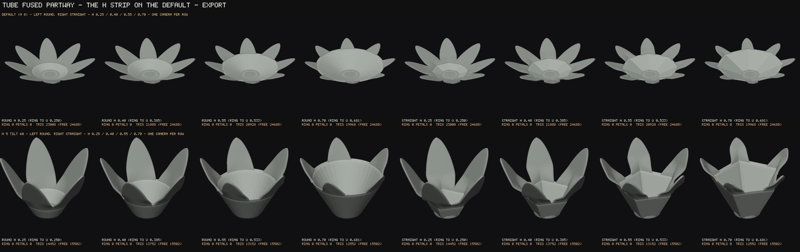
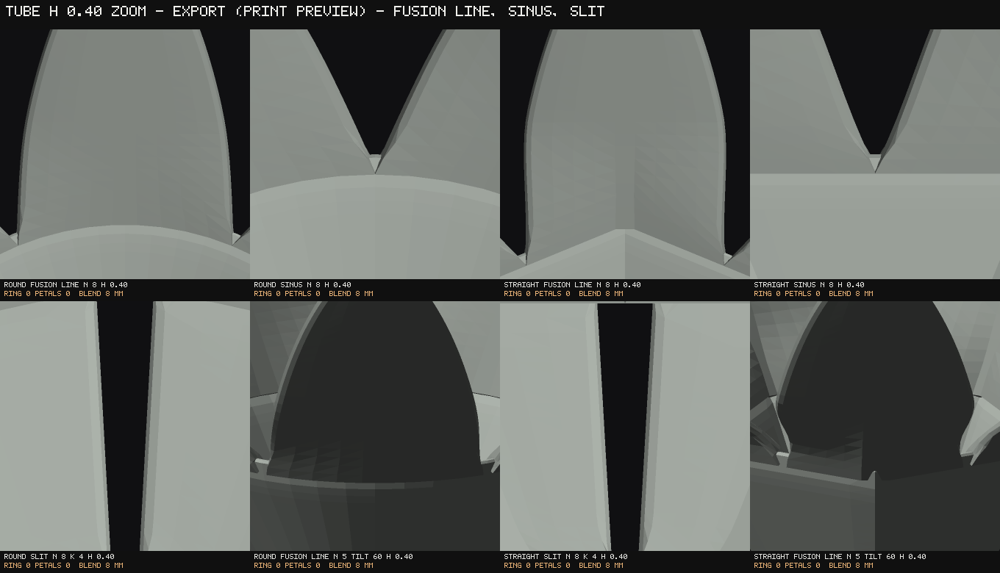
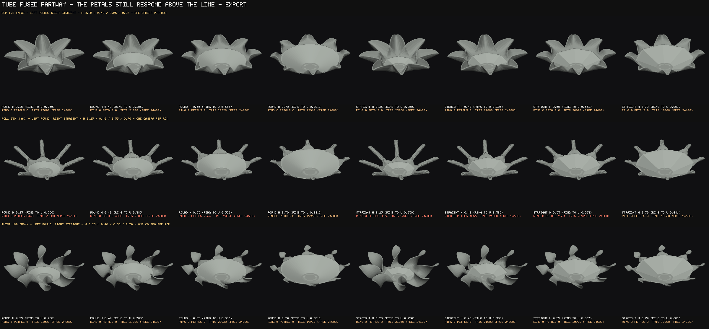
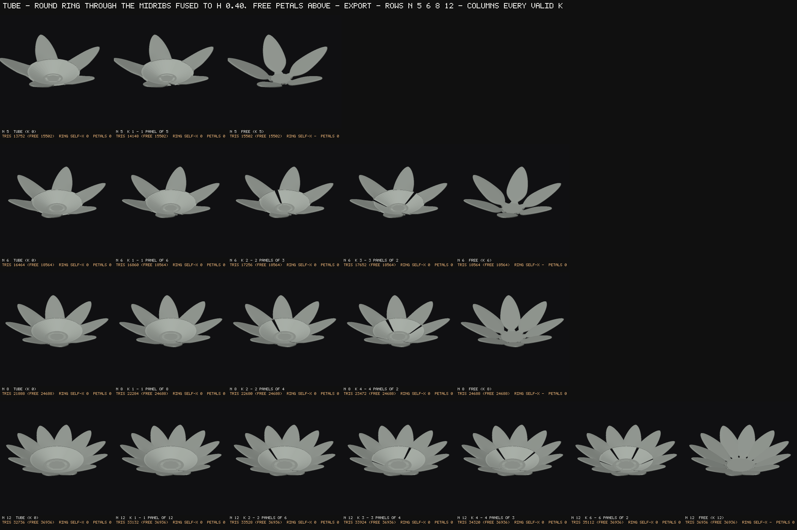
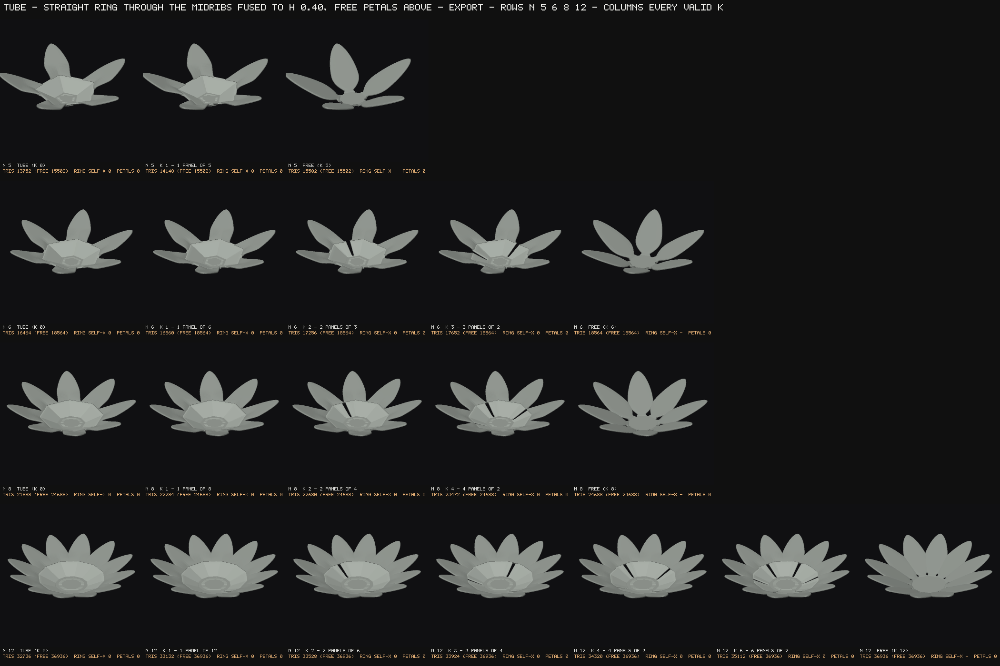
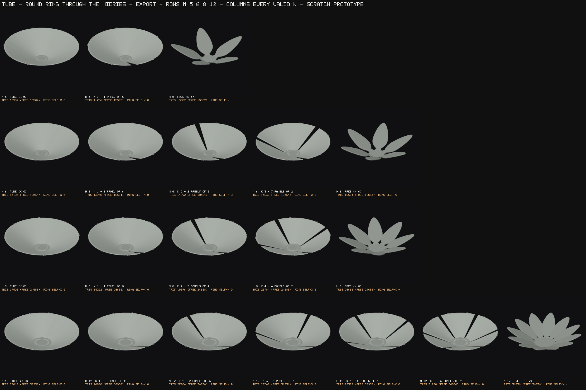
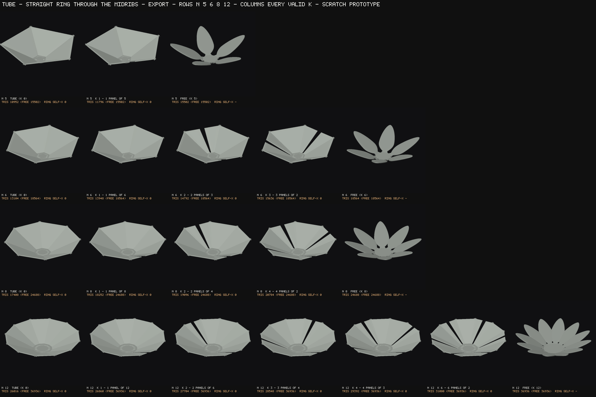
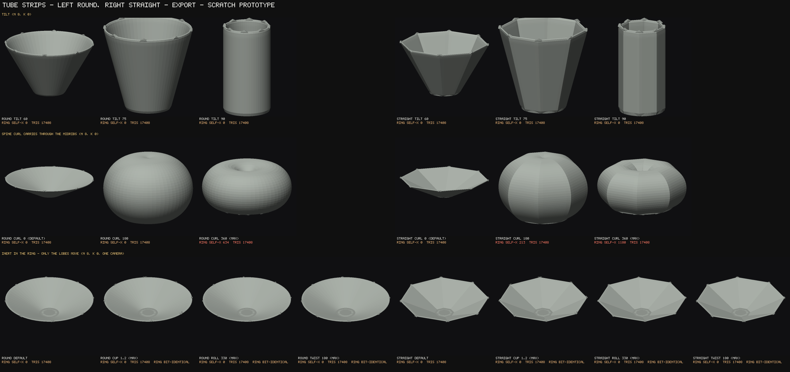
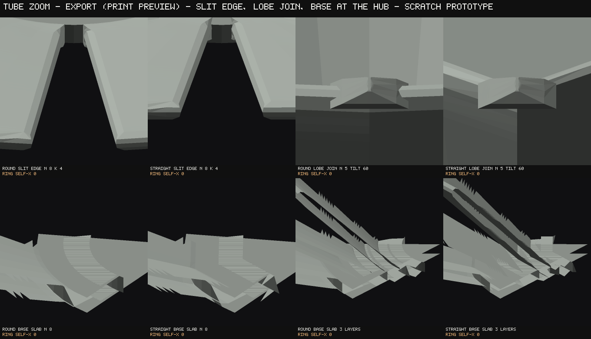
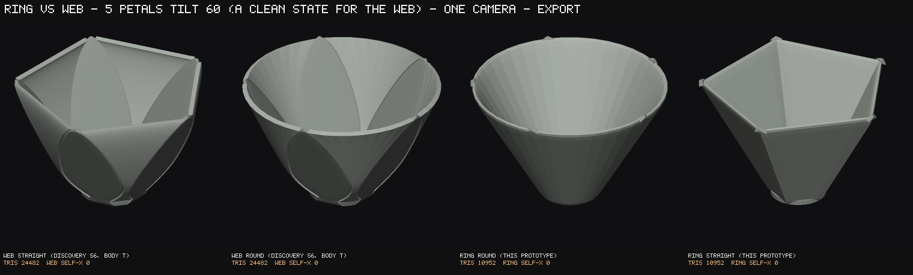

# Parametric Bloom — TUBE: the closed-ring prototype

*Oct 1, 2026. Base `main` at `da8bf62` (#322 merged). **A prototype only. Nothing that ships moved.**
**Part C (on top) is the current round; Parts B and A follow it.**
Every tracked file was sha256-recorded before the first edit and every one is identical at close
(§9); the work is two new tools, this doc and five images. Every figure is **EXPORT** mode (print
preview: the floored sheet, the 0.80 mm tip floor), RADIAL placement, read on **every row of the
petals' own ladder** (3 foot rows + 56 blade rows at `NU` 56), unless a line says otherwise.
Reproduce with `node tools/bloom-tube-ring.mjs` (216 builds, ~8 min; `--attribute` for the fold
table, `--control` for the five must-fails) and `node tools/shot-bloom-tube.mjs <dir>` (the sheets).*

---

# PART C — ROUND, h 0.25, THE BLEND SLIDER, SLITS THAT KEEP THE PETAL EDGE (Eva's rulings on Part B)

*Same prototype rules. Every tracked file is sha256-identical to `da8bf62` at close (§C8). ROUND
only — STRAIGHT is dropped from every new sheet and from the sweep (the code path stays, unused).
EXPORT throughout. Reproduce with:*
- *`node tools/bloom-tube-ring.mjs --round2` — 141 builds, ~10 min;*
- *`node tools/shot-bloom-tube.mjs <dir>` — the four Part C sheets are now its default (~1 min).*

*Parts B and A below are the earlier rounds. Their findings stand where Part C does not say
otherwise.*

## C-RULED. Eva's rulings on Part C (Oct 1, after dragging the preview page)

- **BLEND default = 1.** Recorded as `RULED_BLEND` in `tools/bloom-tube-core.mjs`, and the preview
  page now opens at 1.
  - `buildTube`'s own default stays 0, so Parts A and B, and the BLEND 0 identity in §C0, still
    reproduce.
- **Slit edges approved.** An edge petal is one panel from the foot to the tip, with its outer half
  the petal's own section (§C4).
- **Still open:**
  - the notch's column cost (§C9 #3);
  - deleting STRAIGHT's code path (§C9 #4);
  - the mode-dependent notch (§C8b), which belongs to whoever builds this.

## C0. The answer

- **Neither STOP clause is met.**
  - **The slit edge halves do not fold.** At every slit of every n × k row (38 slit builds, 4 n,
    every valid k, BLEND 0 / 0.5 / 1, plus the 40 × 6 corner) the two edge petals read **0 pairs
    within either shell and 0 within their union**. What they do is SHINGLE — **182,990 pairs
    between the two shells, against 186,406 for today's same two petals** (−1.8%). On the
    default at k 2: 745 against 760.
  - **The flare moves nothing above h.** Every petal row above the ring's top is the same object
    it was at BLEND 0; the flare only moves where the lobe STARTS, below h. No free-petal
    before/after is owed, because there is no change to show.
- **The whole sweep** (141 builds, 129 with a ring) reads **0 boundary edges, 0 non-manifold, 0
  directed-edge mismatches, 0 inward shells and one connected piece on every build.**
  - **No petal ever reads more self-intersection pairs than today's same petal.**
  - Two rings fold, both at the same count at every BLEND: tilt 105 (318 pairs) and headRise 1
    (316 pairs). Both are Part B §B5 classes, untouched by this round.
- **BLEND 0 is the Part B build, float for float.** Measured with `Object.is` against
  `c4d845d`'s own builder: 18 states (k 0, the wedge slits and the ring to the nib) differ in 0 of
  up to 663,120 floats. Two more checks: the five must-fails (`--control`) fire at exactly their
  Part A counts, and the new slit edges are the only intended change at BLEND 0.
- **The ~90° joint Eva sees is two things, and neither is the petal's spine (§C1).**
  1. **The FLARE crease** — a groove plus a ledge where the petal's flat base wall sits on the
     ring's tapered top edge. At BLEND 1 it goes from **15.8° to 1.2°** on the default.
  2. **The NOTCH corner** — where a petal margin leaves the ring's top rim. It is **95.6° at
     h 0.25 and 111.5° at h 0.40**. At h 0.25 it is closed, so the notch is inert there by
     construction. Where it is open, the exterior turn at the hand-over goes **68.5° → 2.0°**
     (default, h 0.40) and **66.9° → 2.6°** (5 petals, h 0.40).

## C1. The flare, diagnosed before anything was built

Measured on the default at h 0.25, ROUND, k 0, on the EMITTED mesh. The instrument is
`fusionProfile()`: rays down the ring's own normal along petal 0's meridian, every 1/12 row; it
reports the top skin's height above the ring's mid-surface and the turn of the hit facet.

- **The mid-surface is smooth through the fusion line.**
  - Along the midrib there is no turn above 1° anywhere from u 0.018 through the blend, at
    h 0.25 or at h 0.40.
  - The only turn on the meridian is **25.0° at the ring row (u 0)**. That is the petal's own
    foot-to-blade turn, at the hub rim, 16 rows below h.
  - **So the hypothesis — "the petal's own foot-to-blade turn, made visible as a rim line" — is
    refused for the line at h.** The turn exists, and it is where the ring meets the hub.
- **What reads as a line at h is the ring's own free-rim treatment, left under the petal.**
  - The ring's top row is an exposed edge to `emitPanel`, so its top skin TAPERS over the last
    3 mm (RIM_TAPER_MM) and closes on the bead.
  - Under the petal the ring's top skin therefore falls **0.600 → 0.535 mm** over rows 11-14.
  - The petal's lobe then starts on row 15 with its flat base wall at full thickness, **0.608 mm,
    0.073 mm proud**.
  - Facets turn **12.3°** (row 14) and **15.8°** (row 15): a groove and a ledge within about
    0.6 mm.
  - The macro on `bloom-tube-c-zoom.png` marks it in red.
- **The ~90° is the in-surface corner.** Where petal 0's margin leaves the ring's top rim the angle
  is **95.6° at h 0.25 and 111.5° at h 0.40**. That corner is the NOTCH's (§C2), not the flare's.
- **Smoothing it changes nothing above h.** The fix is at the lobe's BASE, so no free petal
  moves. The spine is untouched.

## C2. BLEND — one slider, two joints, inert at 0 by branch

`buildTube(set, { blend })`, 0–1 (working name BLEND, design tier). The 8 mm cross-section blend
(BLEND_MM) stays fixed and internal.

### The FLARE

- **The rule.** The petal's lobe starts `round(BLEND × N_cov)` rows further down the ring, where
  the ring is still at full thickness. Below h every row is the ring's own section (w = 0).
  - So the ring's taper and bead are **buried inside the petal**.
  - The petal's base wall lands **flush** on a full-thickness ring.
- **N_cov** is the fewest extra rows that put RIM_TAPER_MM (3.0 mm) of midrib arc between the
  lobe's first row and the ring's top row. It is 4 rows on the default and 6–9 on inner whorls.
- **Floored at row 4 (FLARE_FLOOR_ROW).** Without the floor, inner whorls on six layers sank the
  lobe into the foot-to-blade seam and folded there: 4–8 pairs a petal on layers 3–5, rows 2–3,
  80 pairs on `layers 6`, 840 on 40 × 6. With the floor every one reads 0. An inner whorl whose
  ring is too short to bury the whole taper is reported (`flare a/b rows`), not folded.
- **Measured, the max facet turn along petal 0's meridian at BLEND 0 / 0.5 / 1:**

  | state | BLEND 0 | 0.5 | 1 |
  |---|---|---|---|
  | default | 15.8° | 2.5° | 1.2° |
  | 12 petals | 15.8° | 2.3° | 0.8° |
  | tilt 60 | 15.9° | 3.3° | 2.4° |
  | cup 1.2 | 15.9° | 2.6° | 1.2° |
  | cup −0.8 | 15.8° | 2.5° | 1.2° |
  | roll 330 | 15.8° | 2.5° | 1.2° |
  | width 30 | 15.8° | 2.6° | 2.4° |
  | length 20 | 20.2° | 3.2° | 0.0° |
  | curl −180 | 17.0° | 5.0° | 3.5° |
  | curl 270 | 19.3° | 6.5° | 6.5° |
  | twist 180 | 15.8° | 7.9° | 7.9° |
  | tilt 90 | 14.6° | 8.8° | 8.8° |

  - On the default the top skin reads **0.373–0.608 mm at BLEND 0** and **0.600–0.607 at
    BLEND 1**.
  - Where 0.5 and 1 read alike (twist, curl 270, tilt 90), what remains is the petal's own
    blend, not the rim.
  - **The instrument is blind on some rows, and says so.** On layers 3 / 6, tilt 75 × 5, tilt 105,
    curl 90 / 360 and headRise 1 the ray hits ANOTHER part in front first. The heights read
    7–23 mm there, the inner whorl or a curled neighbour. Those rows' turn figures are not about
    the joint and are not quoted.

### The NOTCH

- **The rule.** In an OPEN sinus, the ring's top rim is cut down into a U. The sinus is the arc of
  ring rim at the ring's top row between petal p's margin and petal p+1's, each laid on the ring
  by arc length exactly as the blend lays it.
- **The shape.**
  - Each corner is an arc of radius r, tangent to the petal margin at its own end on the rim, at
    the margin's measured LEAN β off the meridian. So the outline turns no corner at the
    hand-over.
  - The arc meets a flat bottom at depth r(1 − sin β).
  - **r = BLEND × W / cos β**, W the half-sinus: the radius scales with the slider and is capped
    by the room, so at BLEND 1 the two arcs meet at the sinus centre.
- **How it is drawn.** By lowering the ring's own rows in the sinus (no row crosses its
  neighbour), with COLS_PER_SINUS = 12 columns across each open sinus so the U is resolved.
- **A closed sinus (W ≤ 0) has no room: inert, by construction.** This is the default at h 0.25
  (sinus −1.61 mm, the petals overlapping at the ring's top edge — the look Eva chose).
- **A first cut was tangent to the MERIDIAN** and left a **21.5° kink** at the hand-over on the
  default at h 0.40, because the margin leans 21.5° off it. Tangency to the margin's own lean is
  what takes that to 2°.

**Where the notch engages (BLEND > 0), measured:**

| state | sinus | r at BLEND 1 | depth at BLEND 1 | exterior turn at the corner (BLEND 0 → 1) |
|---|---|---|---|---|
| default, h 0.25 | −1.61 mm | inert | — | — |
| default, h 0.40 | 0.61 mm | 0.33 mm | 0.21 mm | 68.5° → 2.0° |
| 5 petals, h 0.40 | 8.22 mm | 4.47 mm | 2.71 mm | 66.9° → 2.6° |
| 3 layers, h 0.40 (layer 0) | 4.06 mm | 2.14 mm | 1.46 mm | 71.5° → 2.1° |
| 5 petals, h 0.25 | 3.98 mm | 2.01 mm | 1.72 mm | 81.6° → 0.1° |
| 6 petals, h 0.25 | 1.55 mm | 0.78 mm | 0.68 mm | 82.7° → 0.4° |
| 3 / 6 layers, h 0.25 (layer 0) | 1.84 / 3.74 mm | 0.92 / 1.87 mm | 0.91 / 1.90 mm | 89.2 / 91.0° → 1.6 / 2.0° |

- **On the default at h 0.40 the notch is real and small.** Its 0.33 mm radius is under the
  0.45 mm bead radius, so in print it reads as a softened corner rather than a visible scoop. The
  5-petal row is on the BLEND strip as the case where the U can be seen.
- In slit mode the notch runs only on a panel's INTERIOR sinuses. A slit has no rim corner —
  the edge petals are their own surface there (§C4).

## C3. Cost (EXPORT triangles; FREE = today's bloom)

| state | BLEND 0 | BLEND 0.5 | BLEND 1 | FREE |
|---|---|---|---|---|
| default, h 0.25 | 23,008 (−1,680) | 23,840 (−848) | 24,672 (−16) | 24,688 |
| default, h 0.40 | 21,888 | 31,744 (+7,056) | 32,576 (+7,888) | 24,688 |
| 5 petals, h 0.40 | 13,752 | 19,912 | 20,432 (+4,930) | 15,502 |
| 3 layers, h 0.25 | 68,800 | 91,584 | 95,328 (+21,648) | 73,680 |
| 6 layers, h 0.25 | 138,688 | 172,448 | 180,768 (+33,600) | 147,168 |
| 40 × 6, h 0.25, k 0 | — | — | 782,112 (+47,040) | 735,072 |

- **The flare costs triangles in proportion to the rows it adds:** 52 a petal per row at 8
  petals. It exactly gives back what the shorter ring saved, so BLEND 1 on the default is 16
  triangles short of FREE.
- **The notch's cost is its columns.** COLS_PER_SINUS adds 12 columns per open sinus across
  every ring row (+7,000 on the default at h 0.40, where the U is 0.33 mm). A coarser U (6
  columns) would halve it. That is a knob, not a ruling.
- **Slits at BLEND 0, h 0.25:**
  - 8 petals: k 1 / 2 / 4 = 24,504 / 26,000 / 28,992.
  - 12 petals, k 6: 43,392 (+6,456).
  - An edge petal is one panel from the foot to the tip, so a slit costs the edge petal's own
    lower rows plus the ring panel's overlap.

## C4. The slits keep the original petal edge

- **The construction (Eva's ruling).** Each panel's ring runs from its first petal's midrib to its
  last, plus SLIT_OVERLAP_MM (1.0 mm) past each.
  - **An edge petal is ONE panel from the foot (row 0) to the tip.**
  - Its OUTER half (midrib → free margin) is the petal's own section at every row, the same
    function today's petal draws. It carries the owner's edge profile (`emitPanel`, called, never
    copied).
  - Its INNER half rides the ring (w = 0 below h) and blends above it like every other petal.
  - The two halves meet at the midrib, where both are the midrib point (the ring passes through
    it exactly).
- **There is no wedge cut anywhere.** The wedge construction stays behind `slits: 'wedge'` and
  reproduces Part B to the float.
- **The shingle, n × every valid k, h 0.25, BLEND 0 (pairs between the two edge shells, ours
  against today's same two petals):**
  - n 5 k 1: 314 / 326.
  - n 6 k 1 / 2 / 3: 334 / 338, 380 / 384, 426 / 430.
  - n 8 k 1 / 2 / 4: 511 / 526, 745 / 760, 1,213 / 1,228.
  - n 12 k 1 / 2 / 3 / 4 / 6: 926 / 942, 1,595 / 1,614, 2,264 / 2,286, 2,933 / 2,958,
    4,271 / 4,302.
  - Identical at BLEND 0.5 and 1.
  - **Within either edge shell: 0 on every row.**
  - The small deficit against today's figure is the inner half riding the ring instead of
    its own section below h.
- **These are overlaps between two separate closed shells — the export contract's own "the
  slicer unions them".** They are counted, not folded. They are the same crossing band the
  discovery measured on today's petals.

## C5. Sheets (`node tools/shot-bloom-tube.mjs <dir>`)

Every sheet: EXPORT (print preview), a fixed camera per row, no rotation, no chrome, ROUND only.

- **`docs/img/bloom-tube-c-grid.png`** — n 5 / 6 / 8 / 12 × every valid k at h 0.25, BLEND 0, the
  new slit edges.
- **`docs/img/bloom-tube-c-blend.png`** — BLEND 0 / 0.5 / 1, whole and macro, on the default at
  h 0.25, the default at h 0.40, and 5 petals at h 0.40 (where the U can be seen). Every macro
  caption carries the flare rows, the join turn and the notch's radius, depth and corner turn,
  or why it is inert.
- **`docs/img/bloom-tube-c-zoom.png`** —
  - the flare on petal 0, BLEND 0 with the crease marked in red, and BLEND 1 on the same camera
    with the same line in teal;
  - the measured top-skin profile along the meridian and half-way to the next petal (BLEND 0 /
    0.5 / 1);
  - the notch at 5 petals h 0.40 (BLEND 0, 1) and on the default h 0.40 (BLEND 1, a 2.5 mm
    frame);
  - a slit edge low down (n 8 k 4, ring row 6), with the shingle count in the caption.
- **`docs/img/bloom-tube-c-form.png`** — cup 1.2, roll 330, twist 180 at h 0.25, BLEND 0.5,
  beside the default, whole and macro.
  - The roll row reads its petals' own **8,448 pairs, against today's 13,584** — the Part B §B5
    class, lower than today, not this round's.

**One render-only adjustment, stated.** A flared lobe lies ON the ring at full thickness by
design, so the two shells share a surface and the z-buffer drew a sawtooth. On the Part C cells
the ring's triangles are pushed 0.02–0.05 mm away from the camera for the picture only. The
geometry is untouched.

## C6. Instrument checks

- **`--control`** fires all five must-fails at their Part A counts (39,559 / 10 / 1 / 3 / 32,453).
- **The flare instrument's own control is BLEND 0.** It reads the 15.8° crease and the 0.373 mm
  groove there, and BLEND 1 removes them on the same camera and the same rays.
- **The slit-fold check is the census itself**, per shell. The shingle count reproduces today's
  figure for today's petals, measured through the same function.
- **The census was shown able to fire on this round's own geometry.** Before the seam floor, the
  flare on inner whorls read 4–8 pairs a petal at rows 2–3.
- **A first slit cut emitted the edge's outer half as a SECOND panel to the tip.** Its tip apex
  welded to the lobe's, giving 20 non-manifold edges and 2,802 "within" pairs that were really two
  coincident panels. One panel per edge petal fixed both.

## C7. Defaults that are Claude's, flagged

| default | value | what it decides |
|---|---|---|
| FLARE_FLOOR_ROW | 4 | the lowest row a flared lobe may start on |
| COLS_PER_SINUS | 12 | columns across an open sinus when the notch is drawn |
| SLIT_OVERLAP_MM | 1.0 | how far the ring panel runs past an edge midrib |
| notch depth ramp | linear over the ring's rows above the ring row | how the cut is spread down the ring |
| margin lean β | measured from the first row above h, averaged over the sinus's two sides | the angle the U meets each petal edge at |

## C8. Close

- **What was touched:** `tools/bloom-tube-ring.mjs`, `tools/bloom-tube-core.mjs`, `tools/shot-bloom-tube.mjs`,
  `tools/tube-preview.html`, this doc and five images. No patch to the shipped geometry was added this round.
- **Branch and PR:** `claude/youthful-ride-azrkiy`, draft PR #323 against `main`.
- **Merge:** nothing merged, nothing pushed to `main`.

## C8b. The preview page (`tools/tube-preview.html`) — drag it

**A throwaway page, not linked from anywhere, `noindex`.** It loads the bloom's default design and
builds through the SAME patched geometry the sheets and the sweep use, ROUND only.

**How it reaches the builder.**
- The build moved into `tools/bloom-tube-core.mjs`, which has no `node:` import.
  `tools/bloom-tube-ring.mjs` now imports it and supplies the Node loader (a temp file). The page
  supplies a Blob URL.
- **The split is float-identical**, measured under `Object.is` against the pre-split builder on
  eight states: BLEND, slits, live mode, three layers and the ring to the nib.
- `--control` still fires all five must-fails, and the form sheet re-renders byte-identical.

**Controls:**
- TUBE, stepped over the valid k for the current petal count, labelled TUBE … FREE.
- fusion height h, 0.10–0.70.
- BLEND, 0–1.
- Petal count, cup, roll, twist and spine curl, with the registry's own ranges.
- An orbit camera and a print-preview toggle.

**The readout:** the mode, the triangle count against FREE, the built k, and a SNAP line when a
petal-count change leaves the asked k invalid. It also shows the ring's top row, the flare rows,
and the sinus with the notch's state.

**Display-only choices, stated:**
- three's `toCreasedNormals` in both modes, not `bloom.js`'s export-normal path.
- The ring is drawn with a polygon offset, so a petal lying ON it does not z-fight.

**Verified locally** in headless Chromium, with three served from `node_modules`:
- 0 page errors.
- Each control fired its own rebuild: TUBE, h, BLEND, petal count, cup, roll, twist, curl and the
  print-preview box.
- The mesh changed on every one of them except print preview at these settings (see below).
- The snap fired on 8 → 6 petals with K 4 asked: K 3 was built and the readout says so.
- Build time is 0.25–1.0 s per rebuild.
- The defaults screenshot is `docs/img/bloom-tube-preview.png`.

**Noted, not fixed (Eva's instruction):**
- **Print preview changes nothing at the default sheet.** Live and export are float-identical on
  the default and on a stressed form state. The difference appears only below a 1.0 mm sheet, which
  is not on the panel.
- **The notch's existence is MODE-DEPENDENT at a thin sheet.**
  - At `sheetThickness` 0.6, k 2, h 0.40, BLEND 1, the sinus reads **−1.424 mm LIVE (notch
    inert, 27,168 tris)** and **+0.005 mm EXPORT (notch drawn, 33,936 tris)**.
  - Which geometry exists then differs between the two modes. That is the class this project
    refuses in shipped code.
  - The sinus is measured on the mode's own margins. A mode-free measure, or a union over both
    modes as the sphere-stem omission does, would fix it. It is the prototype's, recorded for the
    build session.

## C9. Questions for Eva (batched; the first two are the ones asked)

1. **Does the BLEND strip read right, and which value should be the default?**
   - **Claude would suggest 1.** The flare's crease is 15.8° at 0, 2.5° at 0.5 and 1.2° at 1. It
     costs no triangles against FREE on the default, and the notch is inert at h 0.25.
   - 0.5 leaves half the taper exposed and buys nothing in return.
2. **Do the slit edges now look like real petal edges?** See the slit cell on the zoom sheet and
   the k columns of the grid. The edge halves are today's petal surfaces from the foot to the tip,
   shingling 1.8% less than today's.
3. **Is the notch's 12 columns per sinus worth its cost?** It costs +7,000 triangles on the
   default at h 0.40 for a 0.33 mm U that the bead nearly hides. Options: 6 columns, or no notch
   below a minimum sinus (e.g. 1 mm). A floor would be a typed threshold.
4. **Should STRAIGHT's code path be deleted from the scratch builder**, or kept for Part A/B
   reproduction? Kept for now.

---

# PART B — FUSED PARTWAY, FREE PETALS ABOVE (Eva's rulings on #323)

*Same prototype rules: a scratch builder, and every tracked file sha256-identical to `da8bf62` at
close (§B9). EXPORT throughout. Reproduce with:*
- *`node tools/bloom-tube-ring.mjs --partial` — 244 builds, ~12 min;*
- *`node tools/shot-bloom-tube.mjs <dir>` — the five partial-fusion sheets are now its default.*

*Part A below is the first round (the ring to the nib entry). Its findings stand where Part B does
not say otherwise.*

## B0. The answer

- **The STOP clause is not met.** The transition is fold-free on the default at h = 0.40 at
  **every** blend length tried (0.5, 1, 2, 4, 8, 12 and 16 mm), in both shapes.
- **Over the whole partial-fusion sweep** (244 builds, 240 with a ring): **0 boundary edges, 0
  directed-edge mismatches, 0 inward shells, one connected piece on every build.**
- **191 are fully clean**, ring and transition both. The rest fall into four attributed classes
  (§B5).
- **Partial fusion moves the curl axis fold out of the ring entirely for ROUND** — ring 0 pairs at
  curl 180, 270 and 360, at every h. **But under strong curl it lands in the blend instead** once h
  sits where the midrib is already curling toward the axis (§B6).
- **It costs fewer triangles than today at every state measured** — −2,800 at the default h = 0.40
  (§B7).
- **ROUND is clean everywhere except the inherited seam class and that curl case. STRAIGHT adds its
  crease class to the transition**, which ROUND never shows.



## B1. What was built

- **`buildTube(set, { h, blendMm })`.** The ring is unchanged in construction (Part A §2: through
  every midrib, ROUND or STRAIGHT, wedge slits, C = 8, the owner's `emitPanel` with the periodic
  arm). It ends at **the last row at or below u = h**.
- **Above it, every petal is today's petal.** The lobe hook (patch P3) hands `emitPanel` the
  petal's own rows, from one row below the ring's top (`PANEL_OVERLAP_ROWS`) to the tip. So above
  the blend the row objects are today's own, untouched.
- **Above the blend the petal is today's petal, bit for bit.** On the default at h = 0.40, 1,346 of
  petal 0's 1,960 emitted triangles are exactly today's. The rest are the blend rows, plus the 3 mm
  rim taper that ramps up from any panel's base end (`emitPanel`'s own ramp).
- **The extra build.** The tool now builds every state once more to collect every petal's rows, so
  the ring's curve exists at every row before any petal is drawn.

## B2. The fusion line — the blend law, and its one owner

Over `BLEND_MM` of **midrib arc length above the ring's top row**, each petal row's section is

```
theta(v) = theta_mid + v * s_half(+/-) / rho_mid     (the petal's own width laid onto the ring by ARC LENGTH)
P(v)     = R(theta(v)) + w * (own(v) - R(theta(v)))
n(v)     = normalise((1 - w) * Rn(theta(v)) + w * n_own(v))
w        = smootherstep(s / BLEND_MM)                (s = midrib arc above the ring's top row; C2 at both ends)
```

- `R` / `Rn` are the ring's own curve and unit normal at that row: the same `ringCurve`, the same
  `du × dv` and the same global sign the ring's panels are built from.
- `own` is the petal's own section, i.e. `petalSurface().rowAt(u).sect`.
- **At the ring's top row (and the overlap row below it) w = 0, so the petal IS the ring there.**
  The midrib point is the same double on both sides.
- **The owner of the line where the petal's base meets the ring's top is the ring's cross-section
  at its top row** (`ringCurve(mids, R1)`). The petal reads it; nothing else defines that line.
- **Above `s = BLEND_MM`, w = 1** and the row is today's.
- **There is no jump at h**, by construction. Position and normal are continuous, and the weight is
  C2.

**THE BLEND LENGTH IS 8 mm, AND IT IS A TRADE.** Transition pairs summed over all eight petals,
ROUND, h = 0.40:

| state | today's petals | 2 mm | 4 mm | **8 mm** | 12 mm | 16 mm |
|---|---|---|---|---|---|---|
| default, cup ±max, twist 180, tilt 75, tilt 75 × 5, curl 180, curl 225 | 0 | 0 | 0 | **0** | 0 | 0 |
| roll 330 | 13,584 | 8,440 | 7,464 | **4,808** | 3,520 | 2,080 |
| curl 270 | 0 | 328 | 136 | **0** | 0 | 0 |
| curl 360 | 920 | 872 | 712 | **248** | 240 | 792 |
| curl 270 at h 0.55 | 0 | 968 | 760 | **280** | 536 | 1,808 |
| curl 360 at h 0.70 | 920 | 3,232 | 3,984 | **4,224** | 4,304 | 4,392 |
| STRAIGHT, 6 layers | 0 | 555 | 1,237 | **5,139** | 8,122 | 9,284 |

- **8 mm is ROUND's best or tied-best on five of the six rows that move.** It is the prototype's
  default: `BLEND_MM`, overridable with `TUBE_BLEND`.
- **STRAIGHT wants it short**, because its crease is carried through every blended row (§B5,
  class C).
- **Roll, attributed by row.** Above the blend the roll fold is today's own, to ±5 pairs: petal 0
  reads 353 ours against 353 today above an 8 mm blend.
- **Inside the blend the transition carries fewer pairs than today's petal does on the same rows**:
  248 against 813 at 8 mm, 243 against 481 at 4 mm. Only a 1 mm blend adds any: 255 against 238 on
  its three rows.



**What the zoom shows.**
- Each petal widens out of the ring's rim, and the sinus is a V meeting the rim's bead.
- **A faint line reads across the petal base at the fusion row**, most visibly at tilt 60. Over the
  blend's first rows the ring's top rows and the petal's base rows are the **same surface in two
  closed shells**: a coincident overlap, which the export contract unions. It is not a fold (0
  pairs), and it was not measured further.

## B3. The crossing band (discovery: u 0.161–0.323 on the default)

ROUND; STRAIGHT is within 0.04 mm. "Crossed rows" uses discovery §2a's plan gap, computed on the
petals' own margins row by row from the ring's top up.

| h | ring top u | sinus at the ring's top | crossed rows above h: ours / today | ring / transition pairs |
|---|---|---|---|---|
| 0.10 (below the band) | 0.089 | **+1.67 mm** | 11 (u 0.143–0.323) / 10 | 0 / 0 |
| 0.15 (at its foot) | 0.143 | −0.25 mm | 11 / 10 | 0 / 0 |
| 0.25 (inside) | 0.250 | **−1.61 mm** | 6 (u 0.250–0.343) / 5 | 0 / 0 |
| 0.30 (inside) | 0.286 | −1.40 mm | 4 / 3 | 0 / 0 |
| 0.40 (above) | 0.385 | **+0.61 mm** | **0 / 0** | 0 / 0 |
| 0.55 | 0.533 | +5.36 mm | 0 / 0 | 0 / 0 |
| 0.70 | 0.681 | +11.17 mm | 0 / 0 | 0 / 0 |

- **Below the band**, the free petals above cross exactly as they do today. The rows are today's
  rows, and the margins pass inside each other buried in the sheet, as the builder's own flag
  already reports on every build.
- **Inside the band**, the ring absorbs the part below h. **The petals overlap each other at the
  ring's top edge** (negative sinus: no V opens between them), and the rest of the band crosses as
  today.
- **Somewhere between h 0.30 and 0.40 (not resolved finer), the crossing stops**: from h 0.40
  up nothing crosses and every sinus opens.
- **The one extra crossed row is always inside the blend.** Laying the petal's width onto the ring
  by arc length spreads it slightly further round than the flat petal reaches, so the band's edge
  moves by one row (0.343 instead of 0.323). It is a buried cross-shell overlap between neighbouring
  petals, not a fold. At a 4 mm blend it does not appear (h 0.25: 5 rows on both).
- **None of this is a regression**: these are cross-shell overlaps between separate closed petals,
  allowed by the export contract and already present today.

## B4. The petals still respond above the line

`img/bloom-tube-partial-form.png`: the h strip at cup 1.2, roll 330 and twist 180 (maxima), in both
shapes. Cup, roll and twist act fully above the line — the rows above the blend are today's own. The
ring itself stays bit-identical under all three (Part A §5).



## B5. Everything that folds, attributed

**A. The seam turn past ~95°** — inherited, independent of h.
- Tilt 105 (ring 318 / 272 pairs) and `headRise` 1 (316 / 269), at row 3 (u 0.018), at every h.
- The free bloom folds there too: today's petals 384 / 248.
- And the transition reads 0, because the folding rows are now ring.

**B. Strong curl in the blend** (§B6). This is the one way ROUND transitions fold beyond today's
petals.

**C. STRAIGHT's crease off a column** — Part A §3's mechanism, now in two places:
- **The ring's slit panels**: 6 layers k 2, 681 pairs; 40 × 6 k 2 / k 20, 140 / 1,840 pairs.
- **The transition**: STRAIGHT 6 layers, 4,104–7,743 pairs across h; 40 × 6, 3,288; 3 layers at h
  0.7, 789; length 20 at h 0.7, 253. Today's petals read 0 on all of these.
- The blended section carries the ring's crease at v = 0, and **the petal's own 10 columns put no
  column on v = 0**, so the crease always lands between columns.
- **ROUND reads 0 on every one of these states.**

**D. Roll ±330** — today's own declared petal fold, carried and **reduced** (13,584 → 4,808 at h
0.40; 0 at h 0.70). §B2 attributes it row by row.

## B6. Curl: does stopping the ring lower move the axis fold?

**Yes for the ring, no for the petals at high h.**

| curl | ROUND ring, h 0.25 / 0.40 / 0.55 / 0.70 | transition, same h | today's petals |
|---|---|---|---|
| 180 | 0 / 0 / 0 / 0 | 0 / 0 / 0 / 0 | 0 |
| 270 | 0 / 0 / 0 / 0 | 0 / 0 / **280 / 9,000** | 0 |
| 360 | 0 / 0 / 0 / 0 | 0 / 248 / **1,456 / 4,224** | 920 |

- **In Part A the ring folded from curl ~180 because the midribs reach the axis near the tip.** A
  ring that stops at h ≤ 0.70 never reaches those rows, so **the ring's axis fold is gone for ROUND
  at every h**. STRAIGHT keeps 250 pairs at curl 360, h 0.70.
- **Where it goes instead: into the blend, if h sits where the midrib is already curling inward.**
  Every pair of curl 270 at h 0.70 lies on the blend's rows (located at a 4 mm blend: rows 35–38,
  0 above the blend; the midrib radius there falls to 0.15 mm).
- **The arc-length mapping is the reason.** The petal's width laid onto a ring of tiny radius wraps
  round the axis, so the section folds through itself.
- **Low h is safe at every curl.** At h 0.25 the transition is clean at every curl. At h 0.40 it
  is clean through curl 270, and curl 360 reads 248, a quarter of today's 920.

## B7. Cost (EXPORT triangles)

| state | today | h 0.25 | h 0.40 | h 0.55 | h 0.70 |
|---|---|---|---|---|---|
| **default (8 petals), k 0** | 24,688 | 23,008 (−1,680) | **21,888 (−2,800)** | 20,928 (−3,760) | 19,968 (−4,720) |
| 5 petals, k 0 | 15,502 | 14,452 | 13,752 | 13,152 | 12,552 |
| 12 petals, k 0 | 36,936 | 34,416 | 32,736 | 31,296 | 29,856 |
| 8 × 3 layers | 73,680 | 68,800 | 65,280 | 62,400 | 59,360 |
| 8 × 6 layers | 147,168 | 138,688 | 131,328 | 124,928 | 118,048 |
| 40 × 6 layers (densest) | 735,072 | — | 655,872 (k 0) · 660,432 (k 2) · 701,472 (k 20) | — | — |

- The ring replaces the bottom h of every blade with a cheaper sheet: **lower h saves less**.
- **Each slit adds 396 triangles** at h 0.40: two bead runs, half Part A's 844, because the ring is
  shorter.
- ROUND and STRAIGHT are identical to the triangle.

## B8. The sheets

| file | what it shows |
|---|---|
| `img/bloom-tube-partial-h.png` | h 0.25 / 0.40 / 0.55 / 0.70 on the default and on 5 petals at tilt 60, ROUND then STRAIGHT, one camera per row |
| `img/bloom-tube-partial-form.png` | the same strip at cup 1.2, roll 330 and twist 180 |
| `img/bloom-tube-partial-round.png`, `img/bloom-tube-partial-straight.png` | the n × k grid at h 0.40 |
| `img/bloom-tube-partial-zoom.png` | the fusion line on one petal (n 8, and n 5 at tilt 60), a sinus, a slit |

- **Every caption carries the ring's and the petals' own self-intersection counts.**
- The renders are deterministic soft renders in EXPORT mode with a fixed camera and no chrome, so
  no pixel delta is quoted.
- **Facets are not visible at C = 8** on any of the sheets, so C stays.




## B9. Close

- All 691 tracked files at `da8bf62` are sha256-identical. The tools, the doc and the images are the
  only changes, and they are all additions to #323's branch.
- `--control` still fires all five must-fails (39,559 / 10 / 1 / 3 / 32,453).
- Fusion to the nib (no `h`) still builds Part A's default to the triangle (17,408).

## B10. Questions for Eva (batched; the first two are the ones asked)

1. **Which h should be the default?**
   - **0.40 is the lowest ruled value that is fully clean on the default.** Above the crossing band,
     no petal crosses its neighbour, every sinus opens (+0.61 mm), the blend is clean at every
     length, and the transition is clean through curl 270. It costs −2,800 triangles.
   - **0.25 sits inside the band**: the petals overlap at the ring's top edge, so there is no V
     between them.
   - **0.55 / 0.70 read as a deeper cup**, and fold in the blend under strong curl.
   - The look is yours: see `bloom-tube-partial-h.png`.
2. **ROUND or STRAIGHT?**
   - **ROUND** is clean everywhere except the inherited seam class and strong curl at high h.
   - **STRAIGHT** adds the crease class in both the slit ring and the transition. Fixing it means
     changing `emitPanel`'s rim inset to keep knot columns, and putting a petal column on v = 0.
     It also still thins to 0.97 mm at 5 petals.
3. **The curl-at-high-h case.** Pick one:
   - accept it, declared;
   - clamp h below where the midrib turns inward (a derived bound — the meridian's own minimum
     radius is the measure);
   - cap the arc-length mapping's angle at the sector.
4. **The blend length.** Should it stay a typed 8 mm, or be derived, e.g. from the petal's width at
   h? It is the one new constant here.
5. **The coincident overlap at the fusion line** (ring top rows and petal base rows, one surface in
   two shells). Acceptable as unioned overlap, or should the ring's top rows under each petal be
   trimmed?

WAITING ON EVA (default fusion height + ROUND or STRAIGHT).

---

# PART A — FUSED TO THE NIB (the first round)


## 0. The answer

**Neither STOP clause is met.** On the shipped default the ring has **0 within-shell
self-intersection pairs in both ROUND and STRAIGHT at every valid k**, and its lower edge sits
**inside the hub on every layer of every state measured** — it is built from the petals' own foot
rows, so no new plumbing was needed. Over 204 ring builds: **0 boundary edges, 0 directed-edge
mismatches, 0 degenerate triangles, one connected piece every time.** 157 are clean. The 47 that
fold fall into exactly three classes (§3), and only one of them is new: **when spine curl brings
the midribs to the axis (curl ≥ ~180), a sheet through every midrib has to pass through the axis.**
The free bloom is clean there today.

**The ring costs fewer triangles than the blades it replaces, on every state measured** (−4,550 at
5 petals, −7,280 at the default 8, −151,520 at 40 × 6 layers; §4).

**And the ring removes the petal from the picture.** It reads only the midribs, so the blade's
OUTLINE never appears in it, and cup, roll and twist are inert — the ring is **bit-identical** under
cup, roll and twist at maximum (§5). Width still reaches the ring, but only through the hub: the area
rule sizes the ring radius from the feet. The fused region runs to the nib entry
(u 0.9889 at the default), where the blade is only 1.6 mm wide. So the "lobes" are n small points on
a plain round or polygonal mouth. That is the look question this doc ends on (§8, Q3), and it comes
before ROUND vs STRAIGHT.



---

## 1. Premises checked

| premise | checked how | result |
|---|---|---|
| #322 merged; the discovery doc and its instrument are on `main` | `git log`, `ls` | `da8bf62`; both present |
| neighbouring margins cross on the default (u 0.161–0.323) | re-ran `node tools/bloom-fusion-margins.mjs` | **reproduces to the digit**: 10/56 rows, u 0.161–0.323, plan min −0.83 mm at u 0.232, live and export alike |
| the ring row's chord sits outside the hub (discovery §5) | the same run, plus this tool's hub test (§6) | reproduces (0.857 mm, `nnn`); **the ring does not stop there** — it continues down the feet |
| the nib entry is `tipCap.apex.xLawMm / drawnLengthMm` | read off every built petal | u 0.98892 at the default; the ring's last row is the last strictly below it (row 51 of 59) |
| "ring thickness = petal body thickness" | the ring's `tAt` is the petal's own per-row `tUsed` | 1.20 mm at the default sheet |
| `emitPanel` / `emitRimLoop` can be called as they stand | read the source | **No.** Neither is exported, `NV = 10` is a module constant, and there is no periodic panel. See §2 — the k = 0 case needs an owner change, and that is the main architectural finding. |

---

## 2. What was built, and how it reaches the owner without touching it

`tools/bloom-tube-ring.mjs` reads `bloom-geometry.js` **as text**, applies anchored patches (each
must match exactly once or the tool refuses — the mutant table's discipline), writes the result to a
temp file and imports that. The shipped file is never written.

| patch | what it does | why |
|---|---|---|
| P1 | `NV` becomes `let`, with `__tubeWithNV(n, f)` | the ring carries C × n columns (C = 8 per petal sector); every petal still builds at 10 |
| **P2** (six hunks) | `emitPanel` accepts `panel.periodic`: columns wrap, no side inset, and the rim is **two closed loops** (bottom, top) through the owner's own `rimProfile` + `emitRimLoop` | **a k = 0 tube cannot be expressed through the shipped `emitPanel`.** P2 is the exact delta it needs — about 15 lines. This is what a shipped TUBE costs `emitPanel` (the bell doc called it "the largest change to `emitPanel`"; measured, it is small). |
| P3 | `buildPetalInto` honours `cap.tubeLobe(rows)`: the blade is emitted as one panel from that row to the tip, and the rows are returned | the petal becomes its own lobe; the ring reads the petal's own sections |
| P4 | `emitPanel`, `rimProfile`, `emitRimLoop` exported | so the ring calls the owner |

**The edge profile is the owner's code, called and never copied**: taper, bead, K = 4, the 1.0 mm
floor, the inset bisection and the exposed-tip apex ring all run inside `emitPanel` itself. The
ring's bottom edge is buried (its first rows are the feet, u = 0) and gets the flat wall, exactly as
a petal's foot does. The top edge is exposed and gets the bead. Slit edges are panel margins and get
the bead.

**The ring's cross-section at row r** passes through the n midribs `tubeRows[r].sect(0).P` — the
petal's own section, the same double the petal draws its midrib through.
- **ROUND**: a periodic Catmull-Rom on (ρ, z) against azimuth; azimuth itself is exact.
- **STRAIGHT**: straight chords between consecutive midribs.

A column lands on every midrib. Residual against the midrib: **at most 1.1e-13 mm over all 204
builds** (it is not 0 because the azimuth goes through `atan2`). The normal is `du × dv` with **one
global sign** per ring, fixed at the ring row, where twist is exactly 0.

**The lobe join has one owner: the petal's own rows.** The lobe is the petal's panel from one row
below the ring's top (`PANEL_OVERLAP_ROWS`, the cleft/fringe precedent) to the tip, and its base
gets the flat-wall treatment `emitPanel` gives every buried panel end. The ring's top row meets that
same petal's midrib at the same double. The overlap is a by-design cross-shell overlap. Remove the
ring and the lobes detach — the flood fill reads 10 pieces (§7, control 2) — so the ring is what
holds them.

**Defaults this prototype set, not ruled** (flagged):

- C = 8 columns per petal sector.
- A slit is a **wedge** whose width is `MIN_FEATURE_MM` at the ring row's radius, so it opens
  toward the mouth (8.84 mm ring → 6.5°; about 4.5 mm wide at the mouth of the default).
- k = n builds today's FREE bloom through the shipped path, with no capability.
- Mixed per-layer k is refused, because the prototype passes one capability for all layers. The
  divisor list is shared by construction (`petalCount` is shared by every layer).

---

## 3. Self-intersection — the ring's own shells, each censused ALONE

`tools/bloom-self-intersection.mjs`'s `census`, the discovery's instrument. Cross-shell overlap with
the hub and the lobes is the export contract's own and is not counted.

**Clean (0 pairs) in BOTH shapes at EVERY k** on:
- petal counts 5, 6, 8 and 12 at the shipped form;
- tilt 60, 75 and 90 × 5, 8 and 12 petals;
- curl −180, −90 and 90;
- cup at its maximum and minimum, roll at ±330, twist at 90 and 180;
- width 30, length 20 and 60, sheet 2.4;
- tilt 75 combined with cup 1.2, with roll 330, and with curl −180;
- `headRise` 0.5;
- 2 and 3 layers, and ROUND at 6 layers;
- 40 × 6 layers ROUND;
- the ring run to the TIP.

The ring run to the tip is a control: the discovery's web folded at the apex nib on every state, and
the ring does not.

**The 47 folded builds, attributed** (`--attribute`: each pair's site mapped to the nearest meridian
row; the free bloom censused at the same state for comparison):

| class | states | ring pairs | where (row / u) | the meridian says | free bloom today |
|---|---|---|---|---|---|
| **A. seam turn past ~95°** — the petal's own declared EFFECTIVE TILT PAST 90 class | tilt 96–102; tilt 105 × 12; `headRise` 1 (turn 109°); innermost layer of tilt 75 × 12 × 3 layers (99°) | 269–478 | row 3, u 0.018–0.036, every pair | seam turn = 96–109° | **also folds** — 360 pairs at tilt 93, 392 at 96–102, 248 at `headRise` 1, 564 at tilt 75 × 12 × 3 |
| **B. the midribs reach the axis** — NEW | curl 180 (STRAIGHT only), curl 195–360, tilt 105 × 5/8, tilt 120, tilt 75 × curl 360 | 164 – 28,251 | the mouth / mid-blade, at the u where ρ is smallest | minimum midrib radius **0.01–0.26 mm**; curl 360 also returns to its own base (0.60 mm, under one sheet) | **clean at curl 180 and 270** (0 pairs); 920 at curl 360 |
| **C. a STRAIGHT crease off a column** | STRAIGHT with slits on the inner layers of a 6-layer bloom (k 2: 86 / 629 pairs on layers 4 / 5); 40 × 6 STRAIGHT k 2 / 20 (70 / 1,840) | 70 – 1,434 | **100% of pairs within 0.1 sector of a midrib crease** (median 0.002–0.012) | — | 0 |

**Onsets, at slider resolution** (n 8, k 0):
- **Curl**: clean to **165** in both shapes. **Folds from 180 in STRAIGHT** (213 pairs) and from
  **195 in ROUND** (15,541), as the minimum midrib radius falls 8.84 → 2.16 → 0.06 mm.
- **Tilt**: clean to **93**, folds from **96** (319 / 272 pairs) — after the free bloom, which
  already reads 360 pairs at 93.
- **Negative curl**: clean to −180 in both.

So class A is not the ring's fault, and the ring makes it no worse.

**Class B is a real limit of the construction, not a defect to tune.** A sheet through every
midrib must pass through the axis when the midribs converge on it. At curl 150–180 that closes the
corolla into a ball (`tube-strips.png`, row 2), and past it the sheet folds. It narrows the clean
curl range from today's (clean to 270) to 165 under a TUBE.

**Class C is STRAIGHT's own.** `emitPanel`'s rim inset re-spaces the skin columns uniformly in v.
Once an inset is applied (any slit panel), a crease no longer lands on a column, and the two skins'
offsets on either side of it cross on the inside of the corner. The evidence:
- k = 0 has no side inset and is clean;
- ROUND has no crease and is clean;
- doubling C makes it **worse** (layer-6 k 2: 629 → 845 pairs), because finer columns put samples
  closer to the crease.

A shipped STRAIGHT would need the inset to preserve knot columns, or a mitred crease — an owner
change either way. STRAIGHT also thins the wall at every crease to cos(π/n) of the sheet, derived
and not measured: **0.97 mm at n 5** (under the 1.0 mm floor), 1.04 at 6, 1.11 at 8, 1.16 at 12, on
the 1.2 mm sheet.

---

## 4. Cost — the ring minus the blades it replaces

EXPORT triangles. Each ROUND and STRAIGHT pair is identical to the triangle, by construction (same
lattice).

| state | FREE (today) | k = 0 (tube) | Δ | one slit | k = largest proper divisor |
|---|---|---|---|---|---|
| 5 petals | 15,502 | 10,952 | **−4,550** | 11,796 (−3,706) | — |
| 6 petals | 18,564 | 13,104 | −5,460 | 13,948 | k 3: 15,636 (−2,928) |
| **8 petals (default)** | **24,688** | **17,408** | **−7,280** | 18,252 | k 4: 20,784 (−3,904) |
| 12 petals | 36,936 | 26,016 | −10,920 | 26,860 | k 6: 31,080 (−5,856) |
| 8 × 2 layers | 49,184 | 35,040 | −14,144 | — | k 2: 38,416 |
| 8 × 3 layers | 73,680 | 53,152 | −20,528 | — | k 2: 58,120 |
| 8 × 6 layers | 147,168 | 116,864 | −30,304 | — | k 2: 125,648 |
| **40 × 6 layers (densest eligible)** | **735,072** | **583,552** | **−151,520** | — | k 2: 592,336 · k 20: 671,392 (−63,680) |

**Cost goes DOWN everywhere.** One ring of C = 8 columns per sector replaces n blades of 10 columns
plus n perimeter beads. Each slit adds two bead runs: **+844 triangles per slit** at the default
ladder, independent of n. The ring alone is 13,184 triangles at the default. `ALL MAX` is
FRINGE-carrying and is not eligible (discovery §8 Q6), so it does not move. At C = 8, the ROUND
mouth's chord sagitta at the default is ~0.12 mm at its widest — under print resolution — so C need
not rise.

---

## 5. Which controls the ring reads

- **Read** (through the midrib): tilt, length, spine curl and its bias / start, the dome, layers and
  the area rule.
- **Inert, measured — the ring's every float `Object.is`-identical to the default's**: cup at its
  maximum, roll at its maximum, twist at its maximum, in both shapes (`tube-strips.png`, row 3).
  These controls move only the lobes.
- **Width is NOT inert, and the first draft of this doc said it was.** Width 30 builds the
  default's triangle count exactly, but its ring is not bit-identical. Measured, it moves in two
  ways:
  - the hub's **ring radius goes 8.845 → 11.056 mm** (the area rule sizes the ring from the foot
    widths), so the whole ring sits on a larger base — up to 2.23 mm off the default's meridian;
  - the turning-rate ladder re-places the rows (max |Δu| 0.0068, top row u 0.9830 → 0.9858),
    because the stations are a function of the outline.

  What never reaches the ring is the blade's own cross-section width at any u. "The outline is
  inert" is true of the surface's SHAPE across a sector and false of where the ring stands.
  Taper and tip shape act through the same two routes and were not measured separately.

**Twist**: inert in the ring. Recorded because the first cut said otherwise. The ring had folded at
twist 90 and 180 (338–648 pairs, an inward shell), on a ring whose midribs had not moved — the
residual was identical to the default. The cause was the instrument's own orientation. Each point
had been aligned to the nearest petal's normal, and twist rotates that normal. One global sign
fixed it, and twist is 0 pairs now.

---

## 6. The hub

The ring's rows are the petals' own rows, so its first three are the **feet**: rows 0 and 1 run
inward under the hub, and row 2 is the ring row (u = 0). Each row's section was sampled at 96
azimuths and tested by ray parity against the hub, built alone with the shipped `buildHubInto`
(the discovery's §5 construction).

| state | row 0 (innermost foot) | row 1 | row 2 (ring row) |
|---|---|---|---|
| 5 / 8 / 12 petals | 95–96 / 96 inside | 95–96 | ROUND 23/96 · STRAIGHT 89–95/96 |
| `headRise` 0.5 / 1 | 96 / 96 | 95–96 (STRAIGHT at rise 1: 71) | ROUND 41 / 96 at 0.5, 96 at 1 |
| 3 layers, each layer | 95–96 / 96 | 95–96 | outer as above; inner 96/96 |
| 6 layers, each layer | 95–96 / 96 | 96 | outer as above; inner 96/96 |
| 40 × 6, each layer | 96 / 96 | 96 | outer ROUND 23 · STRAIGHT 75; inner 96 |

- **The lower edge — row 0 — is inside the hub on every layer of every state.** That is a different
  answer from the web's (discovery §5), whose edge stopped at the ring row and hung 0.55 mm outside
  the rim. The ring continues down the feet, as the petals do.
- **The ROUND ring row is a circle of exactly the ring radius at z = 0, which is the hub's rim**. So
  ray parity on a point on the boundary reads ambiguous (23/96 — a grazing tie, not "outside").
- **STRAIGHT's polygon dips inside the rim** between midribs.
- **The ring's foot rows lie coplanar with the hub slab**, as the petal feet already do (CLAUDE.md:
  "a foot's bottom skin is COPLANAR with the hub's underside").
- **Connectedness**: one piece on all 216 builds (the shipped gate's own voxel flood fill at 0.6 mm,
  sliced from `verify-bloom-connectedness.mjs`).
- **No new plumbing on any layer**, so STOP clause 2 is not met.

---

## 7. Instrument self-checks (`--control`, all five fire)

| must-fail | reads |
|---|---|
| census on a ring with two rows swapped (40% / 70%) | 39,559 pairs |
| flood fill on a ring lifted 40 mm | 10 pieces (the hub, the ring and 8 lobes: the lobes hang on the ring alone) |
| orientation on a ring wound inward | 1 inward shell |
| boundary census on a ring missing one triangle | 3 boundary edges |
| census on a folded STRAIGHT k 2 slit-panel set | 32,453 pairs |

Two of the stops were also confirmed with independent evidence:
- The pairs' rows (§3) and the free-bloom census at the same states were cross-checked.
- The discovery's own instrument reproduced its premise.

---

## 8. The sheets

- `img/bloom-tube-round.png` and `img/bloom-tube-straight.png`: rows n 5 / 6 / 8 / 12, columns
  every valid k. **Every caption carries the ring's own self-intersection count and the triangle
  count beside FREE.**
- `img/bloom-tube-strips.png`: tilt 60 / 75 / 90; curl 0 / 180 / 360 (the ball at 180 and the fold
  at 360); cup, roll and twist at maximum with "RING BIT-IDENTICAL" measured on the cell.
- `img/bloom-tube-zoom.png`: a slit edge (n 8, k 4), a lobe join (n 5, tilt 60), and the base as a
  3 mm cutaway slab about petal 0's meridian (one layer and three). Print preview on (EXPORT).
- `img/bloom-tube-vs-web.png`: the discovery's web (straight and round, body thickness) beside the
  ring (ROUND and STRAIGHT) on 5 petals at tilt 60 — the one clean state for the web — on one camera.

All are deterministic soft renders (`bloom-soft-render.mjs`) with a fixed camera, no rotation and
no page chrome, so no pixel delta is quoted.






**What the pictures say, plainly:**

1. **The petals are gone.** The web keeps each petal's oval visible on a corolla. The ring is a
   plain funnel (ROUND) or faceted pot (STRAIGHT) with n 1.6 mm points on the rim.
2. **STRAIGHT** reads as a polygonal cup with the midribs as ridges. **ROUND** reads as a
   morning-glory funnel without its lobes.
3. **Slits read as V-wedges** opening toward the mouth.
4. **Curl 180** closes the corolla into a ball.

---

## 9. Close — what was touched

All 691 tracked files at `da8bf62` were sha256-recorded before the first edit and **all 691 are
identical at close**. Added:
- `tools/bloom-tube-ring.mjs`
- `tools/shot-bloom-tube.mjs`
- this doc
- `docs/img/bloom-tube-{round,straight,strips,zoom,vs-web}.png`

Shipped geometry, registry, app, harness and gates are untouched; flower files are untouched. No
gate imports either new tool and no workflow names them. Note: the flower workflows are
path-filtered on `tools/**`, so they will run on this PR and test flower geometry only.

---

## 10. Questions for Eva (batched; the first two are the ones asked)

1. **ROUND or STRAIGHT?**
   - ROUND: clean everywhere outside classes A/B, costs nothing extra in `emitPanel`'s inset.
   - STRAIGHT: needs an owner change to the rim inset (class C) and thins to 0.97 mm at 5 petals.
2. **Ring or web?**
   - The ring: never crosses, is cheaper, and reaches the hub with no plumbing.
   - The web: keeps the petal shapes readable (`tube-vs-web.png`) but folds on the shipped default
     (discovery).
3. **The look the ruling implies: is a corolla with no visible petals what TUBE should make?**
   - With fusion to the nib entry, the blade outline never appears, cup, roll and twist are inert,
     and the lobes are 1.6 mm points. Width reaches the ring only through the hub radius.
   - A fusion fraction below the nib (e.g. to u 0.6, real petals above it) would bring the lobes
     back. It needs a lobe-base join that is wider than a nib, which this prototype did not build.
4. **Curl under a TUBE.** Class B narrows the clean curl range from 270 to 165. Options:
   - refuse (hide) TUBE above the onset, told;
   - clamp curl when TUBE < n;
   - accept the ball-closing look and declare the fold above it.
5. **The slit's shape.** The prototype's slit is a wedge, 1.0 mm at the ring row and opening toward
   the mouth. The alternative is a parallel 1.0 mm slot (wedge vs slot).
6. **Columns per sector** C = 8 (ROUND sagitta ≈ 0.12 mm at the default mouth) — keep, or derive
   from a chord bar?
7. **The `emitPanel` periodic arm (P2)** is the k = 0 owner change. Confirm it is acceptable as the
   route, rather than a separate ring emitter.

*Part A's questions 2, 3, 5, 6 and 7 were ruled on #323. Question 1 (ROUND or STRAIGHT) and
question 4 (curl) carry into Part B.*
