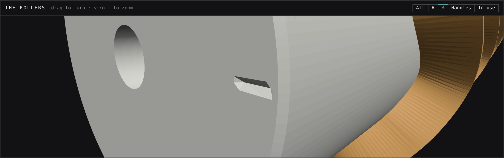
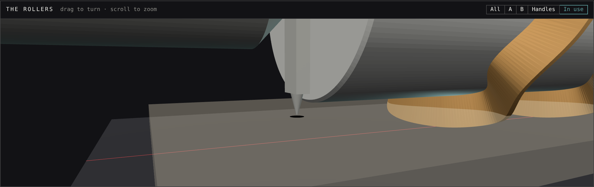
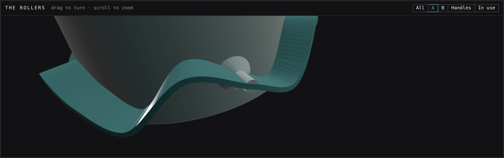

# Tessellation Rollers — design document (`/tile`)

Hidden page (`tile.html`, `tile.css`, `tile.js`, `tile-geometry.js`, `tile-roller.js`,
`tile-sim.js`; `noindex`, unlinked). A parametric tessellation designer whose output is a
**pair of 3D-printable cookie-cutter rollers plus their handles**: roll A
across a sheet of dough, roll B across it in the crossing direction, and the two families of
cut lines divide the sheet into identical interlocking cookies with no waste except the
sheet's border.

This document is the reference for every file above. §3 and §4 are the parts that decide
the physical object; read them before touching `tile-roller.js`.

---

## 0. Status

Phase 1 (this document's subject): the geometry, the manual editor, the 3×3 preview, the
print parameters, the guardrails, STL and SVG export, and the gates. Phase 2 (§10) is
**design only** — image → tile.

Locked decisions (from the brief, not re-opened here): two rollers, each a full cylinder
carrying ONE family of curvy blade lines; a lattice of translated copies of one four-cornered
tile with two shared edge curves (edge A top and bottom, edge B left and right); the crossing
angle between the two roll directions a parameter (default 90°); each circumference an
integer number of pattern repeats, the diameter derived and never set; overhangs and hooks
allowed, the only shape rule being a simple tile outline; registration done by the rollers
and handles alone, never a frame, jig, mat, bracket or square; removable handles.

**Eva's ruling on alignment (Oct 5) replaces the first ring version's index marks** — pegs
on A punching a dimple track, a toothed collar on B riding it — with her method: a
**start detent** on each roller (a notch in its end face, a spring tab on its handle that
clicks at the start of the tessellation), **fiducial pinholes** that roller A punches, and
**sight arms** on B's handles whose pointers are put on two of those pinholes. §4 derives
it, including θ ≠ 90°, and says where the physics forced it to differ from the brief. The
dimple track, the collar and the "seat a tooth" steps are gone. **If a test print shows B
drifting mid-roll, a continuous track can come back** — the old derivation is in this
file's history (§4 of the version merged as #354).

**Eva's ruling on the first version (held as PR #354): each blade is a closed wavy RING
running AROUND the circumference — a jagged pizza-wheel edge wrapped round the pin — and
each roller rolls along the direction of its own lines.** The first version laid the lines
lengthwise as crossbars and rolled each roller along the OTHER family's chord; §3 to §7, §9,
§11 and §12 are rederived for rings, and §3.1 says what the change costs.

---

## 1. The tiling

### 1.1 Four corners are a parallelogram — forced, not chosen

The tile's boundary runs C0 → C1 along **edge A** (the bottom), C1 → C2 along **edge B**
(the right), C2 → C3 along edge A again (the top, traversed backwards) and C3 → C0 along
edge B again (the left, backwards). The top is the bottom translated by some vector `v`, so
`C3 = C0 + v`, `C2 = C1 + v`; the left is the right translated by some `w`, so `C0 = C1 + w`,
`C3 = C2 + w`. Hence `C1 − C0 = C2 − C3` and `C3 − C0 = C2 − C1`: **the corners always form a
parallelogram**, with sides

    tA = C1 − C0   (edge A's chord, length = pitch A)
    tB = C3 − C0   (edge B's chord, length = pitch B)

and the tiling is the lattice `{ m·tA + k·tB }`. The **crossing angle θ** is the angle between
`tA` and `tB`. A free quadrilateral cannot tile by translation, so the editor never offers one.

### 1.2 One validity rule: the outline is simple

**If the closed outline is simple, its lattice translates tile the plane** — no gaps, no
overlaps — whatever the edges do, overhangs and hooks included. Two facts carry it:

* **The area is exact by identity.** By the shoelace integral, edge A's two traversals
  contribute `½(tA × tB)` together (everything but the translation term cancels) and edge B's
  two contribute the same, so the signed area of *any* such outline is `tA × tB`, the lattice
  cell's area — whatever shape the edges take. (The gate checks it to 1e-9.)
* **Degree.** The outline with opposite edges identified is a closed surface mapping onto the
  torus `ℝ²/lattice`; a simple outline makes that map degree one, i.e. a homeomorphism, i.e.
  a tiling. (Beauquier–Nivat: a polygon tiles by translation iff its boundary factors as
  `X·Y·X̂·Ŷ` or the hexagonal form; this is the square form.)

So the editor enforces exactly one rule — **the outline must stay simple** — and every edit
that would break it is **blocked**, never repaired (§2.4). Everything else about shape is a
*flag* (§7), not a refusal.

### 1.3 Corners are one point

All four corners are the same lattice point (`C1 = C0 + tA`, `C2 = C0 + tA + tB`,
`C3 = C0 + tB`). Four cookies meet at every corner. A corner's sharp/smooth setting is
therefore **one setting for the tile**, applied to both families of lines (§2.2).

---

## 2. The editor model

### 2.1 Lattice coordinates

Every edge point is stored in **lattice coordinates** `(u, v)`: the point is `C0 + u·tA + v·tB`.
Edge A's points have `u` running from 0 to 1 along the chord and `v` the offset off it; edge
B's the other way round. Consequences, all deliberate:

* **Edge A is stored once** and drawn twice (bottom, and top = bottom + `tB`); likewise edge B
  (left, and right = left + `tA`). An edit to either copy *is* an edit to the edge, so the shape
  always tessellates — there is no second copy to drift.
* **Pitch and angle changes are affine maps of the whole tile.** Resizing stretches the
  drawing with its box; changing θ shears it. An affine map preserves simplicity, so a pitch or
  angle change can never make the tile invalid. (The validator still runs after one, for the
  floating-point edge case, and blocks it if it ever fails.)

### 2.2 The curve law — reused from /bug

An edge is the chain *corner → interior control points → corner*. It is drawn with
**centripetal Catmull–Rom** (α = 0.5), `sampleOutline` imported from `bug-geometry.js` — the
same law /bug's wing editor uses, inherited there from the /dress curve editors. Centripetal
parameterisation has no cusps and no self-intersection within a segment.

**Sharp ↔ smooth**: each control point is smooth (the curve passes through it with a
continuous tangent) or sharp (a corner in the curve). A sharp point splits the chain into
independent runs; each run is sampled by `sampleOutline`, whose reflected phantom end points
make the run end tangent toward its own neighbour.

**The corner**: smooth by default. A smooth corner means each *line* (the chained copies of
an edge) passes through it with a continuous tangent: the run touching the corner is extended
by the **periodic neighbour** — the last interior point of the previous copy, `p_last − t` —
and the extra segment is trimmed after sampling. Centripetal CR's tangent at a point depends
only on that point and its two neighbours, so the copies on either side of the corner compute
the same tangent: the line is C1 there by construction. (The gate measures it the only way a
sampled curve allows: the turn between the last and first sampled segments at the corner falls
in proportion to the sampling — 6.83° at 20 samples a segment, 0.875° at 160, 7.8× for 8× — where
a sharp corner keeps its 52.9° at any sampling.)
A sharp corner uses reflected phantoms, so each line kinks there. The cookie itself always
has a corner at C0 (two different lines meet there); "smooth" is about each line.

### 2.3 Corners: drag to resize

The parallelogram has three shape degrees of freedom (`|tA|`, `|tB|`, θ). The four corner
handles **resize**: dragging a corner moves it under the pointer with the **opposite corner
fixed** and the edge directions kept, which sets both pitches. θ is owned by one control, the
**crossing angle** slider. (One owner per quantity: a corner drag that could also shear would
be a second owner of θ.) Pitches are clamped to 15–120 mm.

### 2.4 Edge points: add, move, delete, toggle — invalid edits are blocked

* **Click** on any copy of an edge → a point is added **on the curve**, at the click's nearest
  point (the click projected onto the drawn line, so adding a point does not move the line), into
  the control segment that point belongs to; it is selected and follows the pointer while the
  button is held.
* **Drag** any copy of a point → the point moves; the other copy follows.
* **Select + Delete/Backspace**, or **double-click** a point → it is removed. Corners cannot be
  deleted. (The double-click is detected on the second press, not by the browser's `dblclick`:
  every press redraws the editor, so the element a native double-click would name is gone.)
* **Sharp ↔ smooth** toggles the selected point (or, selected corner, the corner setting).

Every one of these goes through a function in `tile-geometry.js` (`movePoint`, `insertPoint`,
`deletePoint`, `togglePoint`, `resizeFromCorner`) that validates the outline that *would*
result and, if it would cross or touch itself, returns the tile **unchanged with the reason**.
The editor shows it ("Blocked: the outline would cross itself"). A slow drag toward a crossing
therefore stops at the last valid position — /bug's §5.3 rule, for the same reason: silently
reshaping what the hand is dragging is worse than refusing the step. Two control points closer
than 0.05 mm are also refused (the curve law divides by their distance).

---

## 3. The rollers

### 3.1 Which way each roller rolls — rings, by ruling

A roller stamps its **unrolled surface** onto the dough: rolling without slip, the surface
point at arc length `s` lands at `start + s·r̂` (`r̂` the roll direction) and its axial position
`z` lands at `z·â` (`â` the axis). Rolling direction does not change the stamp; only which way
round the roller is held does (flipping it end for end rotates the stamp 180°, §4.6). For a
roller to cut a family of lines, that family must be **periodic along the roll direction with a
period that divides the circumference**.

Each family is periodic under the whole lattice, so a roller could roll along either lattice
vector. The first version of this page rolled each roller along the OTHER family's chord, so
its lines ran lengthwise across it as crossbars. **Eva ruled that the wrong axis: each blade is a
closed wavy RING running around the circumference, and each roller rolls along the direction of
its own lines.**

| | **Rings** — roller A rolls along `tA` (ships) | Crossbars — roller A rolls along `tB` (retired) |
|---|---|---|
| period along the roll | `|tA|`, the roller's own pitch | `|tB|` |
| rolling support | continuous — every ring is a wheel at the tip radius | intermittent — it needed rims |
| cutting | progressive, pizza-wheel-like | a bar comes down, ravioli-roller-like |
| **printed upright** | **every ring is a fin standing straight out of the body: support under every ring** | every bar a near-vertical wall |

**What the ruling costs, said rather than hidden.** A roller is printed standing on its end, and
a ring blade is then a thin fin cantilevered `h` = 8 mm straight out of a vertical wall — a ~90°
overhang along its whole length. It prints with **support under every ring**; tree supports come
away most cleanly, and the rings are a pitch apart (40 mm on the default), so they can be reached.
(Printed on its side the rings would stand vertical, but the body's underside and the lower half
of every ring would overhang instead; on its end is still the better of the two.) The page's
how-to (its printing note) and the zip's README both say so. The old crossbar argument for
printability is recorded here as the price, not as a reason to go back.

So, with X a roller's own family and Y the other:

* **Roller A** carries the edge-A lines and **rolls along `tA`**; **roller B** carries the
  edge-B lines and **rolls along `tB`**. The angle between the two roll directions is θ.
* The **pattern period along the roll is the roller's own pitch**: an X-line repeats every
  `|tX|` along `tX`.
* **Circumference at the blade tip `C = n · |tX|`**, `n` = tiles round it (an integer); **tip
  radius `R_tip = C / 2π`**, derived, never set. The read-out prints both diameters.

### 3.2 The unrolled frame and the rings

For roller X: `r̂ = tX/|tX|` and **`â = ẑ × r̂`** — the roll direction turned 90° to the left,
for BOTH rollers, so `(r̂, â, ẑ)` is right-handed for both. A sheet vector `P` has unrolled
coordinates `s = P·r̂` (arc length at the tip radius) and `z = P·â` (along the axis). (The first
version signed `â` so that `tX·â > 0` and stamped a MIRRORED line; the simulator found it — §9.3 —
which is why it derives the spin from a rigid-body roll rather than from this convention.)

**Ring 0** is `n` copies of edge X, corner to corner: copy `c` is edge X moved by `c·(|tX|, 0)`.
Since `tX·â = 0`, a copy ends at the height it started, so the n-th copy ends at the first copy's
start moved by `(C, 0)` — the same point of the cylinder. **The ring closes on itself by
construction**, and because each copy meets the next at a corner through which the line is C1
(a smooth corner, §2.2), the ring is C1 all the way round, its seam included. The mesh never
emits a seam vertex: each offset loop is one period laid `n` times and wrapped back onto its own
first vertex (§3.4).

**Ring j** is line j of the family — the line moved by `j·tY` — so it is ring 0 moved by
`j·(tY·r̂, tY·â)`: turned `j·|tY| cos θ` round the roller and moved `j·(tY·â)` along it. **The
axial step is the perpendicular distance between neighbouring lines, `|tA × tB| / |tX| =
|tY| sin θ`** — 40 mm on the default square tile, `34 · sin 60° = 29.4 mm` for roller A on the
hook fixture (the gate measures it off the mesh, §9). On roller A the rings step toward +Z
(`tB·â_A = |tB| sin θ > 0`); on roller B toward −Z (`tA·â_B = −|tA| sin θ`).

On the cylinder a ring point `(s, z)` sits at roller angle **`φ = −s / R_tip`** and height
**`Z = z + Z0`**, with the roller's +Z end held toward +`â`: **on your left as it rolls
forward**, for either roller.

A ring need not be a graph over the angle: an edge that hooks back makes its ring double back
round the roller (the hook fixture does), which a radially stamped blade cuts and a dragged one
could not.

### 3.3 The sheet: cookies and rings

The sheet is **cols × rows** cookies — cols along edge A, rows along edge B. Roller A's rings
are the A-lines that bound the rows — **rows + 1 of them**, so A's LENGTH follows the rows;
roller B's rings are the B-lines that bound the columns — **cols + 1**, so B's length follows the
columns. How far a roller is rolled decides how long its lines are, and its length how many it
cuts. One pass of each cuts the cols × rows block; outside it the sheet is border waste, cut by
one family only. The cut field is the parallelogram `cols·tA × rows·tB`.

**The default is 4 × 3 = 12 cookies, 160 × 120 mm on the default tile** (Eva's ruling: at least
about 4 × 3 — the first version's page could show a strip of three). Each roller's body runs
at least 3 mm past its outermost blade root or pin; roller B's ends are set by its
pointers (§4.2).

### 3.4 The blade

A ring is a wall standing radially on the body, following the ring curve at every radius (the
same `(φ, Z)` curve from root to tip, so the cut line is exactly the tip curve). Cross-section
square to the curve: **`w_tip` at the edge** (the "blade wall thickness", the FDM floor),
widening by the **draft angle** toward the root: `w_root = w_tip + 2·(h + e)·tan(draft)`,
where `h` is the blade height and `e` = 0.4 mm the root's embedding into the body (so the two
closed shells overlap instead of touching). The draft is for release: the wall is thinnest
where it leaves the dough last.

The two side faces are true **offsets** of the ring curve — computed in each radius's own
unrolled metric (at the root, arc lengths shrink by `R_root/R_tip`, which changes angles, so the
root offset is not the tip offset scaled) — with round joins on the outside of a turn and the
self-intersection loops on the inside of a tight turn removed. A ring is PERIODIC, so its offset
is computed on one period and a loop may straddle the period's start: the raw offset of one
period is laid five times (each copy an exact translate, so indexable), cleaned in one pass, and
cut at a point of the middle period that survived and whose translate one period on survived too
— a safe cut no removed loop contains. That one period is laid `n` times round. The four offset
loops (left and right, tip and root) are zipped into four **closed** strips: **one closed tube per
ring, a torus, with no end caps and no seam vertex**.

**Blade height must exceed dough thickness + 1.5 mm** (so the body never touches the dough);
below that the STL is refused with the reason.

### 3.5 No rims — the rings are the rolling surface

The crossbar rollers needed **rims**: a bar roller is supported only by the bar that is down,
and between bars it would drop by about `R(1 − cos(π/n))`, enough to put the body into the dough.
A ring roller does not. **Every ring runs all the way round, so at every angle every ring has a
point at the bottom**: the roller rests on its blade tips at exactly `R_tip`, continuously, the
blades come down radially and never drag, and the stamp's period is exactly the circumference the
pattern was laid out on. The rims are dropped.

**And with them the rule "the dough must lie between the rims" is DROPPED — it is not needed.**
It existed only because a rim riding on dough lifts the roller by the dough's thickness and every
blade stops short of the board. A ring rides the board *through* the dough (its blade is taller
than the dough by at least 1.5 mm — the rule that stays, §3.4), so the outer rings may run over
dough or over bare board alike and the roller stays level at `R_tip` either way. Nothing bounds
the sheet now but the rollers' own lengths and how far they are rolled. The gate's R1 asserts
the rolling radius read off the mesh IS the blade-tip radius — nothing may stand proud of the
rings (a pin that did would lift every blade off the board; it has a mutant).

### 3.6 Body, bore, handle

The body is a solid of revolution: a tube of wall **`t_wall`** (the "cylinder wall") with 0.6 mm
chamfered ends, closed by end caps 8 mm thick, each with an **axle bore** (8 mm) through it; the
cavity is open to both bores, so it drains and dries. The cavity's ceiling is a 45° cone
(printable upright). Both end faces carry the detent notch (§4.3); roller A's +Z face also
the orientation groove (§4.7).

**The handles** (§4.4): two per roller, one at each end, the roller spinning on their axle
pins (`0.25 mm` under the bore radius, 3 mm longer than the cap is thick) — so a handle
never turns with the roller, which is what lets it carry the detent tab and the sight arm.
Pulling the handles off leaves bare rollers to wash. Printed grip-down.

---

## 4. Aligning the rollers — the start detent, the fiducials and the sight arms

### 4.1 What registration needs

After A, the sheet carries the edge-A lines on the lattice `{m·tA + k·tB}` (up to where A was
put down). B's lines land correctly iff B's lattice is the same lattice. A rolling cylinder
put down on a sheet has **four** free placements: its **phase** (which of its points is at the
bottom), and its rigid placement on the sheet — position along its roll, position sideways,
and the **angle** of its axis. (The first ring version fixed the angle by eye and the other two
with a tooth in a dimple; Eva's method fixes all four with the rollers and handles alone.)

* **The detent fixes the phase.** A notch in the roller's end face and a spring tab on the
  handle click together at one roller angle: the start of the tessellation (§4.3).
* **Two points fix the other three.** With the phase fixed, the roller's straight contact line
  is known on the roller; putting two of its points on two marks on the sheet fixes its
  position along the roll, sideways, and its angle (one point would let it pivot). Two points
  give four numbers for three unknowns; the fourth is the check that the marks are the right
  distance apart, which they are by construction (§4.2).
* **A needs neither marks nor pointers**: it defines the frame. It starts on its detent at the
  dough's straight edge so the pattern begins a known distance in, and so that its pins land
  on the dough (§4.5).

### 4.2 Where the fiducials go — derived, θ ≠ 90° included

**B's contact line.** At any instant roller B touches the sheet along a straight line along
its axis `â_B = ẑ × t̂B` — square to its roll direction `tB`. In B's unrolled frame `(s', z')`
(`s' = P·t̂B`, `z' = P·â_B`) every point of that line has the same `s'`. Lattice point
`u·tA + v·tB` has

    s' = u·|tA| cos θ + v·|tB|          z' = −u·|tA| sin θ

so `z'` depends on the column `u` alone (B's ring for column `m` sits at `z' = −m·|tA| sin θ`),
and along the contact line `v` falls by **`ρ = |tA| cos θ / |tB|`** per column.

**The brief's version is impossible for θ ≠ 90°, and that is proved, not assumed.** The
brief asks for the contact points of B's two END rings (columns 0 and `cols`) to land on two
fiducials that A's blades punch at tile corners. Both points are on the contact line, so their
heights differ by `cols·ρ`. A point on B's ring for column `m` is on B-line `m`; A's pins on A's
blades are on A-lines; an A-line and a B-line meet only at corners (gate R5). So both end
points are corners iff `cols·|tA| cos θ / |tB|` is a whole number — at 90° always, at 60°
on the hook fixture never. And there is a second, physical, objection at every angle: **a
pointer cannot sit above a point under the roller.** The end ring's contact point is under the
roller's body; nothing can be seen or pointed at there.

**What ships.** The pointers sit just past B's two ends, ON B's contact line (§4.4), and A
punches the fiducials there. Because the contact line is straight, two points on it fix B
exactly as two points on its end rings would. Each pointer is at the axial position of a
VIRTUAL column of B — `u = −j` past its +Z end and `u = cols + j` past its −Z end — where `j`
is the fewest whole columns that leave every blade root `END_MARGIN` (3 mm) inside B's end
faces with the pointer `g` beyond them (`g` = 2 mm, §4.4). So B's length is

    L_B = (cols + 2j)·|tA| sin θ − 2g       and the pointers are (cols + 2j)·|tA| sin θ apart.

On B's contact line the two fiducials are the lattice points

    F₁ = (−j, v₁)        F₂ = (cols + j, v₂)        v₂ − v₁ = −(cols + 2j)·ρ

and the remaining freedom — the height of the line — is chosen so the fiducials cost nothing
and A grows as little as possible. Let `S = (cols + 2j)|ρ|`:

* **θ = 90° (ρ = 0):** `v₁ = v₂ = 0`. Both fiducials are corners of row 0 — on A's FIRST ring,
  at tile corners, one column outside the cookies on each side: **Eva's picture exactly.** On
  the default design they are `n_A = cols + 2j = 6` columns apart, i.e. one revolution of A, so
  **one pin lays both** (the layout merges pins that coincide on the roller).
* **S ≤ rows:** the higher fiducial at a whole row, `⌈S⌉` — a corner, on A's ring `⌈S⌉` — and
  the lower `S` rows beneath it: a post on A's body between its rings (a flush pin standing from
  the body, §4.5).
* **S > rows:** the lower at row 0 (a corner on A's first ring), the higher `S` rows up: a post
  beyond A's last ring, so **A grows** by `(S − rows)·|tB| sin θ`. (The zigzag 8 × 1 row in the
  gate is this case.)

**No impostor pair.** A's pins come round every revolution, so A lays more pinholes than the two.
The true pair moved a whole revolution along is harmless (it registers B exactly, a revolution
along). Any OTHER pair close to B's span and direction is a trap: a person placing each pointer
within a millimetre could take it for the right one. The first random-tile sweep found exactly
that — at **91°** with A six tiles round, A's two pins sit 4.5 mm apart at almost the same angle,
so every revolution lays a second pair **0.04 mm and 1° off** B's span, and the simulator itself
took it (B misregistered by 2 mm). So the layout tries the fewest extra columns past either end
(`jT`, `jB`, up to four more in total) until no pair of A's pinholes lies within **3 mm and 10°**
of B's pointers other than the true pair moved whole revolutions; if none works the design is
flagged. The cost is B's length: the default tile at 91° gets one more column (B 236 → 276 mm,
flagged as long). Gate K4 checks the pinholes the simulator actually stamped.

Which column gets the higher one follows ρ's sign. **They are always in the SIDE borders**
(columns −j and cols + j), so they never land on a cookie whatever their height, and they need
not lie on any cut line. That is why the brief's "a row of fiducials along A's first line" is
**two** pinholes, not a whole row: a pinhole at every corner of row 0 would let B be put down a
column off — still registered, but a column off the sheet that was rolled. (At 90° the two are
on A's first line, at the spacing B needs, which is the brief's picture.)

**The proof that every corner lands, for every `cols` and every θ.** B's start angle (§4.3) puts
its contact line at `s'_d = −j·|tA| cos θ + v₁·|tB|`, which equals the `s'` of F₂ as well
(substitute `v₂`). B's unrolled surface lands rigidly (no slip): with the pointer at `z'(−j)` on
F₁ and the pointer at `z'(cols + j)` on F₂, B's surface point `(s', z')` lands at

    F₁ + (s' − s'_d)·t̂B + (z' − z'(−j))·â_B

and B's ring-corner `(m, k)` — at `s' = m|tA| cos θ + k|tB|`, `z' = −m|tA| sin θ` — lands at

    F₁ + (m + j)·|tA|·(cos θ·t̂B − sin θ·â_B) + (k − v₁)·tB  =  m·tA + k·tB

because `|tA|·(cos θ·t̂B − sin θ·â_B) = tA` exactly. Every one of B's corners lands on its own
lattice corner, so every B line lands on its lattice column — for any `cols`, `j` and θ. The
second pointer lands on F₂ by the same identity (it is the check, not a constraint). **This is
checked by simulation, not argued** (§9, R2–R5): A is posed off its own meshes and rolled from
the dough's edge, B is posed by two points off ITS meshes and its handle's, and every corner of
every fixture lands on both families' lines (worst 8.1e-14 mm).

### 4.3 The start detent

**Roller side:** a radial V notch cut into BOTH end faces at the same angle — 90° across,
**0.6 mm deep**, running 2 mm either side of the nub's radius and tapering out over one depth at
its two radial ends — at the angle **opposite the start pose** (the start is at the bottom, the
notch at the top). The nub's radius is as far out as the face allows (0.5 mm inside the end
chamfer; on A also 1 mm clear of the groove), so the tab is long and springy.

**Start poses.** A's: ring 0's first corner on the contact line ("the start of the
tessellation"). B's: its contact line through both fiducials, `s'_d` above. At 90° that is a
corner of ring 0 too; at θ ≠ 90° it is a corner of B's virtual column (−j or cols + j) — no real
ring of B has a corner there, by §4.2's impossibility.

**Light friction, not a lock:** the nub stands 0.5 mm into the 0.6 mm notch (0.1 mm short of the
bottom so it seats on the V's walls); turning the roller in its handles pushes the 1.2 mm tab
0.5 mm back. It holds while you place and press and lets go as soon as the roller turns. (Tab
strain at the 6 mm minimum length ≈ 1.5·t·δ/L² = 2.5 %, at the default lengths 0.2–0.4 %;
the minimum is enforced, §6.)

**A whole-tile error on B is not an error.** B's rings are periodic by `tB`, so a notch one tile
round from the start pose is the same pose: B's lines are identical. Only the declaration check
(K2) can see it, and it does. On A a one-tile error matters physically — it moves the pattern
one column relative to the dough's edge, and one tile EARLY puts the first fiducial at the edge
(K3, and the registration it breaks). Half a tile on B misregisters everything (R).

### 4.4 The handles and the sight arms

Two handles per roller, one at each end; the roller spins on their axle pins, so **a handle
never turns with the roller** and can carry the tab and the arm. Each handle: a 26 mm grip
coaxial with the axle, a bearing boss (`bore/2 + 2.5` mm) against the end face, the axle pin;
standing 0.5 mm off the end face, the **spring tab** runs up (+y) to the nub, and the **sight
arm** runs down (−y), 6 × 3 mm, to a cone **pointer** whose tip, when the arm hangs straight
down, is **on the contact line, 0.5 mm above the dough** (`R_tip − dough − 0.5` from the axle),
at the arm's mid-plane `g = 2 mm` past the end face.

* **One part for both ends of a roller:** it is mirror-symmetric about its x = 0 plane (V3), so
  turned end for end it is the same part, and the two notches are at the same angle (K1).
* **Not one part for both rollers:** each pointer must reach its own roller's contact line,
  and the rollers' diameters differ (`n_A·pitch A ≠ n_B·pitch B` in general), so the arm's
  length differs. Same design, same code, same tab and hub — two STLs, **handle A and handle
  B, print two of each.** (Where the diameters match, the two files are the same.)
* **Why hover and not touch:** a pointer that reached the board would plough the dough as soon
  as the roller rolled. Hovering costs a little: a handle tilted by α puts the start point
  `≈ (dough + 0.5)·α` off — 0.5 mm at 5°. (A pointer at the full blade-tip radius would make
  that error third-order, `R(α − sin α)`, but it would drag.)

### 4.5 Roller A: its start and its pins

A starts on its detent at the dough's straight edge: its ring-0 corner on the contact line is
column `a0`, the first whole column behind every cookie corner and both fiducials by a pin
radius + 2 mm, so both pinholes land whole on the dough (K3). It rolls forward across
everything (`rollEnd`).

**The pins are flush, not taller than the blade** — a deliberate departure from the brief's
"slightly taller". The blades already cut through the dough to the board, so a pin flush with
the blade tips already punches a hole through it; a pin that stood proud would lift the whole
roller off the board by its overshoot every time it came round, and every blade near it would
stop short (gate R1 asserts nothing stands proud of the rings). What makes the hole VISIBLE is
its width: the pin is **3 mm** across (the "fiducial pin size", 1.5–6 mm) where the blade is
1.2, its own width through the dough and 0.5 mm above it (H2: no crater), then a 45° flare into
the body. Its flat tip's rim, not its centre, is at the blade-tip radius.

**A pin comes round every revolution.** A corner pin comes round on a corner (free). A post
between rings, coming round inside the cookie sheet, would punch a hole in a cookie — flagged
with the round count that avoids it (§6), and the gate checks the flag against the simulation.

### 4.6 Placement error

The pointers are placed by eye. With each pointer anywhere within `e` of its pinhole, B is the
least-squares rigid placement (the pointers' midpoint on the holes' midpoint, the axis along
them); the worst cookie corner moves by (default design, 16 directions per pointer, every pair):

| each pointer within | ±0.5 mm | ±1 mm | ±2 mm |
|---|---|---|---|
| worst corner off by | 0.75 mm | 1.51 mm | 3.02 mm |

Linear in `e`, as it must be; it is the translation plus the rotation `≈ 2e / span` swung over the
sheet's far corners (the pointers are 240 mm apart; the farthest corner 144 mm from their
midpoint). Other fixtures: hook at 60° 1.49, obtuse 1.73, acute 40° 2.29 mm at ±1 mm (the acute
tile's pointers are only 162 mm apart). **The page computes this for the current design and
puts the ±1 mm figure in its how-to**; the gate measures the same thing through the simulator
and requires the two to agree (R6). Not included: detent play, which shifts B along its roll by
`R·δφ`.

### 4.7 Orientation and order of use

Holding a roller the other way round end-for-end rotates its stamp 180°; for a tile whose edges
are not centrally symmetric that changes the cookie. **A's +Z end carries a groove ring** on its
end face; both rollers are held with their +Z end on the LEFT as they roll forward (§3.2).

1. Roll the dough `t_dough` thick on a floured board, a border of about a tile all round and a
   straight edge on the side A starts from.
2. **Click A to its start**: turn it in its handles until both tabs click; groove end left,
   pointers straight down, set it at the straight edge, rolling along edge A.
3. **Roll A** forward across the whole sheet in one pass. Its pin(s) punch the two pinholes.
4. **Click B to its start** the same way.
5. **Put both pointers on the pinholes** — the two nearest A's starting edge that both pointers
   reach at once (they are exactly the pointer span apart; a stray hole has no partner).
6. **Press, then roll** B across the whole sheet in one pass (at θ ≠ 90°, back to the near edge
   first and then forward).
7. Lift the border away.

**Why "back, then forward" for B at θ ≠ 90°** — measured, not cautious: B's start line crosses
the sheet slantwise (it passes through the side-border pinholes at different rows), so part of
the sheet lies behind it along B's roll. Rolling back and forward re-stamps the same lines in the
same places (no slip), so it costs nothing.

---

## 5. Parameters and defaults

| group | control | default | range | notes |
|---|---|---|---|---|
| tile | pitch A (edge A's chord) | 40 mm | 15–120 | roller A's circumference unit; roller B's rings are `pitch A · sin θ` apart |
| | pitch B (edge B's chord) | 40 mm | 15–120 | roller B's circumference unit; roller A's rings are `pitch B · sin θ` apart |
| | crossing angle θ | 90° | 30–150° | between the two chords, and so between the two roll directions |
| sheet | cookies along edge A (`cols`) | 4 | 1–8 | roller B carries `cols + 1` rings — B's length |
| | cookies along edge B (`rows`) | 3 | 1–8 | roller A carries `rows + 1` rings — A's length |
| rollers | roller A — tiles round it (`n_A`) | 6 | 2–12 | `D_A = n_A · pitch A / π` |
| | roller B — tiles round it (`n_B`) | 5 | 2–12 | `D_B = n_B · pitch B / π` |
| print | dough thickness | 5 mm | 2–15 | |
| | blade height | 8 mm | 4–20 | must exceed dough + 1.5 mm |
| | blade wall (tip) | 1.2 mm | 0.6–3 | the FDM floor; also the point-spacing flag |
| | draft angle | 2° | 0–10° | wall widens toward the root |
| | cylinder wall | 3 mm | 1.6–8 | |
| | fiducial pin size | 3 mm | 1.5–6 | the pinhole's diameter (§4.5) |
| | axle bore | 8 mm | 5–14 | the handle pin is 0.5 mm smaller |
| check | min cookie width | 8 mm | 3–30 | the neck/spike flag |

The two sheet sliders replace the crossbar version's "span A / span B", and the two round sliders
its "repeats (bars per revolution)". Neither old name survives, because neither old meaning does:
a roller's **diameter** now follows its OWN pitch, and its **length** follows the cookie count in
the OTHER direction (§3.3). Each control's tooltip says which roller it sizes, and the read-out
prints, per roller, its rings, their spacing, its tiles round it and which edge it rolls along.

Default tile: a wave on each edge, corners smooth, 40 mm square cell. **The page opens on
4 × 3 = 12 cookies, a 160 × 120 mm cut field** (Eva: at least about 4 × 3). Roller A is 6 tiles
round (⌀ 76.4 mm at the blade tips), roller B 5 (⌀ 63.7 mm). At 6 round, A's two fiducials are
exactly one revolution apart, so one pin lays both (§4.2).

---

## 6. Guardrails

**Blocked** (the edit is refused, the tile unchanged, the reason shown): the outline crossing or
touching itself; two control points within 0.05 mm.

**Refused** (the design builds and shows, but the roller STLs are not given out, with the
reason): the blade cannot clear the dough (`h ≤ t_dough + 1.5`); a roller too small to hold its
bore — its body under one cylinder wall around the bore (`R_body < bore/2 + t_wall + 0.4`, e.g.
2 tiles of 40 mm round it, a 25.5 mm roller); an end face with no room for the detent (the
notch's inner end a millimetre past the handle's bearing boss and its tab at least 6 mm long —
e.g. 4 tiles of 30 mm round B). W5 checks the refusal names the measured cause.

**Flagged** (drawn red and listed; nothing silently fixed):

1. **Necks and spikes thinner than the minimum cookie width** — the tile is rasterised at
   ≤ 0.2 mm and *opened* by a disc of that width (two exact distance transforms). A neck is a
   place where the opening splits the cookie in two; a spike is a removed sliver reaching more
   than one width beyond the opened shape (a 90° corner reaches 0.21 widths and is not flagged;
   corners sharper than about 39° are).
2. **Control points closer than the blade wall** — the blade cannot show a feature smaller than
   its own thickness. Both points ringed red.
3. **Blade height ≤ dough + 1.5 mm** — STL refused.
4. **A's fiducial post comes round again inside the sheet** (§4.5) — a hole in a cookie —
   flagged with the round count that avoids it.
5. **A roller longer than 250 mm** — beyond common printers' build height; fewer cookies in the
   direction that sets its length, or smaller tiles.
6. **A roller with no room for a hollow** — printed solid round the bore (information only).

The crossbar version's **overhang flag** (bar segments flatter than 30° from horizontal) is
**gone, deliberately**: printed upright, every ring is a fin standing straight out of the body —
a 90° overhang along its whole length — so the flag would fire on every design and tell nothing.
The cost is stated once instead, in the page's how-to (its printing note) and the zip's README:
**print with support under every ring** (§3.1).

---

## 7. Exports

* **STL**: roller A, roller B, handle A, handle B (print two of each handle) — binary,
  millimetres — separately or all four in a ZIP (JSZip from the cdnjs pin `cards.html` uses,
  loaded on click) with a README carrying the §4.7 sequence, the ±1 mm figure, the support note
  and the derived numbers. Every part is a set of closed shells (the body with its notches, each
  ring a closed tube, each pin; the handle's grip, tab, nub, arm and pointer); overlapping closed
  shells are unioned by the slicer.
* **SVG**: the tile and the 3×3 patch, as cut lines in millimetres.
* **Design**: saved and opened as JSON (`tessellation-roller-design`, **version 2**: the tile, the
  print settings, the sheet and the round counts — every number range-checked and the tile
  validated on the way in); the zip carries a copy. **A version-1 file** (the crossbar page's)
  still opens: its tile, print settings and sheet (`span A × span B` become `cols × rows`) are
  kept, its bar counts are not — they counted the OTHER pitch round each roller — and the page
  says what was reset. The page keeps the current design in local storage under a **new key**, so
  a design the crossbar page left behind does not reopen by itself (Eva's preview showed 3
  cookies on a 38 × 108 mm field — a 1 × 3 sheet at about 38 × 36 mm pitches, which the crossbar
  page's own 4 × 3 default never produced; most likely a design an earlier visit left in storage).

---

## 8. Food safety (as on the page)

Print in PLA or PETG from a filament sold as food-contact safe, with a stainless nozzle (some
brass nozzles contain lead). The plastic is not the problem — the layer lines are: they trap
dough and bacteria. Dust the rollers with flour before use, wash them by hand straight after in
warm soapy water with a soft brush, and let them dry completely. No dishwasher — PLA softens near
55 °C. They cut dough for minutes; don't store food in contact with them. If they wear rough or
crack, print new ones.

---

## 9. Verification

Two gates, both in CI (`.github/workflows/tile-gate.yml`), each with a negative control that
must catch every mutation by the clause that names it, every anchor checked before any mutant
runs.

### 9.1 `node tools/verify-tile.mjs` — the geometry (Node only)

Rows: every hand-drawn fixture in `tools/tile-fixtures.mjs` (the default, straight edges, a hook
at 60°, a sharp zigzag at 75°, a jigsaw knob, obtuse 120°, acute 40°, a finger, a pinch, close
points), seeded random tiles (12 by default, 40 in CI), and parameter rows: the zigzag at round
5/5 (its fiducial post comes round inside the sheet — flagged), round 8/4 on a 6 × 3 sheet, a thin
print, an obtuse tile in deep dough, the zigzag on an 8 × 1 sheet (its fiducials more rows apart
than the sheet is deep, so A grows past its last ring), small rollers (a straight 30 mm square at
6/5 round), and three refusals — a blade that cannot clear the dough, an end face with no room for
the detent, a roller too small for its bore. Through the
SHIPPED modules, each clause in its own containment (a clause that throws is a finding, and the
rest of the row still runs):

* **T — tessellation, by the gate's own geometry.** T1 the outline is simple (its own segment
  test, not the builder's); T2 its signed area is `|tA × tB|` (1e-9 relative) and the nine tiles
  sum to 9×; T3 a scanline census over the 3×3 finds no run covered twice; T4 a probe 1 µm
  outside every boundary segment of the centre tile lands in exactly one neighbour and 1 µm inside
  in the centre only; T5 top = bottom + `tB`, right = left + `tA` (1e-12).
* **D — direction: every blade is a RING running AROUND its roller, never a bar along it**
  (Eva's ruling's own check), read off the MESH. D1 each blade's tip edges cover every azimuth
  (the union of their angular spans is the whole circle), and no tip edge is longer than the
  line's own sampling — so a ring cannot close by a chord across a missing copy; D2 each blade's
  axial extent is its line's own extent ACROSS the line (the gate's projection of the edge onto
  the axis) plus the root width — a bar lying along the roller is a pitch or more long; D3 the
  blades are spaced along the axis by `|tA × tB| / |chord|` (θ counted), and there are cookies + 1
  of them. The mutant that lays the line along the axis fails D1 (its "ring" closes on a 119 mm
  chord where the line is sampled every 1.1 mm).
* **S — seam.** Both rollers rolled three revolutions either way in `tile-sim.js` (and always far
  enough to cross the whole sheet, with a revolution to spare): S1 every corner of every stamped
  line lands on a lattice point (1e-6 mm), all of one row (A) or one column (B); S2 the rows
  0..rows (A) and columns 0..cols (B), each exactly once, every ring gaining exactly one period of
  travel per time round — it closes on itself, once; S3 every stamped line is the ideal line of
  its row or column, both ways, over every revolution boundary — the seam; S4 every blade's mesh
  is a closed tube round the roller (a torus: `V − E + F = 0`) whose tip face hugs its spec ring
  all the way round, the seam included.
* **R — registration.** R0 the mesh is the spec: every spec ring point has blade tip beside it,
  and every fiducial pin is centred on its spec point. R1 the rolling radius read off the mesh is
  the blade tips' (nothing stands proud of the rings — the pins are flush). R2 A, posed off its
  own notch and handle meshes at the dough's edge and rolled forward, punches the two sight
  pinholes: the first from the edge, and one exactly B's pointer span (off B's body and handle
  meshes) from it along edge B. R3 B, posed by TWO POINTS — its start angle off its notch and
  handle, its first pointer on the first pinhole, its axis along the pair — lands its second
  pointer on the second pinhole (1e-6 mm). R4 every corner of the cookie sheet lies on its A line
  and its B line (1e-6 mm). R5 the sheet's A and B lines meet at lattice corners only,
  `(cols+1)(rows+1)` of them. R6 (default, hook, obtuse, acute): each pointer swept round a circle
  of 0.5 / 1 / 2 mm (8 directions each, every pair), B re-posed through the simulator — the worst
  corner mismatch equals tile-roller's own `sightTolerance` (the page's figure) to 1e-6 mm, and is
  ~1e-13 at 0 mm.
* **K — the detent, off the meshes.** K1 a V notch on BOTH end faces of each roller, at one angle,
  0.6 mm deep (the law restated); K2 the notch is opposite the start pose the spec declares, and
  the handle's nub reaches into it without bottoming; K3 A puts both sight pinholes whole on the
  dough (a pin radius + 2 mm past its starting edge) and outside the cookie sheet, and every sheet
  corner lies past the edge and inside A's roll.
* **V — the sight arms, off the handle meshes.** V1 with the nub in the notch, the pointer hangs
  over the start pose's contact line (1e-9 rad); V2 its tip hovers dough + 0.5 mm above the board;
  V3 the handle is mirror-symmetric (one part for either end) and its arm and tab stand clear of the
  end face.
* **W — watertight.** Each STL (A, B, handle A, handle B) re-welded from its float32 bytes: no
  unmatched and no duplicated DIRECTED edge (an undirected census passes a face wound inside out),
  no degenerate triangle, every shell's signed volume positive. W5: the STL is refused exactly when
  the MEASURED roller cannot work — its blade does not clear the dough by 1.5 mm, its rolling radius
  less the blade leaves no wall round the bore, or its end face has no room for the detent (the
  doc's law restated) — AND the refusal names that measured cause. Never read off the builder's own
  flag (the quantity under test). A refused design is not checked for R, K, V or S.
* **H — heights, off the mesh.** H1 blade above the body > dough + 1.5 mm, the body's radius read by
  casting rays from the axis against the body's own triangles; H2 every pin reaches the board
  (1e-6 mm) and is its own width wherever it is in the dough (no crater); H4 every pin's foot lies
  inside the body's material (a ray through it crosses the body's skin an odd number of times first).
* **F — flags.** Each fixture's neck / spike / close-point flags are exactly the ones it expects;
  the close-point bar restated; A punches a pinhole inside a cookie (off a corner) iff the
  recurrence flag is raised.
* **E — the editor, as functions.** E1 an invalid tile is refused and really crosses (the gate's
  own test); E2 a drag into a crossing is blocked at the first crossing step, tile unchanged;
  E3 moves, inserts, deletes, toggles land; E4 a corner cannot be deleted; E5 a corner resize
  keeps θ and puts the corner at the pointer; E6 a smooth corner's line is C1 (§2.2) and a sharp
  one kinks; E7 a tile round-trips through JSON and a crossing tile in a file is refused.

`--verbose` prints every row's measured heights, ring spacing and errors (the default fixture
always does). `--mutant <regex>` runs a subset of the negative control. The negative control has
**38 mutations**: smooth corners losing their periodic neighbour, the top edge not the bottom +
`tB`, the validator not checking simplicity, a corner resize ignoring the opposite corner, the
neck test never seeing two pieces, the close-point flag at a tenth of the blade; **the line laid
along the axis — a bar, not a ring** (D), the ring spacing ignoring θ (D), one ring too few (D),
the circumference laid on the other pitch (S), π as 3.14 (S), the spec ring's copies 0.05 mm off
the pitch (S), a ring one copy short bridged by a chord (R0), the offset's copies repeating the
point they meet at (W), the ring tubes or the spec rings not turned with their lines, the tip
face wound backwards, the roller axis right of the roll (the handedness defect, §3.2); **a fiducial
pin removed** (R), the fiducials ignoring θ (R), the second fiducial at the first one's height (R),
B's pointer span one `g` short (R), **B's detent half a tile off its start pose** (R — the physical
catch: everything misregisters by 17 mm on the hook), **A's detent one tile early** (K), **B's notch
one tile round** (K — the same pose by symmetry, §4.3, so only the declaration check sees it), the
notch in one end face only (K1), **the sight arm off the contact line** (V, and R: 1.15 mm round
the roller), the arm one length for both rollers (V2), a pin proud of the blades or its tip disk
centred on the tip radius (R1), a pin short of the board or too wide in the dough (H2); and each
refusal, the recurrence flag never raised, and the impostor search skipped (K4, on the 91° row).

### 9.2 `node tools/verify-tile-page.mjs` — the page (headless Chromium)

Real pointer events, keys, clicks and downloads; every claim measured against the editor's
DRAWN marks, the downloaded bytes, the rollers' MESHES or the tile read back (validated in
Node):

P0 the page loads (four corners, both copies of every point, nine tiles, 4 + 4 cut lines, the
rollers built); P1 a dragged point lands under the pointer and its copy is drawn exactly one
lattice step away; P2 a point dragged by its COPY lands under the pointer; P3 a drag through the
left edge is blocked, the status says so, the point stops short, the tile stays valid; P4 a
click 5 px off an edge adds a point ON the curve (within 1e-6 mm of it) and selects it; P5 Delete
and a double-click each remove a point; P6 Delete on a corner is refused; P7 S toggles a point
and (on a corner) all four corners; P8 dragging C0 keeps C2 put on screen and C0 under the
pointer, θ unchanged; P9 the sliders set the tile; P10 a pinched tile shows its thin parts in
the editor and on all nine 3×3 tiles, too-close points get a ring on both copies; P11 a refused
design disables the roller buttons and says why; P12 the STL download is `84 + 50·n` bytes with
the page's own `n`; P13 the SVG downloads (one closed path; 8 cut lines over nine tiles); P14 the
zip holds both rollers, both handles, the notes and the design; P15 a saved design opens back to
the same tile; P16 it survives a reload; P17 the rollers' view draws something; **P18** the sheet
and round sliders size the right rollers — cookies along edge A sets roller B's rings to
`cols + 1` and cookies along edge B roller A's to `rows + 1`, COUNTED OFF THE MESHES, and tiles
round A sets A's diameter to `n_A · pitch A / π`; **P19** the page opens on at least 4 × 3 cookies
and says so; **P20** a version-1 (crossbar) design file opens with its sheet kept and says what
was reset; **P21** a design the crossbar page kept in local storage does not come back. **P22** the how-to gives
the start method as numbered steps IN ORDER — click A to its start, roll A, click B to its start,
both pointers on the pinholes, press then roll — and quotes the ±1 mm figure, the number
tile-roller computes for the design; **P23** a FRESH browser profile (nothing stored, nothing
seeded or cleared) opens on 4 × 3; **P24** the handle buttons download handle A and handle B
(`84 + 50·n`, the page's own `n`), and the In use view draws roller B on the board with its
handles on.

Its negative control re-serves broken copies of `tile.js` and `tile-roller.js` (eighteen
mutations: a drag ignoring which copy it holds, a blocked edit not told, a click adding itself
instead of its point on the curve, Delete doing nothing, a double-click never deleting, a corner
drag not holding the opposite corner, the 3×3 never showing thin parts, the roller buttons
ignoring a refusal, the design never kept, the sheet sliders feeding the wrong roller, the page
opening on one column of three cookies, a crossbar design file losing its sheet, the page still
reading the crossbar version's storage; the how-to dropping the ±1 mm figure, the how-to putting
B before A, the page opening on 1 × 1 in a fresh profile, the zip leaving out the handles, and the
handle B button giving handle A).

### 9.3 What the gates found

**The alignment rework (Oct 5):**

* **A refusal for the wrong reason passed.** With the "too small for its bore" refusal removed, the
  detent-room refusal fired instead — the STL was still refused, so W5 (refused iff the roller
  measures unusable) stayed green on a page that would tell the user to fix the wrong thing. W5 now
  checks the refusal NAMES each measured cause.
* **The handle reader took the axle pin's tip for the bearing face**, so the first two-point
  simulation looked for pinholes 262 mm apart instead of 240 and found none. It read the pin's
  radius from a window that held no pin vertex; it reads the widest point of the part's top
  millimetre now.
* **A tip read as one vertex is off its axis.** The pointer's and the nub's flat tips are small
  disks; their farthest vertex is a rim vertex, 0.2 mm off the axis. The readers take the mean of
  the disk (its centre).
* **The mirror check reported 26 asymmetric vertices on a symmetric part**: `−0` and `0` format
  differently. Zeroed below 5e-8 first.
* **An impostor pair of pinholes on 2 of 40 random tiles** (both at 91°) — the simulator took it
  and misregistered B by 2 mm; a person would have too. The layout now avoids it and K4 checks
  for it (§4.2).
* **On the default design the two fiducials are the same pin** — exactly one revolution of A
  apart (`n_A = cols + 2j = 6`) — and the first build emitted two coincident pins. They are merged.

**The first ring version (#354)** — the peg, tooth and collar code these fixed is gone with this
rework; the findings are kept because the instruments they changed are still here:

**Rebuilding for rings** (each fixed at its cause):

* **A ray along a shared edge sees neither triangle.** At 6 tiles round, A's first peg sits at
  exactly 60°, on a seam of the revolved body, and the gate's ray-parity tests (H1's body radius,
  H4's foot) missed the hit — the gate's instrument, not the roller. Its rays take a 1e-9 slack on
  the edge test now and merge duplicate hits.
* **H4 founded a cone on a vertex of its base RIM.** It took the cone's vertex nearest the axis as
  the foot, and the base rim and centre tie on radius. It takes the base centre among the ties
  now — and the corrected clause then found a real defect: **B's collar band was too short.** It
  reused the crossbar band, and on a large roller (random seed 37) a tooth's foot overhung its
  shoulder by ~0.3 mm. The band's flat now runs 0.5 mm past every tooth's foot (§4.4).
* **A ring one copy short, closed by a chord, passed every S clause** — the tube is still a torus
  and the stamped line is read at its vertices. D1 now bounds every tip edge by the line's own
  sampling, and R0 finds the spec points along the missing copy with no blade beside them.
* **One clause's exception erased the row.** The first sweep counted mutants as missed whose
  damage had made an earlier clause throw — every finding after the throw was lost. Each clause
  runs in its own containment now; R3's re-seat, which threw when its row's dimple was absent,
  checks the dimple exists first and reports its absence.
* **A corner-based clause cannot see a half-tile shift on a symmetric tile.** The default tile's
  edges cross their chords at their midpoints, so a line moved half a pitch along itself still
  passes through every lattice corner: the mutant that puts A's pegs mid-tile left every R clause
  green on the default. It runs on the hook, whose edges are not symmetric.
* **The axial-bar mutant first crashed instead of failing** — its first form gave the periodic
  offset no safe cut, which is a crash, not a catch. It now transposes the line (each point's two
  coordinates swapped, and the period with them) — a bar along the axis that the builder builds
  and D1 refuses.

**The crossbar version's findings, kept** because the code they fixed is still there: the
handedness defect (§3.2) — R and S; the simulator's window clipping B's lines at obtuse angles —
R4, R5 (§4.6's "back, then forward"); the dough-depth law stated to the tip disk's centre while
its rim reached 0.011 mm deeper — H2; a 30 mm tile's peg feet sunk into the hollow — H4; the
gate's own H1 reading the hollow's radius as the body's (it scanned vertices); the page's
double-click never reaching the point (the press redraws the editor) — P5; two page mutants that
could not fire (a status set twice; a corner drag tested on the one corner whose opposite never
moves). And one found by reading the peg geometry's limits rather than by a red: rollers of 2
tiles of 40 mm round built a body of negative radius, silently. They are refused now, and W5
asserts the refusal from the measured rolling radius.

---

## 10. Phase 2 (design only) — image → tile

Paste, drop or load a picture of one cookie shape; get an editable tile.

1. **Segment** — `bug-image.js`'s `segment` carries over unchanged: luminance, a 3×3 blur,
   Otsu threshold, polarity from the image border, the largest component, holes filled, the
   erase brush. Its border-touch and busy-background refusals carry over too.
2. **Trace** — `traceOuter` (the silhouette loop) and `smoothLoop` carry over.
3. **Corners and angle** — new. Four boundary points `P0…P3` with `P1 − P0 = P2 − P3` (a
   parallelogram), found by searching `P0`, `P1`, `P3` along the loop's arc length and taking
   `P2` as the loop point nearest `P1 + P3 − P0`; scored by how well each arc matches its
   opposite translated (`arc(P0→P1)` against `arc(P3→P2) − (P3 − P0)`). The crossing angle is the
   parallelogram's. O(N³) over ~200 samples, pruned by the parallelogram residual first.
4. **Average opposite sides** — new. Each pair of opposite arcs is resampled by arc length and
   averaged point for point (after removing the translation): edge A from bottom and top, edge B
   from left and right. The averaged tile is the nearest tileable shape; the page reports the
   largest distance the traced outline moved.
5. **Fit** — `bug-image.js`'s `fitOutline` (the fewest Catmull–Rom points within a tolerance
   in mm) carries over, per edge, corners pinned. Points where the averaged edge turns sharply
   become sharp points.
6. **Hand off** — ordinary editor state, validated by §1.2's one rule; an invalid fit is
   refused with the reason, and the picture stays as a backdrop to trace by hand (the /bug
   backdrop pattern).

---

## 11. Decisions made without a ruling, and open questions

1. **Rings — by Eva's ruling, not a free decision** (§3.1). Its cost is recorded rather than
   argued: support under every ring when printed upright. (The first version chose crossbars for
   printability; the ruling reversed that, and nothing here re-opens it.)
2. **No rims** (§3.5) — the rings roll on their own tips; the "dough between the rims" rule is
   dropped with them.
3. **The fiducials are at whole virtual columns of B (−j, cols + j)** — so at 90° they are corners on
   A's first ring (Eva's picture), at the cost of up to one column of B's length per end. Pointers
   at the minimum margin would shorten B and put the fiducials between corners.
4. **Two fiducial pins, not a pin at every corner of row 0** (§4.2): a full row lets B be put down
   a column off.
5. **Roller A defaults to 6 tiles round, B to 5** — at 6, one pin lays both fiducials.
6. **The sheet is two sliders — cookies along edge A and along edge B** — replacing span A and
   span B, and **"tiles round it"** replaces "repeats"; the tooltips say which roller each one
   sizes.
7. **A version-1 (crossbar) design keeps its tile, print settings and sheet; its round counts are
   reset**, and the local-storage key changed so an old design does not reopen by itself.
8. **Corners resize; θ is a slider.**
9. **Corners default smooth.**
10. **A's orientation mark is a groove ring on its +Z end face**, moved out to clear the detent.
14. **The pins are flush with the blade tips, not taller** (§4.5) — the brief said slightly taller.
15. **The pointers hover 0.5 mm above the dough** rather than touch (§4.4): touching would plough the
    dough when rolling; the cost is ≈ (dough + 0.5)·tilt.
16. **Two handle STLs (A and B), print two of each** — one design, but each arm must reach its own
    roller's contact line (§4.4).
17. **The detent is a 0.6 mm V and a 1.2 mm tab**, at least 6 mm long; ends with less room are
    refused.
11. **No hollow-free cavity**: the body is a tube open to its bores, so it drains.
12. **B rolls "back, then forward" at θ ≠ 90°** (§4.7); A starts at the dough's edge and rolls forward.
13. **A roller too small for its bore is refused**, not clamped: a clamp would change the
    circumference, which is the one number the pattern is laid out on.

Open: whether the fiducial-post recurrence should be enforced rather than flagged; how the rings
are best supported (tree supports are the expectation, not a measurement); the handle retention
(friction only today); whether a 0.6 mm detent clicks firmly enough in PLA (a rule of thumb); B
drifting mid-roll now that no track guides it (if a print shows it, the track comes back — §0);
nothing has been printed — every printability figure here is a declared rule of thumb.

---

## 12. Measured (the default design)

| | roller A | roller B | handle A (print 2) | handle B (print 2) |
|---|---|---|---|---|
| diameter at the blades | 76.4 mm (body 60.4) | 63.7 mm (body 47.7) | grip 26 mm | grip 26 mm |
| length | 138 mm | 236 mm | — | — |
| rings | 4, 40 mm apart | 5, 40 mm apart | — | — |
| pointer from the axle | — | — | 32.70 mm | 26.33 mm |
| triangles | 24,876 | 24,280 | 1,800 | 1,800 |
| binary STL | 1.19 MB | 1.16 MB | 88 KB | 88 KB |

12 cookies a pass (4 × 3), cut field 160 × 120 mm. One fiducial pin on A (3 mm, flush with the
blades, lays both pinholes, at columns −1 and 5 of row 0); A starts at column −2, the first
pinhole 40 mm in from the dough's edge. B's pointers 240 mm apart, 0.500 mm above the dough. The
notch 0.6 mm deep on both faces of both rollers, opposite the start pose to 5e-16 rad — all read
off the meshes. Sheet corners within 4.7e-14 mm of both lines after the two-point placement, 20/20
line meetings, stamped lines within 4.6e-13 mm of their ideal (3.3e-13 at the seams). Placement:
±0.5 / ±1 / ±2 mm at each pointer → 0.75 / 1.51 / 3.02 mm worst corner (§4.6).

Against the first ring version: B is 17 mm longer (its ends are set by the pointers, §4.2) and A
3 mm shorter; A gains 2,724 triangles (the notches and the pin, against four pegs), B 960 (notches,
against the collar). The page rebuilds in the same ~60 ms.
